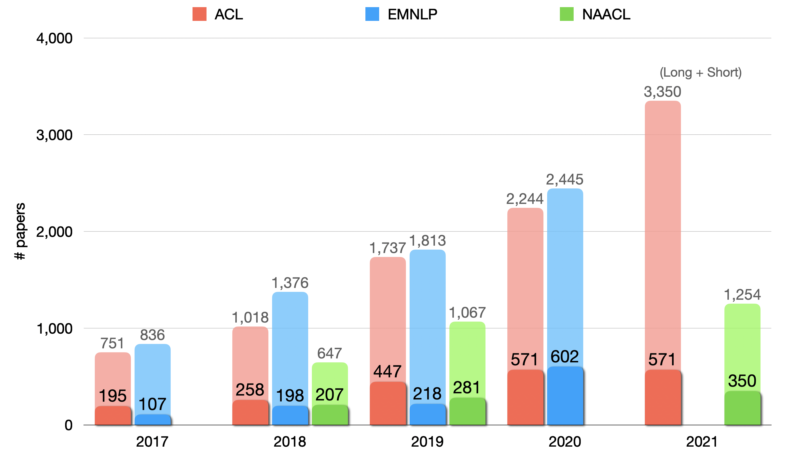

# NLP Conference Papers with arXiv

Statistics and accepted paper list with **[arXiv](https://arxiv.org/) link** of NLP conferences such as [ACL](https://www.aclweb.org/anthology/venues/acl/), [EMNLP](https://www.aclweb.org/anthology/venues/emnlp/), [NAACL](https://www.aclweb.org/anthology/venues/naacl/), [EACL](https://aclanthology.org/venues/eacl/), and [AACL](https://aclanthology.org/venues/aacl/).

**Contributing**: Please feel free to make *[pull requests](https://github.com/roomylee/nlp-papers-with-arxiv/pulls)*.

## Conferences

- **[ACL 2021](acl-2021) (UPdate!)**
- [NAACL 2021 (anthology)](https://aclanthology.org/volumes/2021.naacl-main/)
- [EACL 2021 (anthology)](https://aclanthology.org/volumes/2021.eacl-main/)
- [AACL 2020 (anthology)](https://aclanthology.org/volumes/2020.aacl-main/)
- [EMNLP 2020](emnlp-2020)
- [ACL 2020](acl-2020)
- [EMNLP 2019](emnlp-2019)

## Acceptance Rate

## Acknowledgement

This project is inspired by Hoseong's [ICCV-2019-Paper-Statistics](https://github.com/hoya012/ICCV-2019-Paper-Statistics).
