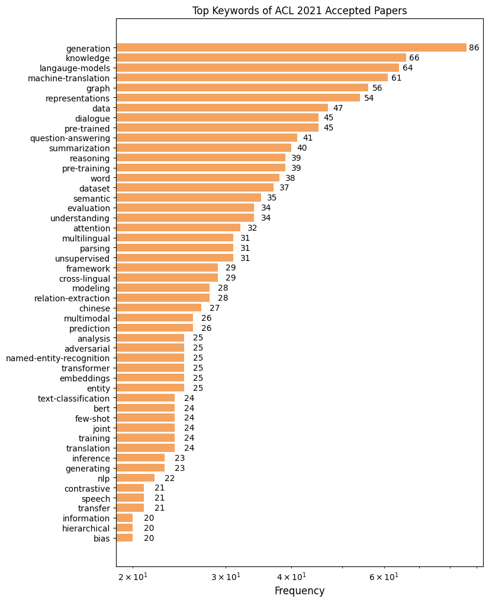

# ACL 2021 Papers

## Keywords

## Paper Awards

### Best paper

- **Vocabulary Learning via Optimal Transport for Neural Machine Translation**, *Jingjing Xu, Hao Zhou, Chun Gan, Zaixiang Zheng and Lei Li*, <https://arxiv.org/abs/2012.15671>

### Best theme paper

- **Including Signed Languages in Natural Language Processing**, *Kayo Yin, Amit Moryossef, Julie Hochgesang, Yoav Goldberg and Malihe Alikhani*, <https://arxiv.org/abs/2105.05222>

### Outstanding papers

- **All That's 'Human' Is Not Gold: Evaluating Human Evaluation of Generated Text**, *Elizabeth Clark, Tal August, Sofia Serrano, Nikita Haduong, Suchin Gururangan and Noah A. Smith*, <https://arxiv.org/abs/2107.00061>

- **Intrinsic Dimensionality Explains the Effectiveness of Language Model Fine-Tuning**, *Armen Aghajanyan, Sonal Gupta and Luke Zettlemoyer*, <https://arxiv.org/abs/2012.13255>

- **Mind Your Outliers! Investigating the Negative Impact of Outliers on Active Learning for Visual Question Answering**, *Siddharth Karamcheti, Ranjay Krishna, Li Fei-Fei and Christopher Manning*, <https://arxiv.org/abs/2107.02331>

- **Neural Machine Translation with Monolingual Translation Memory**, *Deng Cai, Yan Wang, Huayang Li, Wai Lam and Lemao Liu*, <https://arxiv.org/abs/2105.11269>

- **Scientific Credibility of Machine Translation Research: A Meta-Evaluation of 769 Papers**, *Benjamin Marie, Atsushi Fujita and Raphael Rubino*, <http://arxiv.org/abs/2106.15195>

- **UnNatural Language Inference**, *Koustuv Sinha, Prasanna Parthasarathi, Joelle Pineau and Adina Williams*, <https://arxiv.org/abs/2101.00010>

## Main Conference

There are accepted papers of [ACL 2021](https://2021.aclweb.org) with arXiv link.
Papers are grouped according to their track.
The tags `[L]` and `[S]` (prefix of each paper) represent Main Conference -- Long Paper, Main Conference -- Short Paper, respectively.

**Table of Contents**

- [Machine Translation and Multilinguality](#machine-translation-and-multilinguality)
- [Machine Learning for NLP](#machine-learning-for-nlp)
- [Dialog and Interactive Systems](#dialog-and-interactive-systems)
- [Information Extraction](#information-extraction)
- [Semantics: Sentence-level Semantics, Textual Inference and Other areas](#semantics-sentence-level-semantics-textual-inference-and-other-areas)
- [Resources and Evaluation](#resources-and-evaluation)
- [NLP Applications](#nlp-applications)
- [Question Answering](#question-answering)
- [Language Generation](#language-generation)
- [Interpretability and Analysis of Models for NLP](#interpretability-and-analysis-of-models-for-nlp)
- [Sentiment Analysis, Stylistic Analysis, and Argument Mining](#sentiment-analysis-stylistic-analysis-and-argument-mining)
- [Information Retrieval and Text Mining](#information-retrieval-and-text-mining)
- [Summarization](#summarization)
- [Semantics: Lexical Semantics](#semantics-lexical-semantics)
- [Computational Social Science and Cultural Analytics](#computational-social-science-and-cultural-analytics)
- [Syntax: Tagging, Chunking, and Parsing](#syntax-tagging-chunking-and-parsing)
- [Language Grounding to Vision, Robotics and Beyond](#language-grounding-to-vision-robotics-and-beyond)
- [Speech and Multimodality](#speech-and-multimodality)
- [Linguistic Theories, Cognitive Modeling and Psycholinguistics](#linguistic-theories-cognitive-modeling-and-psycholinguistics)
- [Ethics in NLP](#ethics-in-nlp)
- [Discourse and Pragmatics](#discourse-and-pragmatics)
- [Theme](#theme)
- [Phonology, Morphology and Word Segmentation](#phonology-morphology-and-word-segmentation)

### Machine Translation and Multilinguality

- `[L]` **How Good is Your Tokenizer? On the Monolingual Performance of Multilingual Language Models**, *Phillip Rust, Jonas Pfeiffer, Ivan Vulić, Sebastian Ruder and Iryna Gurevych*, <https://arxiv.org/abs/2012.15613>
- `[L]` **Rewriter-Evaluator Architecture for Neural Machine Translation**, *Yangming Li and Kaisheng Yao*, <https://arxiv.org/abs/2012.05414>
- `[L]` **Crafting Adversarial Examples for Neural Machine Translation**, *Xinze Zhang, Junzhe Zhang, Zhenhua Chen and Kun He*, <https://arxiv.org/abs/1911.03677>
- `[L]` **SemFace: Pre-training Encoder and Decoder with a Semantic Interface for Neural Machine Translation**, *Shuo Ren, Long Zhou, Shujie Liu, Furu Wei, Ming Zhou and Shuai Ma*
- `[L]` **Consistency Regularization for Cross-Lingual Fine-Tuning**, *Bo Zheng, Li Dong, Shaohan Huang, Wenhui Wang, Zewen Chi, Saksham Singhal, Wanxiang Che, Ting Liu, Xia Song and Furu Wei*, <https://arxiv.org/abs/2106.08226>
- `[L]` **Improving Pretrained Cross-Lingual Language Models via Self-Labeled Word Alignment**, *Zewen Chi, Li Dong, Bo Zheng, Shaohan Huang, Xian-Ling Mao, Heyan Huang and Furu Wei*, <https://arxiv.org/abs/2106.06381>
- `[L]` **Improving Zero-Shot Translation by Disentangling Positional Information**, *Danni Liu, Jan Niehues, James Cross, Francisco Guzmán and Xian Li*, <https://arxiv.org/abs/2012.15127>
- `[L]` **Fast and Accurate Neural Machine Translation with Translation Memory**, *Qiuxiang He, Guoping Huang, Qu Cui, Li Li and Lemao Liu*
- `[L]` **UnNatural Language Inference**, *Koustuv Sinha, Prasanna Parthasarathi, Joelle Pineau and Adina Williams*, <https://arxiv.org/abs/2101.00010>
- `[L]` **Multi-Head Highly Parallelized LSTM Decoder for Neural Machine Translation**, *Hongfei Xu, Qiuhui Liu, Josef Van Genabith, Deyi Xiong and Meng Zhang*
- `[L]` **A Bidirectional Transformer Based Alignment Model for Unsupervised Word Alignment**, *Jingyi Zhang and Josef Van Genabith*
- `[L]` **Beyond Offline Mapping: Learning Cross-lingual Word Embeddings through Context Anchoring**, *Aitor Ormazabal, Mikel Artetxe, Aitor Soroa, Gorka Labaka and Eneko Agirre*, <https://arxiv.org/abs/2012.15715>
- `[L]` **Breaking the Corpus Bottleneck for Context-Aware Neural Machine Translation with Cross-Task Pre-training**, *Linqing Chen, Junhui Li, Zhengxian Gong, Boxing Chen, Weihua Luo, Min Zhang and Guodong Zhou*
- `[L]` **Contributions of Transformer Attention Heads in Multi- and Cross-lingual Tasks**, *Weicheng Ma, Kai Zhang, Renze Lou, Lili Wang and Soroush Vosoughi*
- `[L]` **Common Sense Beyond English: Evaluating and Improving Multilingual Language Models for Commonsense Reasoning**, *Bill Yuchen Lin, Seyeon Lee, Xiaoyang Qiao and Xiang Ren*, <https://arxiv.org/abs/2106.06937>
- `[L]` **Point, Disambiguate and Copy: Incorporating Bilingual Dictionaries for Neural Machine Translation**, *Tong Zhang, Long Zhang, Wei Ye, Bo Li, Jinan Sun, Xiaoyu Zhu, Wen Zhao and Shikun Zhang*
- `[L]` **VECO: Variable and Flexible Cross-lingual Pre-training for Language Understanding and Generation**, **Fuli Luo, Wei Wang, Jiahao Liu, Yijia Liu, Bin Bi, Songfang Huang, Fei Huang and Luo Si*, <http://arxiv.org/abs/2010.16046>
- `[L]` **Modeling Bilingual Conversational Characteristics for Neural Chat Translation**, *Yunlong Liang, Fandong Meng, Yufeng Chen, Jinan Xu and Jie Zhou*
- `[L]` **Including Signed Languages in Natural Language Processing**, *Kayo Yin, Amit Moryossef, Julie Hochgesang, Yoav Goldberg and Malihe Alikhani*, <https://arxiv.org/abs/2105.05222>
- `[L]` **Intrinsic Dimensionality Explains the Effectiveness of Language Model Fine-Tuning**, *Armen Aghajanyan, Sonal Gupta and Luke Zettlemoyer*, <https://arxiv.org/abs/2012.13255>
- `[L]` **Bilingual Lexicon Induction via Unsupervised Bitext Construction and Word Alignment**, *Haoyue Shi, Luke Zettlemoyer and Sida I. Wang*, <https://arxiv.org/abs/2101.00148>
- `[L]` **Importance-based Neuron Allocation for Multilingual Neural Machine Translation**, *Wanying Xie, Yang Feng, Shuhao Gu and Dong Yu*, <https://arxiv.org/abs/2107.06569>
- `[L]` **Neural Machine Translation with Monolingual Translation Memory**, *Deng Cai, Yan Wang, Huayang Li, Wai Lam and Lemao Liu*, <https://arxiv.org/abs/2105.11269>
- `[L]` **Can Sequence-to-Sequence Models Crack Substitution Ciphers?**, *Nada Aldarrab and Jonathan May*, <https://arxiv.org/abs/2012.15229>
- `[L]` **G-Transformer for Document-Level Machine Translation**, *Guangsheng Bao, Yue Zhang, Zhiyang Teng, Boxing Chen and Weihua Luo*, <https://arxiv.org/abs/2105.14761>
- `[L]` **Prevent the Language Model from being Overconfident in Neural Machine Translation**, *Mengqi Miao, Fandong Meng, Yijin Liu, Xiao-Hua Zhou and Jie Zhou*, <https://arxiv.org/abs/2105.11098>
- `[L]` **Energy-Based Reranking: Improving Neural Machine Translation Using Energy-Based Models**, *Sumanta Bhattacharyya, Amirmohammad Rooshenas, Subhajit Naskar, Simeng Sun, Mohit Iyyer and Andrew McCallum*, <https://arxiv.org/abs/2009.13267>
- `[L]` **On Compositional Generalization of Neural Machine Translation**, *Yafu Li, Yongjing Yin, Yulong Chen and Yue Zhang*, <https://arxiv.org/abs/2105.14802>
- `[L]` **Mask-Align: Self-Supervised Neural Word Alignment**, *Chi Chen, Maosong Sun and Yang Liu*, <https://arxiv.org/abs/2012.07162>
- `[L]` **GWLAN: General Word-Level AutocompletioN for Computer-Aided Translation**, *Huayang Li, Lemao Liu, Guoping Huang and Shuming Shi*, <https://arxiv.org/abs/2105.14913>
- `[L]` **Transfer Learning for Sequence Generation: from Single-source to Multi-source**, *Xuancheng Huang, Jingfang Xu, Maosong Sun and Yang Liu*, <https://arxiv.org/abs/2105.14809>
- `[L]` **Selective Knowledge Distillation for Neural Machine Translation**, *Fusheng Wang, Jianhao Yan, Fandong Meng and Jie Zhou*, <https://arxiv.org/abs/2105.12967>
- `[L]` **Towards User-Driven Neural Machine Translation**, *Huan Lin, Liang Yao, Baosong Yang, Dayiheng Liu, Haibo Zhang, Weihua Luo, Degen Huang and Jinsong Su*, <https://arxiv.org/abs/2106.06200>
- `[L]` **Contrastive Learning for Many-to-many Multilingual Neural Machine Translation**, *Xiao Pan, Mingxuan Wang, Liwei Wu and Lei Li*, <https://arxiv.org/abs/2105.09501>
- `[L]` **Understanding the Properties of Minimum Bayes Risk Decoding in Neural Machine Translation**, *Mathias Müller and Rico Sennrich*, <https://arxiv.org/abs/2105.08504>
- `[L]` **Self-Training Sampling with Monolingual Data Uncertainty for Neural Machine Translation**, *Wenxiang Jiao, Xing Wang, Zhaopeng Tu, Shuming Shi, Michael Lyu and Irwin King*, <https://arxiv.org/abs/2106.00941>
- `[L]` **Attention Calibration for Transformer in Neural Machine Translation**, *Yu Lu, Jiali Zeng, Jiajun Zhang, Shuangzhi Wu and Mu Li*
- `[L]` **Learning Language Specific Sub-network for Multilingual Machine Translation**, *Zehui Lin, Liwei Wu, Mingxuan Wang and Lei Li*, <https://arxiv.org/abs/2105.09259>
- `[L]` **UXLA: A Robust Unsupervised Data Augmentation Framework for Zero-Resource Cross-Lingual NLP**, *M Saiful Bari, Tasnim Mohiuddin and Shafiq Joty*, <https://arxiv.org/abs/2004.13240>
- `[L]` **A Closer Look at Few-Shot Crosslingual Transfer: The Choice of Shots Matters**, *Mengjie Zhao, Yi Zhu, Ehsan Shareghi, Ivan Vulić, Roi Reichart, Anna Korhonen and Hinrich Schütze*, <https://arxiv.org/abs/2012.15682>
- `[L]` **Cascade versus Direct Speech Translation: Do the Differences Still Make a Difference?**, *Luisa Bentivogli, Mauro Cettolo, Marco Gaido, Alina Karakanta, Alberto Martinelli, Matteo Negri and Marco Turchi*, <http://arxiv.org/abs/2106.01045>
- `[L]` **Unsupervised Neural Machine Translation for Low-Resource Domains via Meta-Learning**, *Cheonbok Park, Yunwon Tae, TaeHee Kim, Soyoung Yang, Mohammad Azam Khan, Lucy Park and Jaegul Choo*, <https://arxiv.org/abs/2010.09046>
- `[L]` **Measuring and Increasing Context Usage in Context-Aware Machine Translation**, *Patrick Fernandes, Kayo Yin, Graham Neubig and André F. T. Martins*, <https://arxiv.org/abs/2105.03482>
- `[L]` **Online Learning Meets Machine Translation Evaluation: Finding the Best Systems with the Least Human Effort**, *Vânia Mendonça, Ricardo Rei, Luisa Coheur, Alberto Sardinha and Ana Lúcia Santos*, <https://arxiv.org/abs/2105.13385>
- `[L]` **Evaluating morphological typology in zero-shot cross-lingual transfer**, *Antonio Martínez-García, Toni Badia and Jeremy Barnes*
- `[L]` **From Machine Translation to Code-Switching: Generating High-Quality Code-Switched Text**, *Ishan Tarunesh, Syamantak Kumar and Preethi Jyothi*, <https://arxiv.org/abs/2107.06483>
- `[L]` **Do Context-Aware Translation Models Pay the Right Attention?**, *Kayo Yin, Patrick Fernandes, Danish Pruthi, Aditi Chaudhary, André F. T. Martins and Graham Neubig*, <https://arxiv.org/abs/2105.06977>
- `[L]` **CCMatrix: Mining Billions of High-Quality Parallel Sentences on the Web**, *Holger Schwenk, Guillaume Wenzek, Sergey Edunov, Edouard Grave, Armand Joulin and Angela Fan*, <https://arxiv.org/abs/1911.04944>
- `[L]` **Diverse Pretrained Context Encodings Improve Document Translation**, *Domenic Donato, Lei Yu and Chris Dyer*, <https://arxiv.org/abs/2106.03717>
- `[L]` **Beyond Noise: Mitigating the Impact of Fine-grained Semantic Divergences on Neural Machine Translation**, *Eleftheria Briakou and Marine Carpuat*, <https://arxiv.org/abs/2105.15087>
- `[L]` **Discriminative Reranking for Neural Machine Translation**, *Ann Lee, Michael Auli and Marc'Aurelio Ranzato*
- `[L]` **End-to-End Lexically Constrained Machine Translation for Morphologically Rich Languages**, *Josef Jon, João Paulo Aires, Dusan Varis and Ondřej Bojar*, <https://arxiv.org/abs/2106.12398>
- `[L]` **Syntax-augmented Multilingual BERT for Cross-lingual Transfer**, *Wasi Ahmad, Haoran Li, Kai-Wei Chang and Yashar Mehdad*, <https://arxiv.org/abs/2106.02134>
- `[L]` **Language Embeddings for Typology and Cross-lingual Transfer Learning**, *Dian Yu, Taiqi He and Kenji Sagae*, <https://arxiv.org/abs/2106.02082>
- `[L]` **Adapting High-resource NMT Models to Translate Low-resource Related Languages without Parallel Data**, *Wei-Jen Ko, Ahmed El-Kishky, Adithya Renduchintala, Vishrav Chaudhary, Naman Goyal, Francisco Guzmán, Pascale Fung, Philipp Koehn and Mona Diab*, <https://arxiv.org/abs/2105.15071>
- `[L]` **A unified approach to sentence segmentation of punctuated text in many languages**, *Rachel Wicks and Matt Post*
- `[L]` **Multilingual Speech Translation from Efficient Finetuning of Pretrained Models**, *Xian Li, Changhan Wang, Yun Tang, Chau Tran, Yuqing Tang, Juan Pino, Alexei Baevski, Alexis Conneau and Michael Auli*, <https://arxiv.org/abs/2010.12829>
- `[L]` **Rejuvenating Low-Frequency Words: Making the Most of Parallel Data in Non-Autoregressive Translation**, *Liang Ding, Longyue Wang, Xuebo Liu, Derek F. Wong, Dacheng Tao and Zhaopeng Tu*, <https://arxiv.org/abs/2106.00903>
- `[L]` **All That's 'Human' Is Not Gold: Evaluating Human Evaluation of Generated Text**, *Elizabeth Clark, Tal August, Sofia Serrano, Nikita Haduong, Suchin Gururangan and Noah A. Smith*, <https://arxiv.org/abs/2107.00061>
- `[L]` **Scientific Credibility of Machine Translation Research: A Meta-Evaluation of 769 Papers**, *Benjamin Marie, Atsushi Fujita and Raphael Rubino*, <http://arxiv.org/abs/2106.15195>
- `[L]` **How to Adapt Your Pretrained Multilingual Model to 1600 Languages**, *Abteen Ebrahimi and Katharina Kann*, <https://arxiv.org/abs/2106.02124>
- `[L]` **Vocabulary Learning via Optimal Transport for Neural Machine Translation**, *Jingjing Xu, Hao Zhou, Chun Gan, Zaixiang Zheng and Lei Li*, <https://arxiv.org/abs/2012.15671>
- `[L]` **Mind Your Outliers! Investigating the Negative Impact of Outliers on Active Learning for Visual Question Answering**, *Siddharth Karamcheti, Ranjay Krishna, Li Fei-Fei and Christopher Manning*, <https://arxiv.org/abs/2107.02331>
- `[L]` **Glancing Transformer for Non-Autoregressive Neural Machine Translation**, *Lihua Qian, Hao Zhou, Yu Bao, Mingxuan Wang, Lin Qiu, Weinan Zhang, Yong Yu and Lei Li*, <https://arxiv.org/abs/2008.07905>
- `[L]` **Guiding Teacher Forcing with Seer Forcing for Neural Machine Translation**, *Yang Feng, Shuhao Gu, Dengji Guo, Zhengxin Yang and Chenze Shao*, <https://arxiv.org/abs/2106.06751>
- `[L]` **Exploiting Language Relatedness for Low Web-Resource Language Model Adaptation: An Indic Languages Study**, *Yash Khemchandani, Sarvesh Mehtani, Vaidehi Patil, Abhijeet Awasthi, Partha Talukdar and Sunita Sarawagi*, <https://arxiv.org/abs/2106.03958>
- `[S]` **BERTTune: Fine-Tuning Neural Machine Translation with BERTScore**, *Inigo Jauregi Unanue, Jacob Parnell and Massimo Piccardi*, <https://arxiv.org/abs/2106.02208>
- `[S]` **An Empirical Study on Adversarial Attack on NMT: Languages and Positions Matter**, *Zhiyuan Zeng and Deyi Xiong*
- `[S]` **Cross-lingual Text Classification with Heterogeneous Graph Neural Network**, *Ziyun Wang, Xuan Liu, Peiji Yang, Shixing Liu and Zhisheng Wang*, <http://arxiv.org/abs/2105.11246>
- `[S]` **Bilingual Mutual Information Based Adaptive Training for Neural Machine Translation**, *Yangyifan Xu, Yijin Liu, Fandong Meng, Jiajun Zhang, Jinan Xu and Jie Zhou*, <https://arxiv.org/abs/2105.12523>
- `[S]` **Improving Lexically Constrained Neural Machine Translation with Source-Conditioned Masked Span Prediction**, *Gyubok Lee, Seongjun Yang and Edward Choi*, <https://arxiv.org/abs/2105.05498>
- `[S]` **Modeling Task-Aware MIMO Cardinality for Efficient Multilingual Neural Machine Translation**, *Hongfei Xu, Qiuhui Liu, Josef Van Genabith and Deyi Xiong*
- `[S]` **Adaptive Nearest Neighbor Machine Translation**, *Xin Zheng, Zhirui Zhang, Junliang Guo, Shujian Huang, Boxing Chen, Weihua Luo and Jiajun CHEN*, <https://arxiv.org/abs/2105.13022>
- `[S]` **Anchor-based Bilingual Word Embeddings for Low-Resource Languages**, *Tobias Eder, Viktor Hangya and Alexander Fraser*, <https://arxiv.org/abs/2010.12627>
- `[S]` **An Exploratory Analysis of Multilingual Word-Level Quality Estimation with Cross-Lingual Transformers**, *Tharindu Ranasinghe, Constantin Orasan and Ruslan Mitkov*, <https://arxiv.org/abs/2106.00143>
- `[S]` **nmT5 - Is parallel data still relevant for pre-training massively multilingual language models?**, *Mihir Kale, Aditya Siddhant, Rami Al-Rfou, Linting Xue, Noah Constant and Melvin Johnson*, <https://arxiv.org/abs/2106.02171>
- `[S]` **Gender bias amplification during Speed-Quality optimization in Neural Machine Translation**, *Adithya Renduchintala, Denise Diaz, Kenneth Heafield, Xian Li and Mona Diab*, <https://arxiv.org/abs/2106.00169>
- `[S]` **Multilingual Agreement for Multilingual Neural Machine Translation**, *Jian Yang, Yuwei Yin, Shuming Ma, Haoyang Huang, Dongdong Zhang, Zhoujun Li and Furu Wei*
- `[S]` **Machine Translation into Low-resource Language Varieties**, *Sachin Kumar, Antonios Anastasopoulos, Shuly Wintner and Yulia Tsvetkov*, <https://arxiv.org/abs/2106.06797>
- `[S]` **Don't Rule Out Monolingual Speakers: A Method For Crowdsourcing Machine Translation Data**, *Rajat Bhatnagar, Ananya Ganesh and Katharina Kann*, <https://arxiv.org/abs/2106.06875>
- `[S]` **Difficulty-Aware Machine Translation Evaluation**, *Runzhe Zhan, Xuebo Liu, Derek F. Wong and Lidia S. Chao*

[Back to Top](#main-conference)

### Machine Learning for NLP

- `[L]` **Defense against Synonym Substitution-based Adversarial Attacks via Dirichlet Neighborhood Ensemble**, *Yi Zhou, Xiaoqing Zheng, Cho-Jui Hsieh, Kai-Wei Chang and Xuanjing Huang*, <https://arxiv.org/abs/2006.11627>
- `[L]` **A Sweet Rabbit Hole by DARCY: Using Honeypots to Detect Universal Trigger's Adversarial Attacks**, *Thai Le, Noseong Park and Dongwon Lee*, <https://arxiv.org/abs/2011.10492>
- `[L]` **Super Tickets in Pre-Trained Language Models: From Model Compression to Improving Generalization**, *Chen Liang, Simiao Zuo, Minshuo Chen, Haoming Jiang, Xiaodong Liu, Pengcheng He, Tuo Zhao and Weizhu Chen*, <https://arxiv.org/abs/2105.12002>
- `[L]` **Subsequence Based Deep Active Learning for Named Entity Recognition**, *Puria Radmard, Yassir Fathullah and Aldo Lipani*, <https://arxiv.org/abs/1707.05928>
- `[L]` **R2D2: Recursive Transformer based on Differentiable Tree for Interpretable Hierarchical Language Modeling**, *Xiang Hu, Haitao Mi, Zujie Wen, Yafang Wang, Yi Su, Jing Zheng and Gerard De Melo*, <https://arxiv.org/abs/2107.00967>
- `[L]` **GhostBERT: Generate More Features with Cheap Operations for BERT**, *Zhiqi Huang, Lu Hou, Lifeng Shang, Xin Jiang, Xiao Chen and Qun Liu*
- `[L]` **EnsLM: Ensemble Language Model for Data Diversity by Semantic Clustering**, *Zhibin Duan, Hao Zhang, Chaojie Wang, Zhengjue Wang, Bo Chen and Mingyuan Zhou*
- `[L]` **Convolutions and Self-Attention: Re-interpreting Relative Positions in Pre-trained Language Models**, *Tyler Chang, Yifan Xu, Weijian Xu and Zhuowen Tu*, <https://arxiv.org/abs/2106.05505>
- `[L]` **The Art of Abstention: Selective Prediction and Error Regularization for Natural Language Processing**, *Ji Xin, Raphael Tang, Yaoliang Yu and Jimmy Lin*
- `[L]` **TextSETTR: Few-Shot Text Style Extraction and Tunable Targeted Restyling**, *Parker Riley, Noah Constant, Mandy Guo, Girish Kumar, David Uthus and Zarana Parekh*, <https://arxiv.org/abs/2010.03802>
- `[L]` **Structural Knowledge Distillation: Tractably Distilling Information for Structured Predictor**, *Xinyu Wang, Yong Jiang, Zhaohui Yan, Zixia Jia, Nguyen Bach, Tao Wang, Zhongqiang Huang, Fei Huang and Kewei Tu*, <https://arxiv.org/abs/2010.05010>
- `[L]` **COSY: COunterfactual SYntax for Cross-Lingual Understanding**, *SICHENG YU, Hao Zhang, Yulei Niu, Qianru Sun and Jing Jiang*
- `[L]` **BinaryBERT: Pushing the Limit of BERT Quantization**, *Haoli Bai, Wei Zhang, Lu Hou, Lifeng Shang, Jin JIN, Xin Jiang, Qun Liu, Michael Lyu and Irwin King*, <https://arxiv.org/abs/2012.15701>
- `[L]` **OoMMix: Out-of-manifold Regularization in Contextual Embedding Space for Text Classification**, *Seonghyeon Lee, Dongha Lee and Hwanjo Yu*, <https://arxiv.org/abs/2105.06750>
- `[L]` **Parameter-Efficient Transfer Learning with Diff Pruning**, *Demi Guo, Alexander Rush and Yoon Kim*, <https://arxiv.org/abs/2012.07463>
- `[L]` **Shortformer: Better Language Modeling using Shorter Inputs**, *Ofir Press, Noah A. Smith and Mike Lewis*, <https://arxiv.org/abs/2012.15832>
- `[L]` **Making Pre-trained Language Models Better Few-shot Learners**, *Tianyu Gao, Adam Fisch and Danqi Chen*, <https://arxiv.org/abs/2012.15723>
- `[L]` **Integrating Semantics and Neighborhood Information with Graph-Driven Generative Models for Document Retrieval**, *Zijing Ou, Qinliang Su, Jianxing Yu, Bang Liu, Jingwen Wang, Ruihui Zhao, Changyou Chen and Yefeng Zheng*, <https://arxiv.org/abs/2105.13066>
- `[L]` **ChineseBERT: Chinese Pretraining Enhanced by Glyph and Pinyin Information**, *Zijun Sun, Xiaoya Li, Xiaofei Sun, Yuxian Meng, Xiang Ao, Qing He, Fei Wu and Jiwei Li*, <https://arxiv.org/abs/2106.16038>
- `[L]` **Self-Attention Networks Can Process Bounded Hierarchical Languages**, *Shunyu Yao, Binghui Peng, Christos Papadimitriou and Karthik Narasimhan*, <https://arxiv.org/abs/2105.11115>
- `[L]` **Data Augmentation for Text Generation Without Any Augmented Data**, *Wei Bi, Huayang Li and Jiacheng Huang*, <https://arxiv.org/abs/2105.13650>
- `[L]` **Are Pretrained Convolutions Better than Pretrained Transformers?**, *Yi Tay, Mostafa Dehghani, Jai Prakash Gupta, Vamsi Aribandi, Dara Bahri, Zhen Qin and Donald Metzler*, <https://arxiv.org/abs/2105.03322>
- `[L]` **Lightweight Cross-Lingual Sentence Representation Learning**, *Zhuoyuan Mao, Prakhar Gupta, Chenhui Chu, Martin Jaggi and Sadao Kurohashi*, <http://arxiv.org/abs/2105.13856>
- `[L]` **ERNIE-Doc: A Retrospective Long-Document Modeling Transformer**, *SiYu Ding, Junyuan Shang, Shuohuan Wang, Yu Sun, Hao Tian, Hua Wu and Haifeng Wang*, <https://arxiv.org/abs/2012.15688>
- `[L]` **LeeBERT: Learned Early Exit for BERT with cross-level optimization**, *Wei Zhu*
- `[L]` **BanditMTL: Bandit-based Multi-task Learning for Text Classification**, *Yuren Mao, Zekai Wang, Weiwei Liu, Xuemin Lin and Wenbin Hu*
- `[L]` **PairRE: Knowledge Graph Embeddings via Paired Relation Vectors**, *Linlin Chao, Jianshan He, Taifeng Wang and Wei Chu*, <https://arxiv.org/abs/2011.03798>
- `[L]` **Rational LAMOL: A Rationale-based Lifelong Learning Framework**, *Kasidis Kanwatchara, Thanapapas Horsuwan, Piyawat Lertvittayakumjorn, Boonserm Kijsirikul and Peerapon Vateekul*
- `[L]` **Unified Interpretation of Softmax Cross-Entropy and Negative Sampling: With Case Study for Knowledge Graph Embedding**, *Hidetaka Kamigaito and Katsuhiko Hayashi*, <https://arxiv.org/abs/2106.07250>
- `[L]` **Optimizing Deeper Transformers on Small Datasets**, *Peng Xu, Dhruv Kumar, Wei Yang, Wenjie Zi, Keyi Tang, Chenyang Huang, Jackie Chi Kit Cheung, Simon J.D. Prince and Yanshuai Cao*, <https://arxiv.org/abs/2012.15355>
- `[L]` **Unsupervised Out-of-Domain Detection via Pre-trained Transformers**, *Keyang Xu, Tongzheng Ren, Shikun Zhang, Yihao Feng and Caiming Xiong*, <https://arxiv.org/abs/2106.00948>
- `[L]` **EarlyBERT: Efficient BERT Training via Early-bird Lottery Tickets**, *Xiaohan Chen, Yu Cheng, Shuohang Wang, Zhe Gan, Zhangyang Wang and Jingjing Liu*, <https://arxiv.org/abs/2101.00063>
- `[L]` **Weight Distillation: Transferring the Knowledge in Neural Network Parameters**, *Ye Lin, Yanyang Li, Ziyang Wang, Bei Li, Quan Du, Tong Xiao and Jingbo Zhu*, <https://arxiv.org/abs/2009.09152>
- `[L]` **A Novel Estimator of Mutual Information for Learning to Disentangle Textual Representations**, *Pierre Colombo, Pablo Piantanida and Chloé Clavel*, <https://arxiv.org/abs/2105.02685>
- `[L]` **Multi-hop Graph Convolutional Network with High-order Chebyshev Approximation for Text Reasoning**, *Shuoran Jiang, Qingcai Chen, Xin Liu, Baotian Hu and Lisai Zhang*, <https://arxiv.org/abs/2106.05221>
- `[L]` **Determinantal Beam Search**, *Clara Meister, Martina Forster and Ryan Cotterell*, <https://arxiv.org/abs/2106.07400>
- `[L]` **De-Confounded Variational Encoder-Decoder for Logical Table-to-Text Generation**, *Wenqing Chen, Jidong Tian, Yitian Li, Hao He and Yaohui Jin*
- `[L]` **Rethinking Stealthiness of Backdoor Attack against NLP Models**, *Wenkai Yang, Yankai Lin, Peng Li, Jie Zhou and Xu Sun*
- `[L]` **Cascaded Head-colliding Attention**, *Lin Zheng, Zhiyong Wu and Lingpeng Kong*, <https://arxiv.org/abs/2105.14850>
- `[L]` **Parameter-efficient Multi-task Fine-tuning for Transformers via Shared Hypernetworks**, *Rabeeh Karimi Mahabadi, Sebastian Ruder, Mostafa Dehghani and James Henderson*, <https://arxiv.org/abs/2106.04489>
- `[L]` **Turn the Combination Lock: Learnable Textual Backdoor Attacks via Word Substitution**, *Fanchao Qi, Yuan Yao, Sophia Xu, Zhiyuan Liu and Maosong Sun*, <https://arxiv.org/abs/2106.06361>
- `[L]` **Hierarchy-aware Label Semantics Matching Network for Hierarchical Text Classification**, *Haibin Chen, Qianli Ma, Zhenxi Lin and Jiangyue Yan*
- `[L]` **On the Effectiveness of Adapter-based Tuning for Pretrained Language Model Adaptation**, *Ruidan He, Linlin Liu, Hai Ye, Qingyu Tan, BOSHENG DING, Liying Cheng, Jiawei Low, Lidong Bing and Luo Si*, <https://arxiv.org/abs/2106.03164>
- `[L]` **Crowdsourcing Learning as Domain Adaptation: A Case Study on Named Entity Recognition**, *Xin Zhang, Guangwei Xu, Yueheng Sun, Meishan Zhang and Pengjun Xie*, <https://arxiv.org/abs/2105.14980>
- `[L]` **Marginal Utility Diminishes: Exploring the Minimum Knowledge for BERT Knowledge Distillation**, *Yuanxin LIU, Fandong Meng, Zheng Lin, Weiping Wang and Jie Zhou*, <https://arxiv.org/abs/2106.05691>
- `[L]` **MATE-KD: Masked Adversarial TExt, a Companion to Knowledge Distillation**, *Ahmad Rashid, Vasileios Lioutas and Mehdi Rezagholizadeh*, <https://arxiv.org/abs/2105.05912>
- `[L]` **Lexicon Learning for Few Shot Sequence Modeling**, *Ekin Akyurek and Jacob Andreas*, <https://arxiv.org/abs/2106.03993>
- `[L]` **Modeling Fine-Grained Entity Types with Box Embeddings**, *Yasumasa Onoe, Michael Boratko, Andrew McCallum and Greg Durrett*, <https://arxiv.org/abs/2101.00345>
- `[L]` **Selecting Informative Contexts Improves Language Model Fine-tuning**, *Richard Antonello, Nicole Beckage, Javier Turek and Alexander Huth*, <https://arxiv.org/abs/2005.00175>
- `[L]` **HiddenCut: Simple Data Augmentation for Natural Language Understanding with Better Generalizability**, *Jiaao Chen, Dinghan Shen, Weizhu Chen and Diyi Yang*, <https://arxiv.org/abs/2106.00149>
- `[L]` **Explainable Prediction of Text Complexity: The Missing Preliminaries for Text Simplification**, *Cristina Garbacea, Mengtian Guo, Samuel Carton and Qiaozhu Mei*, <https://arxiv.org/abs/2007.15823>
- `[L]` **Multi-Task Retrieval for Knowledge-Intensive Tasks**, *Jean Maillard, Vladimir Karpukhin, Fabio Petroni, Wen-tau Yih, Barlas Oguz, Veselin Stoyanov and Gargi Ghosh*, <https://arxiv.org/abs/2101.00117>
- `[L]` **Risk Minimization for Zero-shot Sequence Labeling**, *Zechuan Hu, Yong Jiang, Nguyen Bach, Tao Wang, Zhongqiang Huang, Fei Huang and Kewei Tu*
- `[L]` **Exploring Distantly-Labeled Rationales in Neural Network Models**, *Quzhe Huang, Shengqi Zhu, Yansong Feng and Dongyan Zhao*, <https://arxiv.org/abs/2106.01809>
- `[L]` **Learning to Perturb Word Embeddings for Out-of-distribution QA**, *Seanie Lee, Minki Kang, Juho Lee and Sung Ju Hwang*, <https://arxiv.org/abs/2105.02692>
- `[L]` **WARP: Word-level Adversarial ReProgramming**, *Karen Hambardzumyan, Hrant Khachatrian and Jonathan May*, <https://arxiv.org/abs/2101.00121>
- `[L]` **BERTAC: Enhancing Transformer-based Language Models with Adversarially Pretrained Convolutional Neural Networks**, *Jong-Hoon Oh, Ryu Iida, Julien Kloetzer and Kentaro Torisawa*
- `[L]` **Length-Adaptive Transformer: Train Once with Length Drop, Use Anytime with Search**, *Gyuwan Kim and Kyunghyun Cho*, <https://arxiv.org/abs/2010.07003>
- `[L]` **H-Transformer-1D: Fast One-Dimensional Hierarchical Attention for Sequences**, *Zhenhai Zhu and Radu Soricut*
- `[S]` **Embedding Time Differences in Context-sensitive Neural Networks for Learning Time to Event**, *Nazanin Dehghani, Hassan Hajipoor and Hadi Amiri*
- `[S]` **Hi-Transformer: Hierarchical Interactive Transformer for Efficient and Effective Long Document Modeling**, *Chuhan Wu, Fangzhao Wu, Tao Qi and Yongfeng Huang*, <https://arxiv.org/abs/2106.01040>
- `[S]` **Improving Compositional Generalization in Classification Tasks via Structure Annotations**, *Juyong Kim, Pradeep Ravikumar, Joshua Ainslie and Santiago Ontanon*, <https://arxiv.org/abs/2106.10434>
- `[S]` **On Orthogonality Constraints for Transformers**, *Aston Zhang, Alvin Chan, Yi Tay, Jie Fu, Shuohang Wang, Shuai Zhang, Huajie Shao, Shuochao Yao and Roy Ka-Wei Lee*
- `[S]` **Learning to Generate Task-Specific Adapters from Task Description**, *Qinyuan Ye and Xiang Ren*, <https://arxiv.org/abs/2101.00420>
- `[S]` **Continual Quality Estimation with Online Bayesian Meta-Learning**, *Abiola Obamuyide, Marina Fomicheva and Lucia Specia*
- `[S]` **How Helpful is Inverse Reinforcement Learning for Table-to-Text Generation?**, *Sayan Ghosh, Zheng Qi, Snigdha Chaturvedi and Shashank Srivastava*
- `[S]` **Measuring and Improving BERT's Mathematical Abilities by Predicting the Order of Reasoning.**, *Piotr Piękos, Mateusz Malinowski and Henryk Michalewski*, <http://arxiv.org/abs/2106.03921>
- `[S]` **Robust Transfer Learning with Pretrained Language Models through Adapters**, *Wenjuan Han, Bo Pang and Ying Nian Wu*
- `[S]` **Embracing Ambiguity: Shifting the Training Target of NLI Models**, *Johannes Mario Meissner, Napat Thumwanit, Saku Sugawara and Akiko Aizawa*, <https://arxiv.org/abs/2106.03020>
- `[S]` **Don't Let Discourse Confine Your Model: Sequence Perturbations for Improved Event Language Models**, *Mahnaz Koupaee, Greg Durrett, Nathanael Chambers and Niranjan Balasubramanian*

[Back to Top](#main-conference)

### Dialog and Interactive Systems

- `[L]` **TicketTalk: Toward human-level performance with end-to-end, transaction-based dialog systems**, *Bill Byrne, Karthik Krishnamoorthi, Saravanan Ganesh and Mihir Kale*, <https://arxiv.org/abs/2012.12458>
- `[L]` **HERALD: An Annotation Efficient Method to Detect User Disengagement in Social Conversations**, *Weixin Liang, Kai-Hui Liang and Zhou Yu*, <https://arxiv.org/abs/2106.00162>
- `[L]` **Comprehensive Study: How the Context Information of Different Granularity Affects Dialogue State Tracking?**, *Puhai Yang, Heyan Huang and Xian-Ling Mao*, <https://arxiv.org/abs/2105.03571>
- `[L]` **A Joint Model for Dropped Pronoun Recovery and Conversational Discourse Parsing in Chinese Conversational Speech**, *Jingxuan Yang, Kerui Xu, Jun Xu, Si Li, Sheng Gao, Jun Guo, Nianwen Xue and Ji-Rong Wen*, <https://arxiv.org/abs/2106.03345>
- `[L]` **ProtAugment: Intent Detection Meta-Learning through Unsupervised Diverse Paraphrasing**, *Thomas Dopierre, Christophe Gravier and Wilfried Logerais*
- `[L]` **Maria: A Visual Experience Powered Conversational Agent**, *Zujie Liang, Huang Hu, Can Xu, Chongyang Tao, Xiubo Geng, Yining Chen, Fan Liang and Daxin Jiang*, <https://arxiv.org/abs/2105.13073>
- `[L]` **Discovering Dialog Structure Graph for Coherent Dialog Generation**, *Jun Xu, Zeyang Lei, Haifeng Wang, Zheng-Yu Niu, Hua Wu and Wanxiang Che*, <https://arxiv.org/abs/2012.15543>
- `[L]` **Dialogue Response Selection with Hierarchical Curriculum Learning**, **Yixuan Su, Deng Cai, Qingyu Zhou, Zibo Lin, Simon Baker, Yunbo Cao, Shuming Shi, Nigel Collier and Yan Wang*, <https://arxiv.org/abs/2012.14756>
- `[L]` **Out-of-Scope Intent Detection with Self-Supervision and Discriminative Training**, *Li-Ming Zhan, Haowen Liang, Bo LIU, Lu Fan, Xiao-Ming Wu and Albert Y.S. Lam*, <https://arxiv.org/abs/2106.08616>
- `[L]` **Diversifying Dialog Generation via Adaptive Label Smoothing**, *Yida Wang, Yinhe Zheng, Yong Jiang and Minlie Huang*, <https://arxiv.org/abs/2105.14556>
- `[L]` **BoB: BERT Over BERT for Training Persona-based Dialogue Models from Limited Personalized Data**, *Haoyu Song, Yan Wang, Kaiyan Zhang, Wei-Nan Zhang and Ting Liu*, <https://arxiv.org/abs/2106.06169>
- `[L]` **Using Meta-Knowledge Mined from Identifiers to Improve Intent Recognition in Conversational Systems**, *Claudio Pinhanez, Paulo Cavalin, Victor Henrique Alves Ribeiro, Ana Appel, Heloisa Candello, Julio Nogima, Mauro Pichiliani, Melina Guerra, Maira De Bayser, Gabriel Malfatti and Henrique Ferreira*, <https://arxiv.org/abs/2012.09005>
- `[L]` **I like fish, especially dolphins: Addressing Contradictions in Dialogue Modeling**, *Yixin Nie, Mary Williamson, Mohit Bansal, Douwe Kiela and Jason Weston*, <https://arxiv.org/abs/2012.13391>
- `[L]` **A Human-machine Collaborative Framework for Evaluating Malevolence in Dialogues**, *Yangjun Zhang, Pengjie Ren and Maarten De Rijke*
- `[L]` **A Sequence-to-Sequence Approach to Dialogue State Tracking**, *Yue Feng, Yang Wang and Hang Li*, <https://arxiv.org/abs/2011.09553>
- `[L]` **Generating Relevant and Coherent Dialogue Responses using Self-Separated Conditional Variational AutoEncoders**, *Bin Sun, Shaoxiong Feng, Yiwei Li, Jiamou Liu and Kan Li*, <https://arxiv.org/abs/2106.03410>
- `[L]` **Neural Stylistic Response Generation with Disentangled Latent Variables**, *Qingfu Zhu, Wei-Nan Zhang, Ting Liu and William Yang Wang*
- `[L]` **Intent Classification and Slot Filling for Privacy Policies**, *Wasi Ahmad, Jianfeng Chi, Tu Le, Thomas Norton, Yuan Tian and Kai-Wei Chang*, <https://arxiv.org/abs/2101.00123>
- `[L]` **Dual Slot Selector via Local Reliability Verification for Dialogue State Tracking**, *Jinyu Guo, Kai Shuang, Jijie Li and Zihan Wang*
- `[L]` **Learning from Perturbations: Diverse and Informative Dialogue Generation with Inverse Adversarial Training**, *Wangchunshu Zhou, Qifei LI and Chenle Li*, <https://arxiv.org/abs/2105.15171>
- `[L]` **Novel Slot Detection: A Benchmark for Discovering Unknown Slot Types in the Task-Oriented Dialogue System**, *Yanan Wu, Zhiyuan Zeng, Keqing He, Hong Xu, Yuanmeng Yan, Huixing Jiang and Weiran Xu*, <https://arxiv.org/abs/2105.14313>
- `[L]` **RADDLE: An Evaluation Benchmark and Analysis Platform for Robust Task-oriented Dialog Systems**, *Baolin Peng, Chunyuan Li, Zhu Zhang, Chenguang Zhu, Jinchao Li and Jianfeng Gao*, <https://arxiv.org/abs/2012.14666>
- `[L]` **Learning to Ask Conversational Questions by Optimizing Levenshtein Distance**, *Zhongkun Liu, Pengjie Ren, Zhumin CHEN, Zhaochun Ren, Maarten De Rijke and Ming Zhou*, <https://arxiv.org/abs/2106.15903>
- `[L]` **DVD: A Diagnostic Dataset for Multi-step Reasoning in Video Grounded Dialogue**, *Hung Le, Chinnadhurai Sankar, Seungwhan Moon, Ahmad Beirami, Alborz Geramifard and Satwik Kottur*, <https://arxiv.org/abs/2101.00151>
- `[L]` **Robustness Testing of Language Understanding in Task-Oriented Dialog**, *Jiexi Liu, Ryuichi Takanobu, Jiaxin Wen, Dazhen Wan, Hongguang Li, Weiran Nie, Cheng LI, Wei Peng and Minlie Huang*, <https://arxiv.org/abs/2012.15262>
- `[L]` **MPC-BERT: A Pre-Trained Language Model for Multi-Party Conversation Understanding**, *Jia-Chen Gu, Chongyang Tao, Zhenhua Ling, Can Xu, Xiubo Geng and Daxin Jiang*, <https://arxiv.org/abs/2106.01541>
- `[L]` **Conversations Are Not Flat: Modeling the Dynamic Information Flow across Dialogue Utterances**, *Zekang Li, Jinchao Zhang, Zhengcong Fei, Yang Feng and Jie Zhou*, <https://arxiv.org/abs/2106.02227>
- `[L]` **Semantic Representation for Dialogue Modeling**, *Xuefeng Bai, Yulong Chen, Linfeng Song and Yue Zhang*, <https://arxiv.org/abs/2105.10188>
- `[L]` **Towards Emotional Support Dialog Systems**, *Siyang Liu, Chujie Zheng, Orianna Demasi, Sahand Sabour, Yu Li, Zhou Yu, Yong Jiang and Minlie Huang*, <https://arxiv.org/abs/2106.01144>
- `[L]` **DialogueCRN: Contextual Reasoning Networks for Emotion Recognition in Conversations**, *Dou Hu, Lingwei Wei and Xiaoyong Huai*, <https://arxiv.org/abs/2106.01978>
- `[L]` **Discovering Dialogue Slots with Weak Supervision**, *Vojtěch Hudeček, Ondřej Dušek and Zhou Yu*
- `[L]` **AugNLG: Few-shot Natural Language Generation using Self-trained Data Augmentation**, *Xinnuo Xu, Guoyin Wang, Young-Bum Kim and Sungjin Lee*, <https://arxiv.org/abs/2106.05589>
- `[L]` **NeuralWOZ: Learning to Collect Task-Oriented Dialogue via Model-Based Simulation**, *Sungdong Kim, Minsuk Chang and Sang-Woo Lee*, <https://arxiv.org/abs/2105.14454>
- `[L]` **Space Efficient Context Encoding for Non-Task-Oriented Dialogue Generation with Graph Attention Transformer**, *Fabian Galetzka, Jewgeni Rose, David Schlangen and Jens Lehmann*
- `[L]` **MMGCN: Multimodal Fusion via Deep Graph Convolution Network for Emotion Recognition in Conversation**, *Jingwen Hu, Yuchen Liu, Jinming Zhao and Qin Jin*, <https://arxiv.org/abs/2107.06779>
- `[L]` **Transferable Dialogue Systems and User Simulators**, *Bo-Hsiang Tseng, Yinpei Dai, Florian Kreyssig and Bill Byrne*
- `[L]` **A Pre-training Strategy for Zero-Resource Response Selection in Knowledge-Grounded Conversations**, *Chongyang Tao, Changyu Chen, Jiazhan Feng, Ji-Rong Wen and Rui Yan*
- `[L]` **Improving Dialog Systems for Negotiation with Personality Modeling**, *Runzhe Yang, Jingxiao Chen and Karthik Narasimhan*, <https://arxiv.org/abs/2010.09954>
- `[L]` **Best of Both Worlds: Making High Accuracy Non-incremental Transformer-based Disfluency Detection Incremental**, *Morteza Rohanian and Julian Hough*
- `[L]` **OTTers: One-turn Topic Transitions for Open-Domain Dialogue**, *Karin Sevegnani, David M. Howcroft, Ioannis Konstas and Verena Rieser*, <https://arxiv.org/abs/2105.13710>
- `[L]` **Enhancing the generalization for Intent Classification and Out-of-Domain Detection in SLU**, *Yilin Shen, Yen-Chang Hsu, Avik Ray and Hongxia Jin*, <https://arxiv.org/abs/2106.14464>
- `[L]` **Increasing Faithfulness in Knowledge-Grounded Dialogue with Controllable Features**, *Hannah Rashkin, David Reitter, Gaurav Singh Tomar and Dipanjan Das*, <https://arxiv.org/abs/2107.06963>
- `[L]` **Value-Agnostic Conversational Semantic Parsing**, *Emmanouil Antonios Platanios, Adam Pauls, Subhro Roy, Yuchen Zhang, Alexander Kyte, Alan Guo, Sam Thomson, Jayant Krishnamurthy, Jason Wolfe, Jacob Andreas and Dan Klein*
- `[L]` **GL-GIN: Fast and Accurate Non-Autoregressive Model for Joint Multiple Intent Detection and Slot Filling**, *Libo Qin, Fuxuan Wei, Tianbao Xie, Xiao Xu, Wanxiang Che and Ting Liu*, <http://arxiv.org/abs/2106.01925>
- `[L]` **The R-U-A-Robot Dataset: Helping Avoid Chatbot Deception by Detecting User Questions About Human or Non-Human Identity**, *David Gros, Yu Li and Zhou Yu*, <https://arxiv.org/abs/2106.02692>
- `[L]` **GTM: A Generative Triple-wise Model for Conversational Question Generation**, *Lei Shen, Fandong Meng, Jinchao Zhang, Yang Feng and Jie Zhou*, <https://arxiv.org/abs/2106.03635>
- `[L]` **DynaEval: Unifying Turn and Dialogue Level Evaluation**, *Chen Zhang, Yiming Chen, Luis Fernando D'Haro, Yan Zhang, Thomas Friedrichs, Grandee Lee and Haizhou Li*, <https://arxiv.org/abs/2106.01112>
- `[S]` **Coreference Resolution without Span Representations**, *Yuval Kirstain, Ori Ram and Omer Levy*, <https://arxiv.org/abs/2101.00434>
- `[S]` **Modeling Discriminative Representations for Out-of-Domain Detection with Supervised Contrastive Learning**, *Zhiyuan Zeng, Keqing He, Yuanmeng Yan, Zijun Liu, Yanan Wu, Hong Xu, Huixing Jiang and Weiran Xu*, <https://arxiv.org/abs/2105.14289>
- `[S]` **Saying No is An Art: Contextualized Fallback Responses for Unanswerable Dialogue Queries**, *Ashish Shrivastava, Kaustubh Dhole, Abhinav Bhatt and Sharvani Raghunath*, <https://arxiv.org/abs/2012.01873>
- `[S]` **QA-Driven Zero-shot Slot Filling with Weak Supervision Pretraining**, *Xinya Du, Luheng He, Qi Li, Dian Yu, Panupong Pasupat and Yuan Zhang*
- `[S]` **Preview, Attend and Review: Schema-Aware Curriculum Learning for Multi-Domain Dialogue State Tracking**, *Yinpei Dai, Hangyu Li, Yongbin Li, Jian Sun, Fei Huang, Luo Si and Xiaodan Zhu*, <https://arxiv.org/abs/2106.00291>
- `[S]` **Continual Learning for Task-oriented Dialogue System with Iterative Network Pruning, Expanding and Masking**, *Binzong Geng, Fajie Yuan, Qiancheng Xu, Ying Shen, Ruifeng Xu and Min Yang*, <https://arxiv.org/abs/2107.08173>
- `[S]` **On the Generation of Medical Dialogs for COVID-19**, *Meng Zhou, Zechen Li, Bowen Tan, Guangtao Zeng, Wenmian Yang, Xuehai He, Zeqian Ju, Subrato Chakravorty, Shu Chen, Xingyi Yang, Yichen Zhang, Qingyang Wu, Zhou Yu, Kun Xu, Eric Xing and Pengtao Xie*, <https://arxiv.org/abs/2005.05442>
- `[S]` **Domain-Adaptive Pretraining Methods for Dialogue Understanding**, *Han Wu, Kun Xu, Linfeng Song, Lifeng Jin, Haisong Zhang and Linqi Song*, <https://arxiv.org/abs/2105.13665>
- `[S]` **Constructing Multi-Modal Dialogue Dataset by Replacing Text with Semantically Relevant Images**, *Nyoungwoo Lee, Suwon Shin, Jaegul Choo, Ho-Jin Choi and Sung-Hyon Myaeng*, <https://arxiv.org/abs/2107.08685>
- `[S]` **PRAL: A Tailored Pre-Training Model for Task-Oriented Dialog Generation**, *Jing Gu, Qingyang Wu, Chongruo Wu, Weiyan Shi and Zhou Yu*, <https://arxiv.org/abs/2004.13835>
- `[S]` **Unsupervised Enrichment of Persona-grounded Dialog with Background Stories**, *Bodhisattwa Prasad Majumder, Taylor Berg-Kirkpatrick, Julian McAuley and Harsh Jhamtani*, <https://arxiv.org/abs/2106.08364>
- `[S]` **A Span-based Dynamic Local Attention Model for Sequential Sentence Classification**, *Xichen Shang, Qianli Ma, Zhenxi Lin, Jiangyue Yan and Zipeng Chen*
- `[S]` **N-Best ASR Transformer: Enhancing SLU Performance using Multiple ASR Hypotheses**, *Karthik Ganesan, Pakhi Bamdev, Jaivarsan B, Amresh Venugopal and Abhinav Tushar*, <https://arxiv.org/abs/2106.06519>

[Back to Top](#main-conference)

### Information Extraction

- `[L]` **Named Entity Recognition with Small Strongly Labeled and Large Weakly Labeled Data**, *Haoming Jiang, Danqing Zhang, Tianyu Cao, Bing Yin and Tuo Zhao*, <https://arxiv.org/abs/2106.08977>
- `[L]` **Locate and Label: A Two-stage Identifier for Nested Named Entity Recognition**, *Yongliang Shen, Xinyin Ma, Zeqi Tan, Shuai Zhang, Wen Wang and Weiming Lu*, <https://arxiv.org/abs/2105.06804>
- `[L]` **OntoED: Low-resource Event Detection with Ontology Embedding**, *Shumin Deng, Ningyu Zhang, Luoqiu Li, Chen Hui, Tou Huaixiao, Mosha Chen, Fei Huang and Huajun Chen*, <https://arxiv.org/abs/2105.10922>
- `[L]` **BERTifying the Hidden Markov Model for Multi-Source Weakly Supervised Named Entity Recognition**, *Yinghao Li, Pranav Shetty, Lucas Liu, Chao Zhang and Le Song*, <https://arxiv.org/abs/2105.12848>
- `[L]` **Knowledge-Enriched Event Causality Identification via Latent Structure Induction Networks**, *Pengfei Cao, Xinyu Zuo, Yubo Chen, Kang Liu, Jun Zhao, Yuguang Chen and Weihua Peng*
- `[L]` **Document-level Event Extraction via Heterogeneous Graph-based Interaction Model with a Tracker**, *Runxin Xu, Tianyu Liu, Lei Li and Baobao Chang*, <https://arxiv.org/abs/2105.14924>
- `[L]` **A Large-Scale Chinese Multimodal NER Dataset with Speech Clues**, *Dianbo Sui, Zhengkun Tian, Yubo Chen, Kang Liu and Jun Zhao*
- `[L]` **LearnDA: Learnable Knowledge-Guided Data Augmentation for Event Causality Identification**, *Xinyu Zuo, Pengfei Cao, Yubo Chen, Kang Liu, Jun Zhao, Weihua Peng and Yuguang Chen*, <https://arxiv.org/abs/2106.01649>
- `[L]` **CIL: Contrastive Instance Learning Framework for Distantly Supervised Relation Extraction**, *Tao Chen, Haizhou Shi, Siliang Tang, Zhigang Chen, Fei Wu and Yueting Zhuang*, <https://arxiv.org/abs/2106.10855>
- `[L]` **SENT: Sentence-level Distant Relation Extraction via Negative Training**, *Ruotian Ma, Tao Gui, Linyang Li, Qi Zhang, Xuanjing Huang and Yaqian Zhou*, <https://arxiv.org/abs/2106.11566>
- `[L]` **Modularized Interaction Network for Named Entity Recognition**, *Fei Li, Zheng Wang, Siu Cheung Hui, Lejian Liao, Dandan Song, Jing Xu, Guoxiu He and Meihuizi Jia*
- `[L]` **Capturing Event Argument Interaction via A Bi-Directional Entity-Level Recurrent Decoder**, *Xi Xiangyu, Wei Ye, Shikun Zhang, Quanxiu Wang, Huixing Jiang and Wei Wu*, <https://arxiv.org/abs/2107.00189>
- `[L]` **A Span-Based Model for Joint Overlapped and Discontinuous Named Entity Recognition**, *Fei Li, ZhiChao Lin, Meishan Zhang and Donghong Ji*, <https://arxiv.org/abs/2106.14373>
- `[L]` **An End-to-End Progressive Multi-Task Learning Framework for Medical Named Entity Recognition and Normalization**, *Baohang Zhou, Xiangrui Cai, Ying Zhang and Xiaojie Yuan*, <https://arxiv.org/abs/1812.06081>
- `[L]` **MLBiNet: A Cross-Sentence Collective Event Detection Network**, *Dongfang Lou, Zhilin Liao, Shumin Deng, Ningyu Zhang and Huajun Chen*, <https://arxiv.org/abs/2105.09458>
- `[L]` **PRGC: Potential Relation and Global Correspondence Based Joint Relational Triple Extraction**, *Hengyi Zheng, Rui Wen, Xi Chen, Yifan Yang, Yunyan Zhang, Ziheng Zhang, Ningyu Zhang, Bin Qin, Xu Ming and Yefeng Zheng*, <https://arxiv.org/abs/2106.09895>
- `[L]` **Improving Named Entity Recognition by External Context Retrieving and Cooperative Learning**, *Xinyu Wang, Yong Jiang, Nguyen Bach, Tao Wang, Zhongqiang Huang, Fei Huang and Kewei Tu*, <https://arxiv.org/abs/2105.03654>
- `[L]` **Leveraging Type Descriptions for Zero-shot Named Entity Recognition and Classification**, *Rami Aly, Andreas Vlachos and Ryan McDonald*
- `[L]` **Revisiting the Negative Data of Distantly Supervised Relation Extraction**, *Chenhao Xie, Jiaqing Liang, Jingping Liu, Chengsong Huang, Wenhao Huang and Yanghua Xiao*, <https://arxiv.org/abs/2105.10158?utm_source=feedburner&utm_medium=feed&utm_campaign=Feed%253A+arxiv%252FQSXk+%2528ExcitingAds%2521+cs+updates+on+arXiv.org%2529>
- `[L]` **Learning from Miscellaneous Other-Class Words for Few-shot Named Entity Recognition**, *Meihan Tong, Shuai Wang, Bin Xu, Yixin Cao, Minghui Liu, Lei Hou and Juanzi Li*, <https://arxiv.org/abs/2106.15167>
- `[L]` **Knowing the No-match: Entity Alignment with Dangling Cases**, *Zequn Sun, Muhao Chen and Wei Hu*, <https://arxiv.org/abs/2106.02248>
- `[L]` **Joint Biomedical Entity and Relation Extraction with Knowledge-Enhanced Collective Inference**, *Tuan Lai, Heng Ji, ChengXiang Zhai and Quan Hung Tran*, <https://arxiv.org/abs/2105.13456>
- `[L]` **A Systematic Investigation of KB-Text Embedding Alignment at Scale**, *Vardaan Pahuja, Yu Gu, Wenhu Chen, Mehdi Bahrami, Lei Liu, Wei-Peng Chen and Yu Su*, <https://arxiv.org/abs/2106.01586>
- `[L]` **Compare to The Knowledge: Graph Neural Fake News Detection with External Knowledge**, *Linmei Hu, Tianchi Yang, Luhao Zhang, Wanjun Zhong, Duyu Tang, Chuan Shi, Nan Duan and Ming Zhou*
- `[L]` **Nested Named Entity Recognition via Explicitly Excluding the Influence of the Best Path**, *Yiran Wang, Hiroyuki Shindo, Yuji Matsumoto and Taro Watanabe*
- `[L]` **How Knowledge Graph and Attention Help? A Qualitative Analysis into Bag-level Relation Extraction**, *Zikun Hu, Yixin Cao, Lifu Huang and Tat-Seng Chua*
- `[L]` **From Discourse to Narrative: Knowledge Projection for Event Relation Extraction**, *Jialong Tang, Hongyu Lin, Meng Liao, Yaojie Lu, Xianpei Han, Le Sun, Weijian Xie and Jin Xu*, <https://arxiv.org/abs/2106.08629>
- `[L]` **Fine-grained Information Extraction from Biomedical Literature based on Knowledge-enriched Abstract Meaning Representation**, *Zixuan Zhang, Nikolaus Parulian, Heng Ji, Ahmed Elsayed, Skatje Myers and Martha Palmer*
- `[L]` **MECT: Multi-Metadata Embedding based Cross-Transformer for Chinese Named Entity Recognition**, *Shuang Wu, Xiaoning Song and Zhenhua Feng*, <https://arxiv.org/abs/2107.05418>
- `[L]` **Unleash GPT-2 Power for Event Detection**, *Amir Pouran Ben Veyseh, Viet Lai, Franck Dernoncourt and Thien Huu Nguyen*
- `[L]` **Trigger is Not Sufficient: Exploiting Frame-aware Knowledge for Implicit Event Argument Extraction**, *Kaiwen Wei, Xian Sun, Zequn Zhang, Jingyuan Zhang, Guo Zhi and Li Jin*
- `[L]` **Element Intervention for Open Relation Extraction**, *Fangchao Liu, Lingyong Yan, Hongyu Lin, Xianpei Han and Le Sun*, <https://arxiv.org/abs/2106.09558>
- `[L]` **Text2Event: Controllable Sequence-to-Structure Generation for End-to-end Event Extraction**, *Yaojie Lu, Hongyu Lin, Jin Xu, Xianpei Han, Jialong Tang, Annan Li, Le Sun, Meng Liao and Shaoyi Chen*, <https://arxiv.org/abs/2106.09232>
- `[L]` **CLEVE: Contrastive Pre-training for Event Extraction**, *Ziqi Wang, Xiaozhi Wang, Xu Han, Yankai Lin, Lei Hou, Zhiyuan Liu, Peng Li, Juanzi Li and Jie Zhou*, <https://arxiv.org/abs/2105.14485>
- `[L]` **Accelerating BERT Inference for Sequence Labeling via Early-Exit**, *Xiaonan Li, Yunfan Shao, Tianxiang Sun, Hang Yan, Xipeng Qiu and Xuanjing Huang*, <https://arxiv.org/abs/2105.13878>
- `[L]` **De-biasing Distantly Supervised Named Entity Recognition via Causal Intervention**, *Wenkai Zhang, Hongyu Lin, Xianpei Han and Le Sun*, <https://arxiv.org/abs/2106.09233>
- `[L]` **Ultra-Fine Entity Typing with Weak Supervision from a Masked Language Model**, *Hongliang Dai, Yangqiu Song and Haixun Wang*, <https://arxiv.org/abs/2106.04098>
- `[L]` **UniRE: A Unified Label Space for Entity Relation Extraction**, *Yijun Wang, Changzhi Sun, Yuanbin Wu, Hao Zhou, Lei Li and Junchi Yan*, <https://arxiv.org/abs/2107.04292>
- `[L]` **StereoRel: Relational Triple Extraction from a Stereoscopic Perspective**, *Xuetao Tian, Liping Jing, Lu He and Feng Liu*
- `[L]` **AdaTag: Multi-Attribute Value Extraction from Product Profiles with Adaptive Decoding**, *Jun Yan, Nasser Zalmout, Yan Liang, Christan Grant, Xiang Ren and Xin Luna Dong*, <https://arxiv.org/abs/2106.02318>
- `[L]` **CoRI: Collective Relation Integration with Data Augmentation for Open Information Extraction**, *Zhengbao Jiang, Jialong Han, BUNYAMIN SISMAN and Xin Luna Dong*, <https://arxiv.org/abs/2106.00793>
- `[L]` **CitationIE: Leveraging the Citation Graph for Scientific Information Extraction**, *Vijay Viswanathan, Graham Neubig and Pengfei Liu*, <https://arxiv.org/abs/2106.01560>
- `[L]` **Exploiting Document Structures and Cluster Consistencies for Event Coreference Resolution**, *Hieu Minh Tran, Duy Phung and Thien Huu Nguyen*
- `[L]` **Factuality Assessment as Modal Dependency Parsing**, *Jiarui Yao, Haoling Qiu, Jin Zhao, Bonan Min and Nianwen Xue*
- `[L]` **Benchmarking Scalable Methods for Streaming Cross Document Entity Coreference**, *Robert L Logan IV, Andrew McCallum, Sameer Singh and Dan Bikel*
- `[L]` **Discontinuous Named Entity Recognition as Maximal Clique Discovery**, *Yucheng Wang, Bowen Yu, Hongsong Zhu, Tingwen Liu, Nan Yu and Limin Sun*, <https://arxiv.org/abs/2106.00218>
- `[L]` **LNN-EL: A Neuro-Symbolic Approach to Short-text Entity Linking**, *Hang Jiang, Sairam Gurajada, Qiuhao Lu, Sumit Neelam, Lucian Popa, Prithviraj Sen, Yunyao Li and Alexander Gray*, <https://arxiv.org/abs/2106.09795>
- `[L]` **Refining Sample Embeddings with Relation Prototypes to Enhance Continual Relation Extraction**, *Li Cui, Deqing Yang, Jiaxin Yu, Chengwei Hu, Jiayang Cheng, Jingjie Yi and Yanghua Xiao*
- `[L]` **Document-level Event Extraction via Parallel Prediction Networks**, *Hang Yang, Dianbo Sui, Yubo Chen, Kang Liu, Jun Zhao and Taifeng Wang*
- `[L]` **StructuralLM: Structural Pre-training for Form Understanding**, *Chenliang Li, Bin Bi, Ming Yan, Wei Wang, Songfang Huang, Fei Huang and Luo Si*, <https://arxiv.org/abs/2105.11210?context=cs>
- `[L]` **AdvPicker: Effectively Leveraging Unlabeled Data via Adversarial Discriminator for Cross-Lingual NER**, *Weile Chen, Huiqiang Jiang, Qianhui Wu, Borje Karlsson and Yi Guan*, <https://arxiv.org/abs/2106.02300>
- `[L]` **A Neural Transition-based Joint Model for Disease Named Entity Recognition and Normalization**, *Zongcheng Ji, Tian Xia, Mei Han and Jing Xiao*
- `[L]` **Search from History and Reason for Future: Two-stage Reasoning on Temporal Knowledge Graphs**, *Zixuan Li, Xiaolong Jin, Saiping Guan, Wei Li, Jiafeng Guo, Yuanzhuo Wang and Xueqi Cheng*, <https://arxiv.org/abs/2106.00327>
- `[L]` **Interpretable and Low-Resource Entity Matching via Decoupling Feature Learning from Decision Making**, *Zijun Yao, Chengjiang Li, Tiansi Dong, Xin Lv, Jifan Yu, Lei Hou, Juanzi Li, YICHI ZHANG and Zelin Dai*, <https://arxiv.org/abs/2106.04174>
- `[S]` **TIMERS: Document-level Temporal Relation Extraction**, *Puneet Mathur, Rajiv Jain, Franck Dernoncourt, Vlad Morariu, Quan Hung Tran and Dinesh Manocha*
- `[S]` **ROPE: Reading Order Equivariant Positional Encoding for Graph-based Document Information Extraction**, *Chen-Yu Lee, Chun-Liang Li, Chu Wang, Renshen Wang, Yasuhisa Fujii, Siyang Qin, Ashok Popat and Tomas Pfister*, <http://arxiv.org/abs/2106.10786>
- `[S]` **Enhancing Entity Boundary Detection for Better Chinese Named Entity Recognition**, *Chun Chen and Fang Kong*
- `[S]` **Entity Concept-enhanced Few-shot Relation Extraction**, *Shan Yang, Yongfei Zhang, Guanglin Niu, Qinghua Zhao and Shiliang Pu*, <https://arxiv.org/abs/2106.02401>
- `[S]` **Improving Model Generalization: A Chinese Named Entity Recognition Case Study**, *Guanqing Liang and Cane Wing-Ki Leung*
- `[S]` **MOLEMAN: Mention-Only Linking of Entities with a Mention Annotation Network**, *Nicholas FitzGerald, Dan Bikel, Jan Botha, Daniel Gillick, Tom Kwiatkowski and Andrew McCallum*, <https://arxiv.org/abs/2106.07352>
- `[S]` **Explicitly Capturing Relations between Entity Mentions via Graph Neural Networks for Domain-specific Named Entity Recognition**, *Pei Chen, Haibo Ding, Jun Araki and Ruihong Huang*
- `[S]` **Zero-shot Event Extraction via Transfer Learning: Challenges and Insights**, *Qing Lyu, Hongming Zhang, Elior Sulem and Dan Roth*
- `[S]` **Three Sentences Are All You Need: Local Path Enhanced Document Relation Extraction**, *Quzhe Huang, Shengqi Zhu, Yansong Feng, Yuan Ye, Yuxuan Lai and Dongyan Zhao*, <https://arxiv.org/abs/2106.01793>

[Back to Top](#main-conference)

### Semantics: Sentence-level Semantics, Textual Inference and Other areas

- `[L]` **DeCLUTR: Deep Contrastive Learning for Unsupervised Textual Representations**, *John Giorgi, Osvald Nitski, Bo Wang and Gary Bader*, <https://arxiv.org/abs/2006.03659>
- `[L]` **KACE: Generating Knowledge Aware Contrastive Explanations for Natural Language Inference**, *Qianglong Chen, Feng Ji, Xiangji Zeng, Feng-Lin Li, Ji Zhang, Haiqing Chen and Yin Zhang*
- `[L]` **Conditional Generation of Temporally-ordered Event Sequences**, *Shih-Ting Lin, Nathanael Chambers and Greg Durrett*, <https://arxiv.org/abs/2012.15786>
- `[L]` **Evidence-based Factual Error Correction**, *James Thorne and Andreas Vlachos*, <https://arxiv.org/abs/2106.01072>
- `[L]` **ERICA: Improving Entity and Relation Understanding for Pre-trained Language Models via Contrastive Learning**, *Yujia Qin, Yankai Lin, Ryuichi Takanobu, Zhiyuan Liu, Peng Li, Heng Ji, Minlie Huang, Maosong Sun and Jie Zhou*, <https://arxiv.org/abs/2012.15022>
- `[L]` **ADEPT: An Adjective-Dependent Plausibility Task**, *Ali Emami, Ian Porada, Alexandra Olteanu, Kaheer Suleman, Adam Trischler and Jackie Chi Kit Cheung*
- `[L]` **Towards Robustness of Text-to-SQL Models against Synonym Substitution**, *Yujian Gan, Xinyun Chen, Qiuping Huang, Matthew Purver, John R. Woodward, Jinxia Xie and Pengsheng Huang*, <https://arxiv.org/abs/2106.01065>
- `[L]` **ConSERT: A Contrastive Framework for Self-Supervised Sentence Representation Transfer**, *Yuanmeng Yan, Rumei Li, Sirui Wang, Fuzheng Zhang, Wei Wu and Weiran Xu*, <https://arxiv.org/abs/2105.11741>
- `[L]` **Exploring Dynamic Selection of Branch Expansion Orders for Code Generation**, *Hui Jiang, Chulun Zhou, Fandong Meng, Biao Zhang, Jie Zhou, Degen Huang, Qingqiang Wu and Jinsong Su*, <http://arxiv.org/abs/2106.00261>
- `[L]` **COINS: Dynamically Generating COntextualized Inference Rules for Narrative Story Completion**, *Debjit Paul and Anette Frank*, <https://arxiv.org/abs/2106.02497>
- `[L]` **End-to-End AMR Corefencence Resolution**, *Qiankun Fu, Linfeng Song, Wenyu Du and Yue Zhang*
- `[L]` **Reasoning over Entity-Action-Location Graph for Procedural Text Understanding**, *Hao Huang, Xiubo Geng, Jian Pei, Guodong Long and Daxin Jiang*
- `[L]` **From Paraphrasing to Semantic Parsing: Unsupervised Semantic Parsing via Synchronous Semantic Decoding**, *Shan Wu, Bo Chen, Chunlei Xin, Xianpei Han, Le Sun, Weipeng Zhang, Jiansong Chen, Fan Yang and Xunliang Cai*, <https://arxiv.org/abs/2106.06228>
- `[L]` **Self-Guided Contrastive Learning for BERT Sentence Representations**, *Taeuk Kim, Kang Min Yoo and Sang-goo Lee*, <https://arxiv.org/abs/2106.07345>
- `[L]` **Pre-training Universal Language Representation**, *Yian Li and Hai Zhao*, <https://arxiv.org/abs/2105.14478>
- `[L]` **XLPT-AMR: Cross-Lingual Pre-Training via Multi-Task Learning for Zero-Shot AMR Parsing and Text Generation**, *Dongqin Xu, Junhui Li, Muhua Zhu, Min Zhang and Guodong Zhou*
- `[L]` **Tree-Structured Topic Modeling with Nonparametric Neural Variational Inference**, *Ziye Chen, Cheng Ding, Zusheng Zhang, Yanghui Rao and Haoran Xie*
- `[L]` **Span-based Semantic Parsing for Compositional Generalization**, *Jonathan Herzig and Jonathan Berant*, <https://arxiv.org/abs/2009.06040>
- `[L]` **Structural Pre-training for Dialogue Comprehension**, *Zhuosheng Zhang and Hai Zhao*, <https://arxiv.org/abs/2105.10956>
- `[L]` **AutoTinyBERT: Automatic Hyper-parameter Optimization for Efficient Pre-trained Language Models**, *Yichun Yin, Cheng Chen, Lifeng Shang, Xin Jiang, Xiao Chen and Qun Liu*
- `[L]` **Hate Speech Detection Based on Sentiment Knowledge Sharing**, *Xianbing Zhou, Yang Yong, Xiaochao Fan, Ge Ren, Yunfeng Song, Yufeng Diao, Liang Yang and Hongfei LIN*
- `[L]` **Taming Pre-trained Language Models with N-gram Representations for Low-Resource Domain Adaptation**, *Shizhe Diao, Ruijia Xu, Hongjin Su, Yilei Jiang, Yan Song and Tong Zhang*
- `[L]` **ExCAR: Event Graph Knowledge Enhanced Explainable Causal Reasoning**, *Li Du, Xiao Ding, Kai Xiong, Ting Liu and Bing Qin*
- `[L]` **Chase: A Large-Scale and Pragmatic Chinese Dataset for Cross-Database Context-Dependent Text-to-SQL**, *Jiaqi Guo, Ziliang Si, Yu Wang, Qian Liu, Ming Fan, Jian-Guang LOU, Zijiang Yang and Ting Liu*
- `[L]` **Improving Paraphrase Detection with the Adversarial Paraphrasing Task**, *Animesh Nighojkar and John Licato*, <https://arxiv.org/abs/2106.07691>
- `[L]` **Probabilistic, Structure-Aware Algorithms for Improved Variety, Accuracy, and Coverage of AMR Alignments**, *Austin Blodgett and Nathan Schneider*, <https://arxiv.org/abs/2106.06002>
- `[L]` **Meta-Learning to Compositionally Generalize**, *Henry Conklin, Bailin Wang, Kenny Smith and Ivan Titov*, <https://arxiv.org/abs/2106.04252>
- `[L]` **Data Augmentation with Adversarial Training for Cross-Lingual NLI**, *Xin Dong, Yaxin Zhu, Zuohui Fu, Dongkuan Xu and Gerard De Melo*
- `[L]` **Compositional Generalization and Natural Language Variation: Can a Semantic Parsing Approach Handle Both?**, *Peter Shaw, Ming-Wei Chang, Panupong Pasupat and Kristina Toutanova*, <https://arxiv.org/abs/2010.12725>
- `[L]` **ReadOnce Transformers: Reusable Representations of Text for Transformers**, *Shih-Ting Lin, Ashish Sabharwal and Tushar Khot*, <https://arxiv.org/abs/2010.12854>
- `[L]` **Bootstrapped Unsupervised Sentence Representation Learning**, *Yan Zhang, Ruidan He, ZUOZHU LIU, Lidong Bing and Haizhou Li*
- `[L]` **LGESQL: Line Graph Enhanced Text-to-SQL Model with Mixed Local and Non-Local Relations**, *Ruisheng Cao, Lu Chen, Zhi Chen, Yanbin Zhao, Su Zhu and Kai Yu*, <https://arxiv.org/abs/2106.01093>
- `[L]` **Learning Event Graph Knowledge for Abductive Reasoning**, *Li Du, Xiao Ding, Ting Liu and Bing Qin*
- `[L]` **CLINE: Contrastive Learning with Semantic Negative Examples for Natural Language Understanding**, *Dong Wang, Ning Ding, Piji Li and Haitao Zheng*, <https://arxiv.org/abs/2107.00440>
- `[S]` **Doing Good or Doing Right? Exploring the Weakness of Commonsense Causal Reasoning Models**, *Mingyue Han and Yinglin Wang*, <https://arxiv.org/abs/2107.01791>
- `[S]` **Zero-shot Fact Verification by Claim Generation**, *Liangming Pan, Wenhu Chen, Wenhan Xiong, Min-Yen Kan and William Yang Wang*, <https://arxiv.org/abs/2105.14682>
- `[S]` **DefSent: Sentence Embeddings using Definition Sentences**, *Hayato Tsukagoshi, Ryohei Sasano and Koichi Takeda*, <https://arxiv.org/abs/2105.04339>
- `[S]` **AND does not mean OR: Using Formal Languages to Study Language Models' Representations**, *Aaron Traylor, Roman Feiman and Ellie Pavlick*
- `[S]` **Input Representations for Parsing Discourse Representation Structures: Comparing English with Chinese**, *Chunliu Wang, Rik Van Noord, Arianna Bisazza and Johan Bos*
- `[S]` **Code Generation from Natural Language with Less Prior Knowledge and More Monolingual Data**, *Sajad Norouzi, Keyi Tang and Yanshuai Cao*, <https://arxiv.org/abs/2101.00259>
- `[S]` **Enforcing Consistency in Weakly Supervised Semantic Parsing**, *Nitish Gupta, Sameer Singh and Matt Gardner*, <https://arxiv.org/abs/2107.05833>
- `[S]` **Exploring Listwise Evidence Reasoning with T5 for Fact Verification**, *Kelvin Jiang, Ronak Pradeep and Jimmy Lin*
- `[S]` **Discrete Cosine Transform as Universal Sentence Encoder**, *Nada Almarwani and Mona Diab*, <https://arxiv.org/abs/2106.00934>
- `[S]` **Issues with Entailment-based Zero-shot Text Classification**, *Tingting Ma, Jin-Ge Yao, Chin-Yew Lin and Tiejun Zhao*
- `[S]` **Neural-Symbolic Commonsense Reasoner with Relation Predictors**, *Farhad Moghimifar, Lizhen Qu, Terry Yue Zhuo, Gholamreza Haffari and Mahsa Baktashmotlagh*, <https://arxiv.org/abs/2105.06717>

[Back to Top](#main-conference)

### Resources and Evaluation

- `[L]` **Evaluating Evaluation Measures for Ordinal Classification and Ordinal Quantification**, *Tetsuya Sakai*
- `[L]` **Supporting Cognitive and Emotional Empathic Writing of Students**, *Thiemo Wambsganss, Christina Niklaus, Matthias Söllner, Siegfried Handschuh and Jan Marco Leimeister*, <https://arxiv.org/abs/2105.14815>
- `[L]` **CoSQA: 20,000+ Web Queries for Code Search and Question Answering**, *Junjie Huang, Duyu Tang, Linjun Shou, Ming Gong, Ke Xu, Daxin Jiang, Ming Zhou and Nan Duan*, <https://arxiv.org/abs/2105.13239>
- `[L]` **Evaluation of Thematic Coherence in Microblogs**, *Iman Munire Bilal, Bo Wang, Maria Liakata, Rob Procter and Adam Tsakalidis*, <https://arxiv.org/abs/2106.15971>
- `[L]` **Human-in-the-Loop for Data Collection: a Multi-Target Counter Narrative Dataset to Fight Online Hate Speech**, *Margherita Fanton, Helena Bonaldi, Serra Sinem Tekiroğlu and Marco Guerini*, <https://arxiv.org/abs/2107.08720>
- `[L]` **Ruddit: Norms of Offensiveness for English Reddit Comments**, *Rishav Hada, Sohi Sudhir, Pushkar Mishra, Helen Yannakoudakis, Saif M. Mohammad and Ekaterina Shutova*, <https://arxiv.org/abs/2106.05664>
- `[L]` **Few-NERD: A Few-shot Named Entity Recognition Dataset**, *Ning Ding, Guangwei Xu, Yulin Chen, Xiaobin Wang, Xu Han, Pengjun Xie, Haitao Zheng and Zhiyuan Liu*, <https://arxiv.org/abs/2105.07464>
- `[L]` **MultiMET: A Multimodal Dataset for Metaphor Understanding**, *Dongyu Zhang, Minghao Zhang, Heting Zhang, Liang Yang and Hongfei LIN*
- `[L]` **Towards Quantifiable Dialogue Coherence Evaluation**, *Zheng Ye, Liucun Lu, Lishan Huang, Liang Lin and Xiaodan Liang*, <https://arxiv.org/abs/2106.00507>
- `[L]` **Evaluation Examples are not Equally Informative: How should that change NLP Leaderboards?**, *Pedro Rodriguez, Joe Barrow, Alexander Miserlis Hoyle, John P. Lalor, Robin Jia and Jordan Boyd-Graber*
- `[L]` **ILDC for CJPE: Indian Legal Documents Corpus for Court Judgment Prediction and Explanation**, *Vijit Malik, Rishabh Sanjay, Shubham Kumar Nigam, Kripabandhu Ghosh, Shouvik Kumar Guha, Arnab Bhattacharya and Ashutosh Modi*, <https://arxiv.org/abs/2105.13562>
- `[L]` **RAW-C: Relatedness of Ambiguous Words in Context (A New Lexical Resource for English)**, *Sean Trott and Benjamin Bergen*, <http://arxiv.org/abs/2105.13266>
- `[L]` **SMURF: SeMantic and linguistic UndeRstanding Fusion for Caption Evaluation via Typicality Analysis**, **Joshua Feinglass and Yezhou Yang*, <https://arxiv.org/abs/2106.01444>
- `[L]` **Are Missing Links Predictable? An Inferential Benchmark for Knowledge Graph Completion**, *Yixin Cao, Xiang Ji, Xin Lv, Juanzi Li, Yonggang Wen and Hanwang Zhang*
- `[L]` **Can vectors read minds better than experts? Comparing data augmentation strategies for the automated scoring of children's mindreading ability**, *Venelin Kovatchev, Phillip Smith, Mark Lee and Rory Devine*, <http://arxiv.org/abs/2106.01635>
- `[L]` **A Dataset and Baselines for Multilingual Reply Suggestion**, *Mozhi Zhang, Wei Wang, Budhaditya Deb, Guoqing Zheng, Milad Shokouhi and Ahmed Hassan Awadallah*
- `[L]` **What Ingredients Make for an Effective Crowdsourcing Protocol for Difficult NLU Data Collection Tasks?**, *Nikita Nangia, Saku Sugawara, Harsh Trivedi, Alex Warstadt, Clara Vania and Samuel R. Bowman*, <http://arxiv.org/abs/2106.00794>
- `[L]` **TIMEDIAL: Temporal Commonsense Reasoning in Dialog**, *Lianhui Qin, Aditya Gupta, Shyam Upadhyay, Luheng He, Yejin Choi and Manaal Faruqui*, <https://arxiv.org/abs/2106.04571>
- `[L]` **Better than Average: Paired Evaluation of NLP systems**, *Maxime Peyrard, Wei Zhao, Steffen Eger and Robert West*
- `[L]` **Handling Extreme Class Imbalance in Technical Logbook Datasets**, *Farhad Akhbardeh, Cecilia Ovesdotter Alm, Marcos Zampieri and Travis Desell*
- `[L]` **Factoring Statutory Reasoning as Language Understanding Challenges**, *Nils Holzenberger and Benjamin Van Durme*, <https://arxiv.org/abs/2105.07903>
- `[L]` **Cross-replication Reliability - An Empirical Approach to Interpreting Inter-rater Reliability**, *Ka Wong, Praveen Paritosh and Lora Aroyo*, <https://arxiv.org/abs/2106.07393>
- `[L]` **An Empirical Study on Hyperparameter Optimization for Fine-Tuning Pre-trained Language Models**, *Xueqing Liu and Chi Wang*, <https://arxiv.org/abs/2106.09204>
- `[L]` **Neural semi-Markov CRF for Monolingual Word Alignment**, *Wuwei Lan, Chao Jiang and Wei Xu*, <https://arxiv.org/abs/2106.02569>
- `[L]` **Privacy at Scale: Introducing the PrivaSeer Corpus of Web Privacy Policies**, *Mukund Srinath, Shomir Wilson and C Lee Giles*, <https://arxiv.org/abs/2004.11131>
- `[L]` **KaggleDBQA: Realistic Evaluation of Text-to-SQL Parsers**, *Chia-Hsuan Lee, Oleksandr Polozov and Matthew Richardson*, <http://arxiv.org/abs/2106.11455>
- `[L]` **The statistical advantage of automatic NLG metrics at the system level**, *Johnny Wei and Robin Jia*, <https://arxiv.org/abs/2105.12437>
- `[L]` **QASR: QCRI Aljazeera Speech Resource A Large Scale Annotated Arabic Speech Corpus**, *Hamdy Mubarak, Amir Hussein, Shammur Absar Chowdhury and Ahmed Ali*, <https://arxiv.org/abs/2106.13000>
- `[L]` **ARBERT & MARBERT: Deep Bidirectional Transformers for Arabic**, *Muhammad Abdul-Mageed, AbdelRahim Elmadany and El Moatez Billah Nagoudi*, <https://arxiv.org/abs/2101.01785>
- `[L]` **Assessing the Representations of Idiomaticity in Vector Models with a Noun Compound Dataset Labeled at Type and Token Levels**, *Marcos Garcia, Tiago Kramer Vieira, Carolina Scarton, Marco Idiart and Aline Villavicencio*
- `[L]` **Annotating Online Misogyny**, *Philine Zeinert, Nanna Inie and Leon Derczynski*
- `[S]` **How effective is BERT without word ordering? Implications for language understanding and data privacy**, *Jack Hessel and Alexandra Schofield*
- `[S]` **AligNarr: Aligning Narratives on Movies**, *Paramita Mirza, Mostafa Abouhamra and Gerhard Weikum*
- `[S]` **Targeting the Benchmark: On Methodology in Current Natural Language Processing Research**, *David Schlangen*, <https://arxiv.org/abs/2007.04792>
- `[S]` **SaRoCo: Detecting Satire in a Novel Romanian Corpus of News Articles**, *Ana-Cristina Rogoz, Gaman Mihaela and Radu Tudor Ionescu*, <https://arxiv.org/abs/2105.06456>
- `[S]` **WikiSum: Coherent Summarization Dataset for Efficient Human-Evaluation**, *Nachshon Cohen, Oren Kalinsky, Yftah Ziser and Alessandro Moschitti*
- `[S]` **OntoGUM: Evaluating Contextualized SOTA Coreference Resolution on 12 More Genres**, *Yilun Zhu, Sameer Pradhan and Amir Zeldes*, <https://arxiv.org/abs/2106.00933>
- `[S]` **Bringing Structure into Summaries: a Faceted Summarization Dataset for Long Scientific Documents**, *Rui Meng, Khushboo Thaker, Lei Zhang, Yue Dong, Xingdi Yuan, Tong Wang and Daqing He*, <https://arxiv.org/abs/2106.00130>
- `[S]` **Can Transformer Models Measure Coherence In Text: Re-Thinking the Shuffle Test**, *Philippe Laban, Luke Dai, Lucas Bandarkar and Marti A. Hearst*, <https://arxiv.org/abs/2107.03448>
- `[S]` **Happy Dance, Slow Clap: Using Reaction GIFs to Predict Induced Affect on Twitter**, *Boaz Shmueli, Soumya Ray and Lun-Wei Ku*, <https://arxiv.org/abs/2105.09967>
- `[S]` **UMIC: An Unreferenced Metric for Image Captioning via Contrastive Learning**, *Hwanhee Lee, Seunghyun Yoon, Franck Dernoncourt, Trung Bui and Kyomin Jung*, <https://arxiv.org/abs/2106.14019>

[Back to Top](#main-conference)

### NLP Applications

- `[L]` **Inter-GPS: Interpretable Geometry Problem Solving with Formal Language and Symbolic Reasoning**, *Pan Lu, Ran Gong, Shibiao Jiang, Liang Qiu, Siyuan Huang, Xiaodan Liang and Song-Chun Zhu*, <https://arxiv.org/abs/2105.04165>
- `[L]` **Meta-KD: A Meta Knowledge Distillation Framework for Language Model Compression across Domains**, *Haojie Pan, Chengyu Wang, Minghui Qiu, Yichang Zhang, Yaliang Li and Jun Huang*, <https://arxiv.org/abs/2012.01266>
- `[L]` **Unsupervised Extractive Summarization-Based Representations for Accurate and Explainable Collaborative Filtering**, *Reinald Adrian Pugoy and Hung-Yu Kao*
- `[L]` **Competence-based Multimodal Curriculum Learning for Medical Report Generation**, *Fenglin Liu, Shen Ge and Xian Wu*
- `[L]` **IrEne: Interpretable Energy Prediction for Transformers**, *Qingqing Cao, Yash Kumar Lal, Harsh Trivedi, Aruna Balasubramanian and Niranjan Balasubramanian*, <https://arxiv.org/abs/2106.01199>
- `[L]` **Writing by Memorizing: Hierarchical Retrieval-based Medical Report Generation**, *Xingyi Yang, Muchao Ye, Quanzeng You and Fenglong Ma*, <https://arxiv.org/abs/2106.06471>
- `[L]` **PLOME: Pre-training with Misspelled Knowledge for Chinese Spelling Correction**, *Shulin Liu, Tao Yang, Tianchi Yue, Feng Zhang and Di Wang*
- `[L]` **Joint Verification and Reranking for Open Fact Checking Over Tables**, *Michael Sejr Schlichtkrull, Vladimir Karpukhin, Barlas Oguz, Mike Lewis, Wen-tau Yih and Sebastian Riedel*, <https://arxiv.org/abs/2012.15115>
- `[L]` **Personalized Transformer for Explainable Recommendation**, *Lei Li, Yongfeng Zhang and Li Chen*, <https://arxiv.org/abs/2105.11601>
- `[L]` **Math Word Problem Solving with Explicit Numerical Values**, *Qinzhuo Wu, Qi Zhang, Zhongyu Wei and Xuanjing Huang*
- `[L]` **Neural-Symbolic Solver for Math Word Problems with Auxiliary Tasks**, *Jinghui Qin, Xiaodan Liang, Yining Hong, Jianheng Tang and Liang Lin*, <https://arxiv.org/abs/2107.01431>
- `[L]` **Mitigating Bias in Session-based Cyberbullying Detection: A Non-Compromising Approach**, *Lu Cheng, Ahmadreza Mosallanezhad, Yasin Silva, Deborah Hall and Huan Liu*
- `[L]` **SMedBERT: A Knowledge-Enhanced Pre-trained Language Model with Structured Semantics for Medical Text Mining**, *Taolin Zhang, Zerui Cai, Chengyu Wang, Minghui Qiu, Bite Yang and XIAOFENG HE*
- `[L]` **COVID-Fact: Fact Extraction and Verification of Real-World Claims on COVID-19 Pandemic**, *Arkadiy Saakyan, Tuhin Chakrabarty and Smaranda Muresan*, <https://arxiv.org/abs/2106.03794>
- `[L]` **What is Your Article Based On? Inferring Fine-grained Provenance**, *Yi Zhang, Zachary Ives and Dan Roth*
- `[L]` **Cross-modal Memory Networks for Radiology Report Generation**, *Zhihong Chen, Yaling Shen, Yan Song and Xiang Wan*
- `[L]` **Mid-Air Hand Gestures for Post-Editing of Machine Translation**, *Rashad Albo Jamara, Nico Herbig, Antonio Krüger and Josef Van Genabith*
- `[L]` **Explaining Relationships Between Scientific Documents**, *Kelvin Luu, Xinyi Wu, Rik Koncel-Kedziorski, Kyle Lo, Isabel Cachola and Noah A. Smith*
- `[L]` **Controversy and Conformity: from Generalized to Personalized Aggressiveness Detection**, *Kamil Kanclerz, Alicja Figas, Marcin Gruza, Tomasz Kajdanowicz, Jan Kocon, Daria Puchalska and Przemyslaw Kazienko*
- `[L]` **Multi-perspective Coherent Reasoning for Helpfulness Prediction of Multimodal Reviews**, *Junhao Liu, Zhen Hai, Min Yang and Lidong Bing*
- `[L]` **Learning Syntactic Dense Embedding with Correlation Graph for Automatic Readability Assessment**, *Xinying Qiu, Yuan Chen, Hanwu Chen, Jian-Yun Nie, Yuming Shen and Dawei Lu*, <https://arxiv.org/abs/2107.04268>
- `[L]` **PlotCoder: Hierarchical Decoding for Synthesizing Visualization Code in Programmatic Context**, *Xinyun Chen, Linyuan Gong, Alvin Cheung and Dawn Song*
- `[L]` **Detecting Propaganda Techniques in Memes**, *Dimitar Dimitrov, Bishr Bin Ali, Shaden Shaar, Firoj Alam, Fabrizio Silvestri, Hamed Firooz, Preslav Nakov and Giovanni Da San Martino*
- `[L]` **CLIP: A Dataset for Extracting Action Items for Physicians from Hospital Discharge Notes**, *James Mullenbach, Yada Pruksachatkun, Sean Adler, Jennifer Seale, Jordan Swartz, Greg McKelvey, Hui Dai, Yi Yang and David Sontag*, <https://arxiv.org/abs/2106.02524>
- `[L]` **Assessing Emoji Use in Modern Text Processing Tools**, *Abu Awal Md Shoeb and Gerard De Melo*, <https://arxiv.org/abs/2101.00430>
- `[L]` **Early Detection of Sexual Predators in Chats**, *Matthias Vogt, Ulf Leser and Alan Akbik*
- `[L]` **Changing the World by Changing the Data**, *Anna Rogers*, <https://arxiv.org/abs/2105.13947>
- `[L]` **Select, Extract and Generate: Neural Keyphrase Generation with Layer-wise Coverage Attention**, *Wasi Ahmad, Xiao Bai, Soomin Lee and Kai-Wei Chang*, <https://arxiv.org/abs/2008.01739>
- `[L]` **Accelerating Text Communication via Abbreviated Sentence Input**, *Jiban Adhikary, Jamie Berger and Keith Vertanen*
- `[L]` **Learning Latent Structures for Cross Action Phrase Relations in Wet Lab Protocols**, *Chaitanya Kulkarni, Jany Chan, Eric Fosler-Lussier and Raghu Machiraju*
- `[L]` **Instantaneous Grammatical Error Correction with Shallow Aggressive Decoding**, *Xin Sun, Tao Ge, Furu Wei and Houfeng Wang*, <https://arxiv.org/abs/2106.04970>
- `[L]` **Regression Bugs Are In Your Model! Measuring, Reducing and Analyzing Regressions In NLP Model Updates**, *YUQING XIE, Yi-An Lai, Yuanjun Xiong, Yi Zhang and Stefano Soatto*, <https://arxiv.org/abs/2105.03048>
- `[L]` **Automatic ICD Coding via Interactive Shared Representation Networks with Self-distillation Mechanism**, *Tong Zhou, Pengfei Cao, Yubo Chen, Kang Liu, Jun Zhao, Kun Niu, Weifeng Chong and Shengping Liu*
- `[L]` **Generating SOAP Notes from Doctor-Patient Conversations Using Modular Summarization Techniques**, *Kundan Krishna, Sopan Khosla, Jeffrey Bigham and Zachary C. Lipton*, <https://arxiv.org/abs/2005.01795>
- `[L]` **Multimodal Multi-Speaker Merger & Acquisition Financial Modeling: A New Task, Dataset, and Neural Baselines**, *Ramit Sawhney, Mihir Goyal, Prakhar Goel, Puneet Mathur and Rajiv Ratn Shah*
- `[L]` **Tail-to-Tail Non-Autoregressive Sequence Prediction for Chinese Grammatical Error Correction**, *Piji Li and Shuming Shi*, <https://arxiv.org/abs/2106.01609>
- `[L]` **PHMOSpell: Phonological and Morphological Knowledge Guided Chinese Spelling Check**, *Li Huang, Junjie Li, Weiwei Jiang, Zhiyu Zhang, Minchuan Chen, Shaojun Wang and Jing Xiao*
- `[S]` **Attentive Multiview Text Representation for Differential Diagnosis**, *Hadi Amiri, Mitra Mohtarami and Isaac Kohane*
- `[S]` **Exploration and Exploitation: Two Ways to Improve Chinese Spelling Correction Models**, *Chong Li, Cenyuan Zhang, Xiaoqing Zheng and Xuanjing Huang*, <https://arxiv.org/abs/2105.14813>
- `[S]` **Unsupervised Cross-Domain Prerequisite Chain Learning using Variational Graph Autoencoders**, *Irene Li, Vanessa Yan, Tianxiao Li, Rihao Qu and Dragomir Radev*, <https://arxiv.org/abs/2105.03505>
- `[S]` **Weakly-Supervised Methods for Suicide Risk Assessment: Role of Related Domains**, *Chenghao Yang, Yudong Zhang and Smaranda Muresan*, <https://arxiv.org/abs/2106.02792>
- `[S]` **Question Generation for Adaptive Education**, *Megha Srivastava and Noah Goodman*, <https://arxiv.org/abs/2106.04262>
- `[S]` **MedNLI Is Not Immune: Natural Language Inference Artifacts in the Clinical Domain**, *Christine Herlihy and Rachel Rudinger*, <https://arxiv.org/abs/2106.01491>
- `[S]` **Quotation Recommendation and Interpretation Based on Transformation from Queries to Quotations**, *Lingzhi Wang, Xingshan Zeng and Kam-Fai Wong*, <https://arxiv.org/abs/2105.14189>

[Back to Top](#main-conference)

### Question Answering

- `[L]` **Dual Reader-Parser on Hybrid Textual and Tabular Evidence for Open Domain Question Answering**, *Alexander Hanbo Li, Patrick Ng, Peng Xu, Henghui Zhu, Zhiguo Wang and Bing Xiang*
- `[L]` **Explanations for CommonsenseQA: New Dataset and Models**, *Shourya Aggarwal, Divyanshu Mandowara, Vishwajeet Agrawal, Dinesh Khandelwal, Parag Singla and Dinesh Garg*
- `[L]` **Answering Ambiguous Questions through Generative Evidence Fusion and Round-Trip Prediction**, *Yifan Gao, Henghui Zhu, Patrick Ng, Cicero Nogueira Dos Santos, Zhiguo Wang, Feng Nan, Dejiao Zhang, Ramesh Nallapati, Andrew O. Arnold and Bing Xiang*, <https://arxiv.org/abs/2011.13137>
- `[L]` **End-to-End Training of Neural Retrievers for Open-Domain Question Answering**, *Devendra Sachan, Mostofa Patwary, Mohammad Shoeybi, Neel Kant, Wei Ping, William L. Hamilton and Bryan Catanzaro*, <https://arxiv.org/abs/2101.00408>
- `[L]` **Few-Shot Question Answering by Pretraining Span Selection**, *Ori Ram, Yuval Kirstain, Jonathan Berant, Amir Globerson and Omer Levy*, <https://arxiv.org/abs/2101.00438>
- `[L]` **Database reasoning over text**, *James Thorne, Majid Yazdani, Marzieh Saeidi, Fabrizio Silvestri, Sebastian Riedel and Alon Halevy*, <https://arxiv.org/abs/2106.01074>
- `[L]` **Robustifying Multi-hop QA through Pseudo-Evidentiality Training**, *Kyungjae Lee, Seung-won Hwang, Sang-eun Han and Dohyeon Lee*, <https://arxiv.org/abs/2107.03242?context=cs>
- `[L]` **Learning Dense Representations of Phrases at Scale**, *Jinhyuk Lee, Mujeen Sung, Jaewoo Kang and Danqi Chen*, <https://arxiv.org/abs/2012.12624>
- `[L]` **Generation-Augmented Retrieval for Open-Domain Question Answering**, *Yuning Mao, Pengcheng He, Xiaodong Liu, Yelong Shen, Jianfeng Gao, Jiawei Han and Weizhu Chen*, <https://arxiv.org/abs/2009.08553>
- `[L]` **xMoCo: Cross Momentum Contrastive Learning for Open-Domain Question Answering**, *Nan Yang, Furu Wei, Binxing Jiao, Daxing Jiang and Linjun Yang*
- `[L]` **TAT-QA: A Question Answering Benchmark on a Hybrid of Tabular and Textual Content in Finance**, *Fengbin Zhu, Wenqiang Lei, Youcheng Huang, Chao Wang, Shuo Zhang, Jiancheng Lv, Fuli Feng and Tat-Seng Chua*, <https://arxiv.org/abs/2105.07624>
- `[L]` **A Semantic-based Method for Unsupervised Commonsense Question Answering**, *Yilin Niu, Fei Huang, Jiaming Liang, Wenkai Chen, Xiaoyan Zhu and Minlie Huang*, <https://arxiv.org/abs/2105.14781>
- `[L]` **Challenges in Information-Seeking QA: Unanswerable Questions and Paragraph Retrieval**, *Akari Asai and Eunsol Choi*, <https://arxiv.org/abs/2010.11915>
- `[L]` **Question Answering Over Temporal Knowledge Graphs**, *Apoorv Saxena, Soumen Chakrabarti and Partha Talukdar*, <https://arxiv.org/abs/2106.01515>
- `[L]` **Can Generative Pre-trained Language Models Serve As Knowledge Bases for Closed-book QA?**, *Cunxiang Wang, Pai Liu and Yue Zhang*, <https://arxiv.org/abs/2106.01561>
- `[L]` **UnitedQA: A Hybrid Approach for Open Domain Question Answering**, *Hao Cheng, Yelong Shen, Xiaodong Liu, Pengcheng He, Weizhu Chen and Jianfeng Gao*, <https://arxiv.org/abs/2101.00178>
- `[L]` **ForecastQA: A Question Answering Challenge for Event Forecasting with Temporal Text Data**, *Woojeong Jin, Rahul Khanna, Suji Kim, Dong-Ho Lee, Fred Morstatter, Aram Galstyan and Xiang Ren*, <https://arxiv.org/abs/2005.00792>
- `[L]` **Recursive Tree-Structured Self-Attention for Answer Sentence Selection**, *Khalil Mrini, Emilia Farcas and Ndapa Nakashole*
- `[L]` **On the Efficacy of Adversarial Data Collection for Question Answering: Results from a Large-Scale Randomized Study**, *Divyansh Kaushik, Douwe Kiela, Zachary C. Lipton and Wen-tau Yih*, <https://arxiv.org/abs/2106.00872>
- `[L]` **Joint Models for Answer Verification in Question Answering Systems**, *Zeyu Zhang, Thuy Vu and Alessandro Moschitti*
- `[L]` **Modeling Transitions of Focal Entities for Conversational Knowledge Base Question Answering**, *Yunshi Lan and Jing Jiang*
- `[L]` **A Gradually Soft Multi-Task and Data-Augmented Approach to Medical Question Understanding**, *Khalil Mrini, Franck Dernoncourt, Seunghyun Yoon, Trung Bui, Walter Chang, Emilia Farcas and Ndapa Nakashole*
- `[L]` **Check It Again: Progressive Visual Question Answering via Visual Entailment**, *Qingyi Si, Zheng Lin, Ming Yu Zheng, Peng Fu and Weiping Wang*, <https://arxiv.org/abs/2106.04605>
- `[L]` **A Mutual Information Maximization Approach for the Spurious Solution Problem in Weakly Supervised Question Answering**, *Zhihong Shao, Lifeng Shang, Qun Liu and Minlie Huang*, <https://arxiv.org/abs/2106.07174>
- `[L]` **Learn to Resolve Conversational Dependency: A Consistency Training Framework for Conversational Question Answering**, *Gangwoo Kim, Hyunjae Kim, Jungsoo Park and Jaewoo Kang*
- `[S]` **DuReader_robust: A Chinese Dataset Towards Evaluating Robustness and Generalization of Machine Reading Comprehension in Real-World Applications**, *Hongxuan Tang, Hongyu Li, Jing Liu, Yu Hong, Hua Wu and Haifeng Wang*, <https://arxiv.org/abs/2004.11142>
- `[S]` **Towards a more Robust Evaluation for Conversational Question Answering**, *Wissam Siblini, Baris Sayil and Yacine Kessaci*
- `[S]` **Sequence to General Tree: Knowledge-Guided Geometry Word Problem Solving**, *Shih-hung Tsai, Chao-Chun Liang, Hsin-Min Wang and Keh-Yih Su*, <https://arxiv.org/abs/2106.00990>
- `[S]` **Training Adaptive Computation for Open-Domain Question Answering with Computational Constraints**, *Yuxiang Wu, Pasquale Minervini, Pontus Stenetorp and Sebastian Riedel*, <https://arxiv.org/abs/2107.02102>
- `[S]` **Multi-Scale Progressive Attention Network for Video Question Answering**, *Zhicheng Guo, Jiaxuan Zhao, Licheng Jiao, Xu Liu and Lingling Li*
- `[S]` **Efficient Passage Retrieval with Hashing for Open-domain Question Answering**, *Ikuya Yamada, Akari Asai and Hannaneh Hajishirzi*, <https://arxiv.org/abs/2106.00882>
- `[S]` **Towards Visual Question Answering on Pathology Images**, *Xuehai He, Zhuo Cai, Wenlan Wei, Yichen Zhang, Luntian Mou, Eric Xing and Pengtao Xie*
- `[S]` **VAULT: VAriable Unified Long Text Representation for Machine Reading Comprehension**, *Haoyang Wen, Anthony Ferritto, Heng Ji, Radu Florian and Avi Sil*, <https://arxiv.org/abs/2105.03229>
- `[S]` **Towards more equitable question answering systems: How much more data do you need?**, *Arnab Debnath, Navid Rajabi, Fardina Fathmiul Alam and Antonios Anastasopoulos*, <https://arxiv.org/abs/2105.14115>
- `[S]` **A Semantics-aware Transformer Model of Relation Linking for Knowledge Base Question Answering**, *Tahira Naseem, Srinivas Ravishankar, Nandana Mihindukulasooriya, Ibrahim Abdelaziz, Young-Suk Lee, Pavan Kapanipathi, Salim Roukos, Alfio Gliozzo and Alexander Gray*
- `[S]` **Neural Retrieval for Question Answering with Cross-Attention Supervised Data Augmentation**, *Yinfei Yang, Ning Jin, Kuo Lin, Mandy Guo and Daniel Cer*, <https://arxiv.org/abs/2009.13815>
- `[S]` **In Factuality: Efficient Integration of Relevant Facts for Visual Question Answering**, *Peter Vickers, Nikolaos Aletras, Emilio Monti and Loïc Barrault*

[Back to Top](#main-conference)

### Language Generation

- `[L]` **Generalising Multilingual Concept-to-Text NLG with Language Agnostic Delexicalisation**, *Giulio Zhou and Gerasimos Lampouras*, <https://arxiv.org/abs/2105.03432>
- `[L]` **Prefix-Tuning: Optimizing Continuous Prompts for Generation**, *Xiang Lisa Li and Percy Liang*, <https://arxiv.org/abs/2101.00190>
- `[L]` **Polyjuice: Generating Counterfactuals for Explaining, Evaluating, and Improving Models**, *Tongshuang Wu, Marco Tulio Ribeiro, Jeffrey Heer and Daniel Weld*, <https://arxiv.org/abs/2101.00288>
- `[L]` **Mention Flags (MF): Constraining Transformer-based Text Generators**, *Yufei Wang, Ian Wood, Stephen Wan, Mark Dras and Mark Johnson*
- `[L]` **Guiding the Growth: Difficulty-Controllable Question Generation through Step-by-Step Rewriting**, *Yi Cheng, Siyao Li, Bang Liu, Ruihui Zhao, Sujian Li, Chenghua Lin and Yefeng Zheng*, <https://arxiv.org/abs/2105.11698>
- `[L]` **OpenMEVA: A Benchmark for Evaluating Open-ended Story Generation Metrics**, *Jian Guan, Zhexin Zhang, Zhuoer Feng, Zitao Liu, Wenbiao Ding, Xiaoxi Mao, Changjie Fan and Minlie Huang*, <https://arxiv.org/abs/2105.08920>
- `[L]` **Improving Encoder by Auxiliary Supervision Tasks for Table-to-Text Generation**, *Liang Li, Can Ma, Yinliang Yue and Dayong Hu*
- `[L]` **Factorising Meaning and Form for Intent-Preserving Paraphrasing**, *Tom Hosking and Mirella Lapata*, <https://arxiv.org/abs/2105.15053>
- `[L]` **DeepRapper: Neural Rap Generation with Rhyme and Rhythm Modeling**, *Lanqing Xue, Kaitao Song, Duocai Wu, Xu Tan, Nevin L. Zhang, Tao Qin, Wei-Qiang Zhang and Tie-Yan Liu*, <https://arxiv.org/abs/2107.01875>
- `[L]` **One2Set: Generating Diverse Keyphrases as a Set**, *Jiacheng Ye, Tao Gui, Yichao Luo, Yige Xu and Qi Zhang*, <https://arxiv.org/abs/2105.11134>
- `[L]` **Enhancing Content Preservation in Text Style Transfer Using Reverse Attention and Conditional Layer Normalization**, *Dongkyu Lee, Zhiliang Tian, Lanqing Xue and Nevin L. Zhang*
- `[L]` **Long Text Generation by Modeling Sentence-Level and Discourse-Level Coherence**, *Jian Guan, Xiaoxi Mao, Changjie Fan, Zitao Liu, Wenbiao Ding and Minlie Huang**, <https://arxiv.org/abs/2105.08963>
- `[L]` **PENS: A Dataset and Generic Framework for Personalized News Headline Generation**, *Xiang Ao, Xiting Wang, Ling Luo, Ying Qiao, Qing He and Xing Xie*
- `[L]` **BERTGen: Multi-task Generation through BERT**, *Faidon Mitzalis, Ozan Caglayan, Pranava Madhyastha and Lucia Specia*, <https://arxiv.org/abs/2106.03484>
- `[L]` **POS-Constrained Parallel Decoding for Non-autoregressive Generation**, *Kexin Yang, Wenqiang Lei, Dayiheng Liu, Weizhen Qi and Jiancheng Lv*
- `[L]` **Bridging Subword Gaps in Pretrain-Finetune Paradigm for Natural Language Generation**, *Xin Liu, Baosong Yang, Dayiheng Liu, Haibo Zhang, Weihua Luo, Min Zhang, Haiying Zhang and Jinsong Su*, <https://arxiv.org/abs/2106.06125>
- `[L]` **AggGen: Ordering and Aggregating while Generating**, *Xinnuo Xu, Ondřej Dušek, Verena Rieser and Ioannis Konstas*, <https://arxiv.org/abs/2106.05580>
- `[L]` **Metaphor Generation with Conceptual Mappings**, *Kevin Stowe, Tuhin Chakrabarty, Nanyun Peng, Smaranda Muresan and Iryna Gurevych*, <https://arxiv.org/abs/2106.01228>
- `[L]` **Reflective Decoding: Beyond Unidirectional Generation with Off-the-Shelf Language Models**, *Peter West, Ximing Lu, Ari Holtzman, Chandra Bhagavatula, Jena D. Hwang and Yejin Choi*, <https://arxiv.org/abs/2010.08566>
- `[L]` **Continuous Language Generative Flow**, *Zineng Tang, Shiyue Zhang, Hyounghun Kim and Mohit Bansal*
- `[L]` **Keep It Simple: Unsupervised Simplification of Multi-Paragraph Text**, *Philippe Laban, Tobias Schnabel, Paul Bennett and Marti A. Hearst*
- `[L]` **Language Model Augmented Relevance Score**, *Ruibo Liu, Jason Wei and Soroush Vosoughi*
- `[L]` **DYPLOC: Dynamic Planning of Content Using Mixed Language Models for Text Generation**, *Xinyu Hua, Ashwin Sreevatsa and Lu Wang*, <https://arxiv.org/abs/2106.00791>
- `[L]` **Controllable Open-ended Question Generation with A New Question Type Ontology**, *Shuyang Cao and Lu Wang*, <https://arxiv.org/abs/2107.00152>
- `[L]` **DExperts: Decoding-Time Controlled Text Generation with Experts and Anti-Experts**, *Alisa Liu, Maarten Sap, Ximing Lu, Swabha Swayamdipta, Chandra Bhagavatula, Noah A. Smith and Yejin Choi*, <https://arxiv.org/abs/2105.03023>
- `[L]` **Towards Table-to-Text Generation with Numerical Reasoning**, *Lya Hulliyyatus Suadaa, Hidetaka Kamigaito, Kotaro Funakoshi, Manabu Okumura and Hiroya Takamura*
- `[L]` **TGEA: An Error-Annotated Dataset and Benchmark Tasks for TextGeneration from Pretrained Language Models**, *Jie He, Bo Peng, Yi Liao, Qun Liu and Deyi Xiong*
- `[S]` **On Training Instance Selection for Few-Shot Neural Text Generation**, *Ernie Chang, Xiaoyu Shen, Hui-Syuan Yeh and Vera Demberg*, <https://arxiv.org/abs/2107.03176>
- `[S]` **A Simple Recipe for Multilingual Grammatical Error Correction**, *Sascha Rothe, Jonathan Mallinson, Eric Malmi, Sebastian Krause and Aliaksei Severyn*, <https://arxiv.org/abs/2106.03830>
- `[S]` **Avoiding Overlap in Data Augmentation for AMR-to-Text Generation**, *Wenchao Du and Jeffrey Flanigan*
- `[S]` **Addressing Semantic Drift in Generative Question Answering with Auxiliary Extraction**, *Chenliang Li, Bin Bi, Ming Yan, Wei Wang and Songfang Huang*

[Back to Top](#main-conference)

### Interpretability and Analysis of Models for NLP

- `[L]` **Improving the Faithfulness of Attention-based Explanations with Task-specific Information for Text Classification**, *George Chrysostomou and Nikolaos Aletras*, <https://arxiv.org/abs/2105.02657>
- `[L]` **Learning Faithful Representations of Causal Graphs**, *Ananth Balashankar and Lakshminarayanan Subramanian*
- `[L]` **Implicit Representations of Meaning in Neural Language Models**, *Belinda Z. Li, Maxwell Nye and Jacob Andreas*, <https://arxiv.org/abs/2106.00737>
- `[L]` **Positional Artefacts Propagate Through Masked Language Model Embeddings**, *Ziyang Luo, Artur Kulmizev and Xiaoxi Mao*, <https://arxiv.org/abs/2011.04393>
- `[L]` **Bird's Eye: Probing for Linguistic Graph Structures with a Simple Information-Theoretic Approach**, *Yifan Hou and Mrinmaya Sachan*, <https://arxiv.org/abs/2105.02629>
- `[L]` **When Do You Need Billions of Words of Pretraining Data?**, *Yian Zhang, Alex Warstadt, Xiaocheng Li and Samuel R. Bowman*, <https://arxiv.org/abs/2011.04946>
- `[L]` **Knowledgeable or Educated Guess? Revisiting Language Models as Knowledge Bases**, *Boxi Cao, Hongyu Lin, Xianpei Han, Le Sun, Lingyong Yan, Meng Liao, Tong Xue and Jin Xu*, <https://arxiv.org/abs/2106.09231>
- `[L]` **Language Model Evaluation Beyond Perplexity**, *Clara Meister and Ryan Cotterell*, <https://arxiv.org/abs/2106.00085>
- `[L]` **Analyzing the Source and Target Contributions to Predictions in Neural Machine Translation**, *Elena Voita, Rico Sennrich and Ivan Titov*, <https://arxiv.org/abs/2010.10907>
- `[L]` **Integrated Directional Gradients: Feature Interaction Attribution for Neural NLP Models**, *Sandipan Sikdar, Parantapa Bhattacharya and Kieran Heese*
- `[L]` **Introducing Orthogonal Constraint in Structural Probes**, *Tomasz Limisiewicz and David Mareček*, <https://arxiv.org/abs/2012.15228>
- `[L]` **Poisoning Knowledge Graph Embeddings via Relation Inference Patterns**, *Peru Bhardwaj, John Kelleher, Luca Costabello and Declan O'Sullivan*
- `[L]` **Comparing Test Sets with Item Response Theory**, *Clara Vania, Phu Mon Htut, William Huang, Dhara Mungra, Richard Yuanzhe Pang, Jason Phang, Haokun Liu, Kyunghyun Cho and Samuel R. Bowman*, <https://arxiv.org/abs/2106.00840>
- `[L]` **Explaining Contextualization in Language Models using Visual Analytics**, *Rita Sevastjanova, Aikaterini-Lida Kalouli, Christin Beck, Hanna Schäfer and Mennatallah El-Assady*
- `[L]` **What Context Features Can Transformer Language Models Use?**, *Joe O'Connor and Jacob Andreas*, <http://arxiv.org/abs/2106.08367>
- `[L]` **Reservoir Transformers**, *Sheng Shen, Alexei Baevski, Ari Morcos, Kurt Keutzer, Michael Auli and Douwe Kiela*, <https://arxiv.org/abs/2012.15045>
- `[L]` **Uncovering Constraint-Based Behavior in Neural Models via Targeted Fine-Tuning**, *Forrest Davis and Marten Van Schijndel*, <https://arxiv.org/abs/2106.01207>
- `[L]` **Causal Analysis of Syntactic Agreement Mechanisms in Neural Language Models**, *Matthew Finlayson, Aaron Mueller, Sebastian Gehrmann, Stuart Shieber, Tal Linzen and Yonatan Belinkov*, <https://arxiv.org/abs/2106.06087>
- `[L]` **Examining the Inductive Bias of Neural Language Models with Artificial Languages**, *Jennifer C. White and Ryan Cotterell*, <http://arxiv.org/abs/2106.01044>
- `[L]` **Learning to Explain: Generating Stable Explanations Fast**, *Xuelin Situ, Ingrid Zukerman, Cecile Paris, Sameen Maruf and Gholamreza Haffari*
- `[L]` **StereoSet: Measuring stereotypical bias in pretrained language models**, *Moin Nadeem, Anna Bethke and Siva Reddy*, <https://arxiv.org/abs/2004.09456>
- `[L]` **Hidden Killer: Invisible Textual Backdoor Attacks with Syntactic Trigger**, *Fanchao Qi, Mukai Li, Yangyi Chen, Zhengyan Zhang, Zhiyuan Liu, Yasheng Wang and Maosong Sun*, <https://arxiv.org/abs/2105.12400>
- `[L]` **Alignment Rationale for Natural Language Inference**, *Zhongtao Jiang, Yuanzhe Zhang, Zhao Yang, Jun Zhao and Kang Liu*
- `[L]` **More Identifiable yet Equally Performant Transformers for Text Classification**, *Rishabh Bhardwaj, Navonil Majumder, Soujanya Poria and Eduard Hovy*, <https://arxiv.org/abs/2106.01269>
- `[L]` **Enabling Lightweight Fine-tuning for Pre-trained Language Model Compression based on Matrix Product Operators**, *Peiyu Liu, Ze-Feng Gao, Wayne Xin Zhao, Zhi-Yuan Xie, Zhong-Yi Lu and Ji-Rong Wen*, <https://arxiv.org/abs/2106.02205>
- `[L]` **On Sample Based Explanation Methods for NLP: Faithfulness, Efficiency and Semantic Evaluation**, *Wei Zhang, Ziming Huang, Yada Zhu, Guangnan Ye, Xiaodong Cui and Fan Zhang*, <https://arxiv.org/abs/2106.04753>
- `[S]` **Parameter Selection: Why We Should Pay More Attention to It**, *Jie-Jyun Liu, Tsung-Han Yang, Si-An Chen and Chih-Jen Lin*, <https://arxiv.org/abs/2107.05393>
- `[S]` **Attention Flows are Shapley Value Explanations**, *Kawin Ethayarajh and Dan Jurafsky*, <https://arxiv.org/abs/2105.14652>
- `[S]` **Is Sparse Attention more Interpretable?**, *Clara Meister, Stefan Lazov, Isabelle Augenstein and Ryan Cotterell*, <https://arxiv.org/abs/2106.01087>
- `[S]` **Using Adversarial Attacks to Reveal the Statistical Bias in Machine Reading Comprehension Models**, *Jieyu Lin, Jiajie Zou and Nai Ding*, <https://arxiv.org/abs/2105.11136>
- `[S]` **Relative Importance in Sentence Processing**, *Nora Hollenstein and Lisa Beinborn*, <https://arxiv.org/abs/2106.03471>
- `[S]` **The Case for Translation-Invariant Self-Attention in Transformer-Based Language Models**, *Ulme Wennberg and Gustav Eje Henter*, <https://arxiv.org/abs/2106.01950>

[Back to Top](#main-conference)

### Sentiment Analysis, Stylistic Analysis, and Argument Mining

- `[L]` **Dual Graph Convolutional Networks for Aspect-based Sentiment Analysis**, *Ruifan Li, Hao Chen, Fangxiang Feng, Zhanyu Ma, Xiaojie WANG and Eduard Hovy*
- `[L]` **Multi-Label Few-Shot Learning for Aspect Category Detection**, *Mengting Hu, Shiwan Zhao, Honglei Guo, Chao Xue, Hang Gao, Tiegang Gao, Renhong Cheng and Zhong Su*, <https://arxiv.org/abs/2105.14174>
- `[L]` **Directed Acyclic Graph Network for Conversational Emotion Recognition**, *Weizhou Shen, Siyue Wu, Yunyi Yang and Xiaojun Quan*, <https://arxiv.org/abs/2105.12907>
- `[L]` **DynaSent: A Dynamic Benchmark for Sentiment Analysis**, **Christopher Potts, Zhengxuan Wu, Atticus Geiger and Douwe Kiela*, <https://arxiv.org/abs/2012.15349>
- `[L]` **Position Bias Mitigation: A Knowledge-Aware Graph Model for Emotion Cause Extraction**, *Hanqi Yan, Lin Gui, Gabriele Pergola and Yulan He*, <https://arxiv.org/abs/2106.03518>
- `[L]` **Improving Formality Style Transfer with Context-Aware Rule Injection**, *Zonghai Yao and Hong Yu*, <https://arxiv.org/abs/2106.00210>
- `[L]` **Argument Pair Extraction via Attention-guided Multi-Layer Multi-Cross Encoding**, *Liying Cheng, Tianyu Wu, Lidong Bing and Luo Si*
- `[L]` **Bridge-Based Active Domain Adaptation for Aspect Term Extraction**, *Zhuang Chen and Tieyun Qian*
- `[L]` **Topic-Driven and Knowledge-Aware Transformer for Dialogue Emotion Detection**, *Lixing Zhu, Gabriele Pergola, Lin Gui, Deyu Zhou and Yulan He*, <https://arxiv.org/abs/2106.01071>
- `[L]` **Multimodal Sentiment Detection Based on Multi-channel Graph Neural Networks**, *Xiaocui Yang, Shi Feng, Yifei Zhang and Daling Wang*
- `[L]` **Distributed Representations of Emotion Categories in Emotion Space**, *Xiangyu Wang and Chengqing Zong*
- `[L]` **A Neural Transition-based Model for Argumentation Mining**, *Jianzhu Bao, Chuang Fan, Jipeng Wu, Yixue Dang, Jiachen Du and Ruifeng Xu*
- `[L]` **Every Bite Is an Experience: Key Point Analysis of Business Reviews**, *Roy Bar-Haim, Lilach Eden, Yoav Kantor, Roni Friedman and Noam Slonim*, <https://arxiv.org/abs/2106.06758>
- `[L]` **A Unified Generative Framework for Aspect-based Sentiment Analysis**, *Hang Yan, Junqi Dai, Tuo Ji, Xipeng Qiu and Zheng Zhang*, <https://arxiv.org/abs/2106.04300>
- `[L]` **Exploring the Efficacy of Automatically Generated Counterfactuals for Sentiment Analysis**, *Linyi Yang, Jiazheng Li, Padraig Cunningham, Yue Zhang, Barry Smyth and Ruihai Dong*, <https://arxiv.org/abs/2106.15231>
- `[L]` **Structured Sentiment Analysis as Dependency Graph Parsing**, *Jeremy Barnes, Robin Kurtz, Stephan Oepen, Lilja Øvrelid and Erik Velldal*, <https://arxiv.org/abs/2105.14504>
- `[L]` **Employing Argumentation Knowledge Graphs for Neural Argument Generation**, *Khalid Al Khatib, Lukas Trautner, Henning Wachsmuth, Yufang Hou and Benno Stein*
- `[L]` **Syntopical Graphs for Computational Argumentation Tasks**, *Joe Barrow, Rajiv Jain, Nedim Lipka, Franck Dernoncourt, Vlad Morariu, Varun Manjunatha, Douglas Oard, Philip Resnik and Henning Wachsmuth*
- `[L]` **Style is NOT a single variable: Case Studies for Cross-Stylistic Language Understanding**, *Dongyeop Kang and Eduard Hovy*, <https://arxiv.org/abs/1911.03663>
- `[L]` **Stance Detection in COVID-19 Tweets**, *Kyle Glandt, Sarthak Khanal, Yingjie Li, Doina Caragea and Cornelia Caragea*
- `[L]` **A Hierarchical VAE for Calibrating Attributes while Generating Text using Normalizing Flow**, *Bidisha Samanta, Mohit Agrawal and NIloy Ganguly*
- `[L]` **Aspect-Category-Opinion-Sentiment Quadruple Extraction with Implicit Aspects and Opinions**, *Hongjie Cai, Rui Xia and Jianfei Yu*
- `[L]` **Topic-Aware Evidence Reasoning and Stance-Aware Aggregation for Fact Verification**, *Jiasheng Si, Deyu Zhou, Tongzhe Li, Xingyu Shi and Yulan He*, <https://arxiv.org/abs/2106.01191>
- `[L]` **Learning Span-Level Interactions for Aspect Sentiment Triplet Extraction**, *Lu Xu, Yew Ken Chia and Lidong Bing*
- `[S]` **Uncertainty and Surprisal Jointly Deliver the Punchline: Exploiting Incongruity-Based Features for Humor Recognition**, *Yubo Xie, Junze Li and Pearl Pu*, <https://arxiv.org/abs/2012.12007>
- `[S]` **Deep Context- and Relation-Aware Learning for Aspect-based Sentiment Analysis**, *Shinhyeok Oh, Dongyub Lee, Taesun Whang, IlNam Park, Seo Gaeun, EungGyun Kim and Harksoo Kim*, <https://arxiv.org/abs/2106.03806>
- `[S]` **Towards Generative Aspect-Based Sentiment Analysis**, *Wenxuan Zhang, Xin Li, Yang Deng, Lidong Bing and Wai Lam*
- `[S]` **Thank you BART! Rewarding Pre-Trained Models Improves Formality Style Transfer**, *Huiyuan Lai, Antonio Toral and Malvina Nissim*, <https://arxiv.org/abs/2105.06947>
- `[S]` **eMLM: A New Pre-training Objective for Emotion Related Tasks**, *Tiberiu Sosea and Cornelia Caragea*
- `[S]` **Counterfactuals to Control Latent Disentangled Text Representations for Style Transfer**, *Sharmila Reddy Nangi, Niyati Chhaya, Sopan Khosla, Nikhil Kaushik and Harshit Nyati*

[Back to Top](#main-conference)

### Information Retrieval and Text Mining

- `[L]` **Semi-Supervised Text Classification with Balanced Deep Representation Distributions**, *Changchun Li, Ximing Li and Jihong Ouyang*
- `[L]` **Improving Document Representations by Generating Pseudo Query Embeddings for Dense Retrieval**, *Hongyin Tang, Xingwu Sun, Beihong Jin, Jingang Wang, Fuzheng Zhang and Wei Wu*, <https://arxiv.org/abs/2105.03599>
- `[L]` **Syntax-Enhanced Pre-trained Model**, *Zenan Xu, Daya Guo, Duyu Tang, Qinliang Su, Linjun Shou, Ming Gong, Wanjun Zhong, Xiaojun Quan, Daxin Jiang and Nan Duan*, <https://arxiv.org/abs/2012.14116>
- `[L]` **Towards Propagation Uncertainty: Edge-enhanced Bayesian Graph Convolutional Networks for Rumor Detection**, *Lingwei Wei, Dou Hu, Wei Zhou, Zhaojuan Yue and Songlin Hu*
- `[L]` **Concept-Based Label Embedding via Dynamic Routing for Hierarchical Text Classification**, *Xuepeng Wang, Li Zhao, Bing Liu, Tao Chen, Feng Zhang and Di Wang*
- `[L]` **Matching Distributions between Model and Data: Cross-domain Knowledge Distillation for Unsupervised Domain Adaptation**, *Bo Zhang, Xiaoming Zhang, Yun Liu, Lei Cheng and Zhoujun Li*
- `[L]` **Few-Shot Text Ranking with Meta Adapted Synthetic Weak Supervision**, *Si Sun, Yingzhuo Qian, Zhenghao Liu, Chenyan Xiong, Kaitao Zhang, Jie Bao, Zhiyuan Liu and Paul Bennett*, <https://arxiv.org/abs/2012.14862>
- `[L]` **Robust Knowledge Graph Completion with Stacked Convolutions and a Student Re-Ranking Network**, *Justin Lovelace, Denis Newman-Griffis, Shikhar Vashishth, Jill Fain Lehman and Carolyn Rosé*, <https://arxiv.org/abs/2106.06555>
- `[L]` **Counterfactual Inference for Text Classification Debiasing**, *Chen Qian, Fuli Feng, Lijie Wen, Chunping Ma and Pengjun Xie*
- `[L]` **Label-Specific Dual Graph Neural Network for Multi-Label Text Classification**, *Qianwen Ma, Chunyuan Yuan, Wei Zhou and Songlin Hu*, <https://arxiv.org/abs/2103.14620>
- `[L]` **A DQN-based Approach to Finding Precise Evidences for Fact Verification**, *Hai Wan, Haicheng Chen, Jianfeng Du, Weilin Luo and Rongzhen Ye*
- `[L]` **VisualSparta: An Embarrassingly Simple Approach to Large-scale Text-to-Image Search with Weighted Bag-of-words**, *Xiaopeng Lu, Tiancheng Zhao and Kyusong Lee*, <https://arxiv.org/abs/2101.00265>
- `[L]` **HieRec: Hierarchical User Interest Modeling for Personalized News Recommendation**, *Tao Qi, Fangzhao Wu, Chuhan Wu, Peiru Yang, Yang Yu, Xing Xie and Yongfeng Huang*, <https://arxiv.org/abs/2106.04408>
- `[L]` **A Neural Model for Joint Document and Snippet Ranking in Question Answering for Large Document Collections**, *Dimitris Pappas and Ion Androutsopoulos*, <https://arxiv.org/abs/2106.08908>
- `[L]` **PP-Rec: News Recommendation with Personalized User Interest and Time-aware News Popularity**, *Tao Qi, Fangzhao Wu, Chuhan Wu and Yongfeng Huang*, <https://arxiv.org/abs/2106.01300>
- `[L]` **Cross-language Sentence Selection via Data Augmentation and Rationale Training**, *Yanda Chen, Chris Kedzie, Suraj Nair, Petra Galuscakova, Rui Zhang, Douglas Oard and Kathleen McKeown*, <https://arxiv.org/abs/2106.02293>
- `[L]` **Article Reranking by Memory-Enhanced Key Sentence Matching for Detecting Previously Fact-Checked Claims**, *Qiang Sheng, Juan Cao, Xueyao Zhang, Xirong Li and Lei Zhong*
- `[L]` **TAN-NTM: Topic Attention Networks for Neural Topic Modeling**, *Madhur Panwar, Shashank Shailabh, Milan Aggarwal and Balaji Krishnamurthy*, <https://arxiv.org/abs/2012.01524>
- `[L]` **Dependency-driven Relation Extraction with Attentive Graph Convolutional Networks**, *Yuanhe Tian, Guimin Chen, Yan Song and Xiang Wan*
- `[L]` **Evaluating Entity Disambiguation and the Role of Popularity in Retrieval-Based NLP**, *Anthony Chen, Pallavi Gudipati, Shayne Longpre, Xiao Ling and Sameer Singh*, <https://arxiv.org/abs/2106.06830>
- `[S]` **The Curse of Dense Low-Dimensional Information Retrieval for Large Index Sizes**, *Nils Reimers and Iryna Gurevych*, <https://arxiv.org/abs/2012.14210>
- `[S]` **Distinct Label Representations for Few-Shot Text Classification**, *Sora Ohashi, Junya Takayama, Tomoyuki Kajiwara and Yuki Arase*
- `[S]` **Pre-training is a Hot Topic: Contextualized Document Embeddings Improve Topic Coherence**, *Federico Bianchi, Silvia Terragni and Dirk Hovy*, <https://arxiv.org/abs/2004.03974>
- `[S]` **Learning to Solve NLP Tasks in an Incremental Number of Languages**, *Giuseppe Castellucci, Simone Filice, Danilo Croce and Roberto Basili*

[Back to Top](#main-conference)

### Summarization

- `[L]` **Cross-Lingual Abstractive Summarization with Limited Parallel Resources**, *Yu Bai, Yang Gao and Heyan Huang*, <https://arxiv.org/abs/2105.13648>
- `[L]` **BACO: A Background Knowledge- and Content-Based Framework for Citing Sentence Generation**, *Yubin Ge, Ly Dinh, Xiaofeng Liu, Jinsong Su, Ziyao Lu, Ante Wang and Jana Diesner*
- `[L]` **Improving Factual Consistency of Abstractive Summarization via Question Answering**, *Feng Nan, Cicero Nogueira Dos Santos, Henghui Zhu, Patrick Ng, Kathleen McKeown, Ramesh Nallapati, Dejiao Zhang, Zhiguo Wang, Andrew O. Arnold and Bing Xiang*, <https://arxiv.org/abs/2105.04623>
- `[L]` **Long-Span Summarization via Local Attention and Content Selection**, *Potsawee Manakul and Mark Gales*, <https://arxiv.org/abs/2105.03801>
- `[L]` **RepSum: Unsupervised Dialogue Summarization based on Replacement Strategy**, *Xiyan Fu, Yating Zhang, Tianyi Wang, Xiaozhong Liu, Changlong Sun and Zhenglu Yang*
- `[L]` **TWAG: A Topic-Guided Wikipedia Abstract Generator**, *Fangwei Zhu, Shangqing Tu, Jiaxin Shi, Juanzi Li, Lei Hou and Tong Cui*, <https://arxiv.org/abs/2106.15135>
- `[L]` **Language Model as an Annotator: Exploring DialoGPT for Dialogue Summarization**, *Xiachong Feng, Xiaocheng Feng, Libo Qin, Bing Qin and Ting Liu*, <https://arxiv.org/abs/2105.12544>
- `[L]` **BASS: Boosting Abstractive Summarization with Unified Semantic Graph**, *Wenhao Wu, Wei Li, Xinyan Xiao, Jiachen Liu, Ziqiang Cao, Sujian Li, Hua Wu and Haifeng Wang*, <https://arxiv.org/abs/2105.12041>
- `[L]` **Capturing Relations between Scientific Papers: An Abstractive Model for Related Work Section Generation**, *Xiuying Chen, Hind Alamro, Mingzhe Li, Shen Gao, Xiangliang Zhang, Dongyan Zhao and Rui Yan*
- `[L]` **Focus Attention: Promoting Faithfulness and Diversity in Summarization**, *Rahul Aralikatte, Shashi Narayan, Joshua Maynez, Sascha Rothe and Ryan McDonald*, <https://arxiv.org/abs/2105.11921>
- `[L]` **Deep Differential Amplifier for Extractive Summarization**, *Ruipeng Jia, Yanan Cao, Fang Fang, Yuchen Zhou, Zheng Fang, Yanbing Liu and Shi Wang*
- `[L]` **Generating Query Focused Summaries from Query-Free Resources**, *Yumo Xu and Mirella Lapata*, <https://arxiv.org/abs/2012.14774>
- `[L]` **PASS: Perturb-and-Select Summarizer for Product Reviews**, *Nadav Oved and Ran Levy*
- `[L]` **DESCGEN: A Distantly Supervised Datasetfor Generating Entity Descriptions**, *Weijia Shi, Mandar Joshi and Luke Zettlemoyer*, <https://arxiv.org/abs/2106.05365>
- `[L]` **ConvoSumm: Conversation Summarization Benchmark and Improved Abstractive Summarization with Argument Mining**, *Alexander Fabbri, Faiaz Rahman, Imad Rizvi, Borui Wang, Haoran Li, Yashar Mehdad and Dragomir Radev*, <https://arxiv.org/abs/2106.00829>
- `[L]` **Multi-TimeLine Summarization (MTLS): Improving Timeline Summarization by Generating Multiple Summaries**, *Yi Yu, Adam Jatowt, Antoine Doucet, Kazunari Sugiyama and Masatoshi Yoshikawa*
- `[L]` **EmailSum: Abstractive Email Thread Summarization**, *Shiyue Zhang, Asli Celikyilmaz, Jianfeng Gao and Mohit Bansal*
- `[L]` **Dissecting Generation Modes for Abstractive Summarization Models via Ablation and Attribution**, *Jiacheng Xu and Greg Durrett*, <https://arxiv.org/abs/2106.01518>
- `[L]` **Self-Supervised Multimodal Opinion Summarization**, *Jinbae Im, Moonki Kim, Hoyeop Lee, Hyunsouk Cho and Sehee Chung*, <https://arxiv.org/abs/2105.13135>
- `[L]` **A Training-free and Reference-free Summarization Evaluation Metric via Centrality-weighted Relevance and Self-referenced Redundancy**, *Wang Chen, Piji Li and Irwin King*, <https://arxiv.org/abs/2106.13945>
- `[S]` **Reinforcement Learning for Abstractive Question Summarization with Question-aware Semantic Rewards**, *Shweta Yadav, Deepak Gupta, Asma Ben Abacha and Dina Demner-Fushman*, <https://arxiv.org/abs/2107.00176>
- `[S]` **Demoting the Lead Bias in News Summarization via Alternating Adversarial Learning**, *Linzi Xing, Wen Xiao and Giuseppe Carenini*, <https://arxiv.org/abs/2105.14241>
- `[S]` **SimCLS: A Simple Framework for Contrastive Learning of Abstractive Summarization**, *Yixin Liu and Pengfei Liu*, <https://arxiv.org/abs/2106.01890>

[Back to Top](#main-conference)

### Semantics: Lexical Semantics

- `[L]` **Word Sense Disambiguation: Towards Interactive Context Exploitation from Both Word and Sense Perspectives**, *Ming Wang and Yinglin Wang*
- `[L]` **Measuring Fine-Grained Domain Relevance of Terms: A Hierarchical Core-Fringe Approach**, *Jie Huang, Kevin Chang, JinJun Xiong and Wen-mei Hwu*, <https://arxiv.org/abs/2105.13255>
- `[L]` **A Knowledge-Guided Framework for Frame Identification**, *Xuefeng Su, Ru Li, Xiaoli Li, Jeff Z. Pan, Hu Zhang, Qinghua Chai and Xiaoqi Han*
- `[L]` **Verb Knowledge Injection for Multilingual Event Processing**, *Olga Majewska, Ivan Vulić, Goran Glavaš, Edoardo Maria Ponti and Anna Korhonen*, <https://arxiv.org/abs/2012.15421>
- `[L]` **Verb Metaphor Detection via Contextual Relation Learning**, *Wei Song, Shuhui Zhou, Ruiji Fu, Ting Liu and Lizhen Liu*
- `[L]` **Exploring the Representation of Word Meanings in Context: A Case Study on Homonymy and Synonymy**, *Marcos Garcia*, <https://arxiv.org/abs/2106.13553>
- `[L]` **Dynamic Contextualized Word Embeddings**, *Valentin Hofmann, Janet Pierrehumbert and Hinrich Schütze*, <https://arxiv.org/abs/2010.12684>
- `[L]` **Lexical Semantic Change Discovery**, *Sinan Kurtyigit, Maike Park, Dominik Schlechtweg, Jonas Kuhn and Sabine Schulte Im Walde*, <https://arxiv.org/abs/2106.03111>
- `[L]` **Obtaining Better Static Word Embeddings Using Contextual Embedding Models**, *Prakhar Gupta and Martin Jaggi*, <https://arxiv.org/abs/2106.04302>
- `[L]` **Meta-Learning with Variational Semantic Memory for Word Sense Disambiguation**, *Yingjun Du, Nithin Holla, Xiantong Zhen, Cees Snoek and Ekaterina Shutova*, <https://arxiv.org/abs/2106.02960>
- `[L]` **LexFit: Lexical Fine-Tuning of Pretrained Language Models**, *Ivan Vulić, Edoardo Maria Ponti, Anna Korhonen and Goran Glavaš*
- `[L]` **BERT is to NLP what AlexNet is to CV: Can Pre-Trained Language Models Identify Analogies?**, *Asahi Ushio, Luis Espinosa Anke, Steven Schockaert and Jose Camacho-Collados*, <https://arxiv.org/abs/2105.04949>
- `[L]` **Learning Prototypical Functions for Physical Artifacts**, *Tianyu Jiang and Ellen Riloff*
- `[L]` **The Possible, the Plausible, and the Desirable: Event-Based Modality Detection for Language Processing**, *Valentina Pyatkin, Shoval Sadde, Aynat Rubinstein, Paul Portner and Reut Tsarfaty*, <https://arxiv.org/abs/2106.08037>
- `[S]` **A Mixture-of-Experts Model for Antonym-Synonym Discrimination**, *Zhipeng Xie and Nan Zeng*
- `[S]` **Learning Domain-Specialised Representations for Cross-Lingual Biomedical Entity Linking**, *Fangyu Liu, Ivan Vulić, Anna Korhonen and Nigel Collier*, <https://arxiv.org/abs/2105.14398>
- `[S]` **Semantic Frame Induction using Masked Word Embeddings and Two-Step Clustering**, *Kosuke Yamada, Ryohei Sasano and Koichi Takeda*, <https://arxiv.org/abs/2105.13466>
- `[S]` **A Cluster-based Approach for Improving Isotropy in Contextual Embedding Space**, *Sara Rajaee and Mohammad Taher Pilehvar*, <https://arxiv.org/abs/2106.01183>

[Back to Top](#main-conference)

### Computational Social Science and Cultural Analytics

- `[L]` **Unified Dual-view Cognitive Model for Interpretable Claim Verification**, *Lianwei Wu, Yuan Rao, Yuqian Lan, Ling Sun and Zhaoyin Qi*, <https://arxiv.org/abs/2105.09567>
- `[L]` **SocAoG: Incremental Graph Parsing for Social Relation Inference in Dialogues**, *Liang Qiu, Yuan Liang, Yizhou Zhao, Pan Lu, Baolin Peng, Zhou Yu, Ying Nian Wu and Song-Chun Zhu*, <https://arxiv.org/abs/2106.01006>
- `[L]` **Claim Matching Beyond English to Scale Global Fact-Checking**, *Ashkan Kazemi, Kiran Garimella, Devin Gaffney and Scott Hale*, <https://arxiv.org/abs/2106.00853>
- `[L]` **Changes in European Solidarity Before and During COVID-19: Evidence from a Large Crowd- and Expert-Annotated Twitter Dataset**, *Alexandra Ils, Dan Liu, Daniela Grunow and Steffen Eger*
- `[L]` **Breaking Down the Invisible Wall of Informal Fallacies in Online Discussions**, *Saumya Sahai, Oana Balalau and Roxana Horincar*
- `[L]` **HateCheck: Functional Tests for Hate Speech Detection Models**, *Paul Röttger, Bertie Vidgen, Dong Nguyen, Zeerak Waseem, Helen Margetts and Janet Pierrehumbert*, <https://arxiv.org/abs/2012.15606>
- `[L]` **Align Voting Behavior with Public Statements for Legislator Representation Learning**, *Xinyi Mou, Zhongyu Wei, Lei Chen, Shangyi Ning, Yancheng He, Changjian Jiang and Xuanjing Huang*
- `[L]` **Structurizing Misinformation Stories via Rationalizing Fact-Checks**, *Shan Jiang and Christo Wilson*
- `[L]` **InfoSurgeon: Cross-Media Fine-grained Information Consistency Checking for Fake News Detection**, *Yi Fung, Christopher Thomas, Revanth Gangi Reddy, Sandeep Polisetty, Heng Ji, Shih-Fu Chang, Kathleen McKeown, Mohit Bansal and Avi Sil*
- `[L]` **Learning from the Worst: Dynamically Generated Datasets to Improve Online Hate Detection**, *Bertie Vidgen, Tristan Thrush, Zeerak Waseem and Douwe Kiela*, <https://arxiv.org/abs/2012.15761>
- `[L]` **Investigating label suggestions for opinion mining in German Covid-19 social media**, *Tilman Beck, Ji-Ung Lee, Christina Viehmann, Marcus Maurer, Oliver Quiring and Iryna Gurevych*, <https://arxiv.org/abs/2105.12980>
- `[L]` **How Did This Get Funded?! Automatically Identifying Quirky Scientific Achievements**, *Chen Shani, Nadav Borenstein and Dafna Shahaf*, <https://arxiv.org/abs/2106.03048>
- `[L]` **Engage the Public: Poll Question Generation for Social Media Posts**, *Zexin Lu, Keyang Ding, Yuji Zhang, Jing Li, Baolin Peng and Lemao Liu*
- `[L]` **Understanding and Countering Stereotypes: A Computational Approach to the Stereotype Content Model**, *Kathleen C. Fraser, Isar Nejadgholi and Svetlana Kiritchenko*, <https://arxiv.org/abs/2106.02596>
- `[L]` **Measure and Evaluation of Semantic Divergence across Two Languages**, *Syrielle Montariol and Alexandre Allauzen*
- `[L]` **Modeling Language Usage and Listener Engagement in Podcasts**, *Sravana Reddy, Mariya Lazarova, Yongze Yu and Rosie Jones*, <https://arxiv.org/abs/2106.06605>
- `[L]` **Measuring Conversational Uptake: A Case Study on Student-Teacher Interactions**, *Dorottya Demszky, Jing Liu, Zid Mancenido, Julie Cohen, Heather Hill, Dan Jurafsky and Tatsunori Hashimoto*, <https://arxiv.org/abs/2106.03873>
- `[L]` **A Survey of Code-switching: Linguistic and Social Perspectives for Language Technologies**, *A. Seza Doğruöz, Sunayana Sitaram, Barbara E. Bullock and Almeida Jacqueline Toribio*
- `[S]` **Catchphrase: Automatic Detection of Cultural References**, *Nir Sweed and Dafna Shahaf*, <https://arxiv.org/abs/2106.04830>
- `[S]` **On Positivity Bias in Negative Reviews**, *Madhusudhan Aithal and Chenhao Tan*, <https://arxiv.org/abs/2106.12056>
- `[S]` **Automatic Fake News Detection: Are Models Learning to Reason?**, *Casper Hansen, Christian Hansen and Lucas Chaves Lima*, <https://arxiv.org/abs/2105.07698>
- `[S]` **X-Fact: A New Benchmark Dataset for Multilingual Fact Checking**, *Ashim Gupta and Vivek Srikumar*, <https://arxiv.org/abs/2106.09248>

[Back to Top](#main-conference)

### Syntax: Tagging, Chunking, and Parsing

- `[L]` **Automated Concatenation of Embeddings for Structured Prediction**, *Xinyu Wang, Yong Jiang, Nguyen Bach, Tao Wang, Zhongqiang Huang, Fei Huang and Kewei Tu*, <https://arxiv.org/abs/2010.05006>
- `[L]` **StructFormer: Joint Unsupervised Induction of Dependency and Constituency Structure from Masked Language Modeling**, *Yikang Shen, Yi Tay, Che Zheng, Dara Bahri, Donald Metzler and Aaron Courville*, <https://arxiv.org/abs/2012.00857>
- `[L]` **A Conditional Splitting Framework for Efficient Constituency Parsing**, *Thanh-Tung Nguyen, Xuan-Phi Nguyen, Shafiq Joty and Xiaoli Li*, <https://arxiv.org/abs/2106.15760>
- `[L]` **N-ary Constituent Tree Parsing with Recursive Semi-Markov Model**, *Xin Xin, Jinlong Li and Zeqi Tan*
- `[L]` **On Finding the K-best Non-projective Dependency Trees**, *Ran Zmigrod, Tim Vieira and Ryan Cotterell*, <https://arxiv.org/abs/2106.00780>
- `[L]` **The Limitations of Limited Context for Constituency Parsing**, *Yuchen Li and Andrej Risteski*, <https://arxiv.org/abs/2106.01580>
- `[L]` **A Unified Generative Framework for Various NER Subtasks**, *Hang Yan, Tao Gui, Junqi Dai, Qipeng Guo, Zheng Zhang and Xipeng Qiu**, <https://arxiv.org/abs/2106.01223>
- `[L]` **An In-depth Study on Internal Structure of Chinese Words**, *Chen Gong, Saihao Huang, Houquan Zhou, Zhenghua Li, Min Zhang, Zhefeng Wang, Baoxing Huai and Nicholas Jing Yuan*, <https://arxiv.org/abs/2106.00334>
- `[L]` **MulDA: A Multilingual Data Augmentation Framework for Low-Resource Cross-Lingual NER**, *Linlin Liu, BOSHENG DING, Lidong Bing, Shafiq Joty, Luo Si and Chunyan Miao*
- `[L]` **Lexicon Enhanced Chinese Sequence Labeling Using BERT Adapter**, *Wei Liu, Xiyan Fu, Yue Zhang and Wenming Xiao*, <https://arxiv.org/abs/2105.07148>
- `[L]` **Multi-View Cross-Lingual Structured Prediction with Minimum Supervision**, *Zechuan Hu, Yong Jiang, Nguyen Bach, Tao Wang, Zhongqiang Huang, Fei Huang and Kewei Tu*
- `[L]` **Transition-based Bubble Parsing: Improvements on Coordination Structure Prediction**, *Tianze Shi and Lillian Lee*, <https://arxiv.org/abs/2107.06905>
- `[L]` **Neural Bi-Lexicalized PCFG Induction**, *Songlin Yang, Yanpeng Zhao and Kewei Tu*, <https://arxiv.org/abs/2105.15021>
- `[L]` **Weakly Supervised Named Entity Tagging with Learnable Logical Rules**, *Jiacheng Li, Haibo Ding, Jingbo Shang, Julian McAuley and Zhe Feng*, <http://arxiv.org/abs/2107.02282>
- `[L]` **SpanNER: Named Entity Re-/Recognition as Span Prediction**, *Jinlan Fu, Xuanjing Huang and Pengfei Liu*, <https://arxiv.org/abs/2106.00641>
- `[S]` **Higher-order Derivatives of Weighted Finite-state Machines**, *Ran Zmigrod, Tim Vieira and Ryan Cotterell*, <https://arxiv.org/abs/2106.00749>
- `[S]` **Replicating and Extending "Because Their Treebanks Leak": Graph Isomorphism, Covariants, and Parser Performance**, *Mark Anderson, Anders Sogaard and Carlos Gómez-Rodríguez*, <https://arxiv.org/abs/2106.00352>

[Back to Top](#main-conference)

### Language Grounding to Vision, Robotics and Beyond

- `[L]` **PhotoChat: A Human-Human Dialogue Dataset With Photo Sharing Behavior For Joint Image-Text Modeling**, *Xiaoxue Zang, Lijuan Liu, Maria Wang, Yang Song, Hao Zhang and Jindong Chen*
- `[L]` **Control Image Captioning Spatially and Temporally**, *Kun Yan, Lei Ji, Huaishao Luo, Ming Zhou, Nan Duan and Shuai Ma*
- `[L]` **Hierarchical Context-aware Network for Dense Video Event Captioning**, *Lei Ji, Xianglin Guo, Haoyang Huang and Xilin Chen*
- `[L]` **Generating Landmark Navigation Instructions from Maps as a Graph-to-Text Problem**, *Raphael Schumann and Stefan Riezler*, <https://arxiv.org/abs/2012.15329>
- `[L]` **Good for Misconceived Reasons: An Empirical Revisiting on the Need for Visual Context in Multimodal Machine Translation**, *Zhiyong Wu, Lingpeng Kong, Wei Bi, Xiang Li and Ben Kao*, <https://arxiv.org/abs/2105.14462>
- `[L]` **Attend What You Need: Motion-Appearance Synergistic Networks for Video Question Answering**, *Ahjeong Seo, Gi-Cheon Kang, Joonhan Park and Byoung-Tak Zhang*, <https://arxiv.org/abs/2106.10446>
- `[L]` **KM-BART: Knowledge Enhanced Multimodal BART for Visual Commonsense Generation**, *Yiran Xing, Zai Shi, Zhao Meng, Gerhard Lakemeyer, Yunpu Ma and Roger Wattenhofer*, <https://arxiv.org/abs/2101.00419>
- `[L]` **Edited Media Understanding Frames: Reasoning About the Intent and Implications of Visual Misinformation**, *Jeff Da, Maxwell Forbes, Rowan Zellers, Anthony Zheng, Jena D. Hwang, Antoine Bosselut and Yejin Choi*
- `[L]` **E2E-VLP: End-to-End Vision-Language Pre-training Enhanced by Visual Learning**, *Haiyang Xu, Ming Yan, Chenliang Li, Bin Bi, Songfang Huang, Wenming Xiao and Fei Huang*, <https://arxiv.org/abs/2106.01804>
- `[L]` **PIGLeT: Language Grounding Through Neuro-Symbolic Interaction in a 3D World**, *Rowan Zellers, Ari Holtzman, Matthew Peters, Roozbeh Mottaghi, Aniruddha Kembhavi, Ali Farhadi and Yejin Choi*, <https://arxiv.org/abs/2106.00188>
- `[L]` **Learning Relation Alignment for Calibrated Cross-modal Retrieval**, *Shuhuai Ren, Junyang Lin, Guangxiang Zhao, Rui Men, An Yang, Jingren Zhou, Xu Sun and Hongxia Yang*, <https://arxiv.org/abs/2105.13868>
- `[S]` **Video Paragraph Captioning as a Text Summarization Task**, *Hui Liu and Xiaojun Wan*
- `[S]` **Are VQA Systems RAD? Measuring Robustness to Augmented Data with Focused Interventions**, *Daniel Rosenberg, Itai Gat, Amir Feder and Roi Reichart*, <https://arxiv.org/abs/2106.04484>
- `[S]` **Enhancing Descriptive Image Captioning with Natural Language Inference**, *Zhan Shi, Hui Liu and Xiaodan Zhu*
- `[S]` **Efficient Text-based Reinforcement Learning by Jointly Leveraging State and Commonsense Graph Representations**, *Keerthiram Murugesan, Mattia Atzeni, Pavan Kapanipathi, Kartik Talamadupula, Mrinmaya Sachan and Murray Campbell*
- `[S]` **mTVR: Multilingual Moment Retrieval in Videos**, *Jie Lei, Tamara Berg and Mohit Bansal*

[Back to Top](#main-conference)

### Speech and Multimodality

- `[L]` **LayoutLMv2: Multi-modal Pre-training for Visually-rich Document Understanding**, *Yang Xu, Yiheng Xu, Tengchao Lv, Lei Cui, Furu Wei, Guoxin Wang, Yijuan Lu, Dinei Florencio, Cha Zhang, Wanxiang Che, Min Zhang and Lidong Zhou*, <https://arxiv.org/abs/2012.14740>
- `[L]` **Text-Free Image-to-Speech Synthesis Using Learned Segmental Units**, *Wei-Ning Hsu, David Harwath, Tyler Miller, Christopher Song and James Glass*, <https://arxiv.org/abs/2012.15454>
- `[L]` **Prosodic segmentation for parsing spoken dialogue**, *Elizabeth Nielsen, Mark Steedman and Sharon Goldwater*, <https://arxiv.org/abs/2105.12667>
- `[L]` **Multi-stage Pre-training over Simplified Multimodal Pre-training Models**, *Tongtong Liu, Fangxiang Feng and Xiaojie WANG*
- `[L]` **CTFN: Hierarchical Learning for Multimodal Sentiment Analysis Using Coupled-Translation Fusion Network**, *Jiajia Tang, Kang Li, Xuanyu Jin, Andrzej Cichocki, Qibin Zhao and Wanzeng Kong*
- `[L]` **VoxPopuli: A Large-Scale Multilingual Speech Corpus for Representation Learning, Semi-Supervised Learning and Interpretation**, *Changhan Wang, Morgane Riviere, Ann Lee, Anne Wu, Chaitanya Talnikar, Daniel Haziza, Mary Williamson, Juan Pino and Emmanuel Dupoux*, <https://arxiv.org/abs/2101.00390>
- `[L]` **UNIMO: Towards Unified-Modal Understanding and Generation via Cross-Modal Contrastive Learning**, *Wei Li, Can Gao, Guocheng Niu, Xinyan Xiao, Hao Liu, Jiachen Liu, Hua Wu and Haifeng Wang*, <https://arxiv.org/abs/2012.15409>
- `[L]` **Stacked Acoustic-and-Textual Encoding: Integrating the Pre-trained Models into Speech Translation Encoders**, *Chen Xu, Bojie Hu, Yanyang Li, Yuhao Zhang, Shen Huang, Qi Ju, Tong Xiao and Jingbo Zhu*, <https://arxiv.org/abs/2105.05752>
- `[L]` **Missing Modality Imagination Network for Emotion Recognition with Uncertain Missing Modalities**, *Jinming Zhao, Ruichen Li and Qin Jin*
- `[L]` **Beyond Sentence-Level End-to-End Speech Translation: Context Helps**, *Biao Zhang, Ivan Titov, Barry Haddow and Rico Sennrich*
- `[L]` **Improving Speech Translation by Understanding and Learning from the Auxiliary Text Translation Task**, *Yun Tang, Juan Pino, Xian Li, Changhan Wang and Dmitriy Genzel*
- `[S]` **An Improved Model for Voicing Silent Speech**, *David Gaddy and Dan Klein*, <https://arxiv.org/abs/2106.01933>
- `[S]` **Lightweight Adapter Tuning for Multilingual Speech Translation**, *Hang Le, Juan Pino, Changhan Wang, Jiatao Gu, Didier Schwab and Laurent Besacier*, <https://arxiv.org/abs/2106.01463>

[Back to Top](#main-conference)

### Linguistic Theories, Cognitive Modeling and Psycholinguistics

- `[L]` **How is BERT surprised? Layerwise detection of linguistic anomalies**, *Bai Li, Zining Zhu, Guillaume Thomas, Yang Xu and Frank Rudzicz*, <https://arxiv.org/abs/2105.07452>
- `[L]` **Psycholinguistic Tripartite Graph Network for Personality Detection**, *Tao Yang, Feifan Yang, Haolan Ouyang and Xiaojun Quan*, <https://arxiv.org/abs/2106.04963>
- `[L]` **CDRNN: Discovering Complex Dynamics in Human Language Processing**, *Cory Shain*
- `[L]` **A Cognitive Regularizer for Language Modeling**, *Jason Wei, Clara Meister and Ryan Cotterell*, <https://arxiv.org/abs/2105.07144>
- `[L]` **Structural Guidance for Transformer Language Models**, *Peng Qian, Tahira Naseem, Roger Levy and Ramón Fernandez Astudillo*
- `[L]` **CogAlign: Learning to Align Textual Neural Representations to Cognitive Language Processing Signals**, *Yuqi Ren and Deyi Xiong*, <https://arxiv.org/abs/2106.05544>
- `[L]` **Lower Perplexity is Not Always Human-Like**, *Tatsuki Kuribayashi, Yohei Oseki, Takumi Ito, Ryo Yoshida, Masayuki Asahara and Kentaro Inui*, <https://arxiv.org/abs/2106.01229>
- `[L]` **A Targeted Assessment of Incremental Processing in Neural Language Models and Humans**, *Ethan Wilcox, Pranali Vani and Roger Levy*, <https://arxiv.org/abs/2106.03232>
- `[L]` **Surprisal Estimators for Human Reading Times Need Character Models**, *Byung-Doh Oh, Christian Clark and William Schuler*
- `[S]` **Beyond Laurel/Yanny: An Autoencoder-Enabled Search for Polyperceivable Audio**, *Kartik Chandra, Chuma Kabaghe and Gregory Valiant*
- `[S]` **What Motivates You? Benchmarking Automatic Detection of Basic Needs from Short Posts**, *Sanja Stajner, Seren Yenikent, Bilal Ghanem and Marc Franco-Salvador*

[Back to Top](#main-conference)

### Ethics in NLP

- `[L]` **Probing Toxic Content in Large Pre-Trained Language Models**, *Nedjma Ousidhoum, Xinran Zhao, Tianqing Fang, Yangqiu Song and Dit-Yan Yeung*
- `[L]` **Societal Biases in Language Generation: Progress and Challenges**, *Emily Sheng, Kai-Wei Chang, Prem Natarajan and Nanyun Peng*, <https://arxiv.org/abs/2105.04054>
- `[L]` **RedditBias: A Real-World Resource for Bias Evaluation and Debiasing of Conversational Language Models**, *Soumya Barikeri, Anne Lauscher, Ivan Vulić and Goran Glavaš*, <https://arxiv.org/abs/2106.03521>
- `[L]` **Bad Seeds: Evaluating Lexical Methods for Bias Measurement**, *Maria Antoniak and David Mimno*
- `[L]` **A Survey of Race, Racism, and Anti-Racism in NLP**, *Anjalie Field, Su Lin Blodgett, Zeerak Waseem and Yulia Tsvetkov*, <https://arxiv.org/abs/2106.11410>
- `[L]` **Stereotyping Norwegian Salmon: An Inventory of Pitfalls in Fairness Benchmark Datasets**, *Su Lin Blodgett, Gilsinia Lopez, Alexandra Olteanu, Robert Sim and Hanna Wallach*
- `[L]` **Intrinsic Bias Metrics Do Not Correlate with Application Bias**, *Seraphina Goldfarb-Tarrant, Rebecca Marchant, Ricardo Muñoz Sánchez, Mugdha Pandya and Adam Lopez*, <https://arxiv.org/abs/2012.15859>
- `[S]` **What's in the Box? An Analysis of Undesirable Content in the Common Crawl Corpus**, *Alexandra Luccioni and Joseph Viviano*, <https://arxiv.org/abs/2105.02732>
- `[S]` **Exposing the limits of Zero-shot Cross-lingual Hate Speech Detection**, *Debora Nozza*
- `[S]` **Men Are Elected, Women Are Married: Events Gender Bias on Wikipedia**, *Jiao Sun and Nanyun Peng*, <https://arxiv.org/abs/2106.01601>
- `[S]` **Quantifying and Avoiding Unfair Qualification Labour in Crowdsourcing**, *Jonathan K. Kummerfeld*, <https://arxiv.org/abs/2105.12762>

[Back to Top](#main-conference)

### Discourse and Pragmatics

- `[L]` **Adversarial Learning for Discourse Rhetorical Structure Parsing**, *Longyin Zhang, Fang Kong and Guodong Zhou*
- `[L]` **Coreference Reasoning in Machine Reading Comprehension**, *Mingzhu Wu, Nafise Sadat Moosavi, Dan Roth and Iryna Gurevych*, <https://arxiv.org/abs/2012.15573>
- `[L]` **Adapting Unsupervised Syntactic Parsing Methodology for Discourse Dependency Parsing**, *Liwen Zhang, Ge Wang, Wenjuan Han and Kewei Tu*
- `[L]` **ABCD: A Graph Framework to Convert Complex Sentences to a Covering Set of Simple Sentences**, *Yanjun Gao, Ting-Hao Huang and Rebecca J. Passonneau*, <https://arxiv.org/abs/2106.12027>
- `[L]` **W-RST: Towards a Weighted RST-style Discourse Framework**, *Patrick Huber, Wen Xiao and Giuseppe Carenini*, <https://arxiv.org/abs/2106.02658>
- `[L]` **Which Linguist Invented the Lightbulb? Presupposition Verification for Question-Answering**, *Najoung Kim, Ellie Pavlick, Burcu Karagol Ayan and Deepak Ramachandran*, <https://arxiv.org/abs/2101.00391>
- `[L]` **Exploring Discourse Structures for Argument Impact Classification**, *Xin Liu, Jiefu Ou, Yangqiu Song and Xin Jiang*, <https://arxiv.org/abs/2106.00976>
- `[S]` **Entity Enhancement for Implicit Discourse Relation Classification in the Biomedical Domain**, *Wei Shi and Vera Demberg*
- `[S]` **Unsupervised Pronoun Resolution via Masked Noun-Phrase Prediction**, *Ming Shen, Pratyay Banerjee and Chitta Baral*, <https://arxiv.org/abs/2105.12392>

[Back to Top](#main-conference)

### Theme

- `[L]` **Learning Language and Multimodal Privacy-Preserving Markers of Mood from Mobile Data**, *Paul Pu Liang, Terrance Liu, Anna Cai, Michal Muszynski, Ryo Ishii, Nick Allen, Randy Auerbach, David Brent, Ruslan Salakhutdinov and Louis-Philippe Morency*, <https://arxiv.org/abs/2106.13213>
- `[L]` **Reliability Testing for Natural Language Processing Systems**, *Samson Tan, Shafiq Joty, Kathy Baxter, Araz Taeihagh, Gregory A. Bennett and Min-Yen Kan*, <https://arxiv.org/abs/2105.02590>
- `[L]` **Towards Argument Mining for Social Good: A Survey**, *Eva Maria Vecchi, Neele Falk, Iman Jundi and Gabriella Lapesa*
- `[L]` **Supporting Land Reuse of Former Open Pit Mining Sites using Text Classification and Active Learning**, *Christopher Schröder, Kim Bürgl, Yves Annanias, Andreas Niekler, Lydia Müller, Daniel Wiegreffe, Christian Bender, Christoph Mengs, Gerik Scheuermann and Gerhard Heyer*
- `[L]` **Anonymisation Models for Text Data: State of the art, Challenges and Future Directions**, *Pierre Lison, Ildikó Pilán, David Sanchez, Montserrat Batet and Lilja Øvrelid*
- `[L]` **Automated Generation of Storytelling Vocabulary from Photographs for use in AAC**, *Mauricio Fontana De Vargas and Karyn Moffatt*
- `[L]` **Breaking Down Walls of Text: How Can NLP Benefit Consumer Privacy?**, *Abhilasha Ravichander, Alan W Black, Thomas Norton, Shomir Wilson and Norman Sadeh*

[Back to Top](#main-conference)

### Phonology, Morphology and Word Segmentation

- `[L]` **Superbizarre Is Not Superb: Derivational Morphology Improves BERT's Interpretation of Complex Words**, *Valentin Hofmann, Janet Pierrehumbert and Hinrich Schütze*, <https://arxiv.org/abs/2101.00403>
- `[L]` **To POS Tag or Not to POS Tag: The Impact of POS Tags on Morphological Learning in Low-Resource Settings**, *Sarah Moeller, Ling Liu and Mans Hulden*
- `[S]` **Improving Arabic Diacritization with Regularized Decoding and Adversarial Training**, *Han Qin, Guimin Chen, Yuanhe Tian and Yan Song*
- `[S]` **When is Char Better Than Subword: A Systematic Study of Segmentation Algorithms for Neural Machine Translation**, *Jiahuan Li, Yutong Shen, Shujian Huang, Xinyu Dai and Jiajun CHEN*
- `[S]` **More than Text: Multi-modal Chinese Word Segmentation**, *Dong Zhang, Zheng Hu, Shoushan Li, Hanqian Wu, Qiaoming Zhu and Guodong Zhou*

[Back to Top](#main-conference)

## Findings of ACL

There are accepted papers to findings of [ACL 2021](https://2021.aclweb.org) with arXiv link.
The tags `[L]` and `[S]` (prefix of each paper) represent Findings -- Long Paper, Findings -- Short Paper, respectively.

- `[L]` **Explainable Inference Over Grounding-Abstract Chains for Science Questions**, *Mokanarangan Thayaparan, Marco Valentino and Andre Freitas*
- `[L]` **LV-BERT: Exploiting Layer Variety for BERT**, *Weihao Yu, Zihang Jiang, Fei Chen, Qibin Hou and Jiashi Feng*, <https://arxiv.org/abs/2106.11740>
- `[L]` **Few-Shot Event Detection with Prototypical Amortized Conditional Random Field**, *Xin Cong, Shiyao Cui, Bowen Yu, Tingwen Liu, Wang Yubin and Bin Wang*, <https://arxiv.org/abs/2012.02353>
- `[L]` **LUX (Linguistic aspects Under eXamination): Discourse Analysis for Automatic Fake News Classification**, *Lucas Azevedo, Mathieu d’Aquin, Brian Davis and Manel Zarrouk*
- `[L]` **Semantic Relation-aware Difference Representation Learning for Change Captioning**, *Yunbin Tu, Tingting Yao, Liang Li, Jiedong Lou, Shengxiang Gao, Zhengtao Yu and Chenggang Yan*
- `[L]` **The Authors Matter: Understanding and Mitigating Implicit Bias in Deep Text Classification**, *Haochen Liu, Wei Jin, Hamid Karimi, Zitao Liu and Jiliang Tang*, <https://arxiv.org/abs/2105.02778>
- `[L]` **From What to Why: Improving Relation Extraction with Rationale Graph**, *Zhenyu Zhang, Bowen Yu, Xiaobo Shu, Xue Mengge, Tingwen Liu and Li Guo*
- `[L]` **SyGNS: A Systematic Generalization Testbed Based on Natural Language Semantics**, *Hitomi Yanaka, Koji Mineshima and Kentaro Inui*, <https://arxiv.org/abs/2106.01077>
- `[L]` **Fully Non-autoregressive Neural Machine Translation: Tricks of the Trade**, *Jiatao Gu and Xiang Kong*, <https://arxiv.org/abs/2012.15833>
- `[L]` **Generate, Prune, Select: A Pipeline for Counterspeech Generation against Online Hate Speech**, *Wanzheng Zhu and Suma Bhat*, <https://arxiv.org/abs/2106.01625>
- `[L]` **REPT: Bridging Language Models and Machine Reading Comprehension via Retrieval-Based Pre-training**, *Fangkai Jiao, Yangyang Guo, Yilin Niu, Feng Ji, Feng-Lin Li and Liqiang Nie*, <https://arxiv.org/abs/2105.04201>
- `[L]` **CasEE: A Joint Learning Framework with Cascade Decoding for Overlapping Event Extraction**, *Jiawei Sheng, Shu Guo, Bowen Yu, Qian Li, Yiming Hei, Lihong Wang, Tingwen Liu and Hongbo Xu*, <https://arxiv.org/abs/2107.01583>
- `[L]` **Discovering Topics in Long-tailed Corpora with Causal Intervention**, *Xiaobao Wu, Chunping Li and Yishu Miao*
- `[L]` **WikiTableT: A Large-Scale Data-to-Text Dataset for Generating Wikipedia Article Sections**, *Mingda Chen, Sam Wiseman and Kevin Gimpel*, <https://arxiv.org/abs/2012.14919>
- `[L]` **Deep Cognitive Reasoning Network for Multi-hop Question Answering over Knowledge Graphs**, *Jianyu Cai, Zhanqiu Zhang, Feng Wu and Jie Wang*
- `[L]` **GoG: Relation-aware Graph-over-Graph Network for Visual Dialog**, *Feilong Chen, Xiuyi Chen, Fandong Meng, Peng Li and Jie Zhou*
- `[L]` **Joint Optimization of Tokenization and Downstream Model**, *Tatsuya Hiraoka, Sho Takase, Kei Uchiumi, Atsushi Keyaki and Naoaki Okazaki*, <https://arxiv.org/abs/2105.12410>
- `[L]` **How does Attention Affect the Model?**, *Cheng Zhang, Qiuchi Li, Lingyu Hua and Dawei Song*
- `[L]` **Contrastive Attention for Automatic Chest X-ray Report Generation**, *Fenglin Liu, Changchang Yin, Xian Wu, Shen Ge, Ping Zhang and Xu Sun*, <https://arxiv.org/abs/2106.06965>
- `[L]` **O2NA: An Object-Oriented Non-Autoregressive Approach for Controllable Video Captioning**, *Fenglin Liu, Xuancheng Ren, Xian Wu, Bang Yang, Shen Ge and Xu Sun*
- `[L]` **Enhancing Transformers with Gradient Boosted Decision Trees for NLI Fine-Tuning**, *Benjamin Minixhofer, Milan Gritta and Ignacio Iacobacci*, <https://arxiv.org/abs/2105.03791>
- `[L]` **Empirical Error Modeling Improves Robustness of Noisy Neural Sequence Labeling**, *Marcin Namysl, Sven Behnke and Joachim Kohler*, <https://arxiv.org/abs/2105.11872>
- `[L]` **Spatial Dependency Parsing for Semi-Structured Document Information Extraction**, *Wonseok Hwang, Jinyeong Yim, Seunghyun Park, Sohee Yang and Minjoon Seo*, <https://arxiv.org/abs/2005.00642>
- `[L]` **Entity-Aware Abstractive Multi-Document Summarization**, *Hao Zhou, Weidong Ren, Gongshen Liu, Bo Su and Wei Lu*
- `[L]` **XeroAlign: Zero-shot cross-lingual transformer alignment**, *Milan Gritta and Ignacio Iacobacci*, <https://arxiv.org/abs/2105.02472>
- `[L]` **Link Prediction on N-ary Relational Facts: A Graph-based Approach**, *Quan Wang, Haifeng Wang, Yajuan Lyu and Yong Zhu*, <https://arxiv.org/abs/2105.08476>
- `[L]` **GLGE: A New General Language Generation Evaluation Benchmark**, *Dayiheng Liu, Yu Yan, Yeyun Gong, Weizhen Qi, Hang Zhang, Jian Jiao, Weizhu Chen, Jie Fu, Linjun Shou, Ming Gong, Pengcheng Wang, Jiusheng Chen, Daxin Jiang, Jiancheng Lv, Ruofei Zhang, Winnie Wu, Ming Zhou and Nan Duan*, <https://arxiv.org/abs/2011.11928>
- `[L]` **AMBERT: A Pre-trained Language Model with Multi-Grained Tokenization**, *Xinsong Zhang, Pengshuai Li and Hang Li*, <https://arxiv.org/abs/2008.11869>
- `[L]` **Multimodal Incremental Transformer with Visual Grounding for Visual Dialogue Generation**, *Feilong Chen, Fandong Meng, Xiuyi Chen, Peng Li and Jie Zhou*
- `[L]` **Retrieve & Memorize: Dialog Policy Learning with Multi-Action Memory**, *YunHao Li, Yunyi Yang, Xiaojun Quan and Jianxing Yu*, <https://arxiv.org/abs/2106.02317>
- `[L]` **Adapt-and-Distill: Developing Small, Fast and Effective Pretrained Language Models for Domains**, *Yunzhi Yao, Shaohan Huang, Wenhui Wang, Li Dong and Furu Wei*, <http://arxiv.org/abs/2106.13474>
- `[L]` **DNN-driven Gradual Machine Learning for Aspect-term Sentiment Analysis**, *Murtadha Ahmed, Qun Chen, Yanyan Wang, Youcef Nafa, Zhanhuai Li and Tianyi Duan*
- `[L]` **OutFlip: Generating Examples for Unknown Intent Detection with Natural Language Attack**, *DongHyun Choi, Myeong Cheol Shin, EungGyun Kim and Dong Ryeol Shin*, <https://arxiv.org/abs/2105.05601>
- `[L]` **GeoQA: A Geometric Question Answering Benchmark Towards Multimodal Numerical Reasoning**, *Jiaqi Chen, Jianheng Tang, Jinghui Qin, Xiaodan Liang, Lingbo Liu, Eric Xing and Liang Lin*, <https://arxiv.org/abs/2105.14517>
- `[L]` **SIRE: Separate Intra- and Inter-sentential Reasoning for Document-level Relation Extraction**, *Shuang Zeng, Yuting Wu and Baobao Chang*, <https://arxiv.org/abs/2106.01709>
- `[L]` **KGPool: Dynamic Knowledge Graph Context Selection for Relation Extraction**, *Abhishek Nadgeri, Anson Bastos, Kuldeep Singh, Isaiah Onando Mulang, Johannes Hoffart, Saeedeh Shekarpour and Vijay Saraswat*, <https://arxiv.org/abs/2106.00459>
- `[L]` **Better Combine Them Together! Integrating Syntactic Constituency and Dependency Representations for Semantic Role Labeling**, *Hao Fei, Shengqiong Wu, Yafeng Ren, Fei Li and Donghong Ji*
- `[L]` **Keep the Primary, Rewrite the Secondary: A Two-Stage Approach for Paraphrase Generation**, *Yixuan Su, David Vandyke, Simon Baker, Yan Wang and Nigel Collier*
- `[L]` **Contrastive Fine-tuning Improves Robustness for Neural Rankers**, *Xiaofei Ma, Cicero Nogueira Dos Santos and Andrew O. Arnold*, <https://arxiv.org/abs/2105.12932>
- `[L]` **Cross-Lingual Transfer in Zero-Shot Cross-Language Entity Linking**, *Elliot Schumacher, James Mayfield and Mark Dredze*, <https://arxiv.org/abs/2010.09828>
- `[L]` **TellMeWhy: A Dataset for Answering Why-Questions in Narratives**, *Yash Kumar Lal, Nathanael Chambers, Raymond Mooney and Niranjan Balasubramanian*, <https://arxiv.org/abs/2106.06132>
- `[L]` **Dialogue in the Wild: Learning from a Deployed Role-Playing Game with Humans and Bots**, *Kurt Shuster, Jack Urbanek, Emily Dinan, Arthur Szlam and Jason Weston*
- `[L]` **Deep Learning against COVID-19: Respiratory Insufficiency Detection in Brazilian Portuguese Speech**, *Edresson Casanova, Lucas Gris, Augusto Camargo, Daniel Da Silva, Murilo Gazzola, Ester Sabino, Anna Levin, Arnaldo Candido Jr, Sandra Aluisio and Marcelo Finger*
- `[L]` **A Dialogue-based Information Extraction System for Medical Insurance Assessment**, *Shuang Peng, Mengdi Zhou, Minghui Yang, Haitao Mi, Shaosheng Cao, Zujie Wen, Teng Xu, Hongbin Wang and Lei Liu*, <https://arxiv.org/abs/2107.05866>
- `[L]` **Prediction or Comparison: Toward Interpretable Qualitative Reasoning**, *Mucheng Ren, Heyan Huang and Yang Gao*, <https://arxiv.org/abs/2106.02399>
- `[L]` **On Commonsense Cues in BERT for Solving Commonsense Tasks**, *Leyang Cui, Sijie Cheng, Yu Wu and Yue Zhang*, <https://arxiv.org/abs/2008.03945>
- `[L]` **Weakly Supervised Pre-Training for Multi-Hop Retriever**, *Yeon Seonwoo, Sang-Woo Lee, Ji-Hoon Kim, Jung-Woo Ha and Alice Oh*, <http://arxiv.org/abs/2106.09983>
- `[L]` **Meet The Truth: Leverage Objective Facts and Subjective Views for Interpretable Rumor Detection**, *Jiawen Li, Shiwen Ni and Hung-Yu Kao*, <https://arxiv.org/abs/2107.10747>
- `[L]` **Read, Listen, and See: Leveraging Multimodal Information Helps Chinese Spell Checking**, *Heng-Da Xu, Zhongli Li, Qingyu Zhou, Chao Li, Zizhen Wang, Yunbo Cao, Heyan Huang and Xian-Ling Mao*, <https://arxiv.org/abs/2105.12306>
- `[L]` **TransSum: Translating Aspect and Sentiment Embeddings for Self-Supervised Opinion Summarization**, *Ke Wang and Xiaojun Wan*
- `[L]` **Hashing based Efficient Inference for Image-Text Matching**, *Rong-Cheng Tu, Lei Ji, Huaishao Luo, Botian Shi, Heyan Huang, Nan Duan and Xian-Ling Mao*
- `[L]` **Rationalization through Concepts**, *Diego Antognini and Boi Faltings*, <https://arxiv.org/abs/2105.04837>
- `[L]` **Parallel Attention Network with Sequence Matching for Video Grounding**, *Hao Zhang, Aixin Sun, Wei Jing, Liangli Zhen, Joey Tianyi Zhou and Siow Mong Rick Goh*, <https://arxiv.org/abs/2105.08481>
- `[L]` **MusicBERT: Symbolic Music Understanding with Large-Scale Pre-Training**, *Mingliang Zeng, Xu Tan, Rui Wang, Zeqian Ju, Tao Qin and Tie-Yan Liu*, <https://arxiv.org/abs/2106.05630>
- `[L]` **CoMAE: A Multi-factor Hierarchical Framework for Empathetic Response Generation**, *Chujie Zheng, Yong Liu, Wei Chen, Yongcai Leng and Minlie Huang*, <https://arxiv.org/abs/2105.08316>
- `[L]` **UniKeyphrase: A Unified Extraction and Generation Framework for Keyphrase Prediction**, *Huanqin Wu, Wei Liu, Lei Li, Dan Nie, Tao Chen, Feng Zhang and Di Wang*, <https://arxiv.org/abs/2106.04847>
- `[L]` **As Good as New. How to Successfully Recycle English GPT-2 to Make Models for Other Languages**, *Wietse De Vries and Malvina Nissim*, <https://arxiv.org/abs/2012.05628>
- `[L]` **Can Cognate Prediction Be Modelled as a Low-Resource Machine Translation Task?**, *Clementine Fourrier, Rachel Bawden and Benoit Sagot*
- `[L]` **What if This Modified That? Syntactic Interventions with Counterfactual Embeddings**, *Mycal Tucker, Peng Qian and Roger Levy*, <https://arxiv.org/abs/2105.14002>
- `[L]` **COM2SENSE: A Commonsense Reasoning Benchmark with Complementary Sentences**, *Shikhar Singh, Nuan Wen, Yu Hou, Pegah Alipoormolabashi, Te-lin Wu, Xuezhe Ma and Nanyun Peng*, <https://arxiv.org/abs/2106.00969>
- `[L]` **Towards Knowledge-Grounded Counter Narrative Generation for Hate Speech**, *Yi-Ling Chung, Serra Sinem Tekirolu and Marco Guerini*, <https://arxiv.org/abs/2106.11783>
- `[L]` **SOLID: A Large-Scale Semi-Supervised Dataset for Offensive Language Identification**, *Sara Rosenthal, Pepa Atanasova, Georgi Karadzhov, Marcos Zampieri and Preslav Nakov*, <https://arxiv.org/abs/2004.14454>
- `[L]` **RealFormer: Transformer Likes Residual Attention**, *Ruining He, Anirudh Ravula, Bhargav Kanagal and Joshua Ainslie*, <https://arxiv.org/abs/2012.11747>
- `[L]` **Promoting Graph Awareness in Linearized Graph-to-Text Generation**, *Alexander Miserlis Hoyle, Ana Marasovi and Noah A. Smith*, <https://arxiv.org/abs/2012.15793>
- `[L]` **Predicting cross-linguistic adjective order with information gain**, *William Dyer, Richard Futrell, Zoey Liu and Greg Scontras*, <http://arxiv.org/abs/2012.15263>
- `[L]` **A Survey of Data Augmentation Approaches for NLP**, *Steven Feng, Varun Gangal, Jason Wei, Sarath Chandar, Soroush Vosoughi, Teruko Mitamura and Eduard Hovy*, <https://arxiv.org/abs/2105.03075>
- `[L]` **Why Machine Reading Comprehension Models Learn Shortcuts?**, *Yuxuan Lai, Chen Zhang, Yansong Feng, Quzhe Huang and Dongyan Zhao*, <https://arxiv.org/abs/2106.01024>
- `[L]` **Handling Cross- and Out-of-Domain Samples in Thai Word Segmentation**, *Peerat Limkonchotiwat, Wannaphong Phatthiyaphaibun, Raheem Sarwar, Ekapol Chuangsuwanich and Sarana Nutanong*
- `[L]` **Sensei: Self-Supervised Sensor Name Segmentation**, *Jiaman Wu, Dezhi Hong, Rajesh Gupta and Jingbo Shang*, <https://arxiv.org/abs/2101.00130>
- `[L]` **Medical Code Assignment with Gated Convolution and Note-Code Interaction**, *Shaoxiong Ji, Shirui Pan and Pekka Marttinen*, <https://arxiv.org/abs/2010.06975>
- `[L]` **Dynamic Semantic Graph Construction and Reasoning for Explainable Multi-hop Science Question Answering**, *Weiwen Xu, Huihui Zhang, Deng Cai and Wai Lam*, <https://arxiv.org/abs/2105.11776>
- `[L]` **Addressing Inquiries about History: An Efficient and Practical Framework for Evaluating Open-domain Chatbot Consistency**, *Zekang Li, Jinchao Zhang, Zhengcong Fei, Yang Feng and Jie Zhou*, <https://arxiv.org/abs/2106.02228>
- `[L]` **Code Summarization with Structure-induced Transformer**, *Hongqiu Wu, Hai Zhao and Min Zhang*, <https://arxiv.org/abs/2012.14710>
- `[L]` **Scheduled Dialog Policy Learning: An Automatic Curriculum Learning Framework for Task-oriented Dialog System**, *Sihong Liu, Jinchao Zhang, Keqing He, Weiran Xu and Jie Zhou*
- `[L]` **Do Explanations Help Users Detect Errors in Open-Domain QA? An Evaluation of Spoken vs. Visual Explanations**, *Ana Valeria Gonzalez, Gagan Bansal, Angela Fan, Yashar Mehdad, Robin Jia and Srinivasan Iyer*
- `[L]` **OntoEA: Ontology-guided Entity Alignment via Joint Knowledge Graph Embedding**, *Yuejia Xiang, Ziheng Zhang, Jiaoyan Chen, Xi Chen, Zhenxi Lin and Yefeng Zheng*, <https://arxiv.org/abs/2105.07688>
- `[L]` **Learning Algebraic Recombination for Compositional Generalization**, *Chenyao Liu, Shengnan An, Zeqi Lin, Qian Liu, Bei Chen, Jian-Guang Lou, Lijie Wen, Nanning Zheng and Dongmei Zhang*, <https://arxiv.org/abs/2107.06516>
- `[L]` **Out of Order: How important is the sequential order of words in a sentence in Natural Language Understanding tasks?**, *Thang Pham, Trung Bui, Long Mai and Anh Nguyen*, <https://arxiv.org/abs/2012.15180>
- `[L]` **RevCore: Review-Augmented Conversational Recommendation**, *Yu Lu, Junwei Bao, Yan Song, Zichen Ma, Shuguang Cui, Youzheng Wu and Xiaodong He*, <https://arxiv.org/abs/2106.00957>
- `[L]` **Awakening Latent Grounding from Pretrained Language Models for Semantic Parsing**, *Qian Liu, Dejian Yang, Jiahui Zhang, Jiaqi Guo, Bin Zhou and Jian-Guang Lou*
- `[L]` **Enhancing Label Correlation Feedback in Multi-Label Text Classification via Multi-Task Learning**, *Ximing Zhang, Qian-Wen Zhang, Zhao Yan, Ruifang Liu and Yunbo Cao*, <https://arxiv.org/abs/2106.03103>
- `[L]` **Unsupervised Energy-based Adversarial Domain Adaptation for Cross-domain Text Classification**, *Han Zou, Jianfei Yang and Xiaojian Wu*
- `[L]` **Survival text regression for time-to-event prediction in conversations**, *Christine De Kock and Andreas Vlachos*
- `[L]` **Unsupervised Knowledge Selection for Dialogue Generation**, *Xiuyi Chen, Feilong Chen, Fandong Meng, Peng Li and Jie Zhou*
- `[L]` **Minimax and Neyman-Pearson Meta-Learning for Outlier Languages**, *Edoardo Maria Ponti, Rahul Aralikatte, Disha Shrivastava, Siva Reddy and Anders Sogaard*, <https://arxiv.org/abs/2106.01051>
- `[L]` **On-the-Fly Attention Modulation for Neural Generation**, *Yue Dong, Chandra Bhagavatula, Ximing Lu, Jena D. Hwang, Antoine Bosselut, Jackie Chi Kit Cheung and Yejin Choi*, <https://arxiv.org/abs/2101.00371>
- `[L]` **Enhanced Metaphor Detection via Incorporation of External Knowledge Based on Linguistic Theories**, *Chang Su, Kechun Wu and Yijiang Chen*
- `[L]` **Controlling Text Edition by Changing Answers of Specific Questions**, *Lei Sha, Patrick Hohenecker and Thomas Lukasiewicz*, <https://arxiv.org/abs/2105.11018>
- `[L]` **Manual Evaluation Matters: Reviewing Test Protocols of Distantly Supervised Relation Extraction**, *Tianyu Gao, Xu Han, Yuzhuo Bai, Keyue Qiu, Zhiyu Xie, Yankai Lin, Zhiyuan Liu, Peng Li, Maosong Sun and Jie Zhou*, <https://arxiv.org/abs/2105.09543>
- `[L]` **GCRC: A New Challenging MRC Dataset from Gaokao Chinese for Explainable Evaluation**, *Hongye Tan, Xiaoyue Wang, Yu Ji, Ru Li, Xiaoli Li, Zhiwei Hu, Yunxiao Zhao and Xiaoqi Han*
- `[L]` **Zero-shot Label-Aware Event Trigger and Argument Classification**, *Hongming Zhang, Haoyu Wang and Dan Roth*, <https://arxiv.org/abs/2012.15243>
- `[L]` **Incorporating Global Information in Local Attention for Knowledge Representation Learning**, *Yu Zhao, Han Zhou, Ruobing Xie, Fuzhen Zhuang, Qing Li and Ji Liu*
- `[L]` **MRN: A Locally and Globally Mention-Based Reasoning Network for Document-Level Relation Extraction**, *Jingye Li, Kang Xu, Fei Li, Hao Fei, Yafeng Ren and Donghong Ji*
- `[L]` **Adversary-Aware Rumor Detection**, *Yun-Zhu Song, Yi-Syuan Chen, Yi-Ting Chang, Shao-Yu Weng and Hong-Han Shuai*
- `[L]` **LICHEE: Improving Language Model Pre-training with Multi-grained Tokenization**, *Weidong Guo, Mingjun Zhao, Lusheng Zhang, Di Niu, Jinwen Luo, Zhenhua Liu, Zhenyang Li and Jianbo Tang*
- `[L]` **Detecting Hallucinated Content in Conditional Neural Sequence Generation**, *Chunting Zhou, Graham Neubig, Jiatao Gu, Mona Diab, Francisco Guzman, Luke Zettlemoyer and Marjan Ghazvininejad*, <https://arxiv.org/abs/2011.02593>
- `[L]` **K-Adapter: Infusing Knowledge into Pre-Trained Models with Adapters**, *Ruize Wang, Duyu Tang, Nan Duan, Zhongyu Wei, Xuanjing Huang, Jianshu Ji, Guihong Cao, Daxin Jiang and Ming Zhou*, <https://arxiv.org/abs/2002.01808>
- `[L]` **Global Attention Decoder for Chinese Spelling Error Correction**, *Zhao Guo, Yuan Ni, Keqiang Wang, Wei Zhu and Guotong Xie*
- `[L]` **Exploring the Role of Context in Utterance-level Emotion, Act and Intent Classification in Conversations: An Empirical Study**, *Deepanway Ghosal, Navonil Majumder, Rada Mihalcea and Soujanya Poria*
- `[L]` **Putting words into the system’s mouth: A targeted attack on neural machine translation using monolingual data poisoning**, *Jun Wang, Chang Xu, Francisco Guzman, Ahmed El-Kishky, Yuqing Tang, Benjamin Rubinstein and Trevor Cohn*, <https://arxiv.org/abs/2107.05243>
- `[L]` **Semantic and Syntactic Enhanced Aspect Sentiment Triplet Extraction**, *Zhexue Chen, Hong Huang, Bang Liu, Xuanhua Shi and Hai Jin*, <https://arxiv.org/abs/2106.03315>
- `[L]` **PsyQA: A Chinese Dataset for Generating Long Counseling Text for Mental Health Support**, *Hao Sun, Zhenru Lin, Chujie Zheng, Siyang Liu and Minlie Huang*, <https://arxiv.org/abs/2106.01702>
- `[L]` **RiddleSense: Reasoning about Riddle Questions Featuring Linguistic Creativity and Commonsense Knowledge**, *Bill Yuchen Lin, Ziyi Wu, Yichi Yang, Dong-Ho Lee and Xiang Ren*, <https://arxiv.org/abs/2101.00376>
- `[L]` **Learning to Generate Questions by Learning to Recover Answer-containing Sentences**, *Seohyun Back, Akhil Kedia, Sai Chetan Chinthakindi, Haejun Lee and Jaegul Choo*
- `[L]` **Making Better Use of Bilingual Information for Cross-Lingual AMR Parsing**, *Yitao Cai, Zhe Lin and Xiaojun Wan*, <https://arxiv.org/abs/2106.04814>
- `[L]` **Pushing Paraphrase Away from Original Sentence: A Multi-Round Paraphrase Generation Approach**, *Zhe Lin and Xiaojun Wan*
- `[L]` **Few-shot Knowledge Graph-to-Text Generation with Pretrained Language Models**, *Junyi Li, Tianyi Tang, Wayne Xin Zhao, Zhicheng Wei, Nicholas Jing Yuan and Ji-Rong Wen*, <https://arxiv.org/abs/2106.01623>
- `[L]` **NAST: A Non-Autoregressive Generator with Word Alignment for Unsupervised Text Style Transfer**, *Fei Huang, Zikai Chen, Chen Henry Wu, Qihan Guo, Xiaoyan Zhu and Minlie Huang*, <https://arxiv.org/abs/2106.02210>
- `[L]` **HyKnow: End-to-End Task-Oriented Dialog Modeling with Hybrid Knowledge Management**, *Silin Gao, Ryuichi Takanobu, Wei Peng, Qun Liu and Minlie Huang*, <https://arxiv.org/abs/2105.06041>
- `[L]` **Target-oriented Fine-tuning for Zero-Resource Named Entity Recognition**, *Ying Zhang, Fandong Meng, Yufeng Chen, Jinan Xu and Jie Zhou*, <https://arxiv.org/abs/2107.10523>
- `[L]` **BERT-Defense: A Probabilistic Model Based on BERT to Combat Cognitively Inspired Orthographic Adversarial Attacks**, *Yannik Keller, Jan Mackensen and Steffen Eger*, <https://arxiv.org/abs/2106.01452>
- `[L]` **Event Detection as Graph Parsing**, *Jianye Xie, Haotong Sun, Junsheng Zhou, Weiguang Qu and Xinyu Dai*
- `[L]` **Toward Fully Exploiting Heterogeneous Corpus: A Decoupled Named Entity Recognition Model with Two-stage Training**, *Yun Hu, Yeshuang Zhu, Jinchao Zhang, Changwen Zheng and Jie Zhou*
- `[L]` **Discriminative Reasoning for Document-level Relation Extraction**, *Wang Xu, Kehai Chen and Tiejun Zhao*, <https://arxiv.org/abs/2106.01562>
- `[L]` **Meta-Learning Adversarial Domain Adaptation Network for Few-Shot Text Classification**, *Chengcheng Han, Zeqiu Fan, Dongxiang Zhang, Minghui Qiu, Ming Gao and Aoying Zhou*
- `[L]` **Documents Representation via Generalized Coupled Tensor Chain with the Rotation Group constraint**, *Igor Vorona, Anh-Huy Phan, Alexander Panchenko and Andrzej Cichocki*
- `[L]` **Improving Unsupervised Extractive Summarization with Facet-Aware Modeling**, *Xinnian Liang, Shuangzhi Wu, Mu Li and Zhoujun Li*
- `[L]` **Improving Gradient-based Adversarial Training for Text Classification by Contrastive Learning and Auto-Encoder**, *Yao Qiu, Jinchao Zhang and Jie Zhou*
- `[L]` **Multi-Granularity Contrasting for Cross-Lingual Pre-Training**, *Shicheng Li, Pengcheng Yang, Fuli Luo and Jun Xie*
- `[L]` **A Comparison between Pre-training and Large-scale Back-translation for Neural Machine Translation**, *Dandan Huang, Kun Wang and Yue Zhang*
- `[L]` **Bi-Granularity Contrastive Learning for Post-Training in Few-Shot Scene**, *Ruikun Luo, Guanhuan Huang and Xiaojun Quan*, <https://arxiv.org/abs/2106.02327>
- `[L]` **KACC: A Multi-task Benchmark for Knowledge Abstraction, Concretization and Completion**, *Jie Zhou, Shengding Hu, Xin Lv, Cheng Yang, Zhiyuan Liu, Wei Xu, Jie Jiang, Juanzi Li and Maosong Sun*, <https://arxiv.org/abs/2004.13631>
- `[L]` **A Query-Driven Topic Model**, *Zheng Fang, Yulan He and Rob Procter*, <https://arxiv.org/abs/2106.07346>
- `[L]` **Gaussian Process based Deep Dyna-Q approach for Dialogue Policy Learning**, *Guanlin Wu, Wenqi Fang, Ji Wang, Jiang Cao, Weidong Bao, Yang Ping, Xiaomin Zhu and Zheng Wang*
- `[L]` **CiteWorth: Cite-Worthiness Detection for Improved Scientific Document Understanding**, *Dustin Wright and Isabelle Augenstein*, <https://arxiv.org/abs/2105.10912>
- `[L]` **Counter-Argument Generation by Attacking Weak Premises**, *Milad Alshomary, Shahbaz Syed, Arkajit Dhar, Martin Potthast and Henning Wachsmuth*, <https://arxiv.org/abs/2105.11752>
- `[L]` **Template-Based Named Entity Recognition Using BART**, *Leyang Cui, Yu Wu, Jian Liu, Sen Yang and Yue Zhang*, <https://arxiv.org/abs/2106.01760>
- `[L]` **“Does it Matter When I Think You Are Lying?” Improving Deception Detection by Integrating Interlocutor’s Judgements in Conversations**, *Huang-Cheng Chou, Woan-Shiuan Chien, Da-Cheng Juan and Chi-Chun Lee*
- `[L]` **High-Quality Dialogue Diversification by Intermittent Short Extension Ensembles**, *Zhiwen Tang, Hrishikesh Kulkarni and Grace Hui Yang*
- `[L]` **Structured Refinement for Sequential Labeling**, *Yiran Wang, Hiroyuki Shindo, Yuji Matsumoto and Taro Watanabe*
- `[L]` **End-to-End Construction of NLP Knowledge Graph**, *Ishani Mondal, Yufang Hou and Charles Jochim*
- `[L]` **Deciphering Implicit Hate: Evaluating Automated Detection Algorithms for Multimodal Hate**, *Austin Botelho, Scott Hale and Bertie Vidgen*, <https://arxiv.org/abs/2106.05903>
- `[L]` **Studying the Evolution of Scientific Topics and their Relationships**, *Ana Sabina Uban, Cornelia Caragea and Liviu P. Dinu*
- `[L]` **A Mixed-Method Design Approach for Empirically Based Selection of Unbiased Data Annotators**, *Gautam Thakur, Janna Caspersen, Drahomira Herrmannova, Bryan Eaton and Jordan Burdette*
- `[L]` **An Evaluation of Disentangled Representation Learning for Texts**, *Krishnapriya Vishnubhotla, Graeme Hirst and Frank Rudzicz*
- `[L]` **Knowing More About Questions Can Help: Improving Calibration in Question Answering**, *Shujian Zhang, Chengyue Gong and Eunsol Choi*, <https://arxiv.org/abs/2106.01494>
- `[L]` **Enhancing Metaphor Detection by Gloss-based Interpretations**, *Hai Wan, Jinxia Lin, Jianfeng Du, Dawei Shen and Manrong Zhang*
- `[L]` **Evaluating Word Embeddings with Categorical Modularity**, *Silvia Casacuberta, Karina Halevy and Damian Blasi*, <https://arxiv.org/abs/2106.00877>
- `[L]` **Attention-based Contextual Language Model Adaptation for Speech Recognition**, *Richard Diehl Martinez, Scott Novotney, Ivan Bulyko, Ariya Rastrow, Andreas Stolcke and Ankur Gandhe*, <https://arxiv.org/abs/2106.01451>
- `[L]` **Exploring Cross-Lingual Transfer Learning with Unsupervised Machine Translation**, *Chao Wang, Judith Gaspers, Thi Ngoc Quynh Do and Hui Jiang*
- `[L]` **Pipeline Signed Japanese Translation Focusing on a Post-positional Particle Complement and Conjugation in a Low-resource Setting**, *Ken Yano and Akira Utsumi*
- `[L]` **Language-Mediated, Object-Centric Representation Learning**, *Ruocheng Wang, Jiayuan Mao, Samuel Gershman and Jiajun Wu*, <https://arxiv.org/abs/2012.15814>
- `[L]` **Entheos: A Multimodal Dataset for Studying Enthusiasm**, *Carla Viegas and Malihe Alikhani*
- `[L]` **Are Rotten Apples Edible? Challenging Commonsense Inference Ability with Exceptions**, *Nam Do and Ellie Pavlick*
- `[L]` **GRICE: A Grammar-based Dataset for Recovering Implicature and Conversational rEasoning**, *Zilong Zheng, Shuwen Qiu, Lifeng Fan, Yixin Zhu and Song-Chun Zhu*
- `[L]` **Automatic Document Sketching: Generating Drafts from Analogous Texts**, *Zeqiu Wu, Michel Galley, Chris Brockett, Yizhe Zhang and Bill Dolan*, <https://arxiv.org/abs/2106.07192>
- `[L]` **Trade the Event: Corporate Events Detection for News-Based Event-Driven Trading**, *Zhihan Zhou, Liqian Ma and Han Liu*, <https://arxiv.org/abs/2105.12825>
- `[L]` **Language-based General Action Template for Reinforcement Learning Agents**, *Ryosuke Kohita, Akifumi Wachi, Daiki Kimura, Subhajit Chaudhury, Michiaki Tatsubori and Asim Munawar*
- `[L]` **MiniLMv2: Multi-Head Self-Attention Relation Distillation for Compressing Pretrained Transformers**, *Wenhui Wang, Hangbo Bao, Shaohan Huang, Li Dong and Furu Wei*, <https://arxiv.org/abs/2012.15828>
- `[L]` **Attending via both Fine-tuning and Compressing**, *Jie Zhou, Yuanbin Wu, Qin Chen, Xuanjing Huang and Liang He*
- `[L]` **Improving Event Causality Identification via Self-Supervised Representation Learning on External Causal Statement**, *Xinyu Zuo, Pengfei Cao, Yubo Chen, Kang Liu, Jun Zhao, Weihua Peng and Yuguang Chen*, <https://arxiv.org/abs/2106.01654>
- `[L]` **PAIR: Leveraging Passage-Centric Similarity Relation for Improving Dense Passage Retrieval**, *Ruiyang Ren, Shangwen Lv, Yingqi Qu, Jing Liu, Wayne Xin Zhao, QiaoQiao She, Hua Wu, Haifeng Wang and Ji-Rong Wen*
- `[L]` **Neural Combinatory Constituency Parsing**, *Zhousi Chen, Longtu Zhang, Aizhan Imankulova and Mamoru Komachi*, <https://arxiv.org/abs/2106.06689>
- `[L]` **Learning Shared Semantic Space for Speech-to-Text Translation**, *Chi Han, Mingxuan Wang, Heng Ji and Lei Li*, <https://arxiv.org/abs/2105.03095>
- `[L]` **Empowering Language Understanding with Counterfactual Reasoning**, *Fuli Feng, Jizhi Zhang, Xiangnan He, Hanwang Zhang and Tat-Seng Chua*, <https://arxiv.org/abs/2106.03046>
- `[L]` **Knowledge-Empowered Representation Learning for Chinese Medical Reading Comprehension: Task, Model and Resources**, *Taolin Zhang, Chengyu Wang, Minghui Qiu, Bite Yang, Zerui Cai, Xiaofeng He and Jun Huang*, <https://arxiv.org/abs/2008.10327>
- `[L]` **Correcting Chinese Spelling Errors with Phonetic Pre-training**, *Ruiqing Zhang, Chao Pang, Chuanqiang Zhang, Shuohuan Wang, Zhongjun He, Yu Sun, Hua Wu and Haifeng Wang*
- `[L]` **Multi-Lingual Question Generation with Language Agnostic Language Model**, *Bingning Wang, Ting Yao, Weipeng Chen, Jingfang Xu and Xiaochuan Wang*
- `[L]` **On the Interplay Between Fine-tuning and Composition in Transformers**, *Lang Yu and Allyson Ettinger*, <https://arxiv.org/abs/2105.14668>
- `[L]` **Lifelong Learning of Topics and Domain-Specific Word Embeddings**, *Xiaorui Qin, Yuyin Lu, Yufu Chen and Yanghui Rao*
- `[L]` **Leveraging Argumentation Knowledge Graph for Interactive Argument Pair Identification**, *Jian Yuan, Zhongyu Wei, Donghua Zhao, Qi Zhang and Changjian Jiang*
- `[L]` **Confidence-Aware Scheduled Sampling for Neural Machine Translation**, *Yijin Liu, Fandong Meng, Yufeng Chen, Jinan Xu and Jie Zhou*, <https://arxiv.org/abs/2107.10427>
- `[L]` **A Closer Look into the Robustness of Neural Dependency Parsers Using Better Adversarial Examples**, *Yuxuan Wang, Wanxiang Che, Ivan Titov, Shay B. Cohen, Zhilin Lei and Ting Liu*
- `[L]` **P-Stance: A Large Dataset for Stance Detection in Political Domain**, *Yingjie Li, Tiberiu Sosea, Aditya Sawant, Ajith Jayaraman Nair, Diana Inkpen and Cornelia Caragea*
- `[L]` **WIND: Weighting Instances Differentially for Model-Agnostic Domain Adaptation**, *Xiang Chen, Yue Cao and Xiaojun Wan*
- `[L]` **DocOIE: A Document-level Context-Aware Dataset for OpenIE**, *Kuicai Dong, Zhao Yilin, Aixin Sun, Jung-Jae Kim and Xiaoli Li*, <https://arxiv.org/abs/2105.04271>
- `[L]` **CONDA: a CONtextual Dual-Annotated dataset for in-game toxicity understanding and detection**, *Henry Weld, Guanghao Huang, Jean Lee, Tongshu Zhang, Kunze Wang, Xinghong Guo, Siqu Long, Josiah Poon and Caren Han*, <https://arxiv.org/abs/2106.06213>
- `[L]` **Adaptive Knowledge-Enhanced Bayesian Meta-Learning for Few-shot Event Detection**, *Shirong Shen, Tongtong Wu, Guilin Qi, Yuan-Fang Li, Gholamreza Haffari and Sheng Bi*, <https://arxiv.org/abs/2105.09509>
- `[L]` **Dynamic Connected Networks for Chinese Spelling Check**, *Baoxin Wang, Wanxiang Che, Dayong Wu, Shijin Wang, Guoping Hu and Ting Liu*
- `[L]` **A Multi-Level Attention Model for Evidence-Based Fact Checking**, *Canasai Kruengkrai, Junichi Yamagishi and Xin Wang*, <https://arxiv.org/abs/2106.00950>
- `[L]` **RealTranS: End-to-End Simultaneous Speech Translation with Convolutional Weighted-Shrinking Transformer**, *Xingshan Zeng, Liangyou Li and Qun Liu*, <https://arxiv.org/abs/2106.04833>
- `[L]` **Training ELECTRA Augmented with Multi-word Selection**, *Jiaming Shen, Jialu Liu, Tianqi Liu, Cong Yu and Jiawei Han*, <https://arxiv.org/abs/2106.00139>
- `[L]` **REAM$\sharp$: An Enhancement Approach to Reference-based Evaluation Metrics for Open-domain Dialog Generation**, *Jun Gao, Wei Bi, Ruifeng Xu and Shuming Shi*, <https://arxiv.org/abs/2105.14488>
- `[L]` **Relation Extraction with Type-aware Map Memories of Word Dependencies**, *Guimin Chen, Yuanhe Tian, Yan Song and Xiang Wan*
- `[L]` **PLATO-2: Towards Building an Open-Domain Chatbot via Curriculum Learning**, *Siqi Bao, Huang He, Fan Wang, Hua Wu, Haifeng Wang, Wenquan Wu, Zhen Guo, Zhibin Liu and Xinchao Xu*, <https://arxiv.org/abs/2006.16779>
- `[L]` **JointGT: Graph-Text Joint Representation Learning for Text Generation from Knowledge Graphs**, *Pei Ke, Haozhe Ji, Yu Ran, Xin Cui, Liwei Wang, Linfeng Song, Xiaoyan Zhu and Minlie Huang*, <https://arxiv.org/abs/2106.10502>
- `[L]` **OKGIT: Open Knowledge Graph Link Prediction with Implicit Types**, *Chandrahas and Partha Talukdar*, <https://arxiv.org/abs/2106.12806>
- `[L]` **Multimodal Fusion with Co-Attention Networks for Fake News Detection**, *Yang Wu, Pengwei Zhan, Yunjian Zhang, Liming Wang and Zhen Xu*, <https://arxiv.org/abs/2104.11476>
- `[L]` **Joint Multi-Decoder Framework with Hierarchical Pointer Network for Frame Semantic Parsing**, *Xudong Chen, Ce Zheng and Baobao Chang*
- `[L]` **H-FND: Hierarchical False-Negative Denoising for Distant Supervision Relation Extraction**, *Jhih-wei Chen, Tsu-Jui Fu, Chen-Kang Lee and Wei-Yun Ma*, <https://arxiv.org/abs/2012.03536>
- `[L]` **GEM: A General Evaluation Benchmark for Multimodal Tasks**, *Lin Su, Nan Duan, Edward Cui, Lei Ji, Chenfei Wu, Huaishao Luo, Yongfei Liu, Ming Zhong, Taroon Bharti and Arun Sacheti*, <https://arxiv.org/abs/2106.09889>
- `[L]` **Graph Relational Topic Model with Higher-order Graph Attention Auto-encoders**, *Qianqian Xie, Jimin Huang, Pan Du and Min Peng*
- `[L]` **Paths to Relation Extraction through Semantic Structure**, *Jonathan Yellin and Omri Abend*
- `[L]` **Dynamic and Multi-Channel Graph Convolutional Networks for Aspect-Based Sentiment Analysis**, *Shiguan Pang, Yun Xue, Zehao Yan, Weihao Huang and Jinhui Feng*
- `[L]` **Automatic Text Simplification for Social Good: Progress and Challenges**, *Sanja Stajner*
- `[L]` **Dialogue-oriented Pre-training**, *Yi Xu and Hai Zhao*, <https://arxiv.org/abs/2106.00420>
- `[L]` **GrantRel: Grant Information Extraction via Joint Entity and Relation Extraction**, *Junyi Bian, Li Huang, Xiaodi Huang, Hong Zhou and Shanfeng Zhu*
- `[L]` **Making Flexible Use of Subtasks: A Multiplex Interaction Network for Unified Aspect-based Sentiment Analysis**, *Guoxin Yu, Xiang Ao, Ling Luo, Min Yang, Xiaofei Sun, Jiwei Li and Qing He*
- `[L]` **Continual Mixed-Language Pre-Training for Extremely Low-Resource Neural Machine Translation**, *Zihan Liu, Genta Indra Winata and Pascale Fung*, <https://arxiv.org/abs/2105.03953>
- `[L]` **Two Parents, One Child: Dual Transfer for Low-Resource Neural Machine Translation**, *Meng Zhang, Liangyou Li and Qun Liu*
- `[L]` **Contrastive Aligned Joint Learning for Multilingual Summarization**, *Danqing Wang, Jiaze Chen, Hao Zhou, Xipeng Qiu and Lei Li*
- `[L]` **When Time Makes Sense: A Historically-Aware Approach to Targeted Sense Disambiguation**, *Kaspar Beelen, Federico Nanni, Mariona Coll Ardanuy, Kasra Hosseini, Giorgia Tolfo and Barbara McGillivray*
- `[L]` **Understanding Feature Focus in Multitask Settings for Lexico-semantic Relation Identification**, *Houssam Akhmouch, Gael Dias and Jose G. Moreno*
- `[L]` **Don’t Miss the Labels: Label-semantic Augmented Meta-Learner for Few-Shot Text Classification**, *Qiaoyang Luo, Lingqiao Liu, Yuhao Lin and Wei Zhang*
- `[L]` **Detecting Harmful Memes and Their Targets**, *Shraman Pramanick, Dimitar Dimitrov, Rituparna Mukherjee, Shivam Sharma, Md. Shad Akhtar, Preslav Nakov and Tanmoy Chakraborty*
- `[L]` **ZmBART: An Unsupervised Cross-lingual Transfer Framework for Language Generation**, *Kaushal Kumar Maurya, Maunendra Sankar Desarkar, Yoshinobu Kano and Kumari Deepshikha*, <https://arxiv.org/abs/2106.01597>
- `[L]` **HacRED: A Large-Scale Relation Extraction Dataset Toward Hard Cases in Practical Applications**, *Qiao Cheng, Juntao Liu, Xiaoye Qu, Jin Zhao, Jiaqing Liang, Zhefeng Wang, Baoxing Huai, Nicholas Jing Yuan and Yanghua Xiao*
- `[L]` **Learning Sequential and Structural Information for Source Code Summarization**, *YunSeok Choi, JinYeong Bak, CheolWon Na and Jee-Hyong Lee*
- `[L]` **Energy-based Unknown Intent Detection with Data Manipulation**, *Yawen Ouyang, Jiasheng Ye, Yu Chen, Xinyu Dai, Shujian Huang and Jiajun Chen*
- `[L]` **Automatic Rephrasing of Transcripts-based Action Items**, *Amir Cohen, Amir Kantor, Sagi Hilleli and Eyal Kolman*
- `[L]` **MergeDistill: Merging Language Models using Pre-trained Distillation**, *Simran Khanuja, Melvin Johnson and Partha Talukdar*, <https://arxiv.org/abs/2106.02834>
- `[L]` **On Sparsifying Encoder Outputs in Sequence-to-Sequence Models**, *Biao Zhang, Ivan Titov and Rico Sennrich*, <https://arxiv.org/abs/2004.11854>
- `[L]` **FrameNet-assisted Noun Compound Interpretation**, *Girishkumar Ponkiya, Diptesh Kanojia, Pushpak Bhattacharyya and Girish Palshikar*
- `[L]` **Hypernym Discovery via a Recurrent Mapping Model**, *Yuhang Bai, Richong Zhang, Fanshuang Kong, Junfan Chen and Yongyi Mao*
- `[L]` **On the Interaction of Belief Bias and Explanations**, *Ana Valeria Gonzalez, Anna Rogers and Anders Sogaard*, <https://arxiv.org/abs/2106.15355>
- `[L]` **Combining Static Word Embeddings and Contextual Representations for Bilingual Lexicon Induction**, *Jinpeng Zhang, Baijun Ji, Nini Xiao, Xiangyu Duan, Min Zhang, Yangbin Shi and Weihua Luo*, <https://arxiv.org/abs/2106.03084>
- `[L]` **Exploring Unsupervised Pretraining Objectives for Machine Translation**, *Christos Baziotis, Ivan Titov, Alexandra Birch and Barry Haddow*, <https://arxiv.org/abs/2106.05634>
- `[L]` **Knowledge-Grounded Dialogue Generation with Term-level De-noising**, *Wen Zheng, Natasa Milic-Frayling and Ke Zhou*
- `[L]` **Inspecting the concept knowledge graph encoded by modern language models**, *Carlos Aspillaga, Marcelo Mendoza and Alvaro Soto*, <https://arxiv.org/abs/2105.13471>
- `[L]` **Latent Reasoning for Low-Resource Question Generation**, *Xinting Huang, Jianzhong Qi, Yu Sun and Rui Zhang*
- `[L]` **Probing Pre-Trained Language Models for Disease Knowledge**, *Israa Alghanmi, Luis Espinosa Anke and Steven Schockaert*, <https://arxiv.org/abs/2106.07285>
- `[L]` **AugVic: Exploiting BiText Vicinity for Low-Resource NMT**, *Tasnim Mohiuddin, M Saiful Bari and Shafiq Joty*, <https://arxiv.org/abs/2106.05141>
- `[L]` **Provably Secure Generative Linguistic Steganography**, *Siyu Zhang, Zhongliang Yang, Jinshuai Yang and Yongfeng Huang*, <https://arxiv.org/abs/2106.02011>
- `[L]` **Decoupled Dialogue Modeling and Semantic Parsing for Multi-Turn Text-to-SQL**, *Zhi Chen, Lu Chen, Hanqi Li, Ruisheng Cao, Da Ma, Mengyue Wu and Kai Yu*, <https://arxiv.org/abs/2106.02282>
- `[L]` **Adjacency List Oriented Relational Fact Extraction via Adaptive Multi-task Learning**, *Fubang Zhao, Zhuoren Jiang, Yangyang Kang, Changlong Sun and Xiaozhong Liu*, <https://arxiv.org/abs/2106.01559>
- `[L]` **Self-Supervised Document Similarity Ranking via Contextualized Language Models and Hierarchical Inference**, *Dvir Ginzburg, Itzik Malkiel, Oren Barkan, Avi Caciularu and Noam Koenigstein*, <https://arxiv.org/abs/2106.01186>
- `[L]` **How Good Is NLP? A Sober Look at NLP Tasks through the Lens of Social Impact**, *Zhijing Jin, Geeticka Chauhan, Brian Tse, Mrinmaya Sachan and Rada Mihalcea*, <https://arxiv.org/abs/2106.02359>
- `[L]` **IgSEG: Image-guided Story Ending Generation**, *Qingbao Huang, Chuan Huang, Linzhang Mo, Jielong Wei, Yi Cai, Ho-fung Leung and Qing Li*
- `[L]` **Probabilistic Graph Reasoning for Natural Proof Generation**, *Changzhi Sun, Xinbo Zhang, Jiangjie Chen, Chun Gan, Yuanbin Wu, Jiaze Chen, Hao Zhou and Lei Li*, <https://arxiv.org/abs/2107.02418>
- `[L]` **Dialogue Graph Modeling for Conversational Machine Reading**, *Siru Ouyang, Zhuosheng Zhang and Hai Zhao*, <https://arxiv.org/abs/2012.14827>
- `[L]` **IndoCollex: A Testbed for Morphological Transformation of Indonesian Word Colloquialism**, *Haryo Akbarianto Wibowo, Made Nindyatama Nityasya, Afra Feyza Akyurek, Suci Fitriany, Alham Fikri Aji, Radityo Eko Prasojo and Derry Tanti Wijaya*
- `[L]` **Effective Cascade Dual-Decoder Model for Joint Entity and Relation Extraction**, *Lianbo Ma, Huimin Ren, Zhiwei Lin and Xiliang Zhang*, <https://arxiv.org/abs/2106.14163>
- `[L]` **Learning to Bridge Metric Spaces: Few-shot Joint Learning of Intent Detection and Slot Filling**, *Yutai Hou, Yongkui Lai, Cheng Chen, Wanxiang Che and Ting Liu*, <https://arxiv.org/abs/2106.07343>
- `[L]` **Insertion-based Tree Decoding**, *Denis Lukovnikov and Asja Fischer*
- `[L]` **Detecting Bot-Generated Text by Characterizing Linguistic Accommodation in Human-Bot Interactions**, *Paras Bhatt and Anthony Rios*, <https://arxiv.org/abs/2106.01170>
- `[L]` **Defending Pre-trained Language Models from Adversarial Word Substitution Without Performance Sacrifice**, *Rongzhou Bao, Jiayi Wang and Hai Zhao*, <https://arxiv.org/abs/2105.14553>
- `[L]` **BERT-Proof Syntactic Structures: Investigating Errors in Discontinuous Constituency Parsing**, *Maximin Coavoux*
- `[L]` **Hyperbolic Temporal Knowledge Graph Embeddings with Relational and Time Curvatures**, *Sebastien Montella, Lina M. Rojas Barahona and Johannes Heinecke*, <https://arxiv.org/abs/2106.04311>
- `[L]` **Disfl-QA: A Benchmark Dataset for Understanding Disfluencies in Question Answering**, *Aditya Gupta, Jiacheng Xu, Shyam Upadhyay, Diyi Yang and Manaal Faruqui*, <https://arxiv.org/abs/2106.04016>
- `[L]` **Does Robustness Improve Fairness? Approaching Fairness with Word Substitution Robustness Methods for Text Classification**, *Yada Pruksachatkun, Satyapriya Krishna, Jwala Dhamala, Rahul Gupta and Kai-Wei Chang*
- `[L]` **A Joint Model for Structure-based News Genre Classification with Application to Text Summarization**, *Zeyu Dai and Ruihong Huang*
- `[L]` **Representing Syntax and Composition with Geometric Transformations**, *Lorenzo Bertolini, Julie Weeds, David Weir and Qiwei Peng*, <https://arxiv.org/abs/2106.01904>
- `[L]` **To Point or Not to Point: Understanding How Abstractive Summarizers Paraphrase Text**, *Matt Wilber, William Timkey and Marten Van Schijndel*, <https://arxiv.org/abs/2106.01581>
- `[L]` **AgreeSum: Agreement-Oriented Multi-Document Summarization**, *Richard Yuanzhe Pang, Adam Lelkes, Vinh Tran and Cong Yu*, <https://arxiv.org/abs/2106.02278>
- `[L]` **BERT Busters: Outlier Dimensions that Disrupt Transformers**, *Olga Kovaleva, Saurabh Kulshreshtha, Anna Rogers and Anna Rumshisky*, <https://arxiv.org/abs/2105.06990?utm_source=feedburner&utm_medium=feed&utm_campaign=Feed%253A+arxiv%252FQSXk+%2528ExcitingAds%2521+cs+updates+on+arXiv.org%2529>
- `[L]` **“We will Reduce Taxes” - Identifying Election Pledges with Language Models**, *Tommaso Fornaciari, Dirk Hovy, Elin Naurin, Julia Runeson, Robert Thomson and Pankaj Adhikari*
- `[L]` **WeaQA: Weak Supervision via Captions for Visual Question Answering**, *Pratyay Banerjee, Tejas Gokhale, Yezhou Yang and Chitta Baral*, <https://arxiv.org/abs/2012.02356>
- `[L]` **How well do you know your summarization datasets?**, *Priyam Tejaswin, Dhruv Naik and Pengfei Liu*, <https://arxiv.org/abs/2106.11388>
- `[L]` **Multilingual Translation from Denoising Pre-Training**, *Yuqing Tang, Chau Tran, Xian Li, Peng-Jen Chen, Naman Goyal, Vishrav Chaudhary, Jiatao Gu and Angela Fan*
- `[L]` **Annotations Matter: Leveraging Multi-task Learning to Parse UD and SUD**, *Zeeshan Ali Sayyed and Daniel Dakota*
- `[L]` **Generating Informative Conclusions for Argumentative Texts**, *Shahbaz Syed, Khalid Al Khatib, Milad Alshomary, Henning Wachsmuth and Martin Potthast*, <https://arxiv.org/abs/2106.01064>
- `[L]` **Substructure Substitution: Structured Data Augmentation for NLP**, *Haoyue Shi, Karen Livescu and Kevin Gimpel*, <https://arxiv.org/abs/2101.00411>
- `[L]` **Towards Protecting Vital Healthcare Programs by Extracting Actionable Knowledge from Policy**, *Vanessa Lopez, Nagesh Yadav, Gabriele Picco, Inge Vejsbjerg, Eoin Carrol, Seamus Brady, Marco Luca Sbodio, Lam Thanh Hoang, Miao Wei and John Segrave*
- `[L]` **Not Far Away, Not So Close: Sample Efficient Nearest Neighbour Data Augmentation via MiniMax**, *Ehsan Kamalloo, Mehdi Rezagholizadeh, Peyman Passban and Ali Ghodsi*, <https://arxiv.org/abs/2105.13608>
- `[L]` **It’s All in the Heads: Using Attention Heads as a Baseline for Cross-Lingual Transfer in Commonsense Reasoning**, *Alexey Tikhonov and Max Ryabinin*, <https://arxiv.org/abs/2106.12066>
- `[L]` **Biomedical Interpretable Entity Representations**, *Diego Garcia-Olano, Yasumasa Onoe, Ioana Baldini, Joydeep Ghosh, Byron Wallace and Kush Varshney*, <https://arxiv.org/abs/2106.09502>
- `[L]` **Learning Robust Latent Representations for Controllable Speech Synthesis**, *Shakti Kumar, Jithin Pradeep and Hussain Zaidi*, <https://arxiv.org/abs/2105.04458>
- `[L]` **How to Split: the Effect of Word Segmentation on Gender Bias in Speech Translation**, *Marco Gaido, Beatrice Savoldi, Luisa Bentivogli, Matteo Negri and Marco Turchi*, <https://arxiv.org/abs/2105.13782>
- `[L]` **On the Ethical Limits of Natural Language Processing on Legal Text**, *Dimitrios Tsarapatsanis and Nikolaos Aletras*, <https://arxiv.org/abs/2105.02751>
- `[L]` **Transforming Term Extraction: Transformer-Based Approaches to Multilingual Term Extraction Across Domains**, *Christian Lang, Lennart Wachowiak, Barbara Heinisch and Dagmar Gromann*
- `[L]` **ProofWriter: Generating Implications, Proofs, and Abductive Statements over Natural Language**, *Oyvind Tafjord, Bhavana Dalvi and Peter Clark*, <https://arxiv.org/abs/2012.13048>
- `[L]` **Probing Image-Language Transformers for Verb Understanding**, *Lisa Anne Hendricks and Aida Nematzadeh*, <https://arxiv.org/abs/2106.09141>
- `[L]` **Implications of Using Internet Sting Corpora to Approximate Underage Victims**, *Tatiana Ringenberg, Kathryn Seigfried-Spellar and Julia Rayz*
- `[L]` **Detecting Domain Polarity-Changes of Words in a Sentiment Lexicon**, *Shuai Wang, Guangyi Lv, Sahisnu Mazumder and Bing Liu*, <https://arxiv.org/abs/2004.14357>
- `[L]` **Analyzing Online Political Advertisements**, *Danae Sanchez Villegas, Saeid Mokaram and Nikolaos Aletras*, <https://arxiv.org/abs/2105.04047>
- `[L]` **Probing Multi-modal Machine Translation with Pre-trained Language Model**, *Kong Yawei and Kai Fan*
- `[L]` **The interplay between language similarity and script on a novel multi-layer Algerian dialect corpus**, *Samia Touileb and Jeremy Barnes*, <https://arxiv.org/abs/2105.07400>
- `[L]` **A Non-Autoregressive Edit-Based Approach to Controllable Text Simplification**, *Sweta Agrawal, Weijia Xu and Marine Carpuat*
- `[L]` **Investigating Transfer Learning in Multilingual Pre-trained Language Models through Chinese Natural Language Inference**, *Hai Hu, He Zhou, Zuoyu Tian, Yiwen Zhang, Yina Patterson, Yanting Li, Yixin Nie and Kyle Richardson*, <https://arxiv.org/abs/2106.03983>
- `[L]` **Using surprisal and fMRI to map the neural bases of broad and local contextual prediction during natural language comprehension**, *Shohini Bhattasali and Philip Resnik*
- `[L]` **Assessing the Syntactic Capabilities of Transformer-based Multilingual Language Models**, *Laura Perez-Mayos, Alba Taboas Garcia, Simon Mille, and Leo Wanner*, <https://arxiv.org/abs/2105.04688>
- `[L]` **Are Larger Pretrained Language Models Uniformly Better? Comparing Performance at the Instance Level**, *Ruiqi Zhong, Dhruba Ghosh, Dan Klein and Jacob Steinhardt*, <https://arxiv.org/abs/2105.06020>
- `[L]` **Named Entity Recognition through Deep Representation Learning and Weak Supervision**, *Jerrod Parker and Shi Yu*
- `[L]` **Explaining NLP Models via Minimal Contrastive Editing (MiCE)**, *Alexis Ross, Ana Marasovi and Matthew Peters*, <https://arxiv.org/abs/2012.13985>
- `[L]` **Differential Privacy for Text Analytics via Natural Text Sanitization**, *Xiang Yue, Minxin Du, Tianhao Wang, Yaliang Li, Huan Sun and Sherman S. M. Chow*, <https://arxiv.org/abs/2106.01221>
- `[L]` **Synthesizing Adversarial Negative Responses for Robust Response Ranking and Evaluation**, *Prakhar Gupta, Yulia Tsvetkov and Jeffrey Bigham*, <https://arxiv.org/abs/2106.05894>
- `[L]` **Leveraging Abstract Meaning Representation for Knowledge Base Question Answering**, *Pavan Kapanipathi, Ibrahim Abdelaziz, Srinivas Ravishankar, Salim Roukos, Alexander Gray, Ramon Fernandez Astudillo, Maria Chang, Cristina Cornelio, Saswati Dana, Achille Fokoue, Dinesh Garg, Alfio Gliozzo, Sairam Gurajada, Hima Karanam, Naweed Khan, Dinesh Khandelwal, Young-Suk Lee, Yunyao Li, Francois Luus, Ndivhuwo Makondo, Nandana Mihindukulasooriya, Tahira Naseem, Sumit Neelam, Lucian Popa, Revanth Gangi Reddy, Ryan Riegel, Gaetano Rossiello, Udit Sharma, G P Shrivatsa Bhargav and Mo Yu*, <https://arxiv.org/abs/2012.01707>
- `[L]` **Perceptual Models of Machine-Edited Text**, *Elizabeth Merkhofer, Monica-Ann Mendoza, Rebecca Marvin and John Henderson*
- `[L]` **Scaling Within Document Coreference to Long Texts**, *Raghuveer Thirukovalluru, Nicholas Monath, Kumar Shridhar, Manzil Zaheer, Mrinmaya Sachan and Andrew McCallum*
- `[L]` **LEWIS: Levenshtein Editing for Unsupervised Text Style Transfer**, *Machel Reid and Victor Zhong*, <https://arxiv.org/abs/2105.08206>
- `[L]` **Constructing Flow Graphs from Procedural Cybersecurity Texts**, *Kuntal Kumar Pal, Kazuaki Kashihara, Pratyay Banerjee, Swaroop Mishra, Ruoyu Wang and Chitta Baral*, <https://arxiv.org/abs/2105.14357>
- `[L]` **Cluster-Former: Clustering-based Sparse Transformer for Question Answering**, *Shuohang Wang, Luowei Zhou, Zhe Gan, Yen-Chun Chen, Yuwei Fang, Siqi Sun, Yu Cheng and Jingjing Liu*
- `[L]` **Multi-Task Learning and Adapted Knowledge Models for Emotion-Cause Extraction**, *Elsbeth Turcan, Shuai Wang, Rishita Anubhai, Kasturi Bhattacharjee, Yaser Al-Onaizan and Smaranda Muresan*, <https://arxiv.org/abs/2106.09790>
- `[L]` **The Utility and Interplay of Gazetteers and Entity Segmentation for Named Entity Recognition in English**, *Oshin Agarwal and Ani Nenkova*
- `[L]` **On the Cost-Effectiveness of Stacking of Neural and Non-Neural Methods for Text Classification: Scenarios and Performance Prediction**, *Christian Gomes, Marcos Goncalves, Leonardo Rocha and Sergio Canuto*
- `[L]` **Unsupervised Domain Adaptation for Event Detection using Domain-specific Adapters**, *Nghia Ngo Trung, Duy Phung and Thien Huu Nguyen*
- `[L]` **Learning Contextualized Knowledge Structures for Commonsense Reasoning**, *Jun Yan, Mrigank Raman, Aaron Chan, Tianyu Zhang, Ryan Rossi, Handong Zhao, Sungchul Kim, Nedim Lipka and Xiang Ren*, <https://arxiv.org/abs/2010.12873>
- `[L]` **Analyzing Stereotypes in Generative Text Inference Tasks**, *Anna Sotnikova, Yang Trista Cao, Hal Daume Iii and Rachel Rudinger*
- `[L]` **HySPA: Hybrid Span Generation for Scalable Text-to-Graph Extraction**, *Liliang Ren, Chenkai Sun, Heng Ji and Julia Hockenmaier*, <https://arxiv.org/abs/2106.15838>
- `[L]` **Who Blames or Endorses Whom? Entity-to-Entity Directed Sentiment Extraction in News Text**, *Kunwoo Park, Zhufeng Pan and Jungseock Joo*, <https://arxiv.org/abs/2106.01033>
- `[L]` **A Formidable Ability: Detecting Adjectival Extremeness with DSMs**, *Farhan Samir, Barend Beekhuizen and Suzanne Stevenson*
- `[L]` **Compositionality of Complex Graphemes in the Undeciphered Proto-Elamite Script using Image and Text Embedding Models**, *Logan Born, Kathryn Kelley, M. Willis Monroe and Anoop Sarkar*
- `[L]` **Unsupervised Label Refinement Improves Dataless Text Classification**, *Zewei Chu, Karl Stratos and Kevin Gimpel*, <https://arxiv.org/abs/2012.04194>
- `[L]` **Prompting Contrastive Explanations for Commonsense Reasoning Tasks**, *Bhargavi Paranjape, Julian Michael, Marjan Ghazvininejad, Hannaneh Hajishirzi and Luke Zettlemoyer*, <https://arxiv.org/abs/2106.06823>
- `[L]` **SMS Spam Detection Through Skip-gram Embeddings and Shallow Networks**, *Gustavo Sousa, Daniel Carlos Guimaraes Pedronette, Joao Paulo Papa and Ivan Rizzo Guilherme*
- `[L]` **Hierarchical Task Learning from Language Instructions with Unified Transformers and Self-Monitoring**, *Yichi Zhang and Joyce Chai*, <https://arxiv.org/abs/2106.03427>
- `[L]` **Marked Attribute Bias in Natural Language Inference**, *Hillary Dawkins*
- `[L]` **VLM: Task-agnostic Video-Language Model Pre-training for Video Understanding**, *Hu Xu, Gargi Ghosh, Po-Yao Huang, Prahal Arora, Masoumeh Aminzadeh, Christoph Feichtenhofer, Florian Metze and Luke Zettlemoyer*, <https://arxiv.org/abs/2105.09996>
- `[L]` **Corpus-Level Evaluation for Event QA: The IndiaPoliceEvents Corpus Covering the 2002 Gujarat Violence**, *Andrew Halterman, Katherine Keith, Sheikh Sarwar and Brendan O’Connor*, <https://arxiv.org/abs/2105.12936>
- `[L]` **Memory-Efficient Differentiable Transformer Architecture Search**, *Yuekai Zhao, Li Dong, Yelong Shen, Zhihua Zhang, Furu Wei and Weizhu Chen*, <https://arxiv.org/abs/2105.14669>
- `[L]` **On the Copying Behaviors of Pre-Training for Neural Machine Translation**, *Xuebo Liu, Longyue Wang, Derek F. Wong, Liang Ding, Lidia S. Chao, Shuming Shi and Zhaopeng Tu*, <https://arxiv.org/abs/2107.08212>
- `[L]` **Grounding ‘Grounding’ in NLP**, *Khyathi Raghavi Chandu, Yonatan Bisk and Alan W Black*, <https://arxiv.org/abs/2106.02192>
- `[L]` **MLMLM: Link Prediction with Mean Likelihood Masked Language Model**, *Louis Clouatre, Philippe Trempe, Amal Zouaq and Sarath Chandar*, <https://arxiv.org/abs/2009.07058>
- `[L]` **Effective Batching for Recurrent Neural Network Grammars**, *Hiroshi Noji and Yohei Oseki*, <https://arxiv.org/abs/2105.14822>
- `[L]` **Verb Sense Clustering using Contextualized Word Representations for Semantic Frame Induction**, *Kosuke Yamada, Ryohei Sasano and Koichi Takeda*, <http://arxiv.org/abs/2105.13465>
- `[L]` **Enhancing Chinese Word Segmentation via Pseudo Labels for Practicability**, *Kaiyu Huang, Junpeng Liu, Degen Huang, Deyi Xiong, Zhuang Liu and Jinsong Su*
- `[L]` **Logic-Consistency Text Generation from Semantic Parses**, *Chang Shu, Yusen Zhang, Xiangyu Dong, Peng Shi, Tao Yu and Rui Zhang*
- `[L]` **Inducing Semantic Roles Without Syntax**, *Julian Michael and Luke Zettlemoyer*
- `[L]` **Plot and Rework: Modeling Storylines for Visual Storytelling**, *Chi-yang Hsu, Yun-Wei Chu, Ting-Hao Huang and Lun-Wei Ku*, <https://arxiv.org/abs/2105.06950>
- `[L]` **Disentangled Code Representation Learning for Multiple Programming Languages**, *Jingfeng Zhang, Haiwen Hong, Yin Zhang, Yao Wan, Ye Liu and Yulei Sui*
- `[L]` **Exploring Self-Identified Counseling Expertise in Online Support Forums**, *Allison Lahnala, Yuntian Zhao, Charles Welch, Jonathan K. Kummerfeld, Lawrence C An, Kenneth Resnicow, Rada Mihalcea and Veronica Perez-Rosas*, <http://arxiv.org/abs/2106.12976?utm_source=feedburner&utm_medium=feed&utm_campaign=Feed%3A+arxiv%2FQSXk+%28ExcitingAds%21+cs+updates+on+arXiv.org%29>
- `[L]` **An Investigation of Suitability of Pre-Trained Language Models for Dialogue Generation – Avoiding Discrepancies**, *Yan Zeng and Jian-Yun Nie*
- `[L]` **Learning to Sample Replacements for ELECTRA Pre-Training**, *Yaru Hao, Li Dong, Hangbo Bao, Ke Xu and Furu Wei*, <https://arxiv.org/abs/2106.13715>
- `[L]` **Reordering Examples Helps during Priming-based Few-Shot Learning**, *Sawan Kumar and Partha Talukdar*, <https://arxiv.org/abs/2106.01751>
- `[L]` **Constrained Labeled Data Generation for Low-Resource Named Entity Recognition**, *Ruohao Guo and Dan Roth*
- `[L]` **He is very intelligent, she is very beautiful? On Mitigating Social Biases in Language Modelling and Generation**, *Aparna Garimella, Akhash Amarnath, Kiran Kumar, Akash Pramod Yalla, Anandhavelu N, Niyati Chhaya and Balaji Vasan Srinivasan*
- `[L]` **Using Social and Linguistic Information to Adapt Pretrained Representations for Political Perspective Identification**, *Chang Li and Dan Goldwasser*
- `[L]` **Modeling Event-Pair Relations in External Knowledge Graphs for Script Reasoning**, *Yucheng Zhou, Xiubo Geng, Tao Shen, Jian Pei, Wenqiang Zhang and Daxin Jiang*
- `[L]` **PROST: Physical Reasoning about Objects through Space and Time**, *Stephane Aroca-Ouellette, Cory Paik, Alessandro Roncone and Katharina Kann*, <https://arxiv.org/abs/2106.03634>
- `[L]` **Revisiting the Evaluation of End-to-end Event Extraction**, *Shun Zheng, Wei Cao, Wei Xu and Jiang Bian*
- `[L]` **HIT - A Hierarchically Fused Deep Attention Network for Robust Code-mixed Language Representation**, *Ayan Sengupta, Sourabh Kumar Bhattacharjee, Tanmoy Chakraborty and Md. Shad Akhtar*, <https://arxiv.org/abs/2105.14600>
- `[L]` **Semi-Supervised Data Programming with Subset Selection**, *Ayush Maheshwari, Oishik Chatterjee, Krishnateja Killamsetty, Ganesh Ramakrishnan and Rishabh Iyer*, <https://arxiv.org/abs/2008.09887>
- `[L]` **Fingerprinting Fine-tuned Language Models in the Wild**, *Nirav Diwan, Tanmoy Chakraborty and Zubair Shafiq*, <https://arxiv.org/abs/2106.01703>
- `[L]` **Automatic Construction of Sememe Knowledge Bases via Dictionaries**, *Fanchao Qi, Yangyi Chen, Fengyu Wang, Zhiyuan Liu, Xiao Chen and Maosong Sun*, <https://arxiv.org/abs/2105.12585>
- `[L]` **XL-Sum: Large-Scale Multilingual Abstractive Summarization for 44 Languages**, *Tahmid Hasan, Abhik Bhattacharjee, Md. Saiful Islam, Kazi Mubasshir, Yuan-Fang Li, Yong-Bin Kang, M. Sohel Rahman and Rifat Shahriyar*, <https://arxiv.org/abs/2106.13822>
- `[L]` **Investigating Memorization of Conspiracy Theories in Text Generation**, *Sharon Levy, Michael Saxon and William Yang Wang*, <https://arxiv.org/abs/2101.00379>
- `[L]` **A Text-Centered Shared-Private Framework via Cross-Modal Prediction for Multimodal Sentiment Analysis**, *Yang Wu, Zijie Lin, Yanyan Zhao, Bing Qin and Li-Nan Zhu*
- `[L]` **What Would a Teacher Do? Predicting Future Talk Moves**, *Ananya Ganesh, Martha Palmer and Katharina Kann*, <https://arxiv.org/abs/2106.05249>
- `[L]` **Cross-Domain Review Generation for Aspect-Based Sentiment Analysis**, *Jianfei Yu, Chenggong Gong and Rui Xia*
- `[L]` **On the Language Coverage Bias for Neural Machine Translation**, *Shuo Wang, Zhaopeng Tu, Zhixing Tan, Shuming Shi, Maosong Sun and Yang Liu*, <https://arxiv.org/abs/2106.03297>
- `[L]` **Named Entity Recognition via Noise Aware Training Mechanism with Data Filter**, *Xiusheng Huang, Yubo Chen, Shun Wu, Jun Zhao, Yuantao Xie and Weijian Sun*
- `[L]` **A Multi-Task Approach for Improving Biomedical Named Entity Recognition by Incorporating Multi-Granularity information**, *Yiqi Tong, Yidong Chen and Xiaodong Shi*
- `[L]` **EBERT: Efficient BERT Inference with Dynamic Structured Pruning**, *Zejian Liu, Fanrong Li, Gang Li and Jian Cheng*
- `[L]` **Sketch and Refine: Towards Faithful and Informative Table-to-Text Generation**, *Peng Wang, Junyang Lin, An Yang, Chang Zhou, Yichang Zhang, Jingren Zhou and Hongxia Yang*, <https://arxiv.org/abs/2105.14778>
- `[L]` **TILGAN: Transformer-based Implicit Latent GAN for Diverse and Coherent Text Generation**, *Shizhe Diao, Xinwei Shen, Kashun Shum, Yan Song and Tong Zhang*
- `[L]` **John praised Mary because he? Implicit Causality Bias and Its Interaction with Explicit Cues in LMs**, *Yova Kementchedjhieva, Mark Anderson and Anders Sogaard*, <https://arxiv.org/abs/2106.01060>
- `[L]` **Enhancing the Open-Domain Dialogue Evaluation in Latent Space**, *Zhangming Chan, Lemao Liu, Juntao Li, Haisong Zhang, Dongyan Zhao, Shuming Shi and Rui Yan*
- `[L]` **DocNLI: A Large-scale Dataset for Document-level Natural Language Inference**, *Wenpeng Yin, Dragomir Radev and Caiming Xiong*, <https://arxiv.org/abs/2106.09449>
- `[L]` **Are Multilingual Models the Best Choice for Moderately Under-resourced Languages? A Comprehensive Assessment for Catalan**, *Jordi Armengol-Estape, Casimiro Pio Carrino, Carlos Rodriguez-Penagos, Ona De Gibert Bonet, Carme Armentano-Oller, Aitor Gonzalez-Agirre, Maite Melero and Marta Villegas*, <https://arxiv.org/abs/2107.07903>
- `[L]` **Language Models Use Monotonicity to Assess NPI Licensing**, *Jaap Jumelet, Milica Denic, Jakub Szymanik, Dieuwke Hupkes and Shane Steinert-Threlkeld*, <https://arxiv.org/abs/2105.13818>
- `[L]` **Slot Transferability for Cross-domain Slot Filling**, *Hengtong Lu, Zhuoxin Han, Caixia Yuan, Xiaojie Wang, Shuyu Lei, Huixing Jiang and Wei Wu*
- `[L]` **Word Graph Guided Summarization for Radiology Findings**, *Jinpeng Hu, Jianling Li, Zhihong Chen, Yaling Shen, Yan Song, Xiang Wan and Tsung-Hui Chang*
- `[L]` **Generalized Supervised Attention for Text Generation**, *Yixian Liu, Liwen Zhang, Xinyu Zhang, Yong Jiang, Yue Zhang and Kewei Tu*
- `[L]` **Automatically Select Emotion for Response via Personality-affected Emotion Transition**, *Zhiyuan Wen, Jiannong Cao, Ruosong Yang, Shuaiqi Liu and Jiaxing Shen*, <https://arxiv.org/abs/2106.15846>
- `[L]` **Phrase-Level Action Reinforcement Learning for Neural Dialog Response Generation**, *Takato Yamazaki and Akiko Aizawa*
- `[L]` **Automatic Speech Recognition in Sanskrit: A New Speech Corpus and Modelling Insights**, *Devaraja Adiga, Rishabh Kumar, Amrith Krishna, Preethi Jyothi, Ganesh Ramakrishnan and Pawan Goyal*, <https://arxiv.org/abs/2106.05852>
- `[L]` **DialogSum: A Real-Life Scenario Dialogue Summarization Dataset**, *Yulong Chen, Yang Liu, Liang Chen and Yue Zhang*
- `[L]` **What Did You Refer to? Evaluating Co-References in Dialogue**, *Wei-Nan Zhang, Yue Zhang, Hanlin Tang, Zhengyu Zhao, Caihai Zhu and Ting Liu*
- `[L]` **Controllable Abstractive Dialogue Summarization with Sketch Supervision**, *Chien-Sheng Wu, Linqing Liu, Wenhao Liu, Pontus Stenetorp and Caiming Xiong*, <https://arxiv.org/abs/2105.14064>
- `[L]` **Elaborative Simplification: Content Addition and Explanation Generation in Text Simplification**, *Neha Srikanth and Junyi Jessy Li*, <https://arxiv.org/abs/2010.10035>
- `[S]` **Diagnosing Transformers in Task-Oriented Semantic Parsing**, *Shrey Desai and Ahmed Aly*, <https://arxiv.org/abs/2105.13496>
- `[S]` **More Parameters? No Thanks!**, *Zeeshan Khan, Kartheek Akella, Vinay Namboodiri and C V Jawahar*, <http://arxiv.org/abs/2107.09622>
- `[S]` **More than just Frequency? Demasking Unsupervised Hypernymy Prediction Methods**, *Thomas Bott, Dominik Schlechtweg and Sabine Schulte Im Walde*, <https://arxiv.org/abs/2106.00055>
- `[S]` **CoDesc: A Large Code-Description Parallel Dataset**, *Masum Hasan, Tanveer Muttaqueen, Abdullah Al Ishtiaq, Kazi Sajeed Mehrab, Md. Mahim Anjum Haque, Tahmid Hasan, Wasi Ahmad, Anindya Iqbal and Rifat Shahriyar*, <https://arxiv.org/abs/2105.14220>
- `[S]` **Better Chinese Sentence Segmentation with Reinforcement Learning**, *Srivatsan Srinivasan and Chris Dyer*
- `[S]` **Reader-Guided Passage Reranking for Open-Domain Question Answering**, *Yuning Mao, Pengcheng He, Xiaodong Liu, Yelong Shen, Jianfeng Gao, Jiawei Han and Weizhu Chen*, <https://arxiv.org/abs/2101.00294>
- `[S]` **LenAtten: An Effective Length Controlling Unit For Text Summarization**, *Zhongyi Yu, Zhenghao Wu, Hao Zheng, Zhe XuanYuan, Jefferson Fong and Weifeng Su*, <https://arxiv.org/abs/2106.00316>
- `[S]` **Using Word Embeddings to Analyze Teacher Evaluations: An Application to a Filipino Education Non-Profit Organization**, *Francesca Vera*
- `[S]` **Relation Classification with Entity Type Restriction**, *Shengfei Lyu and Huanhuan Chen*, <https://arxiv.org/abs/2105.08393>
- `[S]` **Decoupling Adversarial Training for Fair NLP**, *Xudong Han, Timothy Baldwin and Trevor Cohn*
- `[S]` **GO FIGURE: A Meta Evaluation of Factuality in Summarization**, *Saadia Gabriel, Asli Celikyilmaz, Rahul Jha, Yejin Choi and Jianfeng Gao*, <https://arxiv.org/abs/2010.12834>
- `[S]` **Error Detection in Large-Scale Natural Language Understanding Systems Using Transformer Models**, *Rakesh Chada, Pradeep Natarajan, Darshan Fofadiya and Prathap Ramachandra*
- `[S]` **Benchmarking Robustness of Machine Reading Comprehension Models**, *Chenglei Si, Ziqing Yang, Yiming Cui, Wentao Ma, Ting Liu and Shijin Wang*, <https://arxiv.org/abs/2004.14004>
- `[S]` **Improving BERT with Syntax-aware Local Attention**, *Zhongli Li, Qingyu Zhou, Chao Li, Ke Xu and Yunbo Cao*, <https://arxiv.org/abs/2012.15150>
- `[S]` **Boundary Detection with BERT for Span-level Emotion Cause Analysis**, *Xiangju Li, Wei Gao, Shi Feng, Yifei Zhang and Daling Wang*
- `[S]` **Can the Transformer Learn Nested Recursion with Symbol Masking?**, *Jean-Philippe Bernardy, Adam Ek and Vladislav Maraev*
- `[S]` **Evaluating the Efficacy of Summarization Evaluation across Languages**, *Fajri Koto, Jey Han Lau and Timothy Baldwin*, <https://arxiv.org/abs/2106.01478>
- `[S]` **Investigating Text Simplification Evaluation**, *Laura Vasquez-Rodriguez, Matthew Shardlow, Piotr Przybya and Sophia Ananiadou*
- `[S]` **Frustratingly Simple Few-Shot Slot Tagging**, *Jianqiang Ma, Zeyu Yan, Chang Li and Yang Zhang*
- `[S]` **Investigating the Reordering Capability in CTC-based Non-Autoregressive End-to-End Speech Translation**, *Shun-Po Chuang, Yung-Sung Chuang, Chih-Chiang Chang and Hung-yi Lee*, <https://arxiv.org/abs/2105.04840>
- `[S]` **Fusing Context Into Knowledge Graph for Commonsense Question Answering**, *Yichong Xu, Chenguang Zhu, Ruochen Xu, Yang Liu, Michael Zeng and Xuedong Huang*, <https://arxiv.org/abs/2012.04808>
- `[S]` **Grammar-Constrained Neural Semantic Parsing with LR Parsers**, *Artur Baranowski and Nico Hochgeschwender*
- `[S]` **Grammar-Based Patches Generation for Automated Program Repair**, *Yu Tang, Long Zhou, Ambrosio Blanco, Shujie Liu, Furu Wei, Ming Zhou and Muyun Yang*
- `[S]` **Exploiting Position Bias for Robust Aspect Sentiment Classification**, *Fang Ma, Chen Zhang and Dawei Song*, <https://arxiv.org/abs/2105.14210>
- `[S]` **Jointly Identifying Rhetoric and Implicit Emotions via Multi-Task Learning**, *Xin Chen, Zhen Hai, Deyu Li, Suge Wang and Dian Wang*
- `[S]` **Encouraging Neural Machine Translation to Satisfy Terminology Constraints**, *Melissa Ailem, Jingshu Liu and Raheel Qader*, <https://arxiv.org/abs/2106.03730>
- `[S]` **BertGCN: Transductive Text Classification by Combining GNN and BERT**, *Yuxiao Lin, Yuxian Meng, Xiaofei Sun, Qinghong Han, Kun Kuang, Jiwei Li and Fei Wu*, <https://arxiv.org/abs/2105.05727>
- `[S]` **UserAdapter: Few-Shot User Learning in Sentiment Analysis**, *Wanjun Zhong, Duyu Tang, Jiahai Wang, Jian Yin and Nan Duan*
- `[S]` **Learning Slice-Aware Representations with Mixture of Attentions**, *Cheng Wang, Sungjin Lee, Sunghyun Park, Han Li, Young-Bum Kim and Ruhi Sarikaya*, <https://arxiv.org/abs/2106.02363>
- `[S]` **Better Robustness by More Coverage: Adversarial and Mixup Data Augmentation for Robust Finetuning**, *Chenglei Si, Zhengyan Zhang, Fanchao Qi, Zhiyuan Liu, Yasheng Wang, Qun Liu and Maosong Sun*, <https://arxiv.org/abs/2012.15699>
- `[S]` **Fusing Label Embedding into BERT: An Efficient Improvement for Text Classification**, *Yijin Xiong, Yukun Feng, Hao Wu, Hidetaka Kamigaito and Manabu Okumura*
- `[S]` **How Reliable are Model Diagnostics?**, *Vamsi Aribandi, Yi Tay and Donald Metzler*, <https://arxiv.org/abs/2105.05641>
- `[S]` **Cross-Lingual Cross-Domain Nested Named Entity Evaluation on English Web Texts**, *Barbara Plank*
- `[S]` **Alternated Training with Synthetic and Authentic Data for Neural Machine Translation**, *Rui Jiao, Zonghan Yang, Maosong Sun and Yang Liu*, <https://arxiv.org/abs/2106.08582>
- `[S]` **End-to-End Self-Debiasing Framework for Robust NLU Training**, *Abbas Ghaddar, Phillippe Langlais, Mehdi Rezagholizadeh and Ahmad Rashid*
- `[S]` **Injecting Knowledge Base Information into End-to-End Joint Entity and Relation Extraction and Coreference Resolution**, *Severine Verlinden, Klim Zaporojets, Johannes Deleu, Thomas Demeester and Chris Develder*, <https://arxiv.org/abs/2107.02286>
- `[S]` **Annotation and Evaluation of Coreference Resolution in Screenplays**, *Sabyasachee Baruah, Sandeep Nallan Chakravarthula and Shrikanth Narayanan*
- `[S]` **RetroGAN: A Cyclic Post-Specialization System for Improving Out-of-Knowledge and Rare Word Representations**, *Pedro Colon-Hernandez, Yida Xin, Henry Lieberman, Catherine Havasi, Cynthia Breazeal and Peter Chin*
- `[S]` **Fusion: Towards Automated ICD Coding via Feature Compression**, *Junyu Luo, Cao Xiao, Lucas Glass, Jimeng Sun and Fenglong Ma*
- `[S]` **Is Human Scoring the Best Criteria for Summary Evaluation?**, *Oleg Vasilyev and John Bohannon*, <https://arxiv.org/abs/2012.14602>
- `[S]` **Assessing Dialogue Systems with Distribution Distances**, *Jiannan Xiang, Yahui Liu, Deng Cai, Huayang Li, Defu Lian and Lemao Liu*, <https://arxiv.org/abs/2105.02573>
- `[S]` **Structure-Aware Pre-Training for Table-to-Text Generation**, *Xinyu Xing and Xiaojun Wan*
- `[S]` **A Multi-Task Learning Framework for Multi-Target Stance Detection**, *Yingjie Li and Cornelia Caragea*
- `[S]` **MA-BERT: Learning Representation by Incorporating Multi-Attribute Knowledge in Transformers**, *You Zhang, Jin Wang, Liang-Chih Yu and Xuejie Zhang*
- `[S]` **Event Extraction from Historical Texts: A New Dataset for Black Rebellions**, *Viet Lai, Minh Van Nguyen, Heidi Kaufman and Thien Huu Nguyen*
- `[S]` **Zero-shot Medical Entity Retrieval without Annotation: Learning From Rich Knowledge Graph Semantics**, *Luyang Kong, Christopher Winestock and Parminder Bhatia*, <https://arxiv.org/abs/2105.12682>
- `[S]` **Stylized Story Generation with Style-Guided Planning**, *Xiangzhe Kong, Jialiang Huang, Ziquan Tung, Jian Guan and Minlie Huang*, <https://arxiv.org/abs/2105.08625>
- `[S]` **AdaST: Dynamically Adapting Encoder States in the Decoder for End-to-End Speech-to-Text Translation**, *Wuwei Huang, Dexin Wang and Deyi Xiong*
- `[S]` **A Neural Edge-Editing Approach for Document-Level Relation Graph Extraction**, *Kohei Makino, Makoto Miwa and Yutaka Sasaki*, <https://arxiv.org/abs/2106.09900>
- `[S]` **Enhancing Language Generation with Effective Checkpoints of Pre-trained Language Model**, *Jeonghyeok Park and Hai Zhao*
- `[S]` **Transformer-Exclusive Cross-Modal Representation for Vision and Language**, *Andrew Shin and Takuya Narihira*
- `[S]` **Progressive Multi-Granularity Training for Non-Autoregressive Translation**, *Liang Ding, Longyue Wang, Xuebo Liu, Derek F. Wong, Dacheng Tao and Zhaopeng Tu*, <https://arxiv.org/abs/2106.05546>
- `[S]` **Do Multilingual Neural Machine Translation Models Contain Language Pair Specific Attention Heads?**, *Zae Myung Kim, Laurent Besacier, Vassilina Nikoulina and Didier Schwab*, <https://arxiv.org/abs/2105.14940>
- `[S]` **Modeling the Influence of Verb Aspect on the Activation of Typical Event Locations with BERT**, *Won Ik Cho, Emmanuele Chersoni, Yu-Yin Hsu and Chu-Ren Huang*
- `[S]` **Language Tags Matter for Zero-Shot Neural Machine Translation**, *Liwei Wu, Shanbo Cheng, Mingxuan Wang and Lei Li*, <https://arxiv.org/abs/2106.07930>
- `[S]` **Retrieval Enhanced Model for Commonsense Generation**, *Han Wang, Yang Liu, Chenguang Zhu, Linjun Shou, Ming Gong, Yichong Xu and Michael Zeng*, <https://arxiv.org/abs/2105.11174>
- `[S]` **Improve Query Focused Abstractive Summarization by Incorporating Answer Relevance**, *Dan Su, Tiezheng Yu and Pascale Fung*, <http://arxiv.org/abs/2105.12969>
- `[S]` **Learning a Reversible Embedding Mapping using Bi-Directional Manifold Alignment**, *Ashwinkumar Ganesan, Francis Ferraro and Tim Oates*, <https://arxiv.org/abs/2107.00124>
- `[S]` **Enhancing Zero-shot and Few-shot Stance Detection with Commonsense Knowledge Graph**, *Rui Liu, Zheng Lin, Yutong Tan and Weiping Wang*
- `[S]` **Manifold Adversarial Augmentation for Neural Machine Translation**, *Guandan Chen, Kai Fan, Kaibo Zhang, Boxing Chen and Zhongqiang Huang*, <https://arxiv.org/abs/2006.11834>
- `[S]` **Is the Lottery Fair? Evaluating Winning Tickets Across Demographics**, *Victor Petren Bach Hansen and Anders Sogaard*
- `[S]` **SSMix: Saliency-Based Span Mixup for Text Classification**, *Soyoung Yoon, Gyuwan Kim and Kyumin Park*, <https://arxiv.org/abs/2106.08062>
- `[S]` **DoT: An efficient Double Transformer for NLP tasks with tables**, *Syrine Krichene, Thomas Muller and Julian Eisenschlos*, <https://arxiv.org/abs/2106.00479>
- `[S]` **Grammatical Error Correction as GAN-like Sequence Labeling**, *Kevin Parnow, Zuchao Li and Hai Zhao*, <https://arxiv.org/abs/2105.14209>
- `[S]` **Neural Entity Recognition with Gazetteer based Fusion**, *Qing Sun and Parminder Bhatia*, <https://arxiv.org/abs/2105.13225>
- `[S]` **Figurative Language in Recognizing Textual Entailment**, *Tuhin Chakrabarty, Debanjan Ghosh, Adam Poliak and Smaranda Muresan*, <https://arxiv.org/abs/2106.01195>
- `[S]` **An Exploratory Analysis of the Relation between Offensive Language and Mental Health**, *Ana-Maria Bucur, Marcos Zampieri and Liviu P. Dinu*, <https://arxiv.org/abs/2105.14888>
- `[S]` **Do Language Models Perform Generalizable Commonsense Inference?**, *Peifeng Wang, Filip Ilievski, Muhao Chen and Xiang Ren*, <https://arxiv.org/abs/2106.11533>
- `[S]` **Few-Shot Upsampling for Protest Size Detection**, *Andrew Halterman and Benjamin J. Radford*, <https://arxiv.org/abs/2105.11260>
- `[S]` **Modeling the Unigram Distribution**, *Irene Nikkarinen, Tiago Pimentel, Damian Blasi and Ryan Cotterell*, <https://arxiv.org/abs/2106.02289>
- `[S]` **On the Lack of Robust Interpretability of Neural Text Classifiers**, *Muhammad Bilal Zafar, Michele Donini, Dylan Slack, Cedric Archambeau, Sanjiv Das and Krishnaram Kenthapadi*, <https://arxiv.org/abs/2106.04631>
- `[S]` **Multimodal Graph-based Transformer Framework for Biomedical Relation Extraction**, *Sriram Pingali, Shweta Yadav, Pratik Dutta and Sriparna Saha*, <https://arxiv.org/abs/2107.00596>
- `[S]` **Summary Grounded Conversation Generation**, *Chulaka Gunasekara, Guy Feigenblat, Benjamin Sznajder, Sachindra Joshi and David Konopnicki*, <https://arxiv.org/abs/2106.03337>
- `[S]` **On the Gap between Adoption and Understanding in NLP**, *Federico Bianchi and Dirk Hovy*
- `[S]` **Learning Disentangled Latent Topics for Twitter Rumour Veracity Classification**, *John Dougrez-Lewis, Maria Liakata, Elena Kochkina and Yulan He*
- `[S]` **Minimally-Supervised Morphological Segmentation using Adaptor Grammars with Linguistic Priors**, *Ramy Eskander, Cass Lowry, Sujay Khandagale, Francesca Callejas, Judith Klavans, Maria Polinsky and Smaranda Muresan*
- `[S]` **Predicting in-hospital mortality by combining clinical notes with time-series data**, *Iman Deznabi, Mohit Iyyer and Madalina Fiterau*
- `[S]` **Sequence Models for Computational Etymology of Borrowings**, *Winston Wu, Kevin Duh and David Yarowsky*
- `[S]` **Improving Automated Evaluation of Open Domain Dialog via Diverse Reference Augmentation**, *Varun Gangal, Harsh Jhamtani, Eduard Hovy and Taylor Berg-Kirkpatrick*, <https://arxiv.org/abs/2106.02833>
- `[S]` **New Dataset and Strong Baselines for the Grammatical Error Correction of Russian**, *Viet Anh Trinh and Alla Rozovskaya*
- `[S]` **Effective Attention Sheds Light On Interpretability**, *Kaiser Sun and Ana Marasovi*, <https://arxiv.org/abs/2105.08855>
- `[S]` **On the Distribution, Sparsity, and Inference-time Quantization of Attention Values in Transformers**, *Tianchu Ji, Shraddhan Jain, Michael Ferdman, Peter Milder, H. Andrew Schwartz and Niranjan Balasubramanian*, <https://arxiv.org/abs/2106.01335>
- `[S]` **Ethical-Advice Taker: Do Language Models Understand Natural Language Interventions?**, *Jieyu Zhao, Daniel Khashabi, Tushar Khot, Ashish Sabharwal and Kai-Wei Chang*, <https://arxiv.org/abs/2106.01465>
- `[S]` **Answer Generation for Retrieval-based Question Answering Systems**, *Chao-Chun Hsu, Eric Lind, Luca Soldaini and Alessandro Moschitti*, <https://arxiv.org/abs/2106.00955>
- `[S]` **Federated Chinese Word Segmentation with Global Character Associations**, *Yuanhe Tian, Guimin Chen, Han Qin and Yan Song*
- `[S]` **PSED: A Dataset for Selecting Emphasis in Presentation Slides**, *Amirreza Shirani, Giai Tran, Hieu Trinh, Franck Dernoncourt, Nedim Lipka, Jose Echevarria, Thamar Solorio and Paul Asente*
- `[S]` **Modulating Language Models with Emotions**, *Ruibo Liu, Jason Wei, Chenyan Jia and Soroush Vosoughi*
- `[S]` **Benchmarking Neural Topic Models: An Empirical Study**, *Thanh-Nam Doan and Tuan-Anh Hoang*
- `[S]` **Analysis of Tree-Structured Architectures for Code Generation**, *Samip Dahal, Adyasha Maharana and Mohit Bansal*
- `[S]` **How Does Distilled Data Complexity Impact the Quality and Confidence of Non-Autoregressive Machine Translation?**, *Weijia Xu, Shuming Ma, Dongdong Zhang and Marine Carpuat*, <https://arxiv.org/abs/2105.12900>
- `[S]` **Leveraging Topic Relatedness for Argument Persuasion**, *Xinran Zhao, Esin Durmus, Hongming Zhang and Claire Cardie*
- `[S]` **One Teacher is Enough? Pre-trained Language Model Distillation from Multiple Teachers**, *Chuhan Wu, Fangzhao Wu and Yongfeng Huang*, <https://arxiv.org/abs/2106.01023>
- `[S]` **Task-adaptive Pre-training of Language Models with Word Embedding Regularization**, *Kosuke Nishida, Kyosuke Nishida and Sen Yoshida*
- `[S]` **Do Grammatical Error Correction Models Realize Grammatical Generalization?**, *Masato Mita and Hitomi Yanaka*, <https://arxiv.org/abs/2106.03031>
- `[S]` **Domain-Aware Dependency Parsing for Questions**, *Aparna Garimella, Laura Chiticariu and Yunyao Li*
- `[S]` **Enhancing Dialogue-based Relation Extraction by Speaker and Trigger Words Prediction**, *Tianyang Zhao, Zhao Yan, Yunbo Cao and Zhoujun Li*
- `[S]` **Direct Simultaneous Speech-to-Text Translation Assisted by Synchronized Streaming ASR**, *Junkun Chen, Mingbo Ma, Renjie Zheng and Liang Huang*, <https://arxiv.org/abs/2106.06636>
- `[S]` **Analyzing Code Embeddings for Coding Clinical Narratives**, *Wei Shi, Jiewen Wu, Xiwen Yang, Nancy Chen, Ivan Ho Mien, Jung-Jae Kim and Pavitra Krishnaswamy*
- `[S]` **Rule-Aware Reinforcement Learning for Knowledge Graph Reasoning**, *Zhongni Hou, Xiaolong Jin, Zixuan Li and Long Bai*
- `[S]` **Use of Formal Ethical Reviews in NLP Literature: Historical Trends and Current Practices**, *Sebastin Santy, Anku Rani and Monojit Choudhury*, <https://arxiv.org/abs/2106.01105>
- `[S]` **As Easy as 1, 2, 3: Behavioural Testing of NMT Systems for Numerical Translation**, *Jun Wang, Chang Xu, Francisco Guzman, Ahmed El-Kishky, Benjamin Rubinstein and Trevor Cohn*, <https://arxiv.org/abs/2107.08357>
- `[S]` **BioGen: Generating Biography Summary under Table Guidance on Wikipedia**, *Shen Gao, Xiuying Chen, Chang Liu, Dongyan Zhao and Rui Yan*
- `[S]` **Multilingual Simultaneous Neural Machine Translation**, *Philip Arthur, Dongwon Ryu and Gholamreza Haffari*, <https://arxiv.org/abs/2004.03180>
- `[S]` **Strong and Light Baseline Models for Fact-Checking Joint Inference**, *Kateryna Tymoshenko and Alessandro Moschitti*
- `[S]` **Do It Once: An Embarrassingly Simple Joint Matching Approach to Response Selection**, *Linhao Zhang, Dehong Ma, Sujian Li and Houfeng Wang*
- `[S]` **Climbing the Tower of Treebanks: Improving Low-Resource Dependency Parsing via Hierarchical Source Selection**, *Goran Glavas and Ivan Vuli*
- `[S]` **Adapting Monolingual Models: Data can be Scarce when Language Similarity is High**, *Wietse De Vries, Martijn Bartelds, Malvina Nissim and Martijn Wieling*, <https://arxiv.org/abs/2105.02855>
- `[S]` **BatchMixup: Improving Training by Interpolating Hidden States of the Entire Mini-batch**, *Wenpeng Yin, Huan Wang, Jin Qu and Caiming Xiong*
- `[S]` **Rule Augmented Unsupervised Constituency Parsing**, *Atul Sahay, Anshul Nasery, Ayush Maheshwari, Ganesh Ramakrishnan and Rishabh Iyer*, <https://arxiv.org/abs/2105.10193>
- `[S]` **How transfer learning impacts linguistic knowledge in deep NLP models?**, *Nadir Durrani, Hassan Sajjad and Fahim Dalvi*, <https://arxiv.org/abs/2105.15179>
- `[S]` **Uncertainty Aware Review Hallucination for Science Article Classification**, *Korbinian Friedl, Georgios Rizos, Lukas Stappen, Madina Hasan, Lucia Specia, Thomas Hain and Bjorn Schuller*
- `[S]` **Highlight-Transformer: Leveraging Key Phrase Aware Attention to Improve Abstractive Multi-Document Summarization**, *Shuaiqi Liu, Jiannong Cao, Ruosong Yang and Zhiyuan Wen*
- `[S]` **Constraint based Knowledge Base Distillation in End-to-End Task Oriented Dialogs**, *Dinesh Raghu, Atishya Jain, Mausam - and Sachindra Joshi*
- `[S]` **Beyond Metadata: What Paper Authors Say About Corpora They Use**, *Nikolay Kolyada, Martin Potthast and Benno Stein*
- `[S]` **Knowledge Distillation for Quality Estimation**, *Amit Gajbhiye, Marina Fomicheva, Fernando Alva-Manchego, Frederic Blain, Abiola Obamuyide, Nikolaos Aletras and Lucia Specia*, <https://arxiv.org/abs/2107.00411>
- `[S]` **Cross-document Coreference Resolution over Predicted Mentions**, *Arie Cattan, Alon Eirew, Gabriel Stanovsky, Mandar Joshi and Ido Dagan*, <https://arxiv.org/abs/2106.01210>
- `[S]` **Could you give me a hint ? Generating inference graphs for defeasible reasoning**, *Aman Madaan, Dheeraj Rajagopal, Niket Tandon, Yiming Yang and Eduard Hovy*, <https://arxiv.org/abs/2105.05418>
- `[S]` **Characterizing Social Spambots by their Human Traits**, *Salvatore Giorgi, Lyle Ungar and H. Andrew Schwartz*

[Back to Top](#findings-of-acl)
