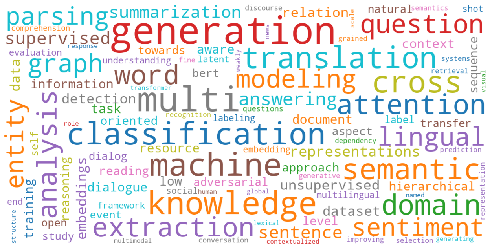

# EMNLP-IJCNLP 2019 Papers

Statistics and Accepted paper list with [arXiv](https://arxiv.org/) link of [EMNLP-IJCNLP 2019](https://www.emnlp-ijcnlp2019.org/),  inspired by Hoseong's [ICCV-2019-Paper-Statistics](https://github.com/hoya012/ICCV-2019-Paper-Statistics).

## EMNLP 2019 Acceptance Rate

## EMNLP 2019 Paper Keywords

## Accepted Papers with arXiv Link

### Index

* [Oral Session](#oral-session)
  * [Machine Learning](#machine-learning)
  * [Lexical Semantics](#lexical-semantics)
  * [Dialog and Interactive Systems](#dialog-and-interactive-systems)
  * [Sentiment Analysis and Argument Mining](#sentiment-analysis-and-argument-mining)
  * [Summarization and Generation](#summarization-and-generation)
  * [Sentence-level Semantics](#sentence-level-semantics)
  * [Speech, Vision, Robotics, Multimodal and Grounding](#speech-vision-robotics-multimodal-and-grounding)
  * [Information Extraction](#information-extraction)
  * [Semantics](#semantics)
  * [Discourse, Summarization, and Generation](#discourse-summarization-and-generation)
  * [Text Mining and NLP Application](#text-mining-and-nlp-application)
  * [Neural Machine Translation](#neural-machine-translation)
  * [Question Answering](#question-answering)
  * [Social Media and Computational Social Science](#social-media-and-computational-social-science)
  * [Discourse and Pragmatics](#discourse-and-pragmatics)
  * [Tagging, Chunking, Syntax and Parsing](#tagging-chunking-syntax-and-parsing)
  * [Machine Translation and Multilinguality](#machine-translation-and-multilinguality)
  * [Reasoning and Question Answering](#reasoning-and-question-answering)
  * [Generation](#generation)
  * [Summarization](#summarization)
  * [Information Retrieval and Document Analysis](#information-retrieval-and-document-analysis)
  * [Reasoning](#reasoning)
  * [Syntax, Parsing, and Linguistic Theories](#syntax-parsing-and-linguistic-theories)
  * [Sentiment and social media](#sentiment-and-social-media)
  * [Phonology, Word Segmentation, and Parsing](#phonology-word-segmentation-and-parsing)
* [Poster & Demo Session](#poster-demo-session)
  * [Information Extraction, Information Retrieval and Document Analysis, Linguistic Theories](#information-extraction-information-retrieval-and-document-analysis-linguistic-theories)
  * [Machine Translation and Mulitilinguality, Phonology, Morphology and Word Segmentation, Tagging, Chunking, Syntax and Parsing](#machine-translation-and-mulitilinguality-phonology-morphology-and-word-segmentation-tagging-chunking-syntax-and-parsing)
  * [Dialog and Interactive Systems, Machine Translation and Multilinuality, Phonology, Morphology, and Word Segmentation, Speech, Vision, Robotics, Multimodal and Grounding, Tagging, Chunking, Syntax and Parsing](#dialog-and-interactive-systems-machine-translation-and-multilinuality-phonology-morphology-and-word-segmentation-speech-vision-robotics-multimodal-and-grounding-tagging-chunking-syntax-and-parsing)
  * [Dialog and Interactive Systems, Speech, Vision, Robotics, Multimodal and Grounding](#dialog-and-interactive-systems-speech-vision-robotics-multimodal-and-grounding)
  * [Question Answering, Textual Inference and Other Areas of Semantics](#question-answering-textual-inference-and-other-areas-of-semantics)
  * [Discourse and Pragmatics, Summarization and Generation](#discourse-and-pragmatics-summarization-and-generation)
  * [Information Retrieval and Document Analysis, Lexical Semantics, Sentence-level Semantics, Machine Learning](#information-retrieval-and-document-analysis-lexical-semantics-sentence-level-semantics-machine-learning)
  * [Machine Learning](#machine-learning-1)
  * [Social Media and Computational Social Science, Text Mining and NLP Applications](#social-media-and-computational-social-science-text-mining-and-nlp-applications)
  * [Sentiment Analysis and Argument Mining, Lexical Semantics, Sentence-level Semantics](#sentiment-analysis-and-argument-mining-lexical-semantics-sentence-level-semantics)
  * [Discourse and Pragmatics, Linguistic Theories, Textual Inference, Question Answering, Summarization and Generation](#discourse-and-pragmatics-linguistic-theories-textual-inference-question-answering-summarization-and-generation)
  * [Information Extraction, Text Mining and NLP Applications, Social Media and Computational Social Science, Sentiment Analysis and Argument Mining](#information-extraction-text-mining-and-nlp-applications-social-media-and-computational-social-science-sentiment-analysis-and-argument-mining)

### Oral Session

#### Machine Learning
- Attending to Future Tokens for Bidirectional Sequence Generation (#1443) [[arXiv]](https://arxiv.org/abs/1908.05915)
- Attention is Not Not Explanation (#526) [[arXiv]](https://arxiv.org/abs/1908.04626)
- Practical Obstacles to Deploying Active Learning (#1176) [[arXiv]](https://arxiv.org/abs/1807.04801)
- Transfer Learning Between Related Tasks Using Expected Label Proportions (#1207) [[arXiv]](https://arxiv.org/abs/1909.00430)
- Insertion-based Decoding with automatically Inferred Generation Order (#TACL-1732) [[arXiv]](https://arxiv.org/abs/1902.01370)
- Are We Modeling the Task or the Annotator? An Investigation of Annotator Bias in Natural Language Understanding Datasets (#1092) [[arXiv]](https://arxiv.org/abs/1908.07898)
- Robust Text Classifier on Test-Time Budgets (#1128) [[arXiv]](https://arxiv.org/abs/1808.08270)
- Commonsense Knowledge Mining from Pretrained Models (#3289) [[arXiv]](https://arxiv.org/abs/1909.00505)
- RNN Architecture Learning with Sparse Regularization (#3428) [[arXiv]](https://arxiv.org/abs/1909.03011)
- Universal Trigger Sequences for Attacking and Analyzing NLP (#1515) [[arXiv]](https://arxiv.org/abs/1908.07125)
- To Annotate or Not? Unsupervised Prediction of Performance Drop due to Domain Shift (#2756)
- Adaptively Sparse Transformers (#2900) [[arXiv]](https://arxiv.org/abs/1909.00015)
- Show Your Work: Improved Reporting of Experimental Results (#3277) [[arXiv]](https://arxiv.org/abs/1909.03004)
- A Deep Factorization of Style and Structure in Fonts (#3999) [[arXiv]](https://arxiv.org/abs/1910.00748)

[Back to Top](#index)

#### Lexical Semantics
- Knowledge Enhanced Contextual Word Representations (#3403) [[arXiv]](https://arxiv.org/abs/1909.04164)
- How Contextual are Contextualized Word Representations? (#208)
- Room to Glo: A Systematic Comparison of Semantic Change Detection Approaches with Word Embeddings (#783)
- On Correlations between Word Vector Sets (#3976) [[arXiv]](https://arxiv.org/abs/1910.02902)
- Game Theory Meets Embeddings: a Unified Framework for Word Sense Disambiguation (#1724)
- Cross-lingual Semantic Specialization via Lexical Relation Induction (#1735)
- Modelling the interplay of metaphor and emotion through multitask learning (#2670)
- How well do NLI models capture verb veridicality? (#3460)
- Modeling Color Terminology Across Thousands of Languages (#3515) [[arXiv]](https://arxiv.org/abs/1910.01531)
- Negative Focus Detection via Contextual Attention Mechanisms (#1314)
- Exploring Human Gender Stereotypes with Word Association Test (#1912)
- Still a Pain in the Neck: Evaluating Text Representations on Lexical Composition (#TACL-1729) [[arXiv]](https://arxiv.org/abs/1902.10618)
- Where''s My Head? Definition, Dataset and Models for Numeric Fused-Heads Identification and Resolution (#TACL-1648) [[arXiv]](https://arxiv.org/abs/1905.10886)

[Back to Top](#index)

#### Dialog and Interactive Systems
- Guided Dialog Policy Learning: Reward Estimation for Multi-Domain Task-Oriented Dialog (#166) [[arXiv]](https://arxiv.org/abs/1908.10719)
- Multi-hop Selector Network for Multi-turn Response Selection in Retrieval-based Chatbots (#554)
- MoEL: Mixture of Empathetic Listeners (#1053) [[arXiv]](https://arxiv.org/abs/1908.07687)
- Entity-Consistent End-to-end Task-Oriented Dialogue System with KB Retriever (#2430) [[arXiv]](https://arxiv.org/abs/1909.06762)
- Building Task-Oriented Visual Dialog Systems Through Alternative Optimization Between Dialog Policy and Language Generation (#3756) [[arXiv]](https://arxiv.org/abs/1909.05365)
- TaskMaster Dialog Corpus: Toward a Realistic and Diverse Dataset (#510)
- MultiDoGO: Multi-Domain Goal-Oriented Dialogues (#1564)
- Build it Break it Fix it for Dialogue Safety: Robustness from Adversarial Human Attack (#1186) [[arXiv]](https://arxiv.org/abs/1908.06083)
- GECOR: An End-to-End Generative Ellipsis and Co-reference Resolution Model for Task-Oriented Dialogue (#1853) [[arXiv]](https://arxiv.org/abs/1909.12086)
- Task-Oriented Conversation Generation Using Heterogeneous Memory Networks (#496) [[arXiv]](https://arxiv.org/abs/1909.11287)

[Back to Top](#index)

#### Sentiment Analysis and Argument Mining
- DialogueGCN: A Graph-based Network for Emotion Recognition in Conversation (#2092) [[arXiv]](http://arxiv.org/abs/1908.11540)
- Knowledge-Enriched Transformer for Emotion Detection in Textual Conversations (#1814) [[arXiv]](https://arxiv.org/abs/1909.10681)
- Interpretable Relevant Emotion Ranking with Event-Driven Attention (#3544)
- Justifying Recommendations using Distantly-Labeled Reviews and Fined-Grained Aspects (#518)
- Using Customer Service Dialogues for Satisfaction Analysis with Context-Assisted Multiple Instance Learning (#204)
- What Gets Echoed? Understanding the “Pointers” in Explanations of Persuasive Arguments (#2089)
- Modeling Frames in Argumentation (#2267)
- AMPERSAND: Argument Mining for PERSuAsive oNline Discussions (#3321)
- Evaluating adversarial attacks against multiple fact verification systems (#427)
- Nonsense!: Quality Control via Two-Step Reason Selection for Annotating Local Acceptability and Related Attributes in News Editorials (#564)
- On the Importance of Delexicalization for Fact Verification (#2984) [[arXiv]](https://arxiv.org/abs/1909.09868)
- Towards Debiasing Fact Verification Models (#3338) [[arXiv]](https://arxiv.org/abs/1908.05267)
- Recognizing Conflict Opinions in Aspect-level Sentiment Classification with Dual Attention Networks (#911)
- Investigating Dynamic Routing in Tree-Structured LSTM for Sentiment Analysis (#1395)
- Aspect-based Sentiment Classification with Aspect-specific Graph Convolutional Networks (#381) [[arXiv]](https://arxiv.org/abs/1909.03477)
- Coupling Global and Local Context for Unsupervised Aspect Extraction (#1988)
- Transferable End-to-End Aspect-based Sentiment Analysis with Selective Adversarial Learning (#65)
- CAN: Constrained Attention Networks for Multi-Aspect Sentiment Analysis (#1995) [[arXiv]](https://arxiv.org/abs/1812.10735)
- Leveraging Just a Few Keywords for Fine-Grained Aspect Detection Through Weakly Supervised Co-Training (#3207) [[arXiv]](http://arxiv.org/abs/1909.00415)

[Back to Top](#index)

#### Summarization and Generation
- Neural Text Summarization: A Critical Evaluation (#3687) [[arXiv]](https://arxiv.org/abs/1908.08960)
- Neural data-to-text generation: A comparison between pipeline and end-to-end architectures (#2586) [[arXiv]](https://arxiv.org/abs/1908.09022)
- MoverScore: Text Generation Evaluating with Contextualized Embeddings and Earth Mover Distance (#1175) [[arXiv]](https://arxiv.org/abs/1909.02622)
- Select and Attend: Towards Controllable Content Selection in Text Generation (#3049) [[arXiv]](https://arxiv.org/abs/1909.04453)
- Sentence-Level Content Planning and Style Specification for Neural Text Generation (#3357) [[arXiv]](https://arxiv.org/abs/1909.00734)

[Back to Top](#index)

#### Sentence-level Semantics
- Translate and Label! An Encoder-Decoder Approach for Cross-lingual Semantic Role Labeling (#2740) [[arXiv]](https://arxiv.org/abs/1908.11326)
- Syntax-Enhanced Self-Attention-Based Semantic Role Labeling (#2106)
- VerbAtlas: a Novel Large-Scale Verbal Semantic Resource and Its Application to Semantic Role Labeling (#2213)
- Parameter-free Sentence Embedding via Orthogonal Basis (#1099)
- Evaluation Benchmarks and Learning Criteria for Discourse-Aware Sentence Representations (#3807) [[arXiv]](https://arxiv.org/abs/1909.00142)
- Learning Semantic Parsers from Denotations with Latent Structured Alignments and Abstract Programs (#2676) [[arXiv]](https://arxiv.org/abs/1909.04165)
- Broad-Coverage Semantic Parsing as Transduction (#263) [[arXiv]](https://arxiv.org/abs/1909.02607)
- Core Semantic First: A Top-down Approach for AMR Parsing (#1544) [[arXiv]](https://arxiv.org/abs/1909.04303)
- Don't paraphrase, detect! Rapid and Effective Data Collection for Semantic Parsing (#2904) [[arXiv]](https://arxiv.org/abs/1908.09940)
- Massively Multilingual Sentence Embeddings for Zero-Shot Cross-Lingual Transfer and Beyond (#TACL-1742) [[arXiv]](https://arxiv.org/abs/1812.10464)

[Back to Top](#index)

#### Speech, Vision, Robotics, Multimodal and Grounding
- Extracting Possessions from Social Media: Images Complement Language (#3013)
- Learning to Speak and Act in a Fantasy Text Adventure Game (#1243) [[arXiv]](https://arxiv.org/abs/1903.03094)
- Help, Anna! Vision-based Navigation with Natural Multimodal Assistance via Retrospective Curiosity-Encouraging Imitation Learning (#1542) [[arXiv]](https://arxiv.org/abs/1909.01871)
- Incorporating Visual Semantics into Sentence Representations within a Grounded Space (#2247)
- Neural Naturalist: Generating Fine-Grained Image Comparisons (#3024) [[arXiv]](https://arxiv.org/abs/1909.04101)
- LXMERT: Learning Cross-Modality Encoder Representations from Transformers (#3048) [[arXiv]](https://arxiv.org/abs/1908.07490)
- Phrase Grounding by Soft-Label Chain Conditional Random Field (#3765) [[arXiv]](https://arxiv.org/abs/1909.00301)
- What You See is What You Get: Visual Pronoun Coreference Resolution in Conversations (#549) [[arXiv]](https://arxiv.org/abs/1909.00421)
- YouMakeup: A Large-Scale Domain-Specific Multimodal Dataset for Fine-Grained Semantic Comprehension (#122)
- DEBUG: A Dense Bottom-Up Grounding Approach for Natural Language Video Localization (#167)

[Back to Top](#index)

#### Information Extraction
- Fine-Grained Evaluation for Entity Linking (#116)
- Supervising Unsupervised Open Information Extraction Models (#3069)
- Neural Cross-Lingual Event Detection with Minimal Parallel Resources (#1723) [[arXiv]](https://arxiv.org/abs/1808.09861)
- KnowledgeNet: A Benchmark Dataset for Knowledge Base Population (#1258)
- Effective Use of Transformer Networks for Entity Tracking (#3308) [[arXiv]](https://arxiv.org/abs/1909.02635)
- Improving Distantly-Supervised Relation Extraction with Joint Label Embedding (#337)
- Leverage Lexical Knowledge for Chinese Named Entity Recognition via Collaborative Graph Network (#566)
- Looking Beyond Label Noise: Shifted Label Distribution Matters in Distantly Supervised Relation Extraction (#1057) [[arXiv]](https://arxiv.org/abs/1904.09331)
- Easy First Relation Extraction with Information Redundancy (#1640)
- Dependency-Guided LSTM-CRF for Named Entity Recognition (#2509) [[arXiv]](https://arxiv.org/abs/1909.10148)
- CrossWeigh: Training Named Entity Tagger from Imperfect Annotations (#2712) [[arXiv]](https://arxiv.org/abs/1909.01441)
- A Little Annotation does a Lot of Good: A Study in Bootstrapping Low-resource Named Entity Recognizers (#3259) [[arXiv]](https://arxiv.org/abs/1908.08983)
- Open Domain Web Keyphrase Extraction Beyond Language Modeling (#1119)
- TuckER: Tensor Factorization for Knowledge Graph Completion (#990) [[arXiv]](https://arxiv.org/abs/1901.09590)
- Weakly Supervised Domain Detection (#TACL-1712) [[arXiv]](https://arxiv.org/abs/1907.11499)
- Event Detection with Multi-Order Graph Convolution and Aggregated Attention (#835)
- Coverage of Information Extraction from Sentences and Paragraphs (#1285)
- HMEAE: Hierarchical Modular Event Argument Extraction (#2354)
- Entity, Relation, and Event Extraction with Contextualized Span Representations (#3930) [[arXiv]](https://arxiv.org/abs/1909.03546)

[Back to Top](#index)

#### Semantics
- Analytical Methods for Interpretable Ultradense Word Embeddings (#75) [[arXiv]](https://arxiv.org/abs/1904.08654)
- Investigating Meta-Learning Algorithms for Low-Resource Natural Language Understanding Tasks (#3142) [[arXiv]](https://arxiv.org/abs/1908.10423)
- Retrofitting Contextualized Word Embeddings with Paraphrases (#3045) [[arXiv]](https://arxiv.org/abs/1909.09700)
- Incorporating Contextual and Syntactic Structures Improves Semantic Similarity Modeling (#3508)

[Back to Top](#index)

#### Discourse, Summarization, and Generation
- Neural Linguistic Steganography (#3399) [[arXiv]](http://arxiv.org/abs/1909.01496)
- The Feasibility of Embedding Based Automatic Evaluation for Single Document Summarization (#3018)
- Attention Optimization for Abstractive Document Summarization (#1918)
- Rewarding Coreference Resolvers for Being Consistent with World Knowledge (#2020) [[arXiv]](https://arxiv.org/abs/1909.02392)

[Back to Top](#index)

#### Text Mining and NLP Applications
- An Empirical Study of Incorporating Pseudo Data into Grammatical Error Correction (#740) [[arXiv]](https://arxiv.org/abs/1909.00502)
- A Multilingual Topic Model for Learning Weighted Topic Links Across Incomparable Corpora (#1257)
- Measure Country-Level Socio-Economic Indicators with Streaming News: An Empirical Study (#3730)
- Towards Extracting Medical Family History from Natural Language Interactions: A New Dataset and Baselines (#2903)
- (Male, Bachelor) and (Female, Ph.D) have different connotations: Parallelly Annotated Stylistic Language Dataset with Multiple Personas (#3793) [[arXiv]](https://arxiv.org/abs/1909.00098)
- Movie Plot Analysis via Turning Point Identification (#244) [[arXiv]](https://arxiv.org/abs/1908.10328)
- Latent Suicide Risk Detection on Microblog via Suicide-Oriented Word Embeddings and Layered Attention (#2488)
- Deep Ordinal Regression for Pledge Specificity Prediction (#1903) [[arXiv]](https://arxiv.org/abs/1909.00187)
- Enabling Robust Grammatical Error Correction in New Domains: Datasets, Metrics, and Analyses (#TACL-1677)
- The Myth of Blind Review Revisited: Experiments on ACL vs. EMNLP (#2233)
- Uncover Sexual Harassment Patterns from Personal Stories by Joint Key Element Extraction and Categorization (#2653)
- Identifying Predictive Causal Factors from News Streams (#2864)
- Training Data Augmentation for Detecting Adverse Drug Reactions in User-Generated Content (#3011)
- Deep Reinforcement Learning-based Text Anonymization against Private-Attribute Inference (#3160)

[Back to Top](#index)

#### Neural Machine Translation
- Enhancing Context Modeling with a Query-Guided Capsule Network for Document-level NMT (#2416) [[arXiv]](http://arxiv.org/abs/1909.00564)
- Simple, Scalable Adaptation for Neural Machine Translation (#3252) [[arXiv]](http://arxiv.org/abs/1909.08478)
- Controlling Text Complexity in Neural Machine Translation (#3177)
- Investigating Multilingual NMT Representations at Scale (#1388) [[arXiv]](https://arxiv.org/abs/1909.02197)
- Hierarchical Modeling of Global Context for Document-Level Neural Machine Translation (#1423)

[Back to Top](#index)

#### Question Answering
- Cross-Lingual Machine Reading Comprehension (#8) [[arXiv]](https://arxiv.org/abs/1909.00361)
- A Multi-Type Multi-Span Network for Reading Comprehension that Requires Discrete Reasoning (#582) [[arXiv]](https://arxiv.org/abs/1908.05514)
- Neural Duplicate Question Detection without Labeled Training Data (#880)
- Asking Clarification Questions in Knowledge-Based Question Answering (#889)
- Multi-View Domain Adapted Sentence Embeddings for Low-Resource Unsupervised Duplicate Question Detection (#1646)
- Interactive Language Learning by Question Answering (#1367) [[arXiv]](https://arxiv.org/abs/1908.10909)
- What's Missing: A Knowledge Gap Guided Approach for Multi-hop Question Answering (#3238) [[arXiv]](https://arxiv.org/abs/1909.09253)
- KagNet: Learning to Answer Commonsense Questions with Knowledge-Aware Graph Networks (#436)
- Learning with Limited Data for Multilingual Reading Comprehension (#3518)
- A Discrete Hard EM Approach for Weakly Supervised Question Answering (#3778) [[arXiv]](https://arxiv.org/abs/1909.04849)

#### Social Media and Computational Social Science
- Multi-label Categorization of Accounts of Sexism using a Neural Framework (#172) [[arXiv]](http://arxiv.org/abs/1910.04602)
- The Trumpiest Trump? Identifying a Subject's Most Characteristic Tweets (#1462) [[arXiv]](https://arxiv.org/abs/1909.04002)
- Finding Microaggressions in the Wild: A Case for Locating Elusive Phenomena in Social Media Posts (#2950)
- Reinforced Product Metadata Selection for Helpfulness Assessment of Customer Reviews (#694)
- Learning Invariant Representations of Social Media Users (#3557) [[arXiv]](https://arxiv.org/abs/1910.04979)

[Back to Top](#index)

#### Discourse and Pragmatics
- A Unified Neural Coherence Model (#1792) [[arXiv]](https://arxiv.org/abs/1909.00349)
- Topic-Guided Coherence Modeling for Sentence Ordering by Preserving Global and Local Information (#2642)
- Neural Generative Rhetorical Structure Parsing (#4060) [[arXiv]](https://arxiv.org/abs/1909.11049)
- Weak Supervision for Learning Discourse Structure (#2453)
- Predicting Discourse Structure using Distant Supervision from Sentiment (#2625)

[Back to Top](#index)

#### Tagging, Chunking, Syntax and Parsing
- Designing and Interpreting Probes with Control Tasks (#4063) [[arXiv]](https://arxiv.org/abs/1909.03368)
- Specializing Word Embeddings (for Parsing) by Information Bottleneck (#1357) [[arXiv]](https://arxiv.org/abs/1910.00163)
- Deep Contextualized Word Embeddings in Transition-Based and Graph-Based Dependency Parsing - A Tale of Two Parsers Revisited (#2799) [[arXiv]](https://arxiv.org/abs/1908.07397)
- Semantic graph parsing with recurrent neural network DAG grammars (#2863) [[arXiv]](https://arxiv.org/abs/1910.00051)
- 75 Languages, 1 Model: Parsing Universal Dependencies Universally (#1221) [[arXiv]](http://arxiv.org/abs/1904.02099)

[Back to Top](#index)

#### Linguistic Theories, Cognitive Modeling and Psycholinguistics
- Is the Red Square Big? MALeViC: Modeling Adjectives Leveraging Visual Contexts (#2585) [[arXiv]](https://arxiv.org/abs/1908.10285)
- Investigating BERT's Knowledge of Language: Five Analysis Methods with NPIs (#3650) [[arXiv]](https://arxiv.org/abs/1909.02597)
- Representation of Constituents in Neural Language Models: - Coordination Phrase as a Case Study (#3929) [[arXiv]](https://arxiv.org/abs/1909.04625)
- Towards Zero-shot Language Modelling (#1745)
- Neural Network Acceptability Judgments (#TACL-1710) [[arXiv]](https://arxiv.org/abs/1805.12471)

[Back to Top](#index)

#### Machine Translation and Multilinguality
- Lost in Evaluation: Misleading Benchmarks for Bilingual Dictionary Induction (#1131) [[arXiv]](http://arxiv.org/abs/1909.05708)
- Towards Realistic Practices In Low-Resource Natural Language Processing: The Development Set (#1266) [[arXiv]](https://arxiv.org/abs/1909.01522)
- Synchronously Generating Two Languages with Interactive Decoding (#1478)
- On NMT Search Errors and Model Errors: Cat Got Your Tongue? (#1868) [[arXiv]](https://arxiv.org/abs/1908.10090)
- Do We Really Need Fully Unsupervised Cross-Lingual Embeddings? (#2459) [[arXiv]](https://arxiv.org/abs/1909.01638)
- Weakly-Supervised Concept-based Adversarial Learning for Cross-lingual Word Embeddings (#2491) [[arXiv]](https://arxiv.org/abs/1904.09446)
- Aligning Cross-lingual Entities with Multi-Aspect Information (#3541) [[arXiv]](http://arxiv.org/abs/1910.06575)
- Contrastive Language Adaptation for Cross-Lingual Stance Detection (#2498) [[arXiv]](https://arxiv.org/abs/1910.02076)
- Jointly Learning to Align and Translate with Transformer Models (#422) [[arXiv]](https://arxiv.org/abs/1909.02074)
- Understanding Data Augmentation in Neural Machine Translation: Two Perspectives towards Generalization (#2192)
- Simple and Effective Noisy Channel Modeling for Neural Machine Translation (#2869) [[arXiv]](https://arxiv.org/abs/1908.05731)
- MultiFiT: Efficient Multi-lingual Language Model Fine-tuning (#745) [[arXiv]](https://arxiv.org/abs/1909.04761)
- Hint-based Training for Non-AutoRegressive Machine Translation (#1064)
- Two New Evaluation Datasets for Low-Resource Machine Translation: Nepali-English and Sinhala English (#3349) [[arXiv]](https://arxiv.org/abs/1902.01382)
- Constant-Time Machine Translation with Conditional Masked Language Models (#1204)
- Learning to Copy for Automatic Post-Editing (#777)

[Back to Top](#index)

#### Reasoning and Question Answering
- Going on a vacation takes longer than “Going for a walk”: A Study of Temporal Commonsense Understanding (#2533) [[arXiv]](https://arxiv.org/abs/1909.03065)
- QAInfomax: Learning Robust Question Answering System by Mutual Information Maximization (#2798) [[arXiv]](https://arxiv.org/abs/1909.00215)
- Adapting Meta Knowledge Graph Information for Multi-Hop Reasoning over Few-Shot Relations (#329) [[arXiv]](https://arxiv.org/abs/1908.11513)
- How Reasonable are Common-Sense Reasoning Tasks: A Case-Study on the Winograd Schema Challenge and SWAG (#586) [[arXiv]](https://arxiv.org/abs/1811.01778)

[Back to Top](#index)

#### Generation
- Pun-GAN: Generative Adversarial Network for Pun Generation (#267)
- Multi-Task Learning with Language Modeling for Question Generation (#3820) [[arXiv]](https://arxiv.org/abs/1908.11813)
- Autoregressive Text Generation beyond Feedback Loops (#3506) [[arXiv]](https://arxiv.org/abs/1908.11658)
- The Woman Worked as a Babysitter: On Biases in Language Generation (#3874) [[arXiv]](https://arxiv.org/abs/1909.01326)
- Counterfactual Story Reasoning and Generation (#3328) [[arXiv]](https://arxiv.org/abs/1909.04076)
- Encode, Tag, Realize: High-Precision Text Editing (#2395) [[arXiv]](https://arxiv.org/abs/1909.01187)
- Answer-guided and Semantic Coherent Question Generation in Open-domain Conversation (#128)
- Read, Attend and Comment: A Deep Architecture for Automatic News Comment Generation (#1947) [[arXiv]](https://arxiv.org/abs/1909.11974)
- A Topic Augmented Text Generation Model: Joint Learning of Semantics and Structural Features (#2822)
- A Modular Architecture for Unsupervised Sarcasm Generation (#2725)
- Interpoetry: Generating Classical Chinese Poems from Vernacular Chinese (#2534) [[arXiv]](https://arxiv.org/abs/1909.00279)
- Set to Ordered Text: Generating Discharge Instructions from Medical Billing Codes (#724)

[Back to Top](#index)

#### Summarization
- Summary Cloze: A New Task for Content Selection in Topic-Focused Summarization (#1178)
- Text Summarization with Pretrained Encoders (#392) [[arXiv]](https://arxiv.org/abs/1908.08345)
- How to Write Summaries with Patterns? Learning towards Abstractive Summarization through Prototype Editing (#609) [[arXiv]](https://arxiv.org/abs/1909.08837)
- Unsupervised Sentence Summarization using the Information Bottleneck Principle (#3219) [[arXiv]](https://arxiv.org/abs/1909.07405)
- Improving Latent Alignment in Text Summarization by Generalizing the Pointer Generator (#3043)

[Back to Top](#index)

#### Information Retrieval and Document Analysis
- Cross-Cultural Transfer Learning for Text Classification (#1036)
- Combining Unsupervised Pre-training and Annotator Rationales to Improve Low-shot Text Classification (#1190)
- Projection Sequence Networks for On-Device Text Classification (#3202)
- Induction Networks for Few-Shot Text Classification (#3562) [[arXiv]](https://arxiv.org/abs/1902.10482)
- Benchmarking Zero-shot Text Classification: Datasets, Evaluation and Entailment Approach (#2899) [[arXiv]](https://arxiv.org/abs/1909.00161)
- Human-grounded Evaluations of Explanation Methods for Text Classification (#425) [[arXiv]](https://arxiv.org/abs/1908.11355)
- A Context-based Framework for Modeling the Role and Function of On-line Resource Citations in Scientific Literature (#793)
- Adversarial Reprogramming of Text Classification Neural Networks (#28) [[arXiv]](https://arxiv.org/abs/1809.01829)
- Document Hashing with Mixture-Prior Generative Models (#1676) [[arXiv]](https://arxiv.org/abs/1908.11078)
- Efficient Vector Retrieval under Maximum Inner Product (#3421)

[Back to Top](#index)

#### Reasoning
- Social IQa: Commonsense Reasoning about Social Interactions (#1334) [[arXiv]](https://arxiv.org/abs/1904.09728)
- Self-Assembling Modular Networks for Interpretable Multi-Hop Reasoning (#2866) [[arXiv]](http://arxiv.org/abs/1909.05803)
- Posing Fair Generalization Tasks for Natural Language Inference (#1413)
- Everything Happens for a Reason: Discovering the Purpose of Actions in Procedural Text (#3279) [[arXiv]](https://arxiv.org/abs/1909.04745)
- CLUTRR: A Diagnostic Benchmark for Inductive Reasoning from Text (#3183) [[arXiv]](https://arxiv.org/abs/1908.06177)

[Back to Top](#index)

#### Syntax, Parsing, and Linguistic Theories
- Working Hard or Hardly Working: Challenges of Integrating Typology into Neural Dependency Parsers (#3860) [[arXiv]](https://arxiv.org/abs/1909.09279)
- Cross-Lingual BERT Transformation for Zero-Shot Dependency Parsing (#1832) [[arXiv]](https://arxiv.org/abs/1909.06775)
- Multilingual Grammar Induction with Continuous Language Identification (#3883)
- Quantifying the Semantic Core of Gender Systems (#2637)

[Back to Top](#index)

#### Sentiment and Social Media
- Perturbation Sensitivity Analysis for Detecting Unintended Model Biases (#3447) [[arXiv]](https://arxiv.org/abs/1910.04210)
- Automatically Inferring Gender Associations from Language (#3519) [[arXiv]](https://arxiv.org/abs/1909.00091)
- Reporting the Unreported: Event Extraction for Analyzing the Local Representation of Hate Crimes (#3715) [[arXiv]](https://arxiv.org/abs/1909.02126)
- Minimally Supervised Learning of Affective Events Using Discourse Relations (#3493) [[arXiv]](https://arxiv.org/abs/1909.00694)

[Back to Top](#index)

#### Phonology, Word Segmentation, and Parsing
- Constraint-based Learning of Phonological Processes (#451)
- Detect Camouflaged Spam Content via StoneSkipping: Graph and Text Joint Embedding for Chinese Character Variation Representation (#1340) [[arXiv]](https://arxiv.org/abs/1908.11561)
- A Generative Model for Punctuation in Dependency Trees (#TACL-1582) [[arXiv]](https://arxiv.org/abs/1906.11298)

[Back to Top](#index)

### Poster & Demo Session
#### Information Extraction, Information Retrieval and Document Analysis, Linguistic Theories
- Leveraging Dependency Forest for Neural Medical Relation Extraction (#249)
- Open Relation Extraction: Relational Knowledge Transfer from Supervised Data to Unsupervised Data (#569)
- Improving Relation Extraction with Knowledge-attention (#710) [[arXiv]](https://arxiv.org/abs/1910.02724)
- Jointly Learning Entity and Relation Representations for Entity Alignment (#782) [[arXiv]](https://arxiv.org/abs/1909.09317)
- Tackling Long-Tailed Relations and Uncommon Entities in Knowledge Graph Completion (#796) [[arXiv]](https://arxiv.org/abs/1909.11359)
- Low-Resource Name Tagging Learned with Weakly Labeled Data (#821) [[arXiv]](https://arxiv.org/abs/1908.09659)
- Learning Dynamic Context Augmentation for Global Entity Linking (#841) [[arXiv]](http://arxiv.org/abs/1909.02117)
- Open Event Extraction from Online Texts using a Generative Adversarial Network (#859) [[arXiv]](https://arxiv.org/abs/1908.09246)
- Learning to Bootstrap for Entity Set Expansion (#1001)
- Multi-input Multi-output Sequence Labeling for Joint Extraction of Fact and Condition Tuples from Scientific Text (#1149)
- Cross-lingual Structure Transfer for Relation and Event Extraction (#1210)
- Uncover the Ground-Truth Relations in Distant Supervision: A Neural Expectation Maximization Framework (#1365) [[arXiv]](http://arxiv.org/abs/1909.05448)
- Doc2EDAG: An End-to-End Document-level Framework for Chinese Financial Event Extraction (#1736) [[arXiv]](http://arxiv.org/abs/1904.07535)
- Event Detection with Trigger-Aware Lattice Neural Network (#1816)
- A Boundary-aware Neural Model for Nested Named Entity Recognition (#1874)
- Learning the Extraction Order of Multiple Relational Facts in a Sentence with Reinforcement Learning (#2024)
- CaRe: Open Knowledge Graph Embeddings (#2439)
- Self-Attention Enhanced CNNs and Collaborative Curriculum Learning for Distantly Supervised Relation Extraction (#2793)
- Neural Cross-Lingual Relation Extraction Based on Bilingual Word Embedding Mapping (#3014)
- Leveraging 2-hop Distant Supervision from Table Entity Pairs for Relation Extraction (#3059) [[arXiv]](http://arxiv.org/abs/1909.06007)
- EntEval: A Holistic Evaluation Benchmark for Entity Representations (#3317) [[arXiv]](https://arxiv.org/abs/1909.00137)
- Joint Event and Temporal Relation Extraction with Shared Representations and Structured Prediction (#3646) [[arXiv]](https://arxiv.org/abs/1909.05360)
- Hierarchical Text Classification with Reinforced Label Assignment (#32) [[arXiv]](https://arxiv.org/abs/1908.10419)
- Investigating Capsule Network and Semantic Feature on Hyperplanes for Text Classification (#314)
- Label-Specific Document Representation for Multi-Label Text Classification (#721)
- Hierarchical Attention Prototypical Networks for Few-Shot Text Classification (#729)
- Many Faces of Feature Importance: Comparing Built-in and Post-hoc Feature Importance in Text Classification (#2087)
- Enhancing Local Feature Extraction with Global Representation for Neural Text Classification (#2273)
- Latent-Variable Generative Text Classifiers for Data-Efficient NLP (#3004)
- PaRe: A Paper-Reviewer Matching Approach Using a Common Topic Space (#3239) [[arXiv]](http://arxiv.org/abs/1909.11258)
- Linking artificial and human neural representations of language (#2750) [[arXiv]](https://arxiv.org/abs/1910.01244)

[Back to Top](#index)

#### Machine Translation and Mulitilinguality, Phonology, Morphology and Word Segmentation, Tagging, Chunking, Syntax and Parsing
- Explicit Cross-lingual Pre-training for Unsupervised Machine Translation (#233) [[arXiv]](https://arxiv.org/abs/1909.00180)
- Latent Part-of-Speech Sequences for Neural Machine Translation (#410) [[arXiv]](https://arxiv.org/abs/1908.11782)
- Improving Back-Translation with Uncertainty-based Confidence Estimation (#798) [[arXiv]](https://arxiv.org/abs/1909.00157)
- Towards Linear Time Neural Machine Translation with Capsule Networks (#846) [[arXiv]](https://arxiv.org/abs/1811.00287)
- Modeling Multi-mapping relations for Precise Cross-lingual Entity Alignment (#985)
- Supervised and Nonlinear Alignment of Two Embedding Spaces for Dictionary Induction in Low Resourced Languages (#1226)
- Beto, Bentz, Becas: The Surprising Cross-Lingual Effectiveness of BERT (#1414) [[arXiv]](https://arxiv.org/abs/1904.09077)
- Iterative Dual Domain Adaptation for Neural Machine Translation (#1427)
- Multi-agent Learning for Neural Machine Translation (#1484) [[arXiv]](https://arxiv.org/abs/1909.01101)
- Pivot-based Transfer Learning for Neural Machine Translation between non-English Languages (#1869) [[arXiv]](https://arxiv.org/abs/1909.09524)
- Context-Aware Monolingual Repair for Neural Machine Translation (#1967) [[arXiv]](https://arxiv.org/abs/1909.01383)
- Multi-Granularity Self-Attention for Neural Machine Translation (#2330) [[arXiv]](https://arxiv.org/abs/1909.02222)
- The Bottom-up Evolution of Representations in the Transformer: A Study with Machine Translation and Language Modeling Objectives (#2415) [[arXiv]](https://arxiv.org/abs/1909.01380)
- Improving Deep Transformer with Depth-Scaled Initialization and Merged Attention (#2537) [[arXiv]](https://arxiv.org/abs/1908.11365)
- A Discriminative Neural Model for Cross-Lingual Word Alignment (#2961) [[arXiv]](https://arxiv.org/abs/1909.00444)
- One Model to Learn Both: Zero Pronoun Prediction and Translation (#3571) [[arXiv]](https://arxiv.org/abs/1909.00369)
- Dynamic Past and Future for Neural Machine Translation (#3601) [[arXiv]](https://arxiv.org/abs/1904.09646)
- Revisit Automatic Error Detection for Wrong and Missing Translation &dash; A Supervised Approach (#3770)
- Towards Understanding Neural Machine Translation with Word Importance (#3857) [[arXiv]](https://arxiv.org/abs/1909.00326)
- Multilingual Neural Machine Translation with Language Clustering (#4056) [[arXiv]](https://arxiv.org/abs/1908.09324)
- Don't Forget the Long Tail! A Comprehensive Analysis of Morphological Generalization in Bilingual Lexicon Induction (#1065) [[arXiv]](https://arxiv.org/abs/1909.02855)
- A Functionalist Account of Vowel System Typology (#1268)
- Pushing the Limits of Low-Resource Morphological Inflection (#2230) [[arXiv]](https://arxiv.org/abs/1908.05838)
- Morphological Analysis Using a Sequence Decoder (#TACL-1654)
- Cross-Lingual Dependency Parsing Using Code-Mixed TreeBank (#205) [[arXiv]](https://arxiv.org/abs/1909.02235)
- Hierarchical Pointer Net Parsing (#531) [[arXiv]](https://arxiv.org/abs/1908.11571)
- Semi-Supervised Semantic Role Labeling with Cross-View Training (#719)
- Low-Resource Sequence Labeling via Unsupervised Multilingual Contextualized Representations (#809)
- A Lexicon-Based Graph Neural Network for Chinese NER (#863)
- CM-Net: A Novel Collaborative Memory Network for Spoken Language Understanding (#1556) [[arXiv]](https://arxiv.org/abs/1909.06937)
- Tree Transformer: Integrating Tree Structures into Self-Attention (#1794) [[arXiv]](https://arxiv.org/abs/1909.06639)
- Semantic Role Labeling with Iterative Structure Refinement (#2179) [[arXiv]](https://arxiv.org/abs/1909.03285)
- Entity Projection via Machine-Translation for Cross-Lingual NER (#2724) [[arXiv]](https://arxiv.org/abs/1909.05356)
- A Bayesian Approach for Sequence Tagging with Crowds (#2738) [[arXiv]](https://arxiv.org/abs/1811.00780)
- A systematic comparison of methods for low-resource dependency parsing on genuinely low-resource languages (#3091) [[arXiv]](http://arxiv.org/abs/1909.02857)
- Target Language-Aware Constrained Inference for Cross-lingual Dependency Parsing (#3368) [[arXiv]](https://arxiv.org/abs/1909.01482)
- Look-up and Adapt: A One-shot Semantic Parser (#3711)
- Similarity Based Auxiliary Classifier for Named Entity Recognition (#3886)
- Variable beam search for generative neural parsing and its relevance for neuro-imaging signal analysis (#4015)

[Back to Top](#index)

#### Dialog and Interactive Systems, Machine Translation and Multilinuality, Phonology, Morphology, and Word Segmentation, Speech, Vision, Robotics, Multimodal and Grounding, Tagging, Chunking, Syntax and Parsing
- Multi-task Learning for Natural Language Generation in Task-Oriented Dialogue (#242)
- Dirichlet Latent Variable Hierarchical Recurrent Encoder-Decoder in Dialogue Generation (#622)
- Semi-Supervised Bootstrapping of Dialogue State Trackers for Task-Oriented Modelling (#1011)
- A Progressive Model to Enable Continual Learning for Semantic Slot Filling (#1289)
- CASA-NLU: Context-Aware Self-Attentive Natural Language Understanding for Task-Oriented Chatbots (#1447) [[arXiv]](https://arxiv.org/abs/1909.08705)
- Sampling Matters! An Empirical Study of Negative Sampling Strategies for Learning of Matching Models in Retrieval-based Dialogue Systems (#2050)
- Zero-shot Cross-lingual Dialogue Systems with Transferable Latent Variables (#2329)
- Modeling Multi-Action Policy for Task-Oriented Dialogues (#2650) [[arXiv]](https://arxiv.org/abs/1908.11546)
- An Evaluation for Intent Classification and Out-of-Scope Prediction (#3471) [[arXiv]](https://arxiv.org/abs/1909.02027)
- Automatically Learning Data Augmentation Policies for Dialogue Tasks (#3528) [[arXiv]](https://arxiv.org/abs/1909.12868)
- uniblock: Scoring and Filtering Corpus with Unicode Block Information (#351) [[arXiv]](https://arxiv.org/abs/1908.09716)
- Multilingual word translation using auxiliary languages (#533)
- Towards Better Modeling Hierarchical Structure for Self-Attention with Ordered Neurons (#801) [[arXiv]](https://arxiv.org/abs/1909.01562)
- Improved Sentence Alignment in Linear Time and Space (#1284)
- Simpler and Faster Learning of Adaptive Policies for Simultaneous Translation (#1603) [[arXiv]](https://arxiv.org/abs/1909.01559)
- Adversarial Learning with Contextual Embeddings for Zero-resource Cross-lingual Classification and NER (#1889) [[arXiv]](https://arxiv.org/abs/1909.00153)
- Recurrent Embedding for Neural Machine Translation (#2114)
- Machine Translation for Machines: the Sentiment Classification Use Case (#2413) [[arXiv]](http://arxiv.org/abs/1910.00478)
- Investigating the Effectiveness of BPE: The Power of Shorter Sequences (#2552)
- HABLex: Human Annotated Bilingual Lexicons for Experiments in Machine Translation (#3022)
- Handling Syntactic Divergence in Low-resource Machine Translation (#3336) [[arXiv]](https://arxiv.org/abs/1909.00040)
- Speculative Beam Search for Simultaneous Translation (#3487) [[arXiv]](https://arxiv.org/abs/1909.05421)
- Self-Attention with Structural Position Representations (#3548) [[arXiv]](http://arxiv.org/abs/1909.00383)
- Low-Resource Neural Machine Translation by Exploiting Multilingualism through Multi-Step Fine-Tuning Using N-way Parallel Corpora (#3590)
- Unsupervised Domain Adaptation for Neural Machine Translation with Domain-Aware Feature Embeddings (#3716) [[arXiv]](https://arxiv.org/abs/1908.10430)
- A Regularization-based Framework for Bilingual Grammar Induction (#4061)
- Encoders Help You Disambiguate Word Senses in Neural Machine Translation (#4083) [[arXiv]](https://arxiv.org/abs/1908.11771)
- Korean Morphological Analysis with Tied Sequence-to-Sequence Multi-Task Model (#2376)
- Convolutional Neural Networks for Diacritic Restoration (#3733)
- Improving Visual Dialog by Learning to Answer Diverse Questions (#459)
- Cross-lingual Transfer Learning with Data Selection for Large-Scale Spoken Language Understanding (#790) [[arXiv]](https://arxiv.org/abs/1904.01825)
- Multi-Head Attention with Diversity for Learning Grounded Multilingual Multimodal Representations (#2786) [[arXiv]](https://arxiv.org/abs/1910.00058)
- Decoupled Box Proposal and Featurization with Ultrafine-Grained Semantic Labels Improve Image Captioning and Visual Question Answering (#3263) [[arXiv]](https://arxiv.org/abs/1909.02097)
- REO-Relevance, Extraness, Omission: A Fine-grained Evaluation for Image Captioning (#3293) [[arXiv]](https://arxiv.org/abs/1909.02217)
- WSLLN: Weakly Supervised Natural Language Localization Networks (#3398) [[arXiv]](https://arxiv.org/abs/1909.00239)
- Grounding learning of modifier dynamics: An application to colour naming. (#3748) [[arXiv]](http://arxiv.org/abs/1909.07586)
- Efficient Navigation with Language Pre-training and Stochastic Sampling (#3830) [[arXiv]](https://arxiv.org/abs/1909.02244)
- Towards Making a Dependency Parser See (#413) [[arXiv]](https://arxiv.org/abs/1909.01053)
- Unsupervised Labeled Parsing with Deep Inside-Outside Recursive Autoencoders (#1234) [[arXiv]](https://arxiv.org/abs/1904.02142)
- Dependency Parsing for Spoken Dialog Systems (#3171) [[arXiv]](https://arxiv.org/abs/1909.03317)
- Span-based Hierarchical Semantic Parsing for Task-Oriented Dialog (#3240)

[Back to Top](#index)

#### Dialog and Interactive Systems, Speech, Vision, Robotics, Multimodal and Grounding
- Data-Efficient Goal-Oriented Conversation with Dialogue Knowledge Transfer Networks (#9) [[arXiv]](https://arxiv.org/abs/1910.01302)
- Multi-Granularity Representations of Dialog (#64) [[arXiv]](https://arxiv.org/abs/1908.09890)
- Are You for Real? Detecting Identity Fraud via Dialogue Interactions (#111) [[arXiv]](https://arxiv.org/abs/1908.06820)
- Hierarchy Response Learning for Neural Conversation Generation (#124)
- Knowledge Aware Conversation Generation with Explainable Reasoning on Augmented Graphs (#138) [[arXiv]](https://arxiv.org/abs/1903.10245)
- Adaptive Parameterization for Neural Dialogue Generation (#298)
- Towards Knowledge-Based Recommender Dialog System (#316) [[arXiv]](https://arxiv.org/abs/1908.05391)
- Structuring latent spaces for stylized response generation (#419) [[arXiv]](https://arxiv.org/abs/1909.05361)
- Improving Open-Domain Dialogue Systems via Multi-Turn Incomplete Utterance Restoration (#537)
- Unsupervised Context Rewriting for Open Domain Conversation (#771)
- Dually Interactive Matching Network for Personalized Response Selection in Retrieval-Based Chatbots (#866) [[arXiv]](https://arxiv.org/abs/1908.05859)
- DyKgChat: Benchmarking Dialogue Generation Grounding on Dynamic Knowledge Graphs (#1432) [[arXiv]](https://arxiv.org/abs/1910.00610)
- Retrieval-guided Dialogue Response Generation via a Matching-to-Generation Framework (#1550)
- Scalable and Accurate Dialogue State Tracking via Hierarchical Sequence Generation (#1842) [[arXiv]](https://arxiv.org/abs/1909.00754)
- Low-Resource Response Generation with Template Prior (#1931) [[arXiv]](https://arxiv.org/abs/1909.11968)
- A Discrete CVAE for Response Generation on Short-Text Conversation (#2039)
- Who Is Speaking to Whom? Learning to Identify Utterance Addressee in Multi-Party Conversations (#2495)
- A Semi-Supervised Stable Variational Network for Promoting Replier-Consistency in Dialogue Generation (#2594)
- Modeling Personalization in Continuous Space for Response Generation via Augmented Wasserstein Autoencoders (#2685)
- Variational Hierarchical User-based Conversation Model (#3513)
- Recommendation as a Communication Game: Self-Supervised Role-Playing for Goal-oriented Dialogue (#3727) [[arXiv]](https://arxiv.org/abs/1909.03922)
- CoSQL: A Conversational Text-to-SQL Challenge Towards Cross-Domain Natural Language Interfaces to Databases (#3881) [[arXiv]](https://arxiv.org/abs/1909.05378)
- A Practical Dialogue-Act-Driven Conversation Model for Multi-Turn Response Selection (#3954)
- How to Build User Simulators to Train RL-based Dialog Systems (#4003) [[arXiv]](https://arxiv.org/abs/1909.01388)
- Graph Convolutional Network with Sequential Attention for Goal-Oriented Dialogue Systems (#TACL-1676)
- Low-Rank HOCA: Efficient High-Order Cross-Modal Attention for Video Captioning (#294)
- Image Captioning with Very Scarce Supervised Data: Adversarial Semi-Supervised Learning Approach (#370) [[arXiv]](https://arxiv.org/abs/1909.02201)
- Dual Attention Networks for Visual Reference Resolution in Visual Dialog (#401) [[arXiv]](https://arxiv.org/abs/1902.09368)
- Unsupervised Discovery of Multimodal Links in Multi-image, Multi-sentence Documents (#942) [[arXiv]](https://arxiv.org/abs/1904.07826)
- UR-FUNNY: A Multimodal Language Dataset for Understanding Humor (#996) [[arXiv]](https://arxiv.org/abs/1904.06618)
- Partners in Crime: Multi-view Sequential Inference for Movie Understanding (#1923)
- Guiding the Flowing of Semantics: Interpretable Video Captioning via POS Tag (#2097)
- A Stack-Propagation Framework with Token-Level Intent Detection for Spoken Language Understanding (#2414) [[arXiv]](https://arxiv.org/abs/1909.02188)
- Talk2Car: Taking Control Of Your Self Driving Car (#2718) [[arXiv]](http://arxiv.org/abs/1909.10838)
- Fact-Checking Meets Fauxtography: Verifying Claims About Images (#2739) [[arXiv]](https://arxiv.org/abs/1908.11722)
- Video Dialog via Progressive Inference and Cross-Transformer (#2766)
- Executing Instructions in Situated Collaborative Interactions (#2884) [[arXiv]](https://arxiv.org/abs/1910.03655)
- Fusion of Detected Objects in Text for Visual Question Answering (#3099) [[arXiv]](https://arxiv.org/abs/1908.05054)
- TIGEr: Text-to-Image Grounding for Image Caption Evaluation (#3260) [[arXiv]](https://arxiv.org/abs/1909.02050)

[Back to Top](#index)

#### Question Answering, Textual Inference and Other Areas of Semantics
- Tree-structured Decoding for Solving Math Word Problems (#56)
- PullNet: Open Domain Question Answering with Iterative Retrieval on Knowledge Bases and Text (#86) [[arXiv]](https://arxiv.org/abs/1904.09537)
- Cosmos QA: Machine Reading Comprehension with Contextual Commonsense Reasoning (#107) [[arXiv]](https://arxiv.org/abs/1909.00277)
- Finding Generalizable Evidence by Learning to Convince Q&A Models (#179) [[arXiv]](https://arxiv.org/abs/1909.05863)
- Ranking and Sampling in Open-domain Question Answering (#468)
- A Non-commutative Bilinear Model for Answering Path Queries in Knowledge Graphs (#618) [[arXiv]](https://arxiv.org/abs/1909.01567)
- Generating Questions for Knowledge Bases via Incorporating Diversified Contexts and Answer-Aware Loss (#807)
- Multi-task Learning for Conversational Question Answering Over a Large-Scale Knowledge Base (#924) [[arXiv]](http://arxiv.org/abs/1910.05069)
- BiPaR: A Bilingual Parallel Dataset for Multilingual and Cross-lingual Reading Comprehension on Novels (#1930) [[arXiv]](https://arxiv.org/abs/1910.05040)
- Language Models as Knowledge Bases? (#2085) [[arXiv]](https://arxiv.org/abs/1909.01066)
- NumNet: Machine Reading Comprehension with Numerical Reasoning (#2237) [[arXiv]](https://arxiv.org/abs/1910.06701)
- Unicoder: A Universal Language Encoder by Pre-training with Multiple Cross-lingual Tasks (#2277) [[arXiv]](https://arxiv.org/abs/1909.00964)
- Addressing Semantic Drift in Question Generation for Semi-Supervised Question Answering (#2390) [[arXiv]](https://arxiv.org/abs/1909.06356)
- Adversarial Domain Adaptation for Machine Reading Comprehension (#2764) [[arXiv]](https://arxiv.org/abs/1908.09209)
- Incorporating External Knowledge into Machine Reading for Generative Question Answering (#2820) [[arXiv]](https://arxiv.org/abs/1909.02745)
- Answering questions by learning to rank - Learning to rank by answering questions (#2825) [[arXiv]](http://arxiv.org/abs/1909.00596)
- Discourse-Aware Semantic Self-Attention for Narrative Reading Comprehension (#2940) [[arXiv]](https://arxiv.org/abs/1908.10721)
- Revealing the Importance of Semantic Retrieval for Machine Reading at Scale (#2945) [[arXiv]](https://arxiv.org/abs/1909.08041)
- PubMedQA: A Dataset for Biomedical Research Question Answering (#2978) [[arXiv]](https://arxiv.org/abs/1909.06146)
- Quick and (not so) Dirty: Unsupervised Selection of Justification Sentences for Multi-hop Question Answering (#3164)
- Answering Complex Open-domain Questions Through Iterative Query Generation (#3417) [[arXiv]](https://arxiv.org/abs/1910.07000)
- NL2pSQL: Generating Pseudo-SQL Queries from Under-specified Natural Language Questions (#3489)
- Leveraging Frequent Query Substructures to Generate Formal Queries for Complex Question Answering (#4004) [[arXiv]](https://arxiv.org/abs/1908.11053)
- Incorporating Graph Attention Mechanism into Knowledge Graph Reasoning Based on Deep Reinforcement Learning (#147)
- Learning to Update Knowledge Graph by Reading News (#493)
- DIVINE: A Generative Adversarial Imitation Learning Framework for Knowledge Graph Reasoning (#709)
- Original Semantics-Oriented Attention and Deep Fusion Network for Sentence Matching (#829)
- Representation Learning with Ordered Relation Paths for Knowledge Graph Completion (#972) [[arXiv]](http://arxiv.org/abs/1909.11864)
- Collaborative Policy Learning for Open Knowledge Graph Reasoning (#1018) [[arXiv]](https://arxiv.org/abs/1909.00230)
- Modeling Event Background for If-Then Commonsense Reasoning Using Context-aware Variational Autoencoder (#1444) [[arXiv]](https://arxiv.org/abs/1909.08824)
- Asynchronous Deep Interaction Network for Natural Language Inference (#2257)
- Keep Calm and Switch On! Preserving Sentiment and Fluency in Semantic Text Exchange (#2830) [[arXiv]](https://arxiv.org/abs/1909.00088)
- Query-focused Scenario Construction (#3550) [[arXiv]](https://arxiv.org/abs/1909.06877)
- Semi-supervised Entity Alignment via Joint Knowledge Embedding Model and Cross-graph Model (#3819)

[Back to Top](#index)

#### Discourse and Pragmatics, Summarization and Generation
- Evaluating Pronominal Anaphora in Machine Translation: An Evaluation Measure and a Test Suite (#723) [[arXiv]](https://arxiv.org/abs/1909.00131)
- A Regularization Approach for Incorporating Event Knowledge and Coreference Relations into Neural Discourse Parsing (#2916)
- Weakly Supervised Multilingual Causality Extraction fromWikipedia (#3994)
- Attribute-aware Sequence Network for Review Summarization (#210)
- Extractive Summarization of Long Documents by Combining Global and Local Context (#268) [[arXiv]](https://arxiv.org/abs/1909.08089)
- Enhancing Neural Data-To-Text Generation Models with External Background Knowledge (#313)
- Reading Like HER: Human Reading Inspired Extractive Summarization (#346)
- Contrastive Attention Mechanism for Abstractive Sentence Summarization (#361)
- NCLS: Neural Cross-Lingual Summarization (#703) [[arXiv]](https://arxiv.org/abs/1909.00156)
- Clickbait? Sensational Headline Generation with Auto-tuned Reinforcement Learning (#749) [[arXiv]](https://arxiv.org/abs/1909.03582)
- Concept Pointer Network for Abstractive Summarization (#845)
- Surface Realisation Using Full Delexicalisation (#1139)
- Unsupervised Text Attribute Transfer via Iterative Matching and Translation (#1169) [[arXiv]](https://arxiv.org/abs/1901.11333)
- Better Rewards Yield Better Summaries: Learning to Summarise Without References (#1191) [[arXiv]](https://arxiv.org/abs/1909.01214)
- Mixture Content Selection for Diverse Sequence Generation (#1369) [[arXiv]](https://arxiv.org/abs/1909.01953)
- An End-to-End Generative Architecture for Paraphrase Generation (#1375)
- Table-to-Text Generation with Effective Hierarchical Encoder on Three dimensions (Row, Column and Time) (#1726) [[arXiv]](http://arxiv.org/abs/1909.02304)
- Subtopic-Driven Multi-Document Summarization (#1779)
- Referring Expression Generation Using Entity Profiles (#1805) [[arXiv]](https://arxiv.org/abs/1909.01528)
- Exploring Diverse Expressions for Paraphrase Generation (#1834)
- Enhancing AMR-to-Text Generation with Dual Graph Representations (#1852) [[arXiv]](https://arxiv.org/abs/1909.00352)
- Keeping Consistency of Sentence Generation and Document Classification with Multi-Task Learning (#1881)
- Toward a task of feedback comment generation for writing learning (#2031)
- Improving Question Generation With to the Point Context (#2033) [[arXiv]](https://arxiv.org/abs/1910.06036)
- Deep Copycat Networks for Text-to-Text Generation (#2121)
- Towards Controllable and Personalized Review Generation (#2412) [[arXiv]](https://arxiv.org/abs/1910.03506)
- Answers Unite! Unsupervised Metrics for Reinforced Summarization Models (#2604) [[arXiv]](https://arxiv.org/abs/1909.01610)
- Long and Diverse Text Generation with Planning-based Hierarchical Variational Model (#2746) [[arXiv]](https://arxiv.org/abs/1908.06605)
- “Transforming” Delete, Retrieve, Generate Approach for Controlled Text Style Transfer (#2932) [[arXiv]](https://arxiv.org/abs/1908.09368)
- An Entity-Driven Framework for Abstractive Summarization (#3275) [[arXiv]](https://arxiv.org/abs/1909.02059)
- Neural Extractive Text Summarization with Syntactic Compression (#3334) [[arXiv]](https://arxiv.org/abs/1902.00863)
- Domain Adaptive Text Style Transfer (#3511) [[arXiv]](https://arxiv.org/abs/1908.09395)
- Let's Ask Again: Refine Network for Automatic Question Generation (#3754) [[arXiv]](https://arxiv.org/abs/1909.05355)
- Earlier Isn't Always Better: Submodular Analysis on Corpus and System Biases in Summarization (#3846) [[arXiv]](https://arxiv.org/abs/1908.11723)

[Back to Top](#index)

#### Information Retrieval and Document Analysis, Lexical Semantics, Sentence-level Semantics, Machine Learning
- A Label Informative Wide & Deep Classifier for Scientific Publications (#542)
- Text Level Graph Neural Network for Text Classification (#573) [[arXiv]](https://arxiv.org/abs/1910.02356)
- Semantic Relatedness based Re-ranker for Text Spotting (#875) [[arXiv]](http://arxiv.org/abs/1909.07950)
- Delta-training: Simple Semi-Supervised Text Classification using Pretrained Word Embeddings (#1306) [[arXiv]](https://arxiv.org/abs/1901.07651)
- Visual Detection with Context for Document Layout Analysis (#1342)
- Evaluating Topic Quality with Posterior Variability (#1562) [[arXiv]](https://arxiv.org/abs/1909.03524)
- Neural Topic Model with Reinforcement Learning (#2494)
- Modelling Stopping Criteria using Poisson Processes (#2705) [[arXiv]](https://arxiv.org/abs/1909.06239)
- Cross-Domain Modeling of Sentence-Level Evidence for Document Retrieval (#3533)
- The Challenges of Optimizing Machine Translation for Low Resource Cross-Language Information Retrieval (#4151)
- Rotate King to get Queen: Word Relationships as Orthogonal Transformations in Embedding Space (#170) [[arXiv]](http://arxiv.org/abs/1909.00504)
- GlossBERT: BERT for Word Sense Disambiguation with Gloss Knowledge (#362) [[arXiv]](https://arxiv.org/abs/1908.07245)
- Leveraging Adjective-Noun Phrasing Knowledge for Comparison Relation Prediction in Text-to-SQL (#670)
- Bridging the Defined and the Defining: Exploiting Implicit Lexical Semantic Relations in Definition Modeling (#1461)
- Don't Just Scratch the Surface: Enhancing Word Representations for Korean with Hanja (#1615) [[arXiv]](https://arxiv.org/abs/1908.09282)
- Challenging Supervised Word Sense Disambiguation with Lexical-Semantic Combinations (#2219)
- Hierarchical Meta-Embeddings for Code-switching Named Entity Recognition (#2419) [[arXiv]](https://arxiv.org/abs/1909.08504)
- Context-Aware Conversation Thread Detection in Group Chat (#162)
- Fine-tune BERT with Sparse Self-Attention Mechanism (#327)
- Feature-Dependent Confusion Matrices for Low-Resource NER Labeling with Noisy Labels (#806) [[arXiv]](https://arxiv.org/abs/1910.06061)
- A Multi-Pairwise Extension of Procrustes Analysis for Multilingual Word Translation (#819)
- Out-of-Domain Detection for Low-Resource Text Classification Tasks (#1063) [[arXiv]](https://arxiv.org/abs/1909.05357)
- An Empirical Study of Harnessing Pre-Trained Neural Networks with Rules for Formality Style Transfer (#1877)
- Multiple Text Style Transfer by using Word-level Conditional Generative Adversarial Network with Two-Phase Training (#1925)
- Improved Differentiable Architecture Search for Language Model and Named Entity Recognition (#2104)
- Using Pairwise Occurrence Information to Improve Knowledge Graph Completion on Large-Scale Datasets (#2696)
- Single Training Dimension Selection for Word Embedding with PCA (#2741) [[arXiv]](https://arxiv.org/abs/1909.01761)
- A Surprisingly Effective Fix for Deep Latent Variable Modeling of Text (#3040) [[arXiv]](https://arxiv.org/abs/1909.00868)
- SciBERT: A Pretrained Language Model for Scientific Text (#3115) [[arXiv]](https://arxiv.org/abs/1903.10676)
- Humor Detection: A Transformer Gets the Last Laugh (#3265) [[arXiv]](https://arxiv.org/abs/1909.00252)
- Combining Global Sparse Gradients with Local Gradients in Distributed Neural Network Training (#3585)
- Small and Practical BERT models for Sequence Labeling (#3631) [[arXiv]](https://arxiv.org/abs/1909.00100)
- Data Augmentation with Atomic Templates for Spoken Language Understanding (#3776) [[arXiv]](https://arxiv.org/abs/1908.10770)
- PaLM: A Hybrid Parser and Language Model (#4026) [[arXiv]](https://arxiv.org/abs/1909.02134)
- A Pilot Study for Chinese SQL Semantic Parsing (#1593) [[arXiv]](https://arxiv.org/abs/1909.13293)
- Global Reasoning over Database Structures for Text-to-SQL Parsing (#1616) [[arXiv]](https://arxiv.org/abs/1908.11214)
- Transductive Learning of Neural Language Models for Syntactic and Semantic Analysis (#1712)
- Efficient Sentence Embedding using Discrete Cosine Transform (#2287) [[arXiv]](https://arxiv.org/abs/1909.03104)
- A Search-based Neural Model for Biomedical Nested and Overlapping Event Detection (#2393)
- PAWS-X: A Cross-lingual Adversarial Dataset for Paraphrase Identification (#3233) [[arXiv]](https://arxiv.org/abs/1908.11828)
- Pretrained Language Models for Sequential Sentence Classification (#3887) [[arXiv]](https://arxiv.org/abs/1909.04054)
- Emergent Linguistic Phenomena in Multi-Agent Communication Games (#2402) [[arXiv]](https://arxiv.org/abs/1901.08706)

[Back to Top](#index)

#### Machine Learning
- A Logic-Driven Framework for Consistency of Neural Models (#6) [[arXiv]](https://arxiv.org/abs/1909.00126)
- Style Transfer for Texts: to Err is Human, but Error Margins Matter (#109)
- Implicit Deep Latent Variable Models for Text Generation (#161) [[arXiv]](https://arxiv.org/abs/1908.11527)
- Text Emotion Distribution Learning from Small Sample: A Meta-Learning Approach (#200)
- Judge the Judges: A Large-Scale Evaluation Study of Neural Language Models for Online Review Generation (#247) [[arXiv]](https://arxiv.org/abs/1901.00398)
- Sentence-BERT: Sentence Embeddings using Siamese BERT-Networks (#373) [[arXiv]](https://arxiv.org/abs/1908.10084)
- Learning Only from Relevant Keywords and Unlabeled Documents (#399) [[arXiv]](http://arxiv.org/abs/1910.04385)
- Denoising-based Sequence-to-Sequence Pre-training for Text Generation (#592) [[arXiv]](https://arxiv.org/abs/1908.08206)
- Dialog Intent Induction with Deep Multi-View Clustering (#686) [[arXiv]](https://arxiv.org/abs/1908.11487)
- Nearly-Unsupervised Hashcode Representations for Biomedical Relation Extraction (#718) [[arXiv]](https://arxiv.org/abs/1909.03881)
- Auditing Deep Learning processes through Kernel-based Explanatory Models (#888)
- Enhancing Recurrent Variational Autoencoders with Mutual Information Estimation for Text Generation (#1060)
- Sampling Bias in Deep Active Classification: An Empirical Study (#1286) [[arXiv]](https://arxiv.org/abs/1909.09389)
- Don't Take the Easy Way Out: Ensemble Based Methods for Avoiding Known Dataset Biases (#1321) [[arXiv]](https://arxiv.org/abs/1909.03683)
- Achieving Verified Robustness to Symbol Substitutions via Interval Bound Propagation (#1360) [[arXiv]](https://arxiv.org/abs/1909.01492)
- Rethinking Cooperative Rationalization: Introspective Extraction and Complement Control (#1422)
- Experimenting with Power Divergences for Language Modeling (#1435)
- Hierarchically-Refined Label Attention Network for Sequence Labeling (#1590) [[arXiv]](https://arxiv.org/abs/1908.08676)
- Certified Robustness to Adversarial Word Substitutions (#1709) [[arXiv]](https://arxiv.org/abs/1909.00986)
- Visualizing and Understanding the Effectiveness of BERT (#1846) [[arXiv]](https://arxiv.org/abs/1908.05620)
- Topics to Avoid: Demoting Latent Confounds in Text Classification (#2147) [[arXiv]](https://arxiv.org/abs/1909.00453)
- Learning to Ask for Conversational Machine Learning (#2168)
- Language Modeling for Code-Switching: Evaluation, Integration of Monolingual Data, and Discriminative Training (#2270) [[arXiv]](https://arxiv.org/abs/1810.11895)
- Using Local Knowledge Graph Construction to Scale Seq2Seq Models to Multi-Document Inputs (#2394)
- Fine-grained Knowledge Fusion for Sequence Labeling Domain Adaptation (#2441) [[arXiv]](https://arxiv.org/abs/1909.04315)
- Exploiting Monolingual Data at Scale for Neural Machine Translation (#2477)
- Meta Relational Learning for Few-Shot Link Prediction in Knowledge Graphs (#2554) [[arXiv]](https://arxiv.org/abs/1909.01515)
- Distributionally Robust Language Modeling (#2660) [[arXiv]](https://arxiv.org/abs/1909.02060)
- Unsupervised Domain Adaptation of Contextualized Embeddings for Sequence Labeling (#2686) [[arXiv]](https://arxiv.org/abs/1904.02817)
- Learning Latent Parameters without Human Response Patterns: Item Response Theory with Artificial Crowds (#2706) [[arXiv]](https://arxiv.org/abs/1908.11421)
- Parallel Iterative Edit Models for Local Sequence Transduction (#2716) [[arXiv]](https://arxiv.org/abs/1910.02893)
- ARAML: A Stable Adversarial Training Framework for Text Generation (#2882) [[arXiv]](https://arxiv.org/abs/1908.07195)
- FlowSeq: Non-Autoregressive Conditional Sequence Generation with Generative Flow (#2905) [[arXiv]](https://arxiv.org/abs/1909.02480)
- Compositional Generalization for Premitive Substitutions (#3039) [[arXiv]](https://arxiv.org/abs/1910.02612)
- WikiCREM: A large unsupervised corpus for co-reference resolution (#3089) [[arXiv]](https://arxiv.org/abs/1908.08025)
- Identifying and Explaining Discriminative Attributes (#3146) [[arXiv]](https://arxiv.org/abs/1909.05363)
- Patient Knowledge Distillation for BERT Model Compression (#3194) [[arXiv]](https://arxiv.org/abs/1908.09355)
- Neural Gaussian Copula for Variational Autoencoder (#3254) [[arXiv]](https://arxiv.org/abs/1909.03569)
- Empirical Study of Transformer's Attention Mechanism via the Lens of Kernel (#3261)
- Learning to Learn and Predict: A Meta-Learning Approach for Multi-Label Classification (#3478) [[arXiv]](https://arxiv.org/abs/1909.04176)
- Revealing the Dark Secrets of BERT (#3494) [[arXiv]](https://arxiv.org/abs/1908.08593)
- Machine Translation With Weakly Paired Documents (#4149)
- Countering Language Drift via Grounding (#2201)

[Back to Top](#index)

#### Social Media and Computational Social Science, Text Mining and NLP Applications
- Integrating Text and Image: Determining Multimodal Document Intent in Instagram Posts (#52) [[arXiv]](http://arxiv.org/abs/1904.09073)
- Neural Conversation Recommendation with Online Interaction Modeling (#705)
- Different Acquisition from the Same Sharing: Sifting Multi-task Learning for Fake News Detection (#720) [[arXiv]](https://arxiv.org/abs/1909.01720)
- Text-based inference of moral sentiment change (#965)
- Detecting Causal Language Use in Science Findings (#1439)
- Multilingual and Multi-aspect Hate Speech Analysis (#1468) [[arXiv]](https://arxiv.org/abs/1908.11049)
- MultiFC: A Real-World Multi-Domain Dataset for Evidence-Based Fact Checking of Claims (#1969) [[arXiv]](https://arxiv.org/abs/1909.03242)
- A Deep Neural Information Fusion Architecture for Textual Network Embeddings (#2006) [[arXiv]](https://arxiv.org/abs/1908.11057)
- You Shall Know a User by the Company It Keeps: Dynamic Representations for Social Media Users in NLP (#2186) [[arXiv]](https://arxiv.org/abs/1909.00412)
- Unsupervised Domain Adaptation for Political Document Analysis (#2606)
- Macrocosm: Social Media Persona Linking for OSINT Applications (#2659)
- A Hierarchical Location Prediction Neural Network for Twitter User Geolocation (#2693)
- Trouble on the Horizon: Forecasting the Derailment of Online Conversations as they Develop (#2828) [[arXiv]](https://arxiv.org/abs/1909.01362)
- A Benchmark Dataset for Learning to Intervene in Online Hate Speech (#3391) [[arXiv]](https://arxiv.org/abs/1909.04251)
- Detecting and Reducing Bias in a High Stakes Domain (#3461) [[arXiv]](https://arxiv.org/abs/1908.11474)
- CodeSwitch-Reddit: Exploration of Written Multilingual Discourse in Online Discussion Forums (#3566) [[arXiv]](https://arxiv.org/abs/1908.11841)
- Modeling Conversation Structure and Temporal Dynamics for Jointly Predicting Rumor Stance and Veracity (#3592) [[arXiv]](https://arxiv.org/abs/1909.08211)
- Measuring Online Debaters' Persuasive Skill from Text over Time (#TACL-1639)
- Reconstructing Capsule Networks for Zero-shot Intent Classification (#142)
- Domain Adaptation for Person-Job Fit with Transferable Deep Global Match Network (#239)
- Heterogeneous Graph Attention Networks for Semi-supervised Short Text Classification (#299)
- Comparing and Developing Tools to Measure the Readability of Domain-Specific Texts (#438)
- News2vec: News Network Embedding with Subnode Information (#473)
- Recursive Context-Aware Lexical Simplification (#732)
- Transfer Learning from Medical Literature for Section Prediction in Electronic Health Records (#1103)
- Neural News Recommendation with Heterogeneous User Behavior (#1459)
- Reviews Meet Graphs: Enhancing User and Item Representations for Recommendation with Hierarchical Attentive Graph Neural Network (#1470)
- Event Representation Learning Enhanced with External Commonsense Knowledge (#1551) [[arXiv]](https://arxiv.org/abs/1909.05190)
- Learning to Discriminate Perturbations for Blocking Adversarial Attacks in Text Classification (#1572) [[arXiv]](https://arxiv.org/abs/1909.03084)
- A Neural Citation Count Prediction Model based on Peer Review Text (#1661)
- Connecting the Dots: Document-level Neural Relation Extraction with Edge-oriented Graphs (#2044) [[arXiv]](http://arxiv.org/abs/1909.00228)
- Semi-supervised Text Style Transfer: Cross Projection in Latent Space (#2052) [[arXiv]](https://arxiv.org/abs/1909.11493)
- Question Answering for Privacy Policies: Combining Computational and Legal Perspectives (#2129)
- Stick to the Facts: Learning towards a Fidelity-oriented E-Commerce Product Description Generation (#2381)
- Fine-Grained Entity Typing via Hierarchical Multi Graph Convolutional Networks (#2389)
- Learning to Infer Entities, Properties and their Relations from Clinical Conversations (#2942) [[arXiv]](https://arxiv.org/abs/1908.11536)
- Practical Correlated Topic Modeling via the Rectified Anchor Word Algorithm (#3072)
- Modeling the Relationship between User Comments and Edits in Document Revision (#3128)
- PRADO: Projection Attention Networks for Document Classification On-Device (#3218)
- Subword Language Model for Query Auto-Completion (#3873) [[arXiv]](https://arxiv.org/abs/1909.00599)
- Enhancing Dialogue Symptom Diagnosis with Global Attention and Symptom Graph (#4069)

[Back to Top](#index)

#### Sentiment Analysis and Argument Mining, Lexical Semantics, Sentence-level Semantics
- Multi-Relational Word Embeddings for Selectional Preferences (#623)
- MulCode: A Multiplicative Multi-way Model for Compressing Neural Language Model (#700)
- It's All in the Name: Mitigating Gender Bias with Name-Based Counterfactual Data Augmentation (#1220) [[arXiv]](http://arxiv.org/abs/1909.00871)
- Examining Gender Bias in Languages with Grammatical Gender (#1741) [[arXiv]](https://arxiv.org/abs/1909.02224)
- Weakly Supervised Cross-lingual Semantic Relation Classification via Knowledge Distillation (#3071)
- Improved Word Sense Disambiguation Using Pre-Trained Contextualized Word Representations (#3702) [[arXiv]](https://arxiv.org/abs/1910.00194)
- Do Neural NLP Models Know Numbers? Probing Numeracy in Embeddings (#3972) [[arXiv]](https://arxiv.org/abs/1909.07940)
- A Split-and-Recombine Approach for Follow-up Query Analysis (#552) [[arXiv]](https://arxiv.org/abs/1909.08905)
- Text2Math: End-to-end Parsing Text into Math Expressions (#1086) [[arXiv]](https://arxiv.org/abs/1910.06571)
- Editing-based SQL Query Generation for Cross-Domain Context-Dependent Questions (#1287) [[arXiv]](https://arxiv.org/abs/1909.00786)
- Syntax-aware Multilingual Semantic Role Labeling (#1351) [[arXiv]](https://arxiv.org/abs/1909.00310)
- Cloze-driven Pretraining of Self-attention Networks (#1446) [[arXiv]](https://arxiv.org/abs/1903.07785)
- Bridging the Gap between Relevance Matching and Semantic Matching for Short Text Similarity Modeling (#1558)
- A Syntax-aware Multi-task Learning Framework for Chinese Semantic Role Labeling (#1836)
- Injecting Phrasal Paraphrase Relation into Sentence Representation for Semantic Equivalence Assessment (#2060)
- Data-Anonymous Encoding for Text-to-SQL Generation (#2231)
- Capturing Argument Interaction in Semantic Role Labeling with Capsule Networks (#2993) [[arXiv]](https://arxiv.org/abs/1910.03136)
- Learning Programmatic Idioms for Scalable Semantic Parsing (#3121) [[arXiv]](http://arxiv.org/abs/1904.09086)
- Jupyter: A Large Scale Distantly Supervised Dataset for Open Domain Context Based Code Generation (#3451) [[arXiv]](https://arxiv.org/abs/1910.02216)
- Model-based Interactive Semantic Parsing: A Unified Formulation and A Text-to-SQL Case Study (#3527) [[arXiv]](https://arxiv.org/abs/1910.05389)
- Modeling Graph Structure in Transformer for Better AMR-to-Text Generation (#3835) [[arXiv]](https://arxiv.org/abs/1909.00136)
- Syntax-Aware Aspect Level Sentiment Classification with Graph Attention Networks (#72) [[arXiv]](https://arxiv.org/abs/1909.02606)
- Learning Explicit and Implicit Structures for Targeted Sentiment Analysis (#281) [[arXiv]](https://arxiv.org/abs/1909.07593)
- Capsule Network with Interactive Attention for Aspect-Level Sentiment Classification (#317)
- Emotion Detection with Neural Personal Discrimination (#402) [[arXiv]](https://arxiv.org/abs/1908.10703)
- Specificity-Driven Cascading Approach for Unsupervised Sentiment Modification (#475)
- Lexical-Based Adversarial Reinforcement Training for Robust Sentiment Classification (#891)
- Leveraging Structural and Semantic Correspondence for Attribute-Oriented Aspect Sentiment Discovery (#896) [[arXiv]](http://arxiv.org/abs/1908.10970)
- From the Token to the Review: A Hierarchical Multimodal approach to Opinion Mining (#936) [[arXiv]](https://arxiv.org/abs/1908.11216)
- Shallow Domain Adaptive Embeddings for Sentiment Analysis (#1477) [[arXiv]](https://arxiv.org/abs/1908.06082)
- Domain-Invariant Feature Distillation for Cross-Domain Sentiment Classification (#1691) [[arXiv]](https://arxiv.org/abs/1908.09122)
- A Novel Aspect-Guided Deep Transition Model for Aspect Based Sentiment Analysis (#1705) [[arXiv]](https://arxiv.org/abs/1909.00324)
- Human-Like Decision Making: Document-level Aspect Sentiment Classification via Hierarchical Reinforcement Learning (#1713)
- A Dataset of General-Purpose Rebuttal (#1840) [[arXiv]](https://arxiv.org/abs/1909.00393)
- Rethinking Attribute Representation and Injection for Sentiment Classification (#1992) [[arXiv]](https://arxiv.org/abs/1908.09590)
- A Knowledge Regularized Hierarchical Approach for Emotion Cause Analysis (#2236)
- Automatic Argument Quality Assessment - New Datasets and Methods (#2447) [[arXiv]](https://arxiv.org/abs/1909.01007)
- Fine-Grained Analysis of Propaganda in News Articles (#2493)
- Context-aware Interactive Attention for Multi-modal Sentiment and Emotion Analysis (#2707)
- Sequential Learning of Convolutional Features for Effective Text Classification (#3182) [[arXiv]](https://arxiv.org/abs/1909.00080)
- The Role of Pragmatic and Discourse Context in Determining Argument Impact (#3909)
- Aspect-Level Sentiment Analysis Via Convolution over Dependency Tree (#4182)

[Back to Top](#index)

#### Discourse and Pragmatics, Linguistic Theories, Textual Inference, Question Answering, Summarization and Generation
- Next Sentence Prediction helps Implicit Discourse Relation Classification within and across Domains (#982)
- Split or Merge: Which is Better for Unsupervised RST Parsing? (#1701)
- BERT for Coreference Resolution: Baselines and Analysis (#3731) [[arXiv]](https://arxiv.org/abs/1908.09091)
- Linguistic Versus Latent Relations for Modeling a Flow in Paragraphs (#3815) [[arXiv]](https://arxiv.org/abs/1908.11790)
- Event Causality Recognition Exploiting Multiple Annotators' Judgments and Background Knowledge (#4125)
- What Part of the Neural Network Does This? Understanding LSTMs by Measuring and Dissecting Memory Cells (#1181)
- Quantity doesn't buy quality syntax with neural language models (#1227) [[arXiv]](https://arxiv.org/abs/1909.00111)
- Higher-order Comparisons of Sentence Encoder Representations (#2000) [[arXiv]](https://arxiv.org/abs/1909.00303)
- Text Genre and Training Data Size in Human-Like Parsing (#2379)
- Feature2Vec: Distributional semantic modelling of human property knowledge (#2535) [[arXiv]](https://arxiv.org/abs/1908.11439)
- Has Pepperoni and Still Vegan?! Improving Answer Consistency in VQA through Entailed Question Generation (#424) [[arXiv]](https://arxiv.org/abs/1909.04696)
- GeoSQA: A Benchmark for Scenario-based Question Answering in the Geography Domain at High School Level (#961) [[arXiv]](https://arxiv.org/abs/1908.07855)
- Revisiting the Evaluation of Theory of Mind through Question Answering (#1069)
- Multi-passage BERT: A Globally Normalized BERT Model for Open-domain Question Answering (#1319) [[arXiv]](https://arxiv.org/abs/1908.08167)
- A Span-Extraction Dataset for Chinese Machine Reading Comprehension (#2131) [[arXiv]](https://arxiv.org/abs/1810.07366)
- CLAR: Contextualized and Lexicalized Aspect Representation for Non-factoid Question Answering (#2177)
- Machine Reading Comprehension Using Structural Knowledge Graph-aware Network (#2229)
- Answering Conversational Questions on Structured Data without Logical Forms (#2851) [[arXiv]](https://arxiv.org/abs/1908.11787)
- Improving Answer Selection and Answer Triggering using Hard Negatives (#2859)
- Can You Unpack That? Learning to Rewrite Questions-in-Context (#3163)
- Quoref: A Reading Comprehension Dataset with Questions Requiring Coreferential Reasoning (#3203) [[arXiv]](https://arxiv.org/abs/1908.05803)
- Zero-shot Reading Comprehension by Cross-lingual Transfer Learning with Multi-lingual Language Representation Model (#3303) [[arXiv]](https://arxiv.org/abs/1909.09587)
- QuaRTz: An Open-Domain Dataset of Qualitative Relationship Questions (#3355) [[arXiv]](https://arxiv.org/abs/1909.03553)
- Giving BERT a Calculator: Finding Operations and Arguments with Reading Comprehension (#3470) [[arXiv]](https://arxiv.org/abs/1909.00109)
- A Gated Self-attention Memory Network for Answer Selection (#4067) [[arXiv]](https://arxiv.org/abs/1909.09696)
- Polly Want a Cracker: Analyzing Performance of Parroting on Paraphrase Generation Datasets (#91) [[arXiv]](https://arxiv.org/abs/1908.07831)
- Query-focused Sentence Compression in Linear Time (#482) [[arXiv]](https://arxiv.org/abs/1904.09051)
- Generating Personalized Recipes from Historical User Preferences (#1255) [[arXiv]](https://arxiv.org/abs/1909.00105)
- Generating Highly Relevant Questions (#1644) [[arXiv]](http://arxiv.org/abs/1910.03401)
- Improving Neural Story Generation by Targeted Common Sense Grounding (#1674) [[arXiv]](https://arxiv.org/abs/1908.09451)
- Abstract Text Summarization: A Low Resource Challenge (#1963)
- Generating Modern Poetry Automatically in Finnish (#2083)
- SUM-QE: a BERT-based Summary Quality Estimation Model (#2422) [[arXiv]](https://arxiv.org/abs/1909.00578)
- An Empirical Comparison on Imitation Learning and Reinforcement Learning for Paraphrase Generation (#2870) [[arXiv]](https://arxiv.org/abs/1908.10835)
- Countering the effects of lead bias in news summarization via multi-stage training and auxiliary losses (#3236) [[arXiv]](http://arxiv.org/abs/1909.04028)
- Learning Rhyming Constraints using Structured Adversaries (#3950) [[arXiv]](https://arxiv.org/abs/1909.06743)
- Question-type Driven Question Generation (#4105) [[arXiv]](https://arxiv.org/abs/1909.00140)
- Deep Reinforcement Learning with Distributional Semantic Rewards for Abstractive Summarization (#4107) [[arXiv]](https://arxiv.org/abs/1909.00141)
- Clause-Wise and Recursive Decoding for Complex and Cross-Domain Text-to-SQL Generation (#285) [[arXiv]](https://arxiv.org/abs/1904.08835)
- Do Nuclear Submarines Have Nuclear Captains? A Challenge Dataset for Commonsense Reasoning over Adjectives and Objects (#1774)
- Aggregating Bidirectional Encoder Representations Using MatchLSTM for Sequence Matching (#2244)
- What Does This Word Mean? Explaining Contextualized Embeddings with Natural Language Definition (#2765)
- Pre-Training BERT on Domain Resources for Short Answer Grading (#3058)
- WIQA: A dataset for “What if...” reasoning over procedural text (#3276) [[arXiv]](https://arxiv.org/abs/1909.04739)
- Evaluating BERT for natural language inference: a case study on the CommitmentBank (#3606)
- Incorporating Domain Knowledge into Medical NLI using Knowledge Graphs (#3974) [[arXiv]](https://arxiv.org/abs/1909.00160)

[Back to Top](#index)

#### Information Extraction, Text Mining and NLP Applications, Social Media and Computational Social Science, Sentiment Analysis and Argument Mining
- An Attentive Fine-Grained Entity Typing Model with Latent Type Representation (#189)
- An Improved Neural Baseline for Temporal Relation Extraction (#193) [[arXiv]](https://arxiv.org/abs/1909.00429)
- Improving Fine-grained Entity Typing with Entity Linking (#822) [[arXiv]](https://arxiv.org/abs/1909.12079)
- Combining Spans into Entities: A Neural Two-Stage Approach for Recognizing Discontiguous Entities (#1222) [[arXiv]](http://arxiv.org/abs/1909.00930)
- Cross-Sentence N-ary Relation Extraction using Lower-Arity Universal Schemas (#1686)
- GEANN: Gazetteer-Enhanced Attentive Neural Networks for Named Entity Recognition (#1760)
- “A Buster Keaton of Linguistics”: First Automated Approaches for the Extraction of Vossian Antonomasia (#1782)
- Multi-Task Learning for Chemical Named Entity Recognition with Chemical Compound Paraphrase (#1799)
- FewRel 2.0: Towards More Challenging Few-Shot Relation Classification (#2697) [[arXiv]](https://arxiv.org/abs/1910.07124)
- ner and pos when nothing is capitalized (#2992) [[arXiv]](https://arxiv.org/abs/1903.11222)
- CaRB: A Crowdsourced Benchmark for Open IE (#4099)
- Weakly Supervised Attention Networks for Entity Extraction (#4158)
- Revealing and Predicting Online Persuasion Strategy with Elementary Units (#19)
- A Challenge Dataset and Effective Models for Aspect-Based Sentiment Analysis (#849)
- Learning with Noisy Labels for Sentence-level Sentiment Classification (#1157) [[arXiv]](https://arxiv.org/abs/1909.00124)
- DENS: A Dataset for Multi-class Emotion Analysis (#1347)
- Multi-Task Stance Detection with Sentiment and Stance Lexicons (#3016)
- A Robust Self-Learning Framework for Cross-Lingual Text Classification (#3085)
- Learning to Flip the Sentiment of Reviews from Non-Parallel Corpora (#3869)
- Label Embedding using Hierarchical Structure of Labels for Twitter Classification (#80)
- Interpretable Word Embeddings via Informative Priors (#393) [[arXiv]](http://arxiv.org/abs/1909.01459)
- TalkDown: A Corpus for Condescension Detection in Context (#1526) [[arXiv]](https://arxiv.org/abs/1909.11272)
- Adversarial Removal of Demographic Attributes Revisited (#2101) [[arXiv]](https://arxiv.org/abs/1808.06640)
- A deep-learning framework to detect sarcasm targets (#2170)
- In Plain Sight: Media Bias through the Lens of Factual Reporting (#2759) [[arXiv]](https://arxiv.org/abs/1909.02670)
- Incorporating Label Dependencies in Multilabel Stance Detection (#3333)
- Investigating Sports Commentator Bias within a Large Corpus of American Football Broadcasts (#3345)
- Charge-Based Prison Term Prediction with Deep Gating Network (#759) [[arXiv]](https://arxiv.org/abs/1908.11521)
- Restoring ancient text using deep learning: a case study on Greek epigraphy (#1020) [[arXiv]](https://arxiv.org/abs/1910.06262)
- Embedding Lexical Features via Tensor Decomposition for Small Sample Humor Recognition (#1068)
- EDA: Easy Data Augmentation Techniques for Boosting Performance on Text Classification Tasks (#1192) [[arXiv]](https://arxiv.org/abs/1901.11196)
- Neural News Recommendation with Multi-Head Self-Attention (#1581)
- What Matters for Neural Cross-Lingual Named Entity Recognition: An Empirical Analysis (#1611) [[arXiv]](https://arxiv.org/abs/1909.03598)
- Telling the Whole Story: A Manually Annotated Chinese Dataset for the Analysis of Humor in Jokes (#1737)
- Generating Natural Anagrams: Towards Language Generation under Hard Combinatorial Constraints (#1763)
- STANCY: Stance Classification Based on Consistency Cues (#2013) [[arXiv]](https://arxiv.org/abs/1910.06048)
- Cross-lingual intent classification in a low resource industrial setting (#2551)
- SoftRegex: Generating Regex from Natural Language Description using Softened Regex Equivalence (#2839)
- Using Clinical Notes with Multimodal Learning for ICU Management. (#2907)
- Spelling-Aware Construction of Mixed-Language Texts for Teaching Foreign-Language Vocabulary (#3639)
- Towards Machine Reading for Interventions from Humanitarian-Assistance Program Literature (#3718)
- RUN through the Streets: Dataset and Models for Realistic Urban Navigation (#4014) [[arXiv]](https://arxiv.org/abs/1909.08970)

[Back to Top](#index)

## License

To the extent possible under law, [Joohong Lee](https://roomylee.github.io/) has waived all copyright and related or neighboring rights to this work.
