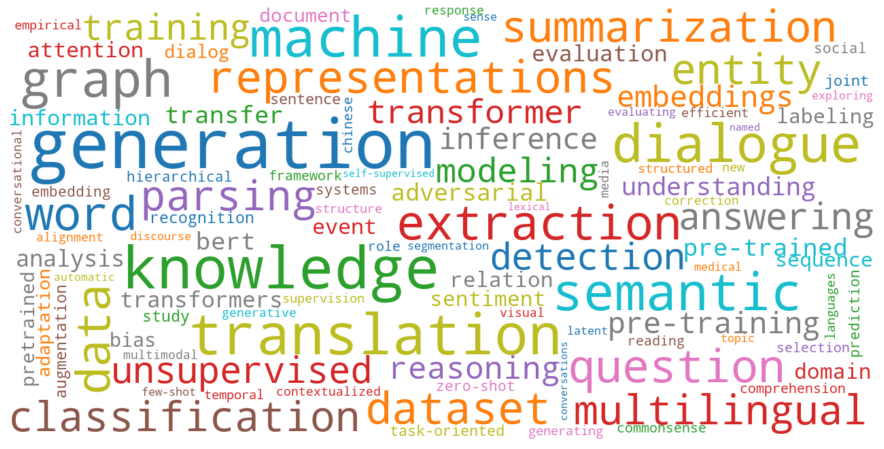
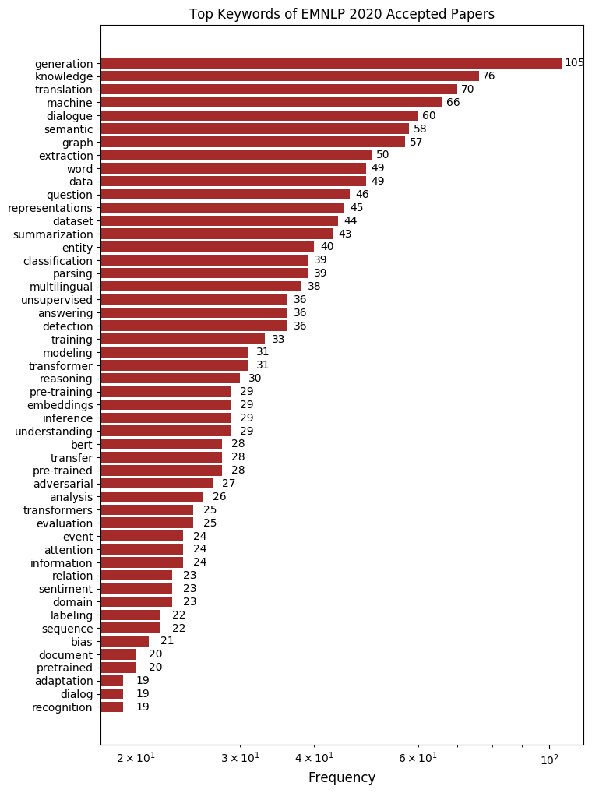

# EMNLP 2020 Papers

## Keywords

## Accepted Papers

There are accepted papers of [EMNLP 2020](https://2020.emnlp.org/) with arXiv link.
Papers are grouped according to their track.
The tags `[M-L]`, `[M-S]`, `[F-L]`, and `[F-S]` (prefix of each paper) represent Main Conference -- Long Paper, Main Conference -- Short Paper, Findings -- Long Paper, and Findings -- Short Paper, respectively.

**Table of Contents**

- [Computational Social Science and Social Media](#computational-social-science-and-social-media)
- [Dialog and Interactive Systems](#dialog-and-interactive-systems)
- [Discourse and Pragmatics](#discourse-and-pragmatics)
- [Information Extraction](#information-extraction)
- [Information Retrieval and Text Mining](#information-retrieval-and-text-mining)
- [Interpretability and Analysis of Models for NLP](#interpretability-and-analysis-of-models-for-nlp)
- [Language Generation](#language-generation)
- [Language Grounding to Vision, Robotics and Beyond](#language-grounding-to-vision-robotics-and-beyond)
- [Linguistic Theories, Cognitive Modeling and Psycholinguistics](#linguistic-theories-cognitive-modeling-and-psycholinguistics)
- [Machine Learning for NLP](#machine-learning-for-nlp)
- [Machine Translation and Multilinguality](#machine-translation-and-multilinguality)
- [Multidisciplinary and AC COI](#multidisciplinary-and-ac-coi)
- [NLP Applications](#nlp-applications)
- [Phonology, Morphology and Word Segmentation](#phonology-morphology-and-word-segmentation)
- [Question Answering](#question-answering)
- [Semantics: Lexical Semantics](#semantics-lexical-semantics)
- [Semantics: Sentence-level Semantics, Textual Inference and Other areas](#semantics-sentence-level-semantics-textual-inference-and-other-areas)
- [Sentiment Analysis, Stylistic Analysis, and Argument Mining](#sentiment-analysis-stylistic-analysis-and-argument-mining)
- [Speech and Multimodality](#speech-and-multimodality)
- [Summarization](#summarization)
- [Syntax: Tagging, Chunking, and Parsing](#syntax-tagging-chunking-and-parsing)

### Computational Social Science and Social Media

- `[M-L]` **On the Reliability and Validity of Detecting Approval of Political Actors in Tweets**, *Indira Sen, Fabian Flöck and Claudia Wagner*
- `[M-L]` **Unsupervised Discovery of Implicit Gender Bias**, *Anjalie Field and Yulia Tsvetkov*, <https://arxiv.org/abs/2004.08361>
- `[M-L]` **Writing Strategies for Science Communication: Data and Computational Analysis**, *Tal August, Lauren Kim, Katharina Reinecke and Noah A. Smith*
- `[M-L]` **Where Are the Facts? Searching for Fact-checked Information to Alleviate the Spread of Fake News**, *Nguyen Vo and Kyumin Lee*, <https://arxiv.org/abs/2010.03159>
- `[M-L]` **Hate-Speech and Offensive Language Detection in Roman Urdu**, *Hammad Rizwan, Muhammad Haroon Shakeel and Asim Karim*
- `[M-L]` **Comparative Evaluation of Label-Agnostic Selection Bias in Multilingual Hate Speech Datasets**, *Nedjma Ousidhoum, Yangqiu Song and Dit-Yan Yeung*
- `[M-L]` **Solving Historical Dictionary Codes with a Neural Language Model**, *Christopher Chu, Raphael Valenti and Kevin Knight*, <https://arxiv.org/abs/2010.04746>
- `[M-L]` **A Time-Aware Transformer Based Model for Suicide Ideation Detection on Social Media**, *Ramit Sawhney, Harshit Joshi, Saumya Gandhi and Rajiv Ratn Shah*
- `[M-L]` **Condolence and Empathy in Online Communities**, *Naitian Zhou and David Jurgens*
- `[M-L]` **An Embedding Model for Estimating Legislative Preferences from the Frequency and Sentiment of Tweets**, *Gregory Spell, Brian Guay, Sunshine Hillygus and Lawrence Carin*
- `[M-L]` **A Computational Approach to Understanding Empathy Expressed in Text-Based Mental Health Support**, *Ashish Sharma, Adam Miner, David Atkins and Tim Althoff*, <https://arxiv.org/abs/2009.08441>
- `[M-L]` **Measuring Information Propagation in Literary Social Networks**, *Matthew Sims and David Bamman*, <https://arxiv.org/abs/2004.13980>
- `[M-L]` **Modeling Protagonist Emotions for Emotion-Aware Storytelling**, *Faeze Brahman and Snigdha Chaturvedi*, <https://arxiv.org/abs/2010.06822>
- `[M-L]` **Help! Need Advice on Identifying Advice**, *Venkata Subrahmanyan Govindarajan, Benjamin Chen, Rebecca Warholic, Katrin Erk and Junyi Jessy Li*, <https://arxiv.org/abs/2010.02494>
- `[M-L]` **HENIN: Learning Heterogeneous Neural Interaction Networks for Explainable Cyberbullying Detection on Social Media**, *Hsin-Yu Chen and Cheng-Te Li*, <http://arxiv.org/abs/2010.04576>
- `[M-L]` **Explainable Automated Fact-Checking for Public Health Claims**, *Neema Kotonya and Francesca Toni*, <http://arxiv.org/abs/2010.09926>
- `[M-L]` **Quantifying Intimacy in Language**, *Jiaxin Pei and David Jurgens*
- `[M-L]` **Coupled Hierarchical Transformer for Stance-Aware Rumor Verification in Social Media Conversations**, *Jianfei Yu, Jing Jiang, Ling Min Serena Khoo, Hai Leong Chieu and Rui Xia*
- `[M-L]` **Social Media Attributions in the Context of Water Crisis**, *Rupak Sarkar, Sayantan Mahinder, Hirak Sarkar and Ashiqur KhudaBukhsh*, <https://arxiv.org/abs/2001.01697>
- `[M-L]` **Social Chemistry 101: Learning to Reason about Social and Moral Norms**, *Maxwell Forbes, Jena D. Hwang, Vered Shwartz, Maarten Sap and Yejin Choi*
- `[M-L]` **Toward Micro-Dialect Identification in Diaglossic and Code-Switched Environments**, *Muhammad Abdul-Mageed, Chiyu Zhang, AbdelRahim Elmadany and Lyle Ungar*, <https://arxiv.org/abs/2010.04900>
- `[M-L]` **Weakly Supervised Learning of Nuanced Frames for Analyzing Polarization in News Media**, *Shamik Roy and Dan Goldwasser*, <https://arxiv.org/abs/2009.09609>
- `[M-S]` **Reactive Supervision: A New Method for Collecting Sarcasm Data**, *Boaz Shmueli, Lun-Wei Ku and Soumya Ray*, <https://arxiv.org/abs/2009.13080>
- `[M-S]` **Hashtags, Emotions, and Comments: A Large-Scale Dataset to Understand Fine-Grained Social Emotions to Online Topics**, *Keyang Ding, Jing Li and Yuji Zhang*
- `[M-S]` **Suicidal Risk Detection for Military Personnel**, *Sungjoon Park, Kiwoong Park, Jaimeen Ahn and Alice Oh*
- `[M-S]` **Multilingual Offensive Language Identification with Cross-lingual Embeddings**, *Tharindu Ranasinghe and Marcos Zampieri*, <https://arxiv.org/abs/2010.05324>
- `[M-S]` **Fortifying Toxic Speech Detectors Against Veiled Toxicity**, *Xiaochuang Han and Yulia Tsvetkov*, <https://arxiv.org/abs/2010.03154>
- `[M-S]` **Named Entity Recognition for Social Media Texts with Semantic Augmentation**, *Yuyang Nie, Yuanhe Tian, Xiang Wan, Yan Song and Bo Dai*
- `[M-S]` **Investigating African-American Vernacular English in Transformer-Based Text Generation**, *Sophie Groenwold, Lily Ou, Aesha Parekh, Samhita Honnavalli, Sharon Levy, Diba Mirza and William Yang Wang*, <https://arxiv.org/abs/2010.02510>
- `[F-L]` **Predicting Responses to Psychological Questionnaires from Participants’ Social Media Posts and Question Text Embeddings**, *Huy Vu, Suhaib Abdurahman, Sudeep Bhatia and Lyle Ungar*
- `[F-L]` **Will This Idea Spread Beyond Academia? Understanding Knowledge Transfer of Scientific Concepts across Text Corpora**, *Hancheng Cao, Mengjie Cheng, Zhepeng Cen, Daniel McFarland and Xiang Ren*, <https://arxiv.org/abs/2010.06657>
- `[F-L]` **Cross-Lingual Suicidal-Oriented Word Embedding toward Suicide Prevention**, *Daeun Lee, Soyoung Park, Jiwon Kang, Daejin Choi and Jinyoung Han*
- `[F-L]` **DeSMOG: Detecting Stance in Media On Global Warming**, *Yiwei Luo, Dallas Card and Dan Jurafsky*
- `[F-L]` **A Semantics-based Approach to Disclosure Classification in User-Generated Online Content**, *Chandan Akiti, Anna squicciarini and Sarah Rajtmajer*
- `[F-L]` **Do Models of Mental Health Based on Social Media Data Generalize?**, *Keith Harrigian, Carlos Aguirre and Mark Dredze*
- `[F-L]` **Event-Related Bias Removal for Real-time Disaster Events**, *SALVADOR MEDINA MAZA, Evangelia Spiliopoulou, Eduard Hovy and Alexander Hauptmann*
- `[F-L]` **Determining Event Outcomes: The Case of #fail**, *Srikala Murugan, Dhivya Chinnappa and Eduardo Blanco*
- `[F-L]` **Detecting Media Bias in News Articles using Gaussian Bias Distributions**, *Wei-Fan Chen, Khalid Al Khatib, Benno Stein and Henning Wachsmuth*, <https://arxiv.org/abs/2010.10649>
- `[F-S]` **Examining the Ordering of Rhetorical Strategies in Persuasive Requests**, *Omar Shaikh, Jiaao Chen, Jon Saad-Falcon, Polo Chau and Diyi Yang*, <https://arxiv.org/abs/2010.04625>
- `[F-S]` **TweetEval: Unified Benchmark and Comparative Evaluation for Tweet Classification**, *Francesco Barbieri, Jose Camacho-Collados, Luis Espinosa Anke and Leonardo Neves*, <https://arxiv.org/abs/2010.12421>
- `[F-S]` **An Empirical Methodology for Detecting and Prioritizing Needs during Crisis Events**, *M. Janina Sarol, Ly Dinh, Rezvaneh Rezapour, Chieh-Li Chin, Pingjing Yang and Jana Diesner*, <https://arxiv.org/abs/2006.01439>
- `[F-S]` **The Pragmatics behind Politics: Modelling Metaphor, Framing and Emotion in Political Discourse**, *Pere-Lluís Huguet Cabot, Verna Dankers, David Abadi, Agneta Fischer and Ekaterina Shutova*

[Back to Top](#accepted-papers)

### Dialog and Interactive Systems

- `[M-L]` **Structured Attention for Unsupervised Dialogue Structure Induction**, *Liang Qiu, Yizhou Zhao, Weiyan Shi, Yuan Liang, Feng Shi, Tao Yuan, Zhou Yu and Song-Chun Zhu*, <https://arxiv.org/abs/2009.08552>
- `[M-L]` **Augmented Natural Language for Generative Sequence Labeling**, *Ben Athiwaratkun, Cicero Nogueira dos Santos, Jason Krone and Bing Xiang*, <https://arxiv.org/abs/2009.13272>
- `[M-L]` **Towards Persona-Based Empathetic Conversational Models**, *Peixiang Zhong, Chen Zhang, Hao Wang, Yong Liu and Chunyan Miao*, <https://arxiv.org/abs/2004.12316>
- `[M-L]` **Multi-turn Response Selection using Dialogue Dependency Relations**, *Qi Jia, Yizhu Liu, Siyu Ren, Kenny Zhu and Haifeng Tang*, <https://arxiv.org/abs/2010.01502>
- `[M-L]` **MedDialog: Large-scale Medical Dialogue Datasets**, *Guangtao Zeng, Wenmian Yang, Zeqian Ju, Yue Yang, Sicheng Wang, Ruisi Zhang, Meng Zhou, Jiaqi Zeng, Xiangyu Dong, Ruoyu Zhang, Hongchao Fang, Penghui Zhu, Shu Chen and Pengtao Xie*, <https://arxiv.org/abs/2004.03329>
- `[M-L]` **The World is Not Binary: Learning to Rank with Grayscale Data for Dialogue Response Selection**, *Zibo Lin, Deng Cai, Yan Wang, Xiaojiang Liu, Haitao Zheng and Shuming Shi*, <https://arxiv.org/abs/2004.02421>
- `[M-L]` **Mitigating Gender Bias for Neural Dialogue Generation with Adversarial Learning**, *Haochen Liu, Wentao Wang, Yiqi Wang, Hui Liu, Zitao Liu and Jiliang Tang*, <https://arxiv.org/abs/2009.13028>
- `[M-L]` **Cross-lingual Spoken Language Understanding with Regularized Representation Alignment**, *Zihan Liu, Genta Indra Winata, Peng Xu, Zhaojiang Lin and Pascale Fung*, <https://arxiv.org/abs/2009.14510>
- `[M-L]` **Will I Sound Like Me? Improving Persona Consistency in Dialogues through Pragmatic Self-Consciousness**, *Hyunwoo Kim, Byeongchang Kim and Gunhee Kim*, <https://arxiv.org/abs/2004.05816>
- `[M-L]` **Dialogue Distillation: Open-Domain Dialogue Augmentation Using Unpaired Data**, *Rongsheng Zhang, Yinhe Zheng, Jianzhi Shao, Xiaoxi Mao, Yadong Xi and Minlie Huang*, <https://arxiv.org/abs/2009.09427>
- `[M-L]` **Information Seeking in the Spirit of Learning: A Dataset for Conversational Curiosity**, *Pedro Rodriguez, Paul Crook, Seungwhan Moon and Zhiguang Wang*, <https://arxiv.org/abs/2005.00172>
- `[M-L]` **Task-Completion Dialogue Policy Learning via Monte Carlo Tree Search with Dueling Network**, *Sihan Wang, kaijie zhou, Kunfeng Lai and Jianping Shen*
- `[M-L]` **Learning a Simple and Effective Model for Multi-turn Response Generation with Auxiliary Tasks**, *YUFAN ZHAO, Can Xu and wei wu*, <https://arxiv.org/abs/2004.01972>
- `[M-L]` **AttnIO: Knowledge Graph Exploration with In-and-Out Attention Flow for Knowledge-Grounded Dialogue**, *Jaehun Jung, Bokyung Son and Sungwon Lyu*
- `[M-L]` **Queens are Powerful too: Mitigating Gender Bias in Dialogue Generation**, *Emily Dinan, Angela Fan, Adina Williams, Jack Urbanek, Douwe Kiela and Jason Weston*, <https://arxiv.org/abs/1911.03842>
- `[M-L]` **Low-Resource Domain Adaptation for Compositional Task-Oriented Semantic Parsing**, *Xilun Chen, Asish Ghoshal, Yashar Mehdad, Luke Zettlemoyer and Sonal Gupta*, <https://arxiv.org/abs/2010.03546>
- `[M-L]` **Continuity of Topic, Interaction, and Query: Learning to Quote in Online Conversations**, *Lingzhi Wang, Jing Li, Xingshan Zeng, Haisong Zhang and Kam-Fai Wong*
- `[M-L]` **Amalgamating Knowledge from Two Teachers for Task-oriented Dialogue System with Adversarial Training**, *Wanwei He, Min Yang, Rui Yan, Chengming Li, Ying Shen and Ruifeng Xu*
- `[M-L]` **Profile Consistency Identification for Open-domain Dialogue Agents**, *Haoyu Song, Yan Wang, Wei-Nan Zhang, Zhengyu Zhao, Ting Liu and Xiaojiang Liu*, <https://arxiv.org/abs/2009.09680>
- `[M-L]` **Knowledge-Grounded Dialogue Generation with Pre-trained Language Models**, *Xueliang Zhao, wei wu, Can Xu, Chongyang Tao, Dongyan Zhao and Rui Yan*, <https://arxiv.org/abs/2010.08824>
- `[M-L]` **BiST: Bi-directional Spatio-Temporal Reasoning for Video-Grounded Dialogues**, *Hung Le, Doyen Sahoo, Nancy Chen and Steven C.H. Hoi*, <http://arxiv.org/abs/2010.10095>
- `[M-L]` **UniConv: A Unified Conversational Neural Architecture for Multi-domain Task-oriented Dialogues**, *Hung Le, Doyen Sahoo, Chenghao Liu, Nancy Chen and Steven C.H. Hoi*, <https://arxiv.org/abs/2004.14307>
- `[M-L]` **GraphDialog: Integrating Graph Knowledge into End-to-End Task-Oriented Dialogue Systems**, *Shiquan Yang, Rui Zhang and Sarah Erfani*, <http://arxiv.org/abs/2010.01447>
- `[M-L]` **Conversational Semantic Parsing**, *Armen Aghajanyan, Jean Maillard, Akshat Shrivastava, Keith Diedrick, Michael Haeger, Haoran Li, Yashar Mehdad, Veselin Stoyanov, Anuj Kumar, Mike Lewis and Sonal Gupta*, <https://arxiv.org/abs/2009.13655>
- `[M-L]` **TOD-BERT: Pre-trained Natural Language Understanding for Task-Oriented Dialogue**, *Chien-Sheng Wu, Steven C.H. Hoi, Richard Socher and Caiming Xiong*, <https://arxiv.org/abs/2004.06871>
- `[M-L]` **Incremental Processing in the Age of Non-Incremental Encoders: An Empirical Assessment of Bidirectional Models for Incremental NLU**, *Brielen Madureira and David Schlangen*, <https://arxiv.org/abs/2010.05330>
- `[M-L]` **Cross Copy Network for Dialogue Generation**, *Changzhen Ji, Xin Zhou, Yating Zhang, Xiaozhong Liu, Changlong Sun, Conghui Zhu and Tiejun Zhao*, <https://arxiv.org/abs/2010.11539>
- `[M-L]` **Conversational Semantic Parsing for Dialog State Tracking**, *Jianpeng Cheng, Devang Agrawal, Héctor Martínez Alonso, Shruti Bhargava, Joris Driesen, Federico Flego, Dain Kaplan, Dimitri Kartsaklis, Lin Li, Dhivya Piraviperumal, Jason D Williams, Hong Yu, Diarmuid Ó Séaghdha and Anders Johannsen*
- `[M-L]` **GRADE: Automatic Graph-Enhanced Coherence Metric for Evaluating Open-Domain Dialogue Systems**, *Lishan Huang, Zheng Ye, Jinghui Qin, Liang Lin and Xiaodan Liang*, <https://arxiv.org/abs/2010.03994>
- `[M-L]` **Probing Task-Oriented Dialogue Representation from Language Models**, *Chien-Sheng Wu and Caiming Xiong*, <https://arxiv.org/abs/2010.13912>
- `[M-L]` **Dialogue Response Ranking Training with Large-Scale Human Feedback Data**, *Xiang Gao, Yizhe Zhang, Michel Galley, Chris Brockett and Bill Dolan*, <https://arxiv.org/abs/2009.06978>
- `[M-L]` **RiSAWOZ: A Large-Scale Multi-Domain Wizard-of-Oz Dataset with Rich Semantic Annotations for Task-Oriented Dialogue Modeling**, *Jun Quan, Shian Zhang, Qian Cao, Zizhong Li and Deyi Xiong*, <https://arxiv.org/abs/2010.08738>
- `[M-L]` **Like hiking? You probably enjoy nature: Persona-grounded Dialog with Commonsense Expansions**, *Bodhisattwa Prasad Majumder, Harsh Jhamtani, Taylor Berg-Kirkpatrick and Julian McAuley*, <https://arxiv.org/abs/2010.03205>
- `[M-L]` **MinTL: Minimalist Transfer Learning for Task-Oriented Dialogue Systems**, *Zhaojiang Lin, Andrea Madotto, Genta Indra Winata and Pascale Fung*, <https://arxiv.org/abs/2009.12005>
- `[M-L]` **Personal Information Leakage Detection in Conversations**, *Qiongkai Xu, Lizhen Qu, Zeyu Gao and Gholamreza Haffari*
- `[M-L]` **Response Selection for Multi-Party Conversations with Dynamic Topic Tracking**, *Weishi Wang, Steven C.H. Hoi and Shafiq Joty*, <https://arxiv.org/abs/2010.07785>
- `[M-L]` **Improving Out-of-Scope Detection in Intent Classification by  Using Embeddings of the Word Graph Space of the Classes**, *Paulo Cavalin, Victor Henrique Alves Ribeiro, Ana Appel and Claudio Pinhanez*
- `[M-L]` **Variational Hierarchical Dialog Autoencoder for Dialog State Tracking Data Augmentation**, *Kang Min Yoo, Hanbit Lee, Franck Dernoncourt, Trung Bui, Walter Chang and Sang-goo Lee*, <https://arxiv.org/abs/2001.08604>
- `[M-L]` **doc2dial: A Goal-Oriented Document-Grounded Dialogue Dataset**, *Song Feng, Hui Wan, Chulaka Gunasekara, Siva Patel, Sachindra Joshi and Luis Lastras*
- `[M-L]` **Filtering Noisy Dialogue Corpora by Connectivity and Content Relatedness**, *Reina Akama, Sho Yokoi, Jun Suzuki and Kentaro Inui*, <https://arxiv.org/abs/2004.14008>
- `[M-L]` **Parallel Interactive Networks for Multi-Domain Dialogue State Generation**, *Junfan Chen, Richong Zhang, Yongyi Mao and Jie Xu*, <https://arxiv.org/abs/2009.07616>
- `[M-L]` **Bridging the Gap between Prior and Posterior Knowledge Selection for Knowledge-Grounded Dialogue Generation**, *Xiuyi Chen, Fandong Meng, Peng Li, Feilong Chen, Shuang Xu, Bo Xu and Jie Zhou*
- `[M-L]` **Spot The Bot: A Robust and Efficient Framework for the Evaluation of Conversational Dialogue Systems**, *Jan Deriu, Don Tuggener, Pius von Däniken, Jon Ander Campos, Alvaro Rodrigo, Thiziri Belkacem, Aitor Soroa, Eneko Agirre and Mark Cieliebak*, <https://arxiv.org/abs/2010.02140>
- `[M-L]` **Human-centric dialog training via offline reinforcement learning**, *Natasha Jaques, Judy Hanwen Shen, Asma Ghandeharioun, Craig Ferguson, Agata Lapedriza, Noah Jones, Shixiang Gu and Rosalind Picard*, <https://arxiv.org/abs/2010.05848>
- `[M-L]` **Interview: Large-scale Modeling of Media Dialog with Discourse Patterns and Knowledge Grounding**, *Bodhisattwa Prasad Majumder, Shuyang Li, Jianmo Ni and Julian McAuley*
- `[M-L]` **INSPIRED: Toward Sociable Recommendation Dialog Systems**, *Shirley Anugrah Hayati, Dongyeop Kang, Qingxiaoyang Zhu, Weiyan Shi and Zhou Yu*, <https://arxiv.org/abs/2009.14306>
- `[M-L]` **End-to-End Slot Alignment and Recognition for Cross-Lingual NLU**, *Weijia Xu, Batool Haider and Saab Mansour*, <https://arxiv.org/abs/2004.14353>
- `[M-L]` **Counterfactual Off-Policy Training for Neural Dialogue Generation**, *Qingfu Zhu, Wei-Nan Zhang, Ting Liu and William Yang Wang*, <https://arxiv.org/abs/2004.14507>
- `[M-L]` **Regularizing Dialogue Generation by Imitating Implicit Scenarios**, *Shaoxiong Feng, Xuancheng Ren, Hongshen Chen, Bin Sun, Kan Li and Xu SUN*, <https://arxiv.org/abs/2010.01893>
- `[M-L]` **Discriminative Nearest Neighbor Few-Shot Intent Detection by Transferring Natural Language Inference**, *Jianguo Zhang, Kazuma Hashimoto, Wenhao Liu, Chien-Sheng Wu, Yao Wan, Philip Yu, Richard Socher and Caiming Xiong*, <https://arxiv.org/abs/2010.13009>
- `[M-L]` **SLURP: A Spoken Language Understanding Resource Package**, *Emanuele Bastianelli, Andrea Vanzo, Pawel Swietojanski and Verena Rieser*
- `[M-L]` **A Probabilistic End-To-End Task-Oriented Dialog Model with Latent Belief States towards Semi-Supervised Learning**, *Yichi Zhang, Zhijian Ou, Min Hu and Junlan Feng*, <https://arxiv.org/abs/2009.08115>
- `[M-L]` **MovieChats: Chat like Humans in a Closed Domain**, *Hui Su, Xiaoyu Shen, Zhou Xiao, Zheng Zhang, Ernie Chang, Cheng Zhang, Cheng Niu and Jie Zhou*
- `[M-S]` **Semantic Role Labeling Guided Multi-turn Dialogue ReWriter**, *Kun Xu, Haochen Tan, Linfeng Song, Han Wu, Haisong Zhang, Linqi Song and Dong Yu*, <https://arxiv.org/abs/2010.01417>
- `[M-S]` **Sound Natural: Content Rephrasing in Dialog Systems**, *Arash Einolghozati, Anchit Gupta, Keith Diedrick and Sonal Gupta*
- `[M-S]` **Iterative Feature Mining for Constraint-Based Data Collection to Increase Data Diversity and Model Robustness**, *Stefan Larson, Anthony Zheng, Anish Mahendran, Rishi Tekriwal, Adrian Cheung, Eric Guldan, Kevin Leach and Jonathan K. Kummerfeld*
- `[M-S]` **Supervised Seeded Iterated Learning for Interactive Language Learning**, *Yuchen Lu, Soumye Singhal, Florian Strub, Olivier Pietquin and Aaron Courville*, <https://arxiv.org/abs/2010.02975>
- `[M-S]` **Simple Data Augmentation with the Mask Token Improves Domain Adaptation for Dialog Act Tagging**, *Semih Yavuz, Kazuma Hashimoto, Wenhao Liu, Nitish Shirish Keskar, Richard Socher and Caiming Xiong*
- `[M-S]` **Neural Conversational QA: Learning to Reason vs Exploiting Patterns**, *Nikhil Verma, Abhishek Sharma, Dhiraj Madan, Danish Contractor, Harshit Kumar and Sachindra Joshi*, <https://arxiv.org/abs/1909.03759>
- `[M-S]` **SlotRefine: A Fast Non-Autoregressive Model for Joint Intent Detection and Slot Filling**, *Di Wu, Liang Ding, Fan Lu and Jian Xie*, <https://arxiv.org/abs/2010.02693>
- `[F-L]` **Difference-aware Knowledge Selection for Knowledge-grounded Conversation Generation**, *Chujie Zheng, Yunbo Cao, Daxin Jiang and Minlie Huang*, <https://arxiv.org/abs/2009.09378>
- `[F-L]` **Converting the Point of View of Messages Spoken to Virtual Assistants**, *Gunhee Lee, Vera Zu, Sai Srujana Buddi, Dennis Liang, Purva Kulkarni and Jack FitzGerald*, <https://arxiv.org/abs/2010.02600>
- `[F-L]` **Few-shot Natural Language Generation for Task-Oriented Dialog**, *Baolin Peng, Chenguang Zhu, Chunyuan Li, Xiujun Li, Jinchao Li, Michael Zeng and Jianfeng Gao*, <https://arxiv.org/abs/2002.12328>
- `[F-L]` **Dialogue Generation on Infrequent Sentence Functions via Structured Meta-Learning**, *Yifan Gao, Piji Li, Wei Bi, Xiaojiang Liu, Michael Lyu and Irwin King*, <https://arxiv.org/abs/2010.01495>
- `[F-L]` **Efficient Context and Schema Fusion Networks for Multi-Domain Dialogue State Tracking**, *Su Zhu, Jieyu Li, Lu Chen and Kai Yu*, <https://arxiv.org/abs/2004.03386>
- `[F-L]` **Group-wise Contrastive Learning for Neural Dialogue Generation**, *Hengyi Cai, Hongshen Chen, Yonghao Song, zhuoye Ding, Yongjun Bao, Weipeng Yan and Xiaofang Zhao*, <https://arxiv.org/abs/2009.07543>
- `[F-L]` **Actor-Double-Critic: Incorporating Model-Based Critic for Task-Oriented Dialogue Systems**, *Yen-chen Wu, Bo-Hsiang Tseng and Milica Gasic*
- `[F-L]` **AirConcierge: Generating Task-Oriented Dialogue via Efficient Large-Scale Knowledge Retrieval**, *Chieh-Yang Chen, Pei-Hsin Wang, Shih-Chieh Chang, Da-Cheng Juan, Wei Wei and Jia-Yu Pan*
- `[F-L]` **GCDST: A Graph-based and Copy-augmented Multi-domain Dialogue State Tracking**, *Peng Wu, Bowei Zou, Ridong Jiang and AiTi Aw*
- `[F-L]` **A Compare Aggregate Transformer for Understanding Document-grounded Dialogue**, *Longxuan Ma, Wei-Nan Zhang, runxin sun and Ting Liu*, <https://arxiv.org/abs/2010.00190>
- `[F-L]` **Improving Knowledge-Aware Dialogue Response Generation by Using Human-Written Prototype Dialogues**, *Sixing Wu, Ying Li, Dawei Zhang and Zhonghai Wu*
- `[F-L]` **Filtering before Iteratively Referring for Knowledge-Grounded Response Selection in Retrieval-Based Chatbots**, *Jia-Chen Gu, Zhenhua Ling, Quan Liu, Zhigang Chen and Xiaodan Zhu*, <https://arxiv.org/abs/2004.14550>
- `[F-L]` **StyleDGPT: Stylized Response Generation with Pre-trained Language Models**, *Ze Yang, wei wu, Can Xu, Xinnian Liang, jiaqi bai, Liran Wang, Wei Wang and Zhoujun Li*, <https://arxiv.org/abs/2010.02569>
- `[F-L]` **Neural Dialogue State Tracking with Temporally Expressive Networks**, *Junfan Chen, Richong Zhang, Yongyi Mao and Jie Xu*, <https://arxiv.org/abs/2009.07615>
- `[F-L]` **AGIF: An Adaptive Graph-Interactive Framework for Joint Multiple Intent Detection and Slot Filling**, *Libo Qin, Xiao Xu, Wanxiang Che and Ting Liu*, <https://arxiv.org/abs/2004.10087>
- `[F-L]` **Multi-Turn Dialogue Generation in E-Commerce Platform with the Context of Historical Dialogue**, *WeiSheng Zhang, Kaisong Song, Yangyang Kang, Zhongqing Wang, Changlong Sun, Xiaozhong Liu, Shoushan Li, Min Zhang and Luo Si*
- `[F-L]` **Focus-Constrained Attention Mechanism for CVAE-based Response Generation**, *Zhi Cui, Yanran Li, Jiayi ZHANG, Jianwei Cui, Chen Wei and Bin Wang*, <https://arxiv.org/abs/2009.12102>
- `[F-L]` **ConveRT: Efficient and Accurate Conversational Representations from Transformers**, *Matthew Henderson, Iñigo Casanueva, Nikola Mrkšić, Pei-Hao Su, Tsung-Hsien Wen and Ivan Vulić*, <https://arxiv.org/abs/1911.03688>
- `[F-L]` **Guided Dialogue Policy Learning without Adversarial Learning in the Loop**, *Ziming Li, Sungjin Lee, Baolin Peng, Jinchao Li, Julia Kiseleva, Maarten de Rijke, Shahin Shayandeh and Jianfeng Gao*, <https://arxiv.org/abs/2004.03267>
- `[F-L]` **Learning Knowledge Bases with Parameters for Task-Oriented Dialogue Systems**, *Andrea Madotto, Samuel Cahyawijaya, Genta Indra Winata, Yan Xu, Zihan Liu, Zhaojiang Lin and Pascale Fung*, <https://arxiv.org/abs/2009.13656>
- `[F-L]` **Plug-and-Play Conversational Models**, *Andrea Madotto, Etsuko Ishii, Zhaojiang Lin, Sumanth Dathathri and Pascale Fung*
- `[F-L]` **Toward Stance-based Personas for Opinionated Dialogues**, *Thomas Scialom, Serra Sinem Tekiroğlu, Jacopo Staiano and Marco Guerini*, <http://arxiv.org/abs/2010.03369>
- `[F-L]` **Hierarchical Pre-training for Sequence Labelling in Spoken Dialog**, *Emile Chapuis, Pierre Colombo, Matteo Manica, Matthieu Labeau and Chloé Clavel*, <https://arxiv.org/abs/2009.11152>
- `[F-L]` **Learning to Plan and Realize Separately for Open-Ended Dialogue Systems**, *Sashank Santhanam, Zhuo Cheng, Brodie Mather, Bonnie Dorr, Archna Bhatia, Bryanna Hebenstreit, Alan Zemel, Adam Dalton, Tomek Strzalkowski and Samira Shaikh*, <https://arxiv.org/abs/2009.12506>
- `[F-L]` **TurnGPT: a Transformer-based Language Model for Predicting Turn-taking in Spoken Dialog**, *Erik Ekstedt and Gabriel Skantze*, <https://arxiv.org/abs/2010.10874>
- `[F-L]` **Learning to Generalize for Sequential Decision Making**, *Xusen Yin, Ralph Weischedel and Jonathan May*, <https://arxiv.org/abs/2010.02229>
- `[F-L]` **Rethinking Supervised Learning and Reinforcement Learning in Task-Oriented Dialogue Systems**, *Ziming Li, Julia Kiseleva and Maarten de Rijke*, <https://arxiv.org/abs/2009.09781>
- `[F-L]` **Approximation of Response Knowledge Retrieval in Knowledge-grounded Dialogue Generation**, *Wen Zheng, Natasa Milic-Frayling and Ke Zhou*
- `[F-L]` **A Multi-Persona Chatbot for Hotline Counselor Training**, *Orianna Demasi, Yu Li and Zhou Yu*
- `[F-L]` **Joint Turn and Dialogue level User Satisfaction Estimation on Multi-Domain Conversations**, *Praveen Kumar Bodigutla, Aditya Tiwari, Spyros Matsoukas, Josep Valls-Vargas and Lazaros Polymenakos*, <https://arxiv.org/abs/2010.02495>
- `[F-L]` **Generalizable and Explainable Dialogue Generation via Explicit Action Learning**, *Xinting Huang, Jianzhong Qi, Yu Sun and Rui Zhang*, <https://arxiv.org/abs/2010.03755>
- `[F-L]` **Consistent Response Generation with Controlled Specificity**, *Junya Takayama and Yuki Arase*
- `[F-L]` **Improving Limited Labeled Dialogue State Tracking with Self-Supervision**, *Chien-Sheng Wu, Steven C.H. Hoi and Caiming Xiong*, <https://arxiv.org/abs/2010.13920>
- `[F-L]` **Speaker or Listener? The Role of a Dialog Agent**, *Yafei Liu, Hongjin Qian, Hengpeng Xu and Jinmao Wei*
- `[F-S]` **Pretrained Language Models for Dialogue Generation with Multiple Input Sources**, *Yu Cao, Wei Bi, Meng Fang and Dacheng Tao*, <https://arxiv.org/abs/2010.07576>
- `[F-S]` **TSDG: Content-aware Neural Response Generation with Two-stage Decoding Process**, *Junsheng Kong, Zhicheng Zhong, Yi Cai, Xin Wu and Da Ren*
- `[F-S]` **Learning Improvised Chatbots from Adversarial Modifications of Natural Language Feedback**, *Makesh Narsimhan Sreedhar, Kun Ni and Siva Reddy*, <https://arxiv.org/abs/2010.07261>
- `[F-S]` **Knowing What You Know: Calibrating Dialogue Belief State Distributions via Ensembles**, *Carel van Niekerk, Michael Heck, Christian Geishauser, Hsien-chin Lin, Nurul Lubis, Marco Moresi and Milica Gasic*, <https://arxiv.org/abs/2010.02586>
- `[F-S]` **Effects of Naturalistic Variation in Goal-Oriented Dialog**, *Jatin Ganhotra, Robert Moore, Sachindra Joshi and Kahini Wadhawan*, <https://arxiv.org/abs/2010.02260>
- `[F-S]` **Towards Low-Resource Semi-Supervised Dialogue Generation with Meta-Learning**, *Yi Huang, Junlan Feng, Shuo Ma, Xiaoyu Du and Xiaoting Wu*
- `[F-S]` **SMRT Chatbots: Improving Non-Task-Oriented Dialog with Simulated Multiple Reference Training**, *Huda Khayrallah and João Sedoc*
- `[F-S]` **Understanding User Resistance Strategies in Persuasive Conversations**, *Youzhi Tian, Weiyan Shi, Chen Li and Zhou Yu*
- `[F-S]` **Dual Inference for Improving Language Understanding and Generation**, *Shang-Yu Su, Yung-Sung Chuang and Yun-Nung Chen*, <https://arxiv.org/abs/2010.04246>

[Back to Top](#accepted-papers)

### Discourse and Pragmatics

- `[M-L]` **Discourse Self-Attention for Discourse Element Identification in Argumentative Student Essays**, *Wei Song, Ziyao Song, Ruiji Fu, Lizhen Liu, Miaomiao Cheng and Ting Liu*
- `[M-L]` **BERT-enhanced Relational Sentence Ordering Network**, *Baiyun Cui, Yingming Li and Zhongfei Zhang*
- `[M-L]` **Online Conversation Disentanglement with Pointer Networks**, *Tao Yu and Shafiq Joty*, <http://arxiv.org/abs/2010.11080>
- `[M-L]` **"I'd rather just go to bed": Understanding Indirect Answers**, *Annie Louis, Dan Roth and Filip Radlinski*, <https://arxiv.org/abs/2010.03450>
- `[M-L]` **PowerTransformer: Unsupervised Controllable Revision for Biased Language Correction**, *Xinyao Ma, Maarten Sap, Hannah Rashkin and Yejin Choi*
- `[M-L]` **TED-CDB: A Large-Scale Chinese Discourse Relation Dataset on TED Talks**, *Wanqiu Long, Bonnie Webber and Deyi Xiong*
- `[M-L]` **MEGA RST Discourse Treebanks with Structure and Nuclearity from Scalable Distant Sentiment Supervision**, *Patrick Huber and Giuseppe Carenini*
- `[M-L]` **Centering-based Neural Coherence Modeling with Hierarchical Discourse Segments**, *Sungho Jeon and Michael Strube*
- `[M-L]` **QADiscourse - Discourse Relations as QA Pairs: Representation, Crowdsourcing and Baselines**, *Valentina Pyatkin, Ayal Klein, Reut Tsarfaty and Ido Dagan*, <http://arxiv.org/abs/2010.02815>
- `[M-L]` **Keeping Up Appearances: Computational Modeling of Face Acts in Persuasion Oriented Discussions**, *Ritam Dutt, Rishabh Joshi and Carolyn Rose*, <https://arxiv.org/abs/2009.10815>
- `[M-L]` **VCDM: Leveraging Variational Bi-encoding and Deep Contextualized Word Representations for Improved Definition Modeling**, *Machel Reid, Edison Marrese-Taylor and Yutaka Matsuo*, <https://arxiv.org/abs/2010.03124>
- `[M-S]` **Learning to Ignore: Long Document Coreference with Bounded Memory Neural Networks**, *Shubham Toshniwal, Sam Wiseman, Allyson Ettinger, Karen Livescu and Kevin Gimpel*, <https://arxiv.org/abs/2010.02807>
- `[M-S]` **Revealing the Myth of Higher-Order Inference in Coreference Resolution**, *Liyan Xu and Jinho D. Choi*, <https://arxiv.org/abs/2009.12013>
- `[M-S]` **Pre-training Mention Representations in Coreference Models**, *Yuval Varkel and Amir Globerson*
- `[F-L]` **Stay Hungry, Stay Focused: Generating Informative and Specific Questions in Information-Seeking Conversations**, *Peng Qi, Yuhao Zhang and Christopher D. Manning*, <https://arxiv.org/abs/2004.14530>
- `[F-L]` **Semantically Driven Sentence Fusion: Modeling and Evaluation**, *Eyal Ben-David, Orgad Keller, Eric Malmi, Idan Szpektor and Roi Reichart*, <http://arxiv.org/abs/2010.02592>
- `[F-L]` **Fast End-to-end Coreference Resolution for Korean**, *Cheoneum Park, Jamin Shin, Sungjoon Park, Joonho Lim and Changki Lee*
- `[F-L]` **Paraphrasing vs Coreferring: Two Sides of the Same Coin**, *Yehudit Meged, Avi Caciularu, Vered Shwartz and Ido Dagan*, <https://arxiv.org/abs/2004.14979>
- `[F-L]` **Weakly-Supervised Modeling of Contextualized Event Embedding for Discourse Relations**, *I-Ta Lee, Maria Leonor Pacheco and Dan Goldwasser*
- `[F-S]` **Sequential Span Classification with Neural Semi-Markov CRFs for Biomedical Abstracts**, *Kosuke Yamada, Tsutomu Hirao, Ryohei Sasano, Koichi Takeda and Masaaki Nagata*
- `[F-S]` **Adapting Coreference Resolution to Twitter Conversations**, *Berfin Aktaş, Veronika Solopova, Annalena Kohnert and Manfred Stede*

[Back to Top](#accepted-papers)

### Information Extraction

- `[M-L]` **Event Extraction by Answering (Almost) Natural Questions**, *Xinya Du and Claire Cardie*, <https://arxiv.org/abs/2004.13625>
- `[M-L]` **Double Graph Based Reasoning for Document-level Relation Extraction**, *Shuang Zeng, Runxin Xu, Baobao Chang and Lei Li*, <https://arxiv.org/abs/2009.13752>
- `[M-L]` **Connecting the Dots: Event Graph Schema Induction with Path Language Modeling**, *Manling Li, Qi Zeng, Ying Lin, Kyunghyun Cho, Heng Ji, Jonathan May, Nathanael Chambers and Clare Voss*
- `[M-L]` **Adaptive Attentional Network for Few-Shot Knowledge Graph Completion**, *Jiawei Sheng, Shu Guo, Zhenyu Chen, Juwei Yue, Lihong Wang, Tingwen Liu and Hongbo Xu*, <https://arxiv.org/abs/2010.09638>
- `[M-L]` **Global-to-Local Neural Networks for Document-Level Relation Extraction**, *Difeng Wang, Wei Hu, Ermei Cao and Weijian Sun*, <https://arxiv.org/abs/2009.10359>
- `[M-L]` **Counterfactual Generator: A Weakly-Supervised Method for Named Entity Recognition**, *Xiangji Zeng, Yunliang Li, Yuchen Zhai and Yin Zhang*
- `[M-L]` **MedFilter: Improving Extraction of Task-relevant Utterances through Integration of Discourse Structure and Ontological Knowledge**, *Sopan Khosla, Shikhar Vashishth, Jill Fain Lehman and Carolyn Rose*, <https://arxiv.org/abs/2010.02246>
- `[M-L]` **Understanding Procedural Text using Interactive Entity Networks**, *Jizhi Tang, Yansong Feng and Dongyan Zhao*
- `[M-L]` **Dynamic Anticipation and Completion for Multi-Hop Reasoning over Sparse Knowledge Graph**, *Xin Lv, Xu Han, Lei Hou, Juanzi Li, Zhiyuan Liu, Wei Zhang, YICHI ZHANG, Hao Kong and Suhui Wu*, <https://arxiv.org/abs/2010.01899>
- `[M-L]` **LUKE: Deep Contextualized Entity Representations with Entity-aware Self-attention**, *Ikuya Yamada, Akari Asai, Hiroyuki Shindo, Hideaki Takeda and Yuji Matsumoto*, <https://arxiv.org/abs/2010.01057>
- `[M-L]` **Enhancing Aspect Term Extraction with Soft Prototypes**, *Zhuang Chen and Tieyun Qian*
- `[M-L]` **Knowledge Association with Hyperbolic Knowledge Graph Embeddings**, *Zequn Sun, Muhao Chen, Wei Hu, Chengming Wang, Jian Dai and Wei Zhang*, <https://arxiv.org/abs/2010.02162>
- `[M-L]` **Joint Constrained Learning for Event-Event Relation Extraction**, *Haoyu Wang, Muhao Chen, Hongming Zhang and Dan Roth*, <https://arxiv.org/abs/2010.06727>
- `[M-L]` **Learning from Context or Names? An Empirical Study on Neural Relation Extraction**, *Hao Peng, Tianyu Gao, Xu Han, Yankai Lin, Peng Li, Zhiyuan Liu, Maosong Sun and Jie Zhou*, <https://arxiv.org/abs/2010.01923>
- `[M-L]` **SelfORE: Self-supervised Relational Feature Learning for Open Relation Extraction**, *Xuming Hu, Lijie Wen, Yusong Xu, Chenwei Zhang and Philip Yu*, <https://arxiv.org/abs/2004.02438>
- `[M-L]` **Systematic Comparison of Neural Architectures and Training Approaches for Open Information Extraction**, *Patrick Hohenecker, Frank Mtumbuka, Vid Kocijan and Thomas Lukasiewicz*
- `[M-L]` **SeqMix: Augmenting Active Sequence Labeling via Sequence Mixup**, *Rongzhi Zhang, Yue Yu and Chao Zhang*, <https://arxiv.org/abs/2010.02322>
- `[M-L]` **Coarse-to-Fine Pre-training for Named Entity Recognition**, *Xue Mengge, Bowen Yu, Zhenyu Zhang, Tingwen Liu, Yue Zhang and Bin Wang*, <https://arxiv.org/abs/2010.08210>
- `[M-L]` **Incremental Event Detection via Knowledge Consolidation Networks**, *Pengfei Cao, Yubo Chen, Jun Zhao and Taifeng Wang*
- `[M-L]` **Exploring and Evaluating Attributes, Values, and Structures for Entity Alignment**, *Zhiyuan Liu, Yixin Cao, Liangming Pan, Juanzi Li, Zhiyuan Liu and Tat-Seng Chua*, <https://arxiv.org/abs/2010.03249>
- `[M-L]` **AxCell: Automatic Extraction of Results from Machine Learning Papers**, *Marcin Kardas, Piotr Czapla, Pontus Stenetorp, Sebastian Ruder, Sebastian Riedel, Ross Taylor and Robert Stojnic*, <https://arxiv.org/abs/2004.14356>
- `[M-L]` **Let's Stop Incorrect Comparisons in End-to-end Relation Extraction!**, *Bruno Taillé, Vincent Guigue, Geoffrey Scoutheeten and patrick Gallinari*, <https://arxiv.org/abs/2009.10684>
- `[M-L]` **A Rigorous Study on Named Entity Recognition: Can Fine-tuning Pretrained Model Lead to the Promised Land?**, *Hongyu Lin, Yaojie Lu, Jialong Tang, Xianpei Han, Le Sun, Zhicheng Wei and Nicholas Jing Yuan*, <https://arxiv.org/abs/2004.12126>
- `[M-L]` **Event Extraction as Machine Reading Comprehension**, *Jian Liu, Yubo Chen, Kang Liu, Wei Bi and Xiaojiang Liu*
- `[M-L]` **MAVEN: A Massive General Domain Event Detection Dataset**, *Xiaozhi Wang, Ziqi Wang, Xu Han, Wangyi Jiang, Rong Han, Zhiyuan Liu, Juanzi Li, Peng Li, Yankai Lin and Jie Zhou*, <https://arxiv.org/abs/2004.13590>
- `[M-L]` **Knowledge-guided Open Attribute Value Extraction with Reinforcement Learning**, *Ye Liu, Sheng Zhang, Rui Song, Suo Feng and Yanghua Xiao*, <https://arxiv.org/abs/2010.09189>
- `[M-L]` **DualTKB: A Dual Learning Bridge between Text and Knowledge Base**, *Pierre Dognin, Igor Melnyk, Inkit Padhi, Cicero Nogueira dos Santos and Payel Das*, <http://arxiv.org/abs/2010.14660>
- `[M-L]` **Weakly Supervised Subevent Knowledge Acquisition**, *Wenlin Yao, Zeyu Dai, Maitreyi Ramaswamy, Bonan Min and Ruihong Huang*
- `[M-L]` **Hierarchical Evidence Set Modeling for Automated Fact Extraction and Verification**, *Shyam Subramanian and Kyumin Lee*, <https://arxiv.org/abs/2010.05111>
- `[M-L]` **Biomedical Event Extraction as Sequence Labeling**, *Alan Ramponi, Rob van der Goot, Rosario Lombardo and Barbara Plank*
- `[M-L]` **Program Enhanced Fact Verification with Verbalization and Graph Attention Network**, *Xiaoyu Yang, Feng Nie, Yufei Feng, Quan Liu, Zhigang Chen and Xiaodan Zhu*, <https://arxiv.org/abs/2010.03084>
- `[M-L]` **Simple and Effective Few-Shot Named Entity Recognition with Structured Nearest Neighbor Learning**, *Yi Yang and Arzoo Katiyar*, <https://arxiv.org/abs/2010.02405>
- `[M-L]` **Knowledge Graph Alignment with Entity-Pair Embedding**, *Zhichun Wang, Jinjian Yang and Xiaoju Ye*
- `[M-L]` **Annotating Temporal Dependency Graphs via Crowdsourcing**, *Jiarui Yao, Haoling Qiu, Bonan Min and Nianwen Xue*
- `[M-L]` **FedED: Federated Learning via Ensemble Distillation for Medical Relation Extraction**, *Dianbo Sui, Yubo Chen, Jun Zhao, Yantao Jia, Yuantao Xie and Weijian Sun*
- `[M-L]` **Entity Enhanced BERT Pre-training for Chinese NER**, *Chen Jia, Yuefeng Shi, Qinrong Yang and Yue Zhang*
- `[M-L]` **Domain Knowledge Empowered Structured Neural Net for End-to-End Event Temporal Relation Extraction**, *Rujun Han, Yichao Zhou and Nanyun Peng*, <https://arxiv.org/abs/2009.07373>
- `[M-L]` **Scalable Zero-shot Entity Linking with Dense Entity Retrieval**, *Ledell Wu, Fabio Petroni, Martin Josifoski, Sebastian Riedel and Luke Zettlemoyer*, <https://arxiv.org/abs/1911.03814>
- `[M-L]` **Pre-training Entity Relation Encoder with Intra-span and Inter-span Information**, *Yijun Wang, Changzhi Sun, Yuanbin Wu, Junchi Yan, Peng Gao and Guotong Xie*
- `[M-L]` **A Dataset for Tracking Entities in Open Domain Procedural Text**, *Niket Tandon, Keisuke Sakaguchi, Bhavana Dalvi, Dheeraj Rajagopal, Peter Clark, Michal Guerquin, Kyle Richardson and Eduard Hovy*
- `[M-L]` **TeMP: Temporal Message Passing for Temporal Knowledge Graph Completion**, *Jiapeng Wu, Meng Cao, Jackie Chi Kit Cheung and William L. Hamilton*, <https://arxiv.org/abs/2010.03526>
- `[M-L]` **Multimodal Joint Attribute Prediction and Value Extraction for E-commerce Product**, *Tiangang Zhu, Yue Wang, Haoran Li, Youzheng Wu, Xiaodong He and Bowen Zhou*, <https://arxiv.org/abs/2009.07162>
- `[M-L]` **Entity Linking in 100 Languages**, *Jan A. Botha, Zifei Shan and Daniel Gillick*
- `[M-L]` **Two are Better than One: Joint Entity and Relation Extraction with Table-Sequence Encoders**, *Jue WANG and Wei Lu*, <https://arxiv.org/abs/2010.03851>
- `[M-L]` **CHARM: Inferring Personal Attributes from Conversations**, *Anna Tigunova, Andrew Yates, Paramita Mirza and Gerhard Weikum*
- `[M-L]` **Design Challenges in Low-resource Cross-lingual Entity Linking**, *Xingyu Fu, Weijia Shi, Xiaodong Yu, Zian Zhao and Dan Roth*, <https://arxiv.org/abs/2005.00692>
- `[M-L]` **A Predicate-Function-Argument Annotation of Natural Language  for Open-Domain Information eXpression**, *Mingming Sun, Wenyue Hua, Zoey Liu, Xin Wang, Kangjie Zheng and Ping Li*
- `[M-L]` **Recurrent Interaction Network for Jointly Extracting Entities and Classifying Relations**, *Kai Sun, Richong Zhang, Samuel Mensah, Yongyi Mao and xudong Liu*, <https://arxiv.org/abs/2005.00162>
- `[M-L]` **Temporal Knowledge Base Completion: New Algorithms and Evaluation Protocols**, *Prachi Jain, Sushant Rathi, Mausam - and Soumen Chakrabarti*, <https://arxiv.org/abs/2005.05035>
- `[M-L]` **OpenIE6: Iterative Grid Labeling and Coordination Analysis for Open Information Extraction**, *Keshav Kolluru, Vaibhav Adlakha, Samarth Aggarwal, Mausam - and Soumen Chakrabarti*, <https://arxiv.org/abs/2010.03147>
- `[M-S]` **Learning Structured Representations of Entity Names using ActiveLearning and Weak Supervision**, *Kun Qian, Poornima Chozhiyath Raman, Yunyao Li and Lucian Popa*
- `[M-S]` **Severing the Edge Between Before and After: Neural Architectures for Temporal Ordering of Events**, *Miguel Ballesteros, Rishita Anubhai, Shuai Wang, Nima Pourdamghani, Yogarshi Vyas, Jie Ma, Parminder Bhatia, Kathleen McKeown and Yaser Al-Onaizan*, <https://arxiv.org/abs/2004.04295>
- `[M-S]` **Incremental Neural Coreference Resolution in Constant Memory**, *Patrick Xia, João Sedoc and Benjamin Van Durme*, <https://arxiv.org/abs/2005.00128>
- `[M-S]` **Table Fact Verification with Structure-Aware Transformer**, *Hongzhi Zhang, Yingyao Wang, Sirui Wang, Xuezhi Cao, Fuzheng Zhang and Zhongyuan Wang*
- `[M-S]` **Learning Collaborative Agents with Rule Guidance for Knowledge Graph Reasoning**, *Deren Lei, Gangrong Jiang, Xiaotao Gu, Kexuan Sun, Yuning Mao and Xiang Ren*, <https://arxiv.org/abs/2005.00571>
- `[M-S]` **Denoising Relation Extraction from Document-level Distant Supervision**, *Chaojun Xiao, Yuan Yao, Ruobing Xie, Xu Han, Zhiyuan Liu, Maosong Sun, Fen Lin and Leyu Lin*
- `[M-S]` **Exploring Contextualized Neural Language Models for Temporal Dependency Parsing**, *Hayley Ross, Jonathon Cai and Bonan Min*, <https://arxiv.org/abs/2004.14577>
- `[M-S]` **Semi-supervised New Event Type Induction and Event Detection**, *Lifu Huang and Heng Ji*
- `[M-S]` **Exposing Shallow Heuristics of Relation Extraction Models with Challenge Data**, *Shachar Rosenman, Alon Jacovi and Yoav Goldberg*, <https://arxiv.org/abs/2010.03656>
- `[M-S]` **Constrained Fact Verification for FEVER**, *Adithya Pratapa, Sai Muralidhar Jayanthi and Kavya Nerella*
- `[M-S]` **Introducing a New Dataset for Event Detection in Cybersecurity Texts**, *Hieu Man Duc Trong, Duc Trong Le, Amir Pouran Ben Veyseh, Thuat Nguyen and Thien Huu Nguyen*
- `[M-S]` **Event Detection: Gate Diversity and Syntactic Importance Scores for Graph Convolution Neural Networks**, *Viet Dac Lai, Tuan Ngo Nguyen and Thien Huu Nguyen*, <https://arxiv.org/abs/2010.14123>
- `[M-S]` **Efficient One-Pass End-to-End Entity Linking for Questions**, *Belinda Z. Li, Sewon Min, Srinivasan Iyer, Yashar Mehdad and Wen-tau Yih*, <https://arxiv.org/abs/2010.02413>
- `[F-L]` **Active Testing: An Unbiased Evaluation Method for Distantly Supervised Relation Extraction**, *Pengshuai Li, Xinsong Zhang, Weijia Jia and Wei Zhao*, <https://arxiv.org/abs/2010.08777>
- `[F-L]` **Minimize Exposure Bias of Seq2Seq Models in Joint Entity and Relation Extraction**, *Ranran Haoran Zhang, Qianying Liu, Aysa Xuemo Fan, Heng Ji, Daojian Zeng, Fei Cheng, Daisuke Kawahara and Sadao Kurohashi*, <https://arxiv.org/abs/2009.07503>
- `[F-L]` **The RELX Dataset and Matching the Multilingual Blanks for Cross-Lingual Relation Classification**, *Abdullatif Köksal and Arzucan Özgür*, <https://arxiv.org/abs/2010.09381>
- `[F-L]` **A Fully Hyperbolic Neural Model for Hierarchical Multi-Class Classification**, *Federico López and Michael Strube*
- `[F-L]` **Interpretable Entity Representations through Large-Scale Typing**, *Yasumasa Onoe and Greg Durrett*, <https://arxiv.org/abs/2005.00147>
- `[F-L]` **Syntactic and Semantic-driven Learning for Open Information Extraction**, *Jialong Tang, Yaojie Lu, Hongyu Lin, Xianpei Han, Le Sun, Xinyan Xiao and Hua Wu*
- `[F-L]` **E-BERT: Efficient-Yet-Effective Entity Embeddings for BERT**, *Nina Poerner, Ulli Waltinger and Hinrich Schütze*, <https://arxiv.org/abs/1911.03681>
- `[F-L]` **Event Extraction as Multi-turn Question Answering**, *Fayuan Li, Weihua Peng, Yuguang Chen, Quan Wang, Lu Pan, Yajuan Lyu and Yong Zhu*
- `[F-L]` **DocStruct: A Multimodal Method to Extract Hierarchy Structure in Document for General Form Understanding**, *Zilong Wang, Mingjie Zhan, xuebo liu and ding liang*, <https://arxiv.org/abs/2010.11685>
- `[F-L]` **Multi$^2$OIE: Multilingual Open Information Extraction Based on Multi-Head Attention with BERT**, *Youngbin Ro, Yukyung Lee and Pilsung Kang*, <https://arxiv.org/abs/2009.08128>
- `[F-L]` **Unsupervised Relation Extraction from Language Models using Constrained Cloze Completion**, *Ankur Goswami, Akshata Bhat, Hadar Ohana and Theodoros Rekatsinas*
- `[F-L]` **SynET: Synonym Expansion using Transitivity**, *Jiale Yu, Yongliang Shen, Xinyin Ma, Chenghao Jia, Chen Chen and Weiming Lu*
- `[F-L]` **BERT-MK: Integrating Graph Contextualized Knowledge into Pre-trained Language Models**, *Bin He, Di Zhou, Jinghui Xiao, Xin Jiang, Qun Liu, Nicholas Jing Yuan and Tong Xu*, <https://arxiv.org/abs/1912.00147>
- `[F-L]` **Edge-Enhanced Graph Convolution Networks for Event Detection with Syntactic Relation**, *Shiyao Cui, Bowen Yu, Tingwen Liu, Zhenyu Zhang, Xuebin Wang and Jinqiao Shi*, <https://arxiv.org/abs/2002.10757>
- `[F-L]` **How Does Context Matter? On the Robustness of Event Detection with Context-Selective Mask Generalization**, *Jian Liu, Yubo Chen, Kang Liu, Yantao Jia and Zhicheng Sheng*
- `[F-L]` **Multilingual Knowledge Graph Completion via Ensemble Knowledge Transfer**, *Xuelu Chen, Muhao Chen, Changjun Fan, Ankith Uppunda, Yizhou Sun and Carlo Zaniolo*, <https://arxiv.org/abs/2010.03158>
- `[F-L]` **Graph Transformer Networks with Syntactic and Semantic Structures for Event Argument Extraction**, *Amir Pouran Ben Veyseh, Tuan Ngo Nguyen and Thien Huu Nguyen*, <https://arxiv.org/abs/2010.13391>
- `[F-L]` **Attending to Long-Distance Document Context for Sequence Labeling**, *Matthew Jörke, Jon Gillick, Matthew Sims and David Bamman*
- `[F-L]` **Global Bootstrapping Neural Network for Entity Set Expansion**, *Lingyong Yan, Xianpei Han, Ben He and Le Sun*
- `[F-L]` **Modeling Preconditions in Text with a Crowd-sourced Dataset**, *Heeyoung Kwon, Mahnaz Koupaee, Pratyush Singh, Gargi Sawhney, Anmol Shukla, Keerthi Kumar Kallur, Nathanael Chambers and Niranjan Balasubramanian*, <https://arxiv.org/abs/2010.02429>
- `[F-L]` **Probabilistic Case-based Reasoning for \\Open-World Knowledge Graph Completion**, *Rajarshi Das, Ameya Godbole, Nicholas Monath, Manzil Zaheer and Andrew McCallum*, <https://arxiv.org/abs/2010.03548>
- `[F-L]` **Tri-Train: Automatic Pre-Fine Tuning between Pre-Training and Fine-Tuning for SciNER**, *Qingkai Zeng, Wenhao Yu, Mengxia Yu, Tianwen Jiang, Tim Weninger and Meng Jiang*
- `[F-S]` **Pretrain-KGE: Learning Knowledge Representation from Pretrained Language Models**, *Zhiyuan Zhang, Xiaoqian Liu, Yi Zhang, Qi Su, Xu SUN and Bin He*
- `[F-S]` **Biomedical Event Extraction with Hierarchical Knowledge Graphs**, *Kung-Hsiang Huang, Mu Yang and Nanyun Peng*, <https://arxiv.org/abs/2009.09335>
- `[F-S]` **Dynamically Updating Event Representations for Temporal Relation Classification with Multi-category Learning**, *Fei Cheng, Masayuki Asahara, Ichiro Kobayashi and Sadao Kurohashi*
- `[F-S]` **Adapting Open Domain Fact Extraction and Verification to COVID-FACT through In-Domain Language Modeling**, *Zhenghao Liu, Chenyan Xiong, Zhuyun Dai, Si Sun, Maosong Sun and Zhiyuan Liu*
- `[F-S]` **Improving Event Duration Prediction via Time-aware Pre-training**, *Zonglin Yang, Xinya Du, Alexander Rush and Claire Cardie*
- `[F-S]` **Resource-Enhanced Neural Model for Event Argument Extraction**, *Jie Ma, Shuai Wang, Rishita Anubhai, Miguel Ballesteros and Yaser Al-Onaizan*, <http://arxiv.org/abs/2010.03022>
- `[F-S]` **MCMH: Learning Multi-Chain Multi-Hop Rules for Knowledge Graph Reasoning**, *Lu Zhang, Mo Yu, Tian Gao and yue yu*, <https://arxiv.org/abs/2010.01735>
- `[F-S]` **Weakly- and Semi-supervised Evidence Extraction**, *Danish Pruthi, Bhuwan Dhingra, Graham Neubig and Zachary C. Lipton*
- `[F-S]` **The Dots Have Their Values: Exploiting the Node-Edge Connections in Graph-based Neural Models for Document-level Relation Extraction**, *Hieu Minh Tran, Minh Trung Nguyen and Thien Huu Nguyen*
- `[F-S]` **Hierarchical Region Learning for Nested Named Entity Recognition**, *Xinwei Long, Shuzi Niu and Yucheng Li*

[Back to Top](#accepted-papers)

### Information Retrieval and Text Mining

- `[M-L]` **Meta Fine-Tuning Neural Language Models for Multi-Domain Text Mining**, *Chengyu Wang, Minghui Qiu, jun huang and XIAOFENG HE*, <https://arxiv.org/abs/2003.13003>
- `[M-L]` **Short Text Topic Modeling with Topic Distribution Quantization and Negative Sampling Decoder**, *Xiaobao Wu, Chunping Li, Yan Zhu and Yishu Miao*
- `[M-L]` **Multi-document Summarization with Maximal Marginal Relevance-guided Reinforcement Learning**, *Yuning Mao, Yanru Qu, Yiqing Xie, Xiang Ren and Jiawei Han*, <https://arxiv.org/abs/2010.00117>
- `[M-L]` **Towards More Accurate Uncertainty Estimation In Text Classification**, *Jianfeng He, Xuchao Zhang, Shuo Lei, Zhiqian Chen, Fanglan Chen, Abdulaziz Alhamadani, Bei Xiao and ChangTien Lu*
- `[M-L]` **Conditional Causal Relationships between Emotions and Causes in Texts**, *Xinhong Chen, Qing Li and Jianping Wang*
- `[M-L]` **Incorporating Multimodal Information in Open-Domain Web Keyphrase Extraction**, *Yansen Wang, Zhen Fan and Carolyn Rose*
- `[M-L]` **Exploiting Structured Knowledge in Text via Graph-Guided Representation Learning**, *Tao Shen, Yi Mao, Pengcheng He, Guodong Long, Adam Trischler and Weizhu Chen*, <https://arxiv.org/abs/2004.14224>
- `[M-L]` **COMETA: A Corpus for Medical Entity Linking in the Social Media**, *Marco Basaldella, Fangyu Liu, Ehsan Shareghi and Nigel Collier*, <https://arxiv.org/abs/2010.03295>
- `[M-L]` **Named Entity Recognition Only from Word Embeddings**, *Ying Luo, Hai Zhao and Junlang Zhan*, <https://arxiv.org/abs/1909.00164>
- `[M-L]` **SynSetExpan: An Iterative Framework for Joint Entity Set Expansion and Synonym Discovery**, *Jiaming Shen, Wenda Qiu, Jingbo Shang, Michelle Vanni, Xiang Ren and Jiawei Han*, <https://arxiv.org/abs/2009.13827>
- `[M-L]` **Top-Rank-Focused Adaptive Vote Collection for the Evaluation of Domain-Specific Semantic Models**, *Pierangelo Lombardo, Alessio Boiardi, Luca Colombo, Angelo Schiavone and Nicolò Tamagnone*, <https://arxiv.org/abs/2010.04486>
- `[M-L]` **CLIRMatrix: A massively large collection of bilingual and multilingual datasets for Cross-Lingual Information Retrieval**, *Shuo Sun and Kevin Duh*
- `[M-L]` **Evaluating the Calibration of Knowledge Graph Embeddings for Trustworthy Link Prediction**, *Tara Safavi, Danai Koutra and Edgar Meij*, <https://arxiv.org/abs/2004.01168>
- `[M-L]` **CoDEx: A Comprehensive Knowledge Graph Completion Benchmark**, *Tara Safavi and Danai Koutra*, <https://arxiv.org/abs/2009.07810>
- `[M-L]` **Text Classification Using Label Names Only: A Language Model Self-Training Approach**, *Yu Meng, Yunyi Zhang, Jiaxin Huang, Chenyan Xiong, Heng Ji, Chao Zhang and Jiawei Han*, <https://arxiv.org/abs/2010.07245>
- `[M-L]` **META: Metadata-Empowered Weak Supervision for Text Classification**, *Dheeraj Mekala, Xinyang Zhang and Jingbo Shang*
- `[M-L]` **Neural Topic Modeling with Cycle-Consistent Adversarial Training**, *Xuemeng Hu, Rui Wang, Deyu Zhou and Yuxuan Xiong*, <https://arxiv.org/abs/2009.13971>
- `[M-L]` **Improving Neural Topic Models using Knowledge Distillation**, *Alexander Miserlis Hoyle, Pranav Goel and Philip Resnik*, <https://arxiv.org/abs/2010.02377>
- `[M-L]` **Modularized Transfomer-based Ranking Framework**, *Luyu Gao, Zhuyun Dai and Jamie Callan*, <https://arxiv.org/abs/2004.13313>
- `[M-S]` **Text Graph Transformer for Document Classification**, *Haopeng Zhang and Jiawei Zhang*
- `[M-S]` **Tired of Topic Models? Clusters of Pretrained Word Embeddings Make for Fast and Good Topics too!**, *Suzanna Sia, Ayush Dalmia and Sabrina J. Mielke*, <https://arxiv.org/abs/2004.14914>
- `[M-S]` **SLEDGE-Z: A Zero-Shot Baseline for COVID-19 Literature Search**, *Sean MacAvaney, Arman Cohan and Nazli Goharian*, <https://arxiv.org/abs/2010.05987>
- `[M-S]` **Ad-hoc Document Retrieval using Weak-Supervision with BERT  and GPT2**, *Yosi Mass and Haggai Roitman*
- `[M-S]` **Incorporating Behavioral Hypotheses for Query Generation**, *Ruey-Cheng Chen and Chia-Jung Lee*, <https://arxiv.org/abs/2010.02667>
- `[M-S]` **Querying Across Genres for Medical Claims in News**, *Chaoyuan Zuo, Narayan Acharya and Ritwik Banerjee*
- `[F-L]` **Machines Getting with the Program: Understanding Intent Arguments of Non-Canonical Directives**, *Won Ik Cho, Youngki Moon, Sangwhan Moon, Seok Min Kim and Nam Soo Kim*, <https://arxiv.org/abs/1912.00342>
- `[F-L]` **Document Ranking with a Pretrained Sequence-to-Sequence Model**, *Rodrigo Nogueira, Zhiying Jiang, Ronak Pradeep and Jimmy Lin*, <https://arxiv.org/abs/2003.06713>
- `[F-L]` **Privacy-Preserving News Recommendation Model Learning**, *Tao Qi, Fangzhao Wu, Chuhan Wu, Yongfeng Huang and Xing Xie*, <https://arxiv.org/abs/2003.09592>
- `[F-L]` **Inferring about fraudulent collusion risk on Brazilian public works contracts in official texts using a Bi-LSTM approach**, *MARCOS LIMA, Roberta Silva, Felipe Lopes de Souza Mendes, Leonardo R. de Carvalho, Aleteia Araujo and Flavio de Barros Vidal*
- `[F-L]` **Multi-pretraining for Large-scale Text Classification**, *Kang-Min Kim, Bumsu Hyeon, Yeachan Kim, Jun-Hyung Park and SangKeun Lee*
- `[F-L]` **DiPair: Fast and Accurate Distillation for Trillion-Scale Text Matching and Pair Modeling**, *Jiecao Chen, Liu Yang, Karthik Raman, Michael Bendersky, Jung-Jung Yeh, Yun Zhou, Marc Najork, Danyang Cai and Ehsan Emadzadeh*, <https://arxiv.org/abs/2010.03099>
- `[F-L]` **Effective Crowd-Annotation of Participants, Interventions, and Outcomes in the Text of Clinical Trial Reports**, *Markus Zlabinger, Marta Sabou, Sebastian Hofstätter and Allan Hanbury*
- `[F-L]` **HoVer: A Dataset for Many-Hop Fact Extraction And Claim Verification**, *Yichen Jiang, Shikha Bordia, ZHENG ZHONG, Charles Dognin, Maneesh Singh and Mohit Bansal*
- `[F-L]` **Denoising Multi-Source Weak Supervision for Neural Text Classification**, *Wendi Ren, Yinghao Li, Hanting Su, David Kartchner, Cassie Mitchell and Chao Zhang*, <https://arxiv.org/abs/2010.04582>
- `[F-L]` **Making Information Seeking Easier: An Improved Pipeline for Conversational Search**, *Vaibhav Kumar and Jamie Callan*
- `[F-L]` **Adversarial Training for Code Retrieval with Question-Description Relevance Regularization**, *Jie Zhao and Huan Sun*, <https://arxiv.org/abs/2010.09803>
- `[F-L]` **Improving Named Entity Recognition with Attentive Ensemble of Syntactic Information**, *Yuyang Nie, Yuanhe Tian, Yan Song, Xiang Ao and Xiang Wan*, <https://arxiv.org/abs/2010.15466>
- `[F-L]` **Contract Discovery: Dataset and a Few-Shot Semantic Retrieval Challenge with Competitive Baselines**, *Łukasz Borchmann, Dawid Wisniewski, Andrzej Gretkowski, Izabela Kosmala, Dawid Jurkiewicz, Łukasz Szałkiewicz, Gabriela Pałka, Karol Kaczmarek, Agnieszka Kaliska and Filip Graliński*, <https://arxiv.org/abs/1911.03911>
- `[F-L]` **BERT for Monolingual and Cross-Lingual Reverse Dictionary**, *Hang Yan, Xiaonan Li, Xipeng Qiu and bocao deng*, <https://arxiv.org/abs/2009.14790>
- `[F-L]` **Long Document Ranking with Query-Directed Sparse Transformer**, *Jyun-Yu Jiang, Chenyan Xiong, Chia-Jung Lee and Wei Wang*, <https://arxiv.org/abs/2010.12683>
- `[F-S]` **exBERT: Extending Pre-trained Models with Domain-specific Vocabulary Under Constrained Training Resources**, *Wen Tai, H. T. Kung, Xin Dong, Marcus Comiter and Chang-Fu Kuo*
- `[F-S]` **Cross-Lingual Training of Neural Models for Document Ranking**, *Peng Shi, He Bai and Jimmy Lin*

[Back to Top](#accepted-papers)

### Interpretability and Analysis of Models for NLP

- `[M-L]` **How do Decisions Emerge across Layers in Neural Models? Interpretation with Differentiable Masking**, *Nicola De Cao, Michael Sejr Schlichtkrull, Wilker Aziz and Ivan Titov*, <https://arxiv.org/abs/2004.14992>
- `[M-L]` **A Matter of Framing: The Impact of Linguistic Formalism on Probing Results**, *Ilia Kuznetsov and Iryna Gurevych*, <https://arxiv.org/abs/2004.14999>
- `[M-L]` **Attention is Not Only a Weight: Analyzing Transformers with Vector Norms**, *Goro Kobayashi, Tatsuki Kuribayashi, Sho Yokoi and Kentaro Inui*, <https://arxiv.org/abs/2004.10102>
- `[M-L]` **Information-Theoretic Probing with Minimum Description Length**, *Elena Voita and Ivan Titov*, <https://arxiv.org/abs/2003.12298>
- `[M-L]` **A Diagnostic Study of Explainability Techniques for Text Classification**, *Pepa Atanasova, Jakob Grue Simonsen, Christina Lioma and Isabelle Augenstein*, <https://arxiv.org/abs/2009.13295>
- `[M-L]` **F1 is Not Enough! Models and Evaluation Towards User-Centered Explainable Question Answering**, *Hendrik Schuff, Heike Adel and Ngoc Thang Vu*, <https://arxiv.org/abs/2010.06283>
- `[M-L]` **Asking without Telling: Exploring Latent Ontologies in Contextual Representations**, *Julian Michael, Jan A. Botha and Ian Tenney*, <https://arxiv.org/abs/2004.14513>
- `[M-L]` **Pareto Probing: Trading Off Accuracy for Complexity**, *Tiago Pimentel, Naomi Saphra, Adina Williams and Ryan Cotterell*, <https://arxiv.org/abs/2010.02180>
- `[M-L]` **Interpretation of NLP models through input marginalization**, *Siwon Kim, Jihun Yi, Eunji Kim and Sungroh Yoon*, <https://arxiv.org/abs/2010.13984>
- `[M-L]` **Learning Music Helps You Read: Using Transfer to Study Linguistic Structure in Language Models**, *Isabel Papadimitriou and Dan Jurafsky*, <https://arxiv.org/abs/2004.14601>
- `[M-L]` **An Empirical Investigation Towards Efficient Multi-Domain Language Model Pre-training**, *Kristjan Arumae, Qing Sun and Parminder Bhatia*, <https://arxiv.org/abs/2010.00784>
- `[M-L]` **Are All Good Word Vector Spaces Isomorphic?**, *Ivan Vulić, Sebastian Ruder and Anders Søgaard*, <https://arxiv.org/abs/2004.04070>
- `[M-L]` **Compositional and Lexical Semantics in RoBERTa, BERT and DistilBERT: A Case Study on CoQA**, *Ieva Staliūnaitė and Ignacio Iacobacci*, <https://arxiv.org/abs/2009.08257>
- `[M-L]` **Cold-Start and Interpretability: Turning Regular Expressions into Trainable Recurrent Neural Networks**, *Chengyue Jiang, Yinggong Zhao, Shanbo Chu, Libin Shen and Kewei Tu*
- `[M-L]` **Adversarial Semantic Collisions**, *Congzheng Song, Alexander Rush and Vitaly Shmatikov*
- `[M-L]` **Learning Explainable Linguistic Expressions with Neural Inductive Logic Programming for Sentence Classification**, *Prithviraj Sen, Marina Danilevsky, Yunyao Li, Siddhartha Brahma, Matthias Boehm, Laura Chiticariu and Rajasekar Krishnamurthy*
- `[M-L]` **Intrinsic Probing through Dimension Selection**, *Lucas Torroba Hennigen, Adina Williams and Ryan Cotterell*, <https://arxiv.org/abs/2010.02812>
- `[M-L]` **When BERT Plays the Lottery, All Tickets Are Winning**, *Sai Prasanna, Anna Rogers and Anna Rumshisky*, <https://arxiv.org/abs/2005.00561>
- `[M-L]` **With Little Power Comes Great Responsibility**, *Dallas Card, Peter Henderson, Urvashi Khandelwal, Robin Jia, Kyle Mahowald and Dan Jurafsky*
- `[M-L]` **Analyzing Individual Neurons in Pre-trained Language Models**, *Nadir Durrani, Hassan Sajjad, Fahim Dalvi and Yonatan Belinkov*, <https://arxiv.org/abs/2010.02695>
- `[M-L]` **Dissecting Span Identification Tasks with Performance Prediction**, *Sean Papay, Roman Klinger and Sebastian Padó*, <https://arxiv.org/abs/2010.02587>
- `[M-L]` **Learning Variational Word Masks to Improve the Interpretability of Neural Text Classifiers**, *Hanjie Chen and Yangfeng Ji*, <https://arxiv.org/abs/2010.00667>
- `[M-L]` **CrowS-Pairs: A Challenge Dataset for Measuring Social Biases in Masked Language Models**, *Nikita Nangia, Clara Vania, Rasika Bhalerao and Samuel R. Bowman*, <https://arxiv.org/abs/2010.00133>
- `[M-L]` **On the Ability and Limitations of Transformers to Recognize Formal Languages**, *Satwik Bhattamishra, Kabir Ahuja and Navin Goyal*, <https://arxiv.org/abs/2009.11264>
- `[M-L]` **Dataset Cartography: Mapping and Diagnosing Datasets with Training Dynamics**, *Swabha Swayamdipta, Roy Schwartz, Nicholas Lourie, Yizhong Wang, Hannaneh Hajishirzi, Noah A. Smith and Yejin Choi*, <https://arxiv.org/abs/2009.10795>
- `[M-L]` **Evaluating and Characterizing Human Rationales**, *Samuel Carton, Anirudh Rathore and Chenhao Tan*, <https://arxiv.org/abs/2010.04736>
- `[M-L]` **Learning Which Features Matter: RoBERTa Acquires a Preference for Linguistic Generalizations (Eventually)**, *Alex Warstadt, Yian Zhang, Xiaocheng Li, Haokun Liu and Samuel R. Bowman*, <https://arxiv.org/abs/2010.05358>
- `[M-L]` **What Do Position Embeddings Learn? An Empirical Study of Pre-Trained Language Model Positional Encoding**, *Yu-An Wang and Yun-Nung Chen*, <https://arxiv.org/abs/2010.04903>
- `[M-L]` **Assessing Phrasal Representation and Composition in Transformers**, *Lang Yu and Allyson Ettinger*, <http://arxiv.org/abs/2010.03763>
- `[M-L]` **Analyzing Redundancy in Pretrained Transformer Models**, *Fahim Dalvi, Hassan Sajjad, Nadir Durrani and Yonatan Belinkov*, <https://arxiv.org/abs/2004.04010>
- `[M-L]` **RNNs can generate bounded hierarchical languages with optimal memory**, *John Hewitt, Michael Hahn, Surya Ganguli, Percy Liang and Christopher D. Manning*, <https://arxiv.org/abs/2010.07515>
- `[M-S]` **"You are grounded!'': Latent Name Artifacts in Pre-trained Language Models**, *Vered Shwartz, Rachel Rudinger and Oyvind Tafjord*, <https://arxiv.org/abs/2004.03012>
- `[M-S]` **Detecting Independent Pronoun Bias with Partially-Synthetic Data Generation**, *Robert Munro and Alex (Carmen) Morrison*
- `[M-S]` **An information theoretic view on selecting linguistic probes**, *Zining Zhu and Frank Rudzicz*, <https://arxiv.org/abs/2009.07364>
- `[M-S]` **Pretrained Language Model Embryology: The Birth of ALBERT**, *Cheng-Han Chiang, Sung-Feng Huang and Hung-yi Lee*, <https://arxiv.org/abs/2010.02480>
- `[M-S]` **Utility is in the Eye of the User: A Critique of NLP Leaderboards**, *Kawin Ethayarajh and Dan Jurafsky*, <https://arxiv.org/abs/2009.13888>
- `[M-S]` **Generating Label Cohesive and Well-Formed Adversarial Claims**, *Pepa Atanasova, Dustin Wright and Isabelle Augenstein*, <https://arxiv.org/abs/2009.08205>
- `[M-S]` **LOGAN: Local Group Bias Detection by Clustering**, *Jieyu Zhao and Kai-Wei Chang*, <https://arxiv.org/abs/2010.02867>
- `[M-S]` **Birds have four legs?! NumerSense: Probing Numerical Commonsense Knowledge of Pre-Trained Language Models**, *Bill Yuchen Lin, Seyeon Lee, Rahul Khanna and Xiang Ren*, <https://arxiv.org/abs/2005.00683>
- `[M-S]` **On the weak link between importance and prunability of attention heads**, *Aakriti Budhraja, Madhura Pande, Preksha Nema, Pratyush Kumar and Mitesh M. Khapra*
- `[M-S]` **Towards Interpreting BERT for Reading Comprehension Based QA**, *Sahana Ramnath, Preksha Nema, Deep Sahni and Mitesh M. Khapra*, <https://arxiv.org/abs/2010.08983>
- `[F-L]` **Why do you think that? Exploring Faithful Sentence-Level Rationales Without Supervision**, *Max Glockner, Ivan Habernal and Iryna Gurevych*, <https://arxiv.org/abs/2010.03384>
- `[F-L]` **Undersensitivity in Neural Reading Comprehension**, *Johannes Welbl, Pasquale Minervini, Max Bartolo, Pontus Stenetorp and Sebastian Riedel*, <https://arxiv.org/abs/2003.04808>
- `[F-L]` **Quantifying the Contextualization of Word Representations with Semantic Class Probing**, *Mengjie Zhao, Philipp Dufter, Yadollah Yaghoobzadeh and Hinrich Schütze*, <https://arxiv.org/abs/2004.12198>
- `[F-L]` **On the Interplay Between Fine-tuning and Sentence-level Probing for Linguistic Knowledge in Pre-trained Transformers**, *Marius Mosbach, Anna Khokhlova, Michael A. Hedderich and Dietrich Klakow*, <https://arxiv.org/abs/2010.02616>
- `[F-L]` **Unsupervised Expressive Rules Provide Explainability and Assist Human Experts Grasping New Domains**, *Eyal Shnarch, Leshem Choshen, Guy Moshkowich, Ranit Aharonov and Noam Slonim*, <https://arxiv.org/abs/2010.09459>
- `[F-L]` **LSTMs Compose—and Learn—Bottom-Up**, *Naomi Saphra and Adam Lopez*, <https://arxiv.org/abs/2010.04650>
- `[F-L]` **Assessing Robustness of Text Classification through Maximal Safe Radius Computation**, *Emanuele La Malfa, Min Wu, Luca Laurenti, Benjie Wang, Anthony Hartshorn and Marta Kwiatkowska*, <http://arxiv.org/abs/2010.02004>
- `[F-L]` **Towards Controllable Biases in Language Generation**, *Emily Sheng, Kai-Wei Chang, Prem Natarajan and Nanyun Peng*, <https://arxiv.org/abs/2005.00268>
- `[F-L]` **RealToxicityPrompts: Evaluating Neural Toxic Degeneration in Language Models**, *Samuel Gehman, Suchin Gururangan, Maarten Sap, Yejin Choi and Noah A. Smith*, <https://arxiv.org/abs/2009.11462>
- `[F-L]` **UNQOVERing Stereotyping Biases via Underspecified Questions**, *Tao Li, Daniel Khashabi, Tushar Khot, Ashish Sabharwal and Vivek Srikumar*, <http://arxiv.org/abs/2010.02428>
- `[F-L]` **Context Analysis for Pre-trained Masked Language Models**, *Yi-An Lai, Garima Lalwani and Yi Zhang*
- `[F-L]` **Reevaluating Adversarial Examples in Natural Language**, *John Morris, Eli Lifland, Jack Lanchantin, Yangfeng Ji and Yanjun Qi*, <https://arxiv.org/abs/2004.14174>
- `[F-L]` **Poison Attacks against Text Datasets with Conditional Adversarially Regularized Autoencoder**, *Alvin Chan, Yi Tay, Yew-Soon Ong and Aston Zhang*, <https://arxiv.org/abs/2010.02684>
- `[F-L]` **What's so special about BERT's layers? A closer look at the NLP pipeline in monolingual and multilingual models**, *Wietse de Vries, Andreas van Cranenburgh and Malvina Nissim*, <https://arxiv.org/abs/2004.06499>
- `[F-L]` **Leakage-Adjusted Simulatability: Can Models Generate Non-Trivial Explanations of Their Behavior in Natural Language?**, *Peter Hase, Shiyue Zhang, Harry Xie and Mohit Bansal*, <https://arxiv.org/abs/2010.04119>
- `[F-L]` **Why and when should you pool? Analyzing Pooling in Recurrent Architectures**, *Pratyush Maini, Keshav Kolluru, Danish Pruthi and Mausam -*, <https://arxiv.org/abs/2005.00159>
- `[F-L]` **Exploring BERT's Sensitivity to Lexical Cues using Tests from Semantic Priming**, *Kanishka Misra, Allyson Ettinger and Julia Rayz*, <https://arxiv.org/abs/2010.03010>
- `[F-L]` **Guiding Attention for Self-Supervised Learning with Transformers**, *Ameet Deshpande and Karthik Narasimhan*, <https://arxiv.org/abs/2010.02399>
- `[F-S]` **Robustness to Modification with Shared Words in Paraphrase Identification**, *Zhouxing Shi and Minlie Huang*, <https://arxiv.org/abs/1909.02560>
- `[F-S]` **Investigating Transferability in Pretrained Language Models**, *Alex Tamkin, Trisha Singh, Davide Giovanardi and Noah Goodman*, <https://arxiv.org/abs/2004.14975>
- `[F-S]` **Inserting Information Bottlenecks for Attribution in Transformers**, *Zhiying Jiang, Raphael Tang, Ji Xin and Jimmy Lin*
- `[F-S]` **How Can Self-Attention Networks Recognize Dyck-n Languages?**, *Javid Ebrahimi, Dhruv Gelda and Wei Zhang*, <https://arxiv.org/abs/2010.04303>
- `[F-S]` **Do Language Embeddings capture Scales?**, *Xikun Zhang, Deepak Ramachandran, Ian Tenney, Yanai Elazar and Dan Roth*, <https://arxiv.org/abs/2010.05345>

[Back to Top](#accepted-papers)

### Language Generation

- `[M-L]` **Facilitating the Communication of Politeness through Fine-Grained Paraphrasing**, *Liye Fu, Susan Fussell and Cristian Danescu-Niculescu-Mizil*
- `[M-L]` **Retrofitting Structure-aware Transformer Language Model for End Tasks**, *Hao Fei, Yafeng Ren and Donghong Ji*, <https://arxiv.org/abs/2009.07408>
- `[M-L]` **Incomplete Utterance Rewriting as Semantic Segmentation**, *Qian Liu, Bei Chen, Jian-Guang LOU, Bin Zhou and Dongmei Zhang*, <https://arxiv.org/abs/2009.13166>
- `[M-L]` **UNION: An Unreferenced Metric for Evaluating Open-ended Story Generation**, *Jian Guan and Minlie Huang*, <https://arxiv.org/abs/2009.07602>
- `[M-L]` **F^2-Softmax: Diversifying Neural Text Generation via Frequency Factorized Softmax**, *Byung-Ju Choi, Jimin Hong, David Park and Sang Wan Lee*, <https://arxiv.org/abs/2009.09417>
- `[M-L]` **Sparse Text Generation**, *Pedro Henrique Martins, Zita Marinho and André F. T. Martins*, <https://arxiv.org/abs/2004.02644>
- `[M-L]` **Gradient-guided Unsupervised Lexically Constrained Text Generation**, *Lei Sha*
- `[M-L]` **Multilingual AMR-to-Text Generation**, *Angela Fan and Claire Gardent*
- `[M-L]` **TeaForN: Teacher-Forcing with N-grams**, *Sebastian Goodman, Nan Ding and Radu Soricut*, <https://arxiv.org/abs/2010.03494>
- `[M-L]` **Acrostic Poem Generation**, *Rajat Agarwal and Katharina Kann*, <https://arxiv.org/abs/2010.02239>
- `[M-L]` **Language Generation with Multi-Hop Reasoning on Commonsense Knowledge Graph**, *Haozhe Ji, Pei Ke, Shaohan Huang, Furu Wei, Xiaoyan Zhu and Minlie Huang*, <https://arxiv.org/abs/2009.11692>
- `[M-L]` **ToTTo: A Controlled Table-To-Text Generation Dataset**, *Ankur Parikh, Xuezhi Wang, Sebastian Gehrmann, Manaal Faruqui, Bhuwan Dhingra, Diyi Yang and Dipanjan Das*, <https://arxiv.org/abs/2004.14373>
- `[M-L]` **Zero-Shot Crosslingual Sentence Simplification**, *Jonathan Mallinson, Rico Sennrich and Mirella Lapata*
- `[M-L]` **If beam search is the answer, what was the question?**, *Clara Meister, Ryan Cotterell and Tim Vieira*, <https://arxiv.org/abs/2010.02650>
- `[M-L]` **KGPT: Knowledge-Grounded Pre-Training for Data-to-Text Generation**, *Wenhu Chen, Yu Su, Xifeng Yan and William Yang Wang*, <https://arxiv.org/abs/2010.02307>
- `[M-L]` **Reformulating Unsupervised Style Transfer as Paraphrase Generation**, *Kalpesh Krishna, John Wieting and Mohit Iyyer*, <https://arxiv.org/abs/2010.05700>
- `[M-L]` **MEGATRON-CNTRL: Controllable Story Generation with External Knowledge Using Large-Scale Language Models**, *Peng Xu, Mostofa Patwary, Mohammad Shoeybi, Raul Puri, Pascale Fung, Anima Anandkumar and Bryan Catanzaro*, <https://arxiv.org/abs/2010.00840>
- `[M-L]` **Generating similes effortlessly like a Pro: A Style Transfer Approach for Simile Generation**, *Tuhin Chakrabarty, Smaranda Muresan and Nanyun Peng*, <https://arxiv.org/abs/2009.08942>
- `[M-L]` **PlotMachines: Outline-Conditioned Generation with Dynamic Plot State Tracking**, *Hannah Rashkin, Asli Celikyilmaz, Yejin Choi and Jianfeng Gao*, <https://arxiv.org/abs/2004.14967>
- `[M-L]` **ENT-DESC: Entity Description Generation by Exploring Knowledge Graph**, *Liying Cheng, Dekun Wu, Lidong Bing, Yan Zhang, Zhanming Jie, Wei Lu and Luo Si*, <https://arxiv.org/abs/2004.14813>
- `[M-L]` **POINTER: Constrained Progressive Text Generation via Insertion-based Generative Pre-training**, *Yizhe Zhang, Guoyin Wang, Chunyuan Li, Zhe Gan, Chris Brockett and Bill Dolan*, <https://arxiv.org/abs/2005.00558>
- `[M-L]` **STORIUM: A Dataset and Evaluation Platform for Machine-in-the-Loop Story Generation**, *Nader Akoury, Shufan Wang, Josh Whiting, Stephen Hood, Nanyun Peng and Mohit Iyyer*, <https://arxiv.org/abs/2010.01717>
- `[M-L]` **De-Biased Court’s View Generation with Causality**, *Yiquan Wu, Kun Kuang, Yating Zhang, Xiaozhong Liu, Changlong Sun, Jun Xiao, Yueting Zhuang, Luo Si and Fei Wu*
- `[M-L]` **Improving Grammatical Error Correction Models with Purpose-Built Adversarial Examples**, *Lihao Wang and Xiaoqing Zheng*
- `[M-L]` **Substance over Style: Document-Level Targeted Content Transfer**, *Allison Hegel, Sudha Rao, Asli Celikyilmaz and Bill Dolan*, <https://arxiv.org/abs/2010.08618>
- `[M-L]` **Improving Text Generation with Student-Forcing Optimal Transport**, *Jianqiao Li, Chunyuan Li, Guoyin Wang, Hao Fu, Yuhchen Lin, Liqun Chen, Yizhe Zhang, Chenyang Tao, Ruiyi Zhang, Wenlin Wang, Dinghan Shen, Qian Yang and Lawrence Carin*, <https://arxiv.org/abs/2010.05994>
- `[M-L]` **Online Back-Parsing for AMR-to-Text Generation**, *Xuefeng Bai, Linfeng Song and Yue Zhang*, <https://arxiv.org/abs/2010.04520>
- `[M-L]` **Do sequence-to-sequence VAEs learn global features of sentences?**, *Tom Bosc and Pascal Vincent*, <https://arxiv.org/abs/2004.07683>
- `[M-L]` **Seq2Edits: Sequence Transduction Using Span-level Edit Operations**, *Felix Stahlberg and Shankar Kumar*, <https://arxiv.org/abs/2009.11136>
- `[M-L]` **PAIR: Planning and Iterative Refinement in Pre-trained Transformers for Long Text Generation**, *Xinyu Hua and Lu Wang*, <https://arxiv.org/abs/2010.02301>
- `[M-L]` **Template Guided Text Generation for Task-Oriented Dialogue**, *Mihir Kale and Abhinav Rastogi*
- `[M-L]` **Lightweight, Dynamic Graph Convolutional Networks for AMR-to-Text Generation**, *Yan Zhang, Zhijiang Guo, Zhiyang Teng, Wei Lu, Shay B. Cohen, ZUOZHU LIU and Lidong Bing*, <https://arxiv.org/abs/2010.04383>
- `[M-L]` **MOCHA: A Dataset for Training and Evaluating Generative Reading Comprehension Metrics**, *Anthony Chen, Gabriel Stanovsky, Sameer Singh and Matt Gardner*, <https://arxiv.org/abs/2010.03636>
- `[M-L]` **Controllable Meaning Representation to Text Generation: Linearization and Data Augmentation Strategies**, *Chris Kedzie and Kathleen McKeown*
- `[M-L]` **Content Planning for Neural Story Generation with Aristotelian Rescoring**, *Seraphina Goldfarb-Tarrant, Tuhin Chakrabarty, Ralph Weischedel and Nanyun Peng*, <https://arxiv.org/abs/2009.09870>
- `[M-L]` **Plan ahead: Self-Supervised Text Planning for Paragraph Completion Task**, *Dongyeop Kang and Eduard Hovy*, <https://arxiv.org/abs/2010.05141>
- `[M-L]` **Generating Dialogue Responses from a Semantic Latent Space**, *Wei-Jen Ko, Avik Ray, Yilin Shen and Hongxia Jin*, <https://arxiv.org/abs/2010.01658>
- `[M-L]` **Partially-Aligned Data-to-Text Generation with Distant Supervision**, *Zihao Fu, Bei Shi, Wai Lam, Lidong Bing and Zhiyuan Liu*, <https://arxiv.org/abs/2010.01268>
- `[M-L]` **Inquisitive Question Generation for High Level Text Comprehension**, *Wei-Jen Ko, TE-YUAN CHEN, Yiyan Huang, Greg Durrett and Junyi Jessy Li*, <https://arxiv.org/abs/2010.01657>
- `[M-L]` **Back to the Future: Unsupervised Backprop-based Decoding for Counterfactual and Abductive Commonsense Reasoning**, *Lianhui Qin, Vered Shwartz, Peter West, Chandra Bhagavatula, Jena D. Hwang, Ronan Le Bras, Antoine Bosselut and Yejin Choi*, <https://arxiv.org/abs/2010.05906>
- `[M-L]` **Blank Language Models**, *Tianxiao Shen, Victor Quach, Regina Barzilay and Tommi Jaakkola*, <https://arxiv.org/abs/2002.03079>
- `[M-L]` **PALM: Pre-training an Autoencoding&Autoregressive Language Model for Context-conditioned Generation**, *Bin Bi, Chenliang Li, Chen Wu, Ming Yan, Wei Wang, Songfang Huang, Fei Huang and Luo Si*, <https://arxiv.org/abs/2004.07159>
- `[M-S]` **Small but Mighty: New Benchmarks for Split and Rephrase**, *Li Zhang, Huaiyu Zhu, Siddhartha Brahma and Yunyao Li*, <https://arxiv.org/abs/2009.08560>
- `[M-S]` **Improving Low Compute Language Modeling with In-Domain Embedding Initialisation**, *Charles Welch, Rada Mihalcea and Jonathan K. Kummerfeld*, <http://arxiv.org/abs/2009.14109>
- `[M-S]` **Unsupervised Text Style Transfer with Padded Masked Language Models**, *Eric Malmi, Aliaksei Severyn and Sascha Rothe*, <https://arxiv.org/abs/2010.01054>
- `[M-S]` **CAT-Gen: Improving Robustness in NLP Models via Controlled Adversarial Text Generation**, *Tianlu Wang, Xuezhi Wang, Yao Qin, Ben Packer, Kang Li, Jilin Chen, Alex Beutel and Ed Chi*, <https://arxiv.org/abs/2010.02338>
- `[M-S]` **Reading Between the Lines: Exploring Infilling in Visual Narratives**, *Khyathi Raghavi Chandu, Ruo-Ping Dong and Alan W Black*, <https://arxiv.org/abs/2010.13944>
- `[M-S]` **Homophonic Pun Generation with Lexically Constrained Rewriting**, *Zhiwei Yu, Hongyu Zang and Xiaojun Wan*
- `[M-S]` **How to Make Neural Natural Language Generation as Reliable as Templates in Task-Oriented Dialogue**, *Henry Elder, Alexander O'Connor and Jennifer Foster*
- `[M-S]` **COD3S: Diverse Generation with Discrete Semantic Signatures**, *Nathaniel Weir, João Sedoc and Benjamin Van Durme*, <https://arxiv.org/abs/2010.02882>
- `[F-L]` **Reducing Sentiment Bias in Language Models via Counterfactual Evaluation**, *Po-Sen Huang, Huan Zhang, Ray Jiang, Robert Stanforth, Johannes Welbl, Jack Rae, Vishal Maini, Dani Yogatama and Pushmeet Kohli*, <https://arxiv.org/abs/1911.03064>
- `[F-L]` **GRUEN for Evaluating Linguistic Quality of Generated Text**, *Wanzheng Zhu and Suma Bhat*, <https://arxiv.org/abs/2010.02498>
- `[F-L]` **How Decoding Strategies Affect the Verifiability of Generated Text**, *Luca Massarelli, Fabio Petroni, Aleksandra Piktus, Myle Ott, Tim Rocktäschel, Vassilis Plachouras, Fabrizio Silvestri and Sebastian Riedel*, <https://arxiv.org/abs/1911.03587>
- `[F-L]` **Control, Generate, Augment: A Scalable Framework for Multi-Attribute Text Generation**, *Giuseppe Russo, Nora Hollenstein, Claudiu Cristian Musat and Ce Zhang*, <http://arxiv.org/abs/2004.14983>
- `[F-L]` **FELIX: Flexible Text Editing Through Tagging and Insertion**, *Jonathan Mallinson, Aliaksei Severyn, Eric Malmi and Guillermo Garrido*, <https://arxiv.org/abs/2003.10687>
- `[F-L]` **Language Generation via Combinatorial Constraint Satisfaction: A Tree Search Enhanced Monte-Carlo Approach**, *Maosen Zhang, Nan Jiang, Lei Li and Yexiang Xue*
- `[F-L]` **Data-to-Text Generation with Style Imitation**, *Shuai Lin, Wentao Wang, Zichao Yang, Xiaodan Liang, Frank F. Xu, Eric Xing and Zhiting Hu*, <https://arxiv.org/abs/1901.09501>
- `[F-L]` **Logic2Text: High-Fidelity Natural Language Generation from Logical Forms**, *Zhiyu Chen, Wenhu Chen, Hanwen Zha, Xiyou Zhou, Yunkai Zhang, Sairam Sundaresan and William Yang Wang*, <https://arxiv.org/abs/2004.14579>
- `[F-L]` **Diversify Question Generation with Continuous Content Selectors and Question Type Modeling**, *Zhen Wang, Siwei Rao, Jie Zhang, Zhen Qin, Guangjian Tian and Jun Wang*
- `[F-L]` **ProphetNet: Predicting Future N-gram for Sequence-to-SequencePre-training**, *Weizhen Qi, Yu Yan, Yeyun Gong, Dayiheng Liu, Nan Duan, Jiusheng Chen, Ruofei Zhang and Ming Zhou*, <https://arxiv.org/abs/2001.04063>
- `[F-L]` **DivGAN: Towards Diverse Paraphrase Generation via Diversified Generative Adversarial Network**, *Yue Cao and Xiaojun Wan*
- `[F-L]` **Enhancing Content Planning for Table-to-Text Generation with Data Understanding and Verification**, *Heng Gong, Wei Bi, Xiaocheng Feng, Bing Qin, Xiaojiang Liu and Ting Liu*
- `[F-L]` **Contextual Text Style Transfer**, *Yu Cheng, Zhe Gan, Yizhe Zhang, Oussama Elachqar, Dianqi Li and Jingjing Liu*, <https://arxiv.org/abs/2005.00136>
- `[F-L]` **Towards Domain-Independent Text Structuring Trainable on Large Discourse Treebanks**, *Grigorii Guz and Giuseppe Carenini*
- `[F-L]` **A Sentiment-Controllable Topic-to-Essay Generator with Topic Knowledge Graph**, *Lin Qiao, Jianhao Yan, Fandong Meng, Zhendong Yang and Jie Zhou*, <https://arxiv.org/abs/2010.05511>
- `[F-L]` **Composed Variational Natural Language Generation for Few-shot Intents**, *Congying Xia, Caiming Xiong, Philip Yu and Richard Socher*, <https://arxiv.org/abs/2009.10056>
- `[F-L]` **Continual Learning for Natural Language Generation in Task-oriented Dialog Systems**, *Fei Mi, Liangwei Chen, Mengjie Zhao, Minlie Huang and Boi Faltings*, <https://arxiv.org/abs/2010.00910>
- `[F-L]` **Narrative Text Generation with a Latent Discrete Plan**, *Harsh Jhamtani and Taylor Berg-Kirkpatrick*, <https://arxiv.org/abs/2010.03272>
- `[F-L]` **Generating Accurate Electronic Health Assessment from Medical Graph**, *Zhichao Yang and hong yu*
- `[F-L]` **Controllable Text Generation with Focused Variation**, *Lei Shu, Alexandros Papangelis, Yi-Chia Wang, Gokhan Tur, Hu Xu, Zhaleh Feizollahi, Bing Liu and Piero Molino*, <https://arxiv.org/abs/2009.12046>
- `[F-L]` **Multichannel Generative Language Model: Learning All Possible Factorizations Within and Across Channels**, *Harris Chan, Jamie Kiros and William Chan*, <https://arxiv.org/abs/2010.04438>
- `[F-L]` **A BERT-based Distractor Generation Scheme with Multi-tasking and Negative Answer Training Strategies.**, *Ho-Lam Chung, Ying-Hong Chan and Yao-Chung Fan*
- `[F-L]` **Multi-hop Question Generation with Graph Convolutional Network**, *Dan Su, Yan Xu, Wenliang Dai, Ziwei Ji, Tiezheng Yu and Pascale Fung*, <https://arxiv.org/abs/2010.09240>
- `[F-S]` **Adversarial Text Generation via Sequence Contrast Discrimination**, *Ke Wang and Xiaojun Wan*
- `[F-S]` **Exploring Versatile Generative Language Model Via Parameter-Efficient Transfer Learning**, *Zhaojiang Lin, Andrea Madotto and Pascale Fung*, <https://arxiv.org/abs/2004.03829>
- `[F-S]` **Controlled Hallucinations: Learning to Generate Faithfully from Noisy Data**, *Katja Filippova*, <https://arxiv.org/abs/2010.05873>
- `[F-S]` **Make Templates Smarter: A Template Based Data2Text System Powered by Text Stitch Model**, *Bingfeng Luo, Zuo Bai, Kunfeng Lai and Jianping Shen*
- `[F-S]` **Incorporating Stylistic Lexical Preferences in Generative Language Models**, *Hrituraj Singh, Gaurav Verma and Balaji Vasan Srinivasan*, <https://arxiv.org/abs/2010.11553>
- `[F-S]` **Pseudo-Bidirectional Decoding for Local Sequence Transduction**, *Wangchunshu Zhou, Tao Ge and Ke Xu*, <https://arxiv.org/abs/2001.11694>

[Back to Top](#accepted-papers)

### Language Grounding to Vision, Robotics and Beyond

- `[M-L]` **ALICE: Active Learning with Contrastive Natural Language Explanations**, *Weixin Liang, James Zou and Zhou Yu*, <https://arxiv.org/abs/2009.10259>
- `[M-L]` **X-LXMERT: Paint, Caption and Answer Questions with Multi-Modal Transformers**, *Jaemin Cho, jiasen lu, Dustin Schwenk, Hannaneh Hajishirzi and Aniruddha Kembhavi*, <https://arxiv.org/abs/2009.11278>
- `[M-L]` **VD-BERT: A Unified Vision and Dialog Transformer with BERT**, *Yue Wang, Shafiq Joty, Michael Lyu, Irwin King, Caiming Xiong and Steven C.H. Hoi*, <https://arxiv.org/abs/2004.13278>
- `[M-L]` **The Grammar of Emergent Languages**, *Oskar van der Wal, Silvan de Boer, Elia Bruni and Dieuwke Hupkes*, <https://arxiv.org/abs/2010.02069>
- `[M-L]` **Detecting Cross-Modal Inconsistency to Defend Against Neural Fake News**, *Reuben Tan, Bryan Plummer and Kate Saenko*, <https://arxiv.org/abs/2009.07698>
- `[M-L]` **Where Are You? Localization from Embodied Dialog**, *Meera Hahn, Jacob Krantz, Dhruv Batra, Devi Parikh, James Rehg, Stefan Lee and Peter Anderson*
- `[M-L]` **Sub-Instruction Aware Vision-and-Language Navigation**, *Yicong Hong, Cristian Rodriguez, Qi Wu and Stephen Gould*, <https://arxiv.org/abs/2004.02707>
- `[M-L]` **STL-CQA: Structure-based Transformers with Localization and Encoding for Chart Question Answering**, *Hrituraj Singh and Sumit Shekhar*
- `[M-L]` **Learning to Represent Image and Text with Denotation Graph**, *Bowen Zhang, Hexiang Hu, Vihan Jain, Eugene Ie and Fei Sha*, <https://arxiv.org/abs/2010.02949>
- `[M-L]` **Video2Commonsense: Generating Commonsense Descriptions to Enrich Video Captioning**, *Zhiyuan Fang, Tejas Gokhale, Pratyay Banerjee, Chitta Baral and Yezhou Yang*, <https://arxiv.org/abs/2003.05162>
- `[M-L]` **Room-Across-Room: Multilingual Vision-and-Language Navigation with Dense Spatiotemporal Grounding**, *Alexander Ku, Peter Anderson, Roma Patel, Eugene Ie and Jason Baldridge*, <https://arxiv.org/abs/2010.07954>
- `[M-L]` **Visually Grounded Continual Learning of Compositional Phrases**, *Xisen Jin, Junyi Du, Arka Sadhu, Ram Nevatia and Xiang Ren*, <https://arxiv.org/abs/2005.00785>
- `[M-L]` **Experience Grounds Language**, *Yonatan Bisk, Ari Holtzman, Jesse Thomason, Jacob Andreas, Yoshua Bengio, Joyce Chai, Mirella Lapata, Angeliki Lazaridou, Jonathan May, Aleksandr Nisnevich, Nicolas Pinto and Joseph Turian*, <https://arxiv.org/abs/2004.10151>
- `[M-L]` **Keep CALM and Explore: Language Models for Action Generation in Text-based Games**, *Shunyu Yao, Rohan Rao, Matthew Hausknecht and Karthik Narasimhan*, <https://arxiv.org/abs/2010.02903>
- `[M-L]` **Does my multimodal model learn cross-modal interactions? It’s harder to tell than you might think!**, *Jack Hessel and Lillian Lee*, <https://arxiv.org/abs/2010.06572>
- `[M-L]` **Refer, Reuse, Reduce: Generating Subsequent References in Visual and  Conversational Contexts**, *Ece Takmaz, Mario Giulianelli, Sandro Pezzelle, Arabella Sinclair and Raquel Fernández*
- `[M-L]` **CapWAP: Image Captioning with a Purpose**, *Adam Fisch, Kenton Lee, Ming-Wei Chang, Jonathan Clark and Regina Barzilay*
- `[M-L]` **What is More Likely to Happen Next? Video-and-Language Future Event Prediction**, *Jie Lei, Licheng Yu, Tamara Berg and Mohit Bansal*, <https://arxiv.org/abs/2010.07999>
- `[M-L]` **HERO: Hierarchical Encoder for Video+Language Omni-representation Pre-training**, *Linjie Li, Yen-Chun Chen, Yu Cheng, Zhe Gan, Licheng Yu and Jingjing Liu*, <https://arxiv.org/abs/2005.00200>
- `[M-L]` **A Visually-grounded First-person Dialogue Dataset with Verbal and Non-verbal Responses**, *Hisashi Kamezawa, Noriki Nishida, Nobuyuki Shimizu, Takashi Miyazaki and Hideki Nakayama*
- `[M-L]` **SSCR: Iterative Language-Based Image Editing via Self-Supervised Counterfactual Reasoning**, *Tsu-Jui Fu, Xin Wang, Scott Grafton, Miguel Eckstein and William Yang Wang*, <https://arxiv.org/abs/2009.09566>
- `[M-L]` **Cross-Media Keyphrase Prediction: A Unified Framework with Multi-Modality Multi-Head Attention and Image Wordings**, *Yue Wang, Jing Li, Michael Lyu and Irwin King*
- `[M-L]` **MUTANT: A Training Paradigm for Out-of-Distribution Generalization in Visual Question Answering**, *Tejas Gokhale, Pratyay Banerjee, Chitta Baral and Yezhou Yang*, <https://arxiv.org/abs/2009.08566>
- `[M-L]` **Vokenization: Improving Language Understanding with Contextualized, Visual-Grounded Supervision**, *Hao Tan and Mohit Bansal*, <https://arxiv.org/abs/2010.06775>
- `[M-S]` **Learning Physical Common Sense as Knowledge Graph Completion via BERT Data Augmentation and Constrained Tucker Factorization**, *Zhenjie Zhao, Evangelos Papalexakis and Xiaojuan Ma*
- `[M-S]` **Beyond Instructional Videos: Probing for More Diverse Visual-Textual Grounding on YouTube**, *Jack Hessel, Zhenhai Zhu, Bo Pang and Radu Soricut*, <https://arxiv.org/abs/2004.14338>
- `[M-S]` **Learning to Contrast the Counterfactual Samples for Robust Visual Question Answering**, *Zujie Liang, Weitao Jiang, Haifeng Hu and Jiaying Zhu*
- `[M-S]` **MAF: Multimodal Alignment Framework for Weakly-Supervised Phrase Grounding**, *Qinxin Wang, Hao Tan, Sheng Shen, Michael Mahoney and Zhewei Yao*, <https://arxiv.org/abs/2010.05379>
- `[M-S]` **Domain-Specific Lexical Grounding in Noisy Visual-Textual Documents**, *Gregory Yauney, Jack Hessel and David Mimno*
- `[M-S]` **Towards Understanding Sample Variance in Visually Grounded Language Generation: Evaluations and Observations**, *Wanrong Zhu, Xin Wang, Pradyumna Narayana, Kazoo Sone, Sugato Basu and William Yang Wang*, <https://arxiv.org/abs/2010.03644>
- `[F-L]` **ConceptBert: Concept-Aware Representation for Visual Question Answering**, *François Gardères, Maryam Ziaeefard, baptiste abeloos and Freddy Lecue*
- `[F-L]` **ZEST: Zero-shot Learning from Text Descriptions using Textual Similarity and Visual Summarization**, *Tzuf Paz-Argaman, Reut Tsarfaty, Gal Chechik and Yuval Atzmon*, <https://arxiv.org/abs/2010.03276>
- `[F-L]` **A Linguistic Analysis of Visually Grounded Dialogues Based on Spatial Expressions**, *Takuma Udagawa, Takato Yamazaki and Akiko Aizawa*, <https://arxiv.org/abs/2010.03127>
- `[F-L]` **Scene Graph Modification Based on Natural Language Commands**, *Xuanli He, Quan Hung Tran, Gholamreza Haffari, Walter Chang, Zhe Lin, Trung Bui, Franck Dernoncourt and Nhan Dam*, <https://arxiv.org/abs/2010.02591>
- `[F-L]` **Semi-Supervised Learning for Video Captioning**, *Ke Lin, Zhuoxin Gan and Liwei WANG*
- `[F-L]` **RMM: A Recursive Mental Model for Dialogue Navigation**, *Homero Roman Roman, Yonatan Bisk, Jesse Thomason, Asli Celikyilmaz and Jianfeng Gao*, <https://arxiv.org/abs/2005.00728>
- `[F-L]` **No Gestures Left Behind: Learning Relationships between Spoken Language and Freeform Gestures**, *Chaitanya Ahuja, Dong Won Lee, Ryo Ishii and Louis-Philippe Morency*
- `[F-L]` **Robust and Interpretable Grounding of Spatial References with Relation Networks**, *Tsung-Yen Yang, Andrew Lan and Karthik Narasimhan*, <https://arxiv.org/abs/2005.00696>
- `[F-L]` **Pragmatic Issue-Sensitive Image Captioning**, *Allen Nie, Reuben Cohn-Gordon and Christopher Potts*, <https://arxiv.org/abs/2004.14451>
- `[F-L]` **Visual Objects As Context: Exploiting Visual Objects for Lexical Entailment**, *Masayasu Muraoka, Tetsuya Nasukawa and Bishwaranjan Bhattacharjee*
- `[F-L]` **Be Different to Be Better! A Benchmark to Leverage the Complementarity of Language and Vision**, *Sandro Pezzelle, Claudio Greco, Greta Gandolfi, Eleonora Gualdoni and Raffaella Bernardi*
- `[F-L]` **Natural Language Rationales with Full-Stack Visual Reasoning: From Pixels to Semantic Frames to Commonsense Graphs**, *Ana Marasović, Chandra Bhagavatula, Jae sung Park, Ronan Le Bras, Noah A. Smith and Yejin Choi*, <https://arxiv.org/abs/2010.07526>
- `[F-L]` **ArraMon: A Joint Navigation-Assembly Instruction Interpretation Task in Dynamic Environments**, *Hyounghun Kim, Abhaysinh Zala, Graham Burri, Hao Tan and Mohit Bansal*
- `[F-L]` **Beyond Language: Learning Commonsense from Images for Reasoning**, *Wanqing Cui, Yanyan Lan, Liang Pang, Jiafeng Guo and Xueqi Cheng*, <https://arxiv.org/abs/2010.05001>
- `[F-L]` **Internal and external pressures on language emergence: least effort, object constancy and frequency**, *Diana Rodríguez Luna, Edoardo Maria Ponti, Dieuwke Hupkes and Elia Bruni*, <https://arxiv.org/abs/2004.03868>
- `[F-L]` **MMFT-BERT: Multimodal Fusion Transformer with BERT Encodings for Visual Question Answering**, *Aisha Urooj, Amir Mazaheri, Niels Da vitoria lobo and Mubarak Shah*, <https://arxiv.org/abs/2010.14095>
- `[F-L]` **Language-Conditioned Feature Pyramids for Visual Selection Tasks**, *Taichi Iki and Akiko Aizawa*
- `[F-S]` **Learning to Stop: A Simple yet Effective Approach to Urban Vision-Language Navigation**, *Jiannan Xiang, Xin Wang and William Yang Wang*, <https://arxiv.org/abs/2009.13112>
- `[F-S]` **Learning to Generate Clinically Coherent Chest X-Ray Reports**, *Justin Lovelace and Bobak Mortazavi*
- `[F-S]` **Learning Visual-Semantic Embeddings for Reporting Abnormal Findings on Chest X-rays**, *Jianmo Ni, Chun-Nan Hsu, Amilcare Gentili and Julian McAuley*, <https://arxiv.org/abs/2010.02467>
- `[F-S]` **MedICaT: A Dataset of Medical Images, Captions, and Textual References**, *Sanjay Subramanian, Lucy Lu Wang, Ben Bogin, Sachin Mehta, Madeleine van Zuylen, Sravanthi Parasa, Sameer Singh, Matt Gardner and Hannaneh Hajishirzi*, <https://arxiv.org/abs/2010.06000>
- `[F-S]` **Can Pre-training help VQA with Lexical Variations?**, *Shailza Jolly and Shubham Kapoor*
- `[F-S]` **Using Visual Feature Space as a Pivot Across Languages**, *Ziyan Yang, Leticia Pinto-Alva, Franck Dernoncourt and Vicente Ordonez*
- `[F-S]` **Visually-Grounded Planning without Vision: Language Models Infer Detailed Plans from High-level Instructions**, *Peter Jansen*, <https://arxiv.org/abs/2009.14259>
- `[F-S]` **Structural and Functional Decomposition for Personality Image Captioning in a Communication Game**, *Minh Thu Nguyen, Duy Phung, Minh Hoai and Thien Huu Nguyen*

[Back to Top](#accepted-papers)

### Linguistic Theories, Cognitive Modeling and Psycholinguistics

- `[M-L]` **Generating Image Descriptions via Sequential Cross-Modal Alignment Guided by Human Gaze**, *Ece Takmaz, Sandro Pezzelle, Lisa Beinborn and Raquel Fernández*
- `[M-L]` **Speakers Fill Lexical Semantic Gaps with Context**, *Tiago Pimentel, Rowan Hall Maudslay, Damian Blasi and Ryan Cotterell*, <https://arxiv.org/abs/2010.02172>
- `[M-L]` **Word class flexibility: A deep contextualized approach**, *Bai Li, Guillaume Thomas, Yang Xu and Frank Rudzicz*, <https://arxiv.org/abs/2009.09241>
- `[M-L]` **Investigating Cross-Linguistic Adjective Ordering Tendencies with a Latent-Variable Model**, *Jun Yen Leung, Guy Emerson and Ryan Cotterell*, <https://arxiv.org/abs/2010.04755>
- `[M-L]` **Surprisal Predicts Code-Switching in Chinese-English Bilingual Text**, *Jesús Calvillo, Le Fang, Jeremy Cole and David Reitter*
- `[M-L]` **Latent Geographical Factors for Analyzing the Evolution of Dialects in Contact**, *Yugo Murawaki*
- `[M-S]` **Investigating representations of verb bias in neural language models**, *Robert Hawkins, Takateru Yamakoshi, Thomas Griffiths and Adele Goldberg*, <https://arxiv.org/abs/2010.02375>
- `[F-L]` **From Language to Language-ish: How Brain-Like is an LSTM's Representation of Nonsensical Language Stimuli?**, *Maryam Hashemzadeh, Greta Kaufeld, Martha White, Andrea E. Martin and Alona Fyshe*, <https://arxiv.org/abs/2010.07435>

[Back to Top](#accepted-papers)

### Machine Learning for NLP

- `[M-L]` **BERT-ATTACK: Adversarial Attack Against BERT Using BERT**, *Linyang Li, Ruotian Ma, Qipeng Guo, Xiangyang Xue and Xipeng Qiu*, <https://arxiv.org/abs/2004.09984>
- `[M-L]` **Imitation Attacks and Defenses for Black-box Machine Translation Systems**, *Eric Wallace, Mitchell Stern and Dawn Song*, <https://arxiv.org/abs/2004.15015>
- `[M-L]` **Be More with Less: Hypergraph Attention Networks for Inductive Text Classification**, *Kaize Ding, Jianling Wang, Jundong Li, Dingcheng Li and Huan Liu*
- `[M-L]` **Neural Mask Generator: Learning to Generate Adaptive Word Maskings for Language Model Adaptation**, *Minki Kang, Moonsu Han and Sung Ju Hwang*, <https://arxiv.org/abs/2010.02705>
- `[M-L]` **Cold-start Active Learning through Self-supervised Language Modeling**, *Michelle Yuan, Hsuan-Tien Lin and Jordan Boyd-Graber*, <https://arxiv.org/abs/2010.09535>
- `[M-L]` **Exploring Logically Dependent Multi-task Learning with Causal Inference**, *Wenqing Chen, Jidong Tian, Liqiang Xiao, Hao He and Yaohui Jin*
- `[M-L]` **Adversarial Self-Supervised Data-Free Distillation for Text Classification**, *Xinyin Ma, Yongliang Shen, Gongfan Fang, Chen Chen, Chenghao Jia and Weiming Lu*, <https://arxiv.org/abs/2010.04883>
- `[M-L]` **Active Learning for BERT: An Empirical Study**, *Liat Ein-Dor, Alon Halfon, Ariel Gera, Eyal Shnarch, Lena Dankin, Leshem Choshen, Marina Danilevsky, Ranit Aharonov, Yoav Katz and Noam Slonim*
- `[M-L]` **DyERNIE: Dynamic Evolution of Riemannian Manifold Embeddings for Temporal Knowledge Graph Completion**, *Zhen Han, Peng Chen, Yunpu Ma and Volker Tresp*
- `[M-L]` **Transformer Based Multi-Source Domain Adaptation**, *Dustin Wright and Isabelle Augenstein*, <https://arxiv.org/abs/2009.07806>
- `[M-L]` **Vector-Vector-Matrix Architecture: A Novel Hardware-Aware Framework for Low-Latency Inference in NLP Applications**, *Matthew Khoury, Rumen Dangovski, Longwu Ou, Preslav Nakov, Yichen Shen and Li Jing*, <https://arxiv.org/abs/2010.08412>
- `[M-L]` **Multilevel Text Alignment with Cross-Document Attention**, *Xuhui Zhou, Nikolaos Pappas and Noah A. Smith*, <https://arxiv.org/abs/2010.01263>
- `[M-L]` **Repulsive Attention: Rethinking Multi-head Attention as Bayesian Inference**, *Bang An, Jie Lyu, Zhenyi Wang, Chunyuan Li, Changwei Hu, Fei Tan, Ruiyi Zhang, Yifan Hu and Changyou Chen*, <https://arxiv.org/abs/2009.09364>
- `[M-L]` **BERT-EMD: Many-to-Many Layer Mapping for BERT Compression with Earth Mover's Distance**, *jianquan li, Xiaokang Liu, Honghong Zhao, Ruifeng Xu, Min Yang and yaohong jin*, <https://arxiv.org/abs/2010.06133>
- `[M-L]` **Embedding Words in Non-Vector Space with Unsupervised Graph Learning**, *Max Ryabinin, Sergei Popov, Liudmila Prokhorenkova and Elena Voita*, <https://arxiv.org/abs/2010.02598>
- `[M-L]` **Slot Attention with Value Normalization for Multi-Domain Dialogue State Tracking**, *Yexiang Wang, Yi Guo and Siqi Zhu*
- `[M-L]` **Exploring the Linear Subspace Hypothesis in Gender Bias Mitigation**, *Francisco Vargas and Ryan Cotterell*, <https://arxiv.org/abs/2009.09435>
- `[M-L]` **Local Additivity Based Data Augmentation for Semi-supervised NER**, *Jiaao Chen, Zhenghui Wang, Ran Tian, Zichao Yang and Diyi Yang*, <https://arxiv.org/abs/2010.01677>
- `[M-L]` **Grounded Compositional Outputs for Adaptive Language Modeling**, *Nikolaos Pappas, Phoebe Mulcaire and Noah A. Smith*, <https://arxiv.org/abs/2009.11523>
- `[M-L]` **Lifelong Language Knowledge Distillation**, *Yung-Sung Chuang, Shang-Yu Su and Yun-Nung Chen*, <https://arxiv.org/abs/2010.02123>
- `[M-L]` **KERMIT: Complementing Transformer Architectures with Encoders of Explicit Syntactic Interpretations**, *Fabio Massimo Zanzotto, Andrea Santilli, Leonardo Ranaldi, Dario Onorati, Pierfrancesco Tommasino and Francesca Fallucchi*
- `[M-L]` **Masking as an Efficient Alternative to Finetuning for Pretrained Language Models**, *Mengjie Zhao, Tao Lin, Fei Mi, Martin Jaggi and Hinrich Schütze*, <https://arxiv.org/abs/2004.12406>
- `[M-L]` **Debiasing knowledge graph embeddings**, *Joseph Fisher, Arpit Mittal, Dave Palfrey and Christos Christodoulopoulos*
- `[M-L]` **SSMBA: Self-Supervised Manifold Based Data Augmentation for Improving Out-of-Domain Robustness**, *Nathan Ng, Kyunghyun Cho and Marzyeh Ghassemi*, <https://arxiv.org/abs/2009.10195>
- `[M-L]` **Plug and Play Autoencoders for Conditional Text Generation**, *Florian Mai, Nikolaos Pappas, Ivan Montero, Noah A. Smith and James Henderson*, <https://arxiv.org/abs/2010.02983>
- `[M-L]` **Sparse Parallel Training of Hierarchical Dirichlet Process Topic Models**, *Alexander Terenin, Måns Magnusson and Leif Jonsson*, <https://arxiv.org/abs/1906.02416>
- `[M-L]` **Entities as Experts: Sparse Memory Access with Entity Supervision**, *Thibault Févry, Livio Baldini Soares, Nicholas FitzGerald, Eunsol Choi and Tom Kwiatkowski*, <https://arxiv.org/abs/2004.07202>
- `[M-L]` **BERT-of-Theseus: Compressing BERT by Progressive Module Replacing**, *Canwen Xu, Wangchunshu Zhou, Tao Ge, Furu Wei and Ming Zhou*, <https://arxiv.org/abs/2002.02925>
- `[M-L]` **SetConv: A New Approach for Learning from Imbalanced Data**, *Yang Gao, Yi-Fan Li, Yu Lin, Charu Aggarwal and Latifur Khan*
- `[M-L]` **ETC: Encoding Long and Structured Inputs in Transformers**, *Joshua Ainslie, Santiago Ontanon, Chris Alberti, Vaclav Cvicek, Zachary Fisher, Philip Pham, Anirudh Ravula, Sumit Sanghai, Qifan Wang and Li Yang*, <https://arxiv.org/abs/2004.08483>
- `[M-L]` **Scalable Multi-Hop Relational Reasoning for Knowledge-Aware Question Answering**, *Yanlin Feng, Xinyue Chen, Bill Yuchen Lin, Peifeng Wang, Jun Yan and Xiang Ren*, <https://arxiv.org/abs/2005.00646>
- `[M-L]` **Recall and Learn: Fine-tuning Deep Pretrained Language Models with Less Forgetting**, *Sanyuan Chen, Yutai Hou, Yiming Cui, Wanxiang Che, Ting Liu and Xiangzhan Yu*, <https://arxiv.org/abs/2004.12651>
- `[M-L]` **Exploring and Predicting Transferability across NLP Tasks**, *Tu Vu, Tong Wang, Tsendsuren Munkhdalai, Alessandro Sordoni, Adam Trischler, Andrew Mattarella-Micke, Subhransu Maji and Mohit Iyyer*, <https://arxiv.org/abs/2005.00770>
- `[M-L]` **H2KGAT: Hierarchical Hyperbolic Knowledge Graph Attention Network**, *Shen Wang, Xiaokai Wei, Cicero Nogueira dos Santos, Zhiguo Wang, Ramesh Nallapati, Andrew Arnold, Bing Xiang and Philip S. Yu*
- `[M-L]` **Consistency of a Recurrent Language Model With Respect to Incomplete Decoding**, *Sean Welleck, Ilia Kulikov, Jaedeok Kim, Richard Yuanzhe Pang and Kyunghyun Cho*, <https://arxiv.org/abs/2002.02492>
- `[M-L]` **DORB: Dynamically Optimizing Multiple Rewards with Bandits**, *Ramakanth Pasunuru, Han Guo and Mohit Bansal*
- `[M-L]` **Word Rotator's Distance**, *Sho Yokoi, Ryo Takahashi, Reina Akama, Jun Suzuki and Kentaro Inui*, <https://arxiv.org/abs/2004.15003>
- `[M-L]` **Message Passing for Hyper-Relational Knowledge Graphs**, *Mikhail Galkin, Priyansh Trivedi, Gaurav Maheshwari, Ricardo Usbeck and Jens Lehmann*, <https://arxiv.org/abs/2009.10847>
- `[M-L]` **On Losses for Modern Language Models**, *Stéphane Aroca-Ouellette and Frank Rudzicz*, <https://arxiv.org/abs/2010.01694>
- `[M-L]` **Understanding the Mechanics of SPIGOT: Surrogate Gradients for Latent Structure Learning**, *Tsvetomila Mihaylova, Vlad Niculae and André F. T. Martins*, <https://arxiv.org/abs/2010.02357>
- `[M-L]` **Interactive Fiction Game Playing as Multi-Paragraph Reading Comprehension with Reinforcement Learning**, *Xiaoxiao Guo, Mo Yu, Yupeng Gao, Chuang Gan, Murray Campbell and Shiyu Chang*, <https://arxiv.org/abs/2010.02386>
- `[M-L]` **Autoregressive Knowledge Distillation through Imitation Learning**, *Alexander Lin, Jeremy Wohlwend, Howard Chen and Tao Lei*, <https://arxiv.org/abs/2009.07253>
- `[M-L]` **An Exploration of Arbitrary-Order Sequence Labeling via Energy-Based Inference Networks**, *Lifu Tu, Tianyu Liu and Kevin Gimpel*, <https://arxiv.org/abs/2010.02789>
- `[M-L]` **TernaryBERT: Distillation-aware Ultra-low Bit BERT**, *Wei Zhang, Lu Hou, Yichun Yin, Lifeng Shang, Xiao Chen, Xin Jiang and Qun Liu*, <https://arxiv.org/abs/2009.12812>
- `[M-L]` **We Can Detect Your Bias: Predicting the Political Ideology of News Articles**, *Ramy Baly, Giovanni Da San Martino, James Glass and Preslav Nakov*, <https://arxiv.org/abs/2010.05338>
- `[M-L]` **Self-Supervised Meta-Learning for Few-Shot Natural Language Classification Tasks**, *Trapit Bansal, Rishikesh Jha, Tsendsuren Munkhdalai and Andrew McCallum*, <https://arxiv.org/abs/2009.08445>
- `[M-L]` **Ensemble Distillation for Structured Prediction: Calibrated, Accurate, Fast---Choose Three**, *Steven Reich, David Mueller and Nicholas Andrews*, <https://arxiv.org/abs/2010.06721>
- `[M-L]` **Efficient Meta Lifelong-Learning with Limited Memory**, *Zirui Wang, Sanket Vaibhav Mehta, Barnabas Poczos and Jaime Carbonell*, <https://arxiv.org/abs/2010.02500>
- `[M-L]` **Learning VAE-LDA Models with Rounded Reparameterization Trick**, *Runzhi Tian, Yongyi Mao and Richong Zhang*
- `[M-L]` **Disentangle-based Continual Graph Representation Learning**, *Xiaoyu Kou, Yankai Lin, Shaobo Liu, Peng Li, Jie Zhou and Yan Zhang*, <https://arxiv.org/abs/2010.02565>
- `[M-L]` **T3: Tree-Autoencoder Constrained Adversarial Text Generation for Targeted Attack**, *Boxin Wang, Hengzhi Pei, Boyuan Pan, Qian Chen, Shuohang Wang and Bo Li*, <https://arxiv.org/abs/1912.10375>
- `[M-L]` **Calibrated Language Model Fine-Tuning for In- and Out-of-Distribution Data**, *Lingkai Kong, Haoming Jiang, Yuchen Zhuang, Jie Lyu, Tuo Zhao and Chao Zhang*, <http://arxiv.org/abs/2010.11506>
- `[M-L]` **Structured Pruning of Large Language Models**, *Ziheng Wang, Jeremy Wohlwend and Tao Lei*, <https://arxiv.org/abs/1910.04732>
- `[M-L]` **Semi-Supervised Bilingual Lexicon Induction with Two-way Interaction**, *Xu Zhao, Zihao Wang, Hao Wu and Yong Zhang*, <https://arxiv.org/abs/2010.07101>
- `[M-L]` **Wasserstein Distance Regularized Sequence Representation for Text Matching in Asymmetrical Domains**, *Weijie Yu, Chen Xu, Jun Xu, Liang Pang, Xiaopeng Gao, Xiaozhao Wang and Ji-Rong Wen*, <https://arxiv.org/abs/2010.07717>
- `[M-L]` **Training for Gibbs Sampling on Conditional Random Fields with Neural Scoring Factors**, *Sida Gao and Matthew R. Gormley*
- `[M-L]` **Coding Textual Inputs Boosts the Accuracy of Neural Networks**, *Abdul Rafae Khan, Jia Xu and Weiwei Sun*
- `[M-L]` **Contrastive Distillation on Intermediate Representations for Language Model Compression**, *Siqi Sun, Zhe Gan, Yuwei Fang, Yu Cheng, Shuohang Wang and Jingjing Liu*, <https://arxiv.org/abs/2009.14167>
- `[M-L]` **Effective Unsupervised Domain Adaptation with Adversarially Trained  Language Models**, *Thuy-Trang Vu, Dinh Phung and Gholamreza Haffari*, <https://arxiv.org/abs/2010.01739>
- `[M-L]` **Learning from Task Descriptions**, *Orion Weller, Nicholas Lourie, Matt Gardner and Matthew Peters*
- `[M-S]` **BAE: BERT-based Adversarial Examples for Text Classification**, *Siddhant Garg and Goutham Ramakrishnan*, <https://arxiv.org/abs/2004.01970>
- `[M-S]` **A Simple Approach to Learning Unsupervised Multilingual Embeddings**, *Pratik Jawanpuria, Mayank Meghwanshi and Bamdev Mishra*, <https://arxiv.org/abs/2004.05991>
- `[M-S]` **The Thieves on Sesame Street are Polyglots - Extracting Multilingual Models from Monolingual APIs**, *Nitish Shirish Keskar, Bryan McCann, Caiming Xiong and Richard Socher*
- `[M-S]` **Bootstrapped Q-learning with Context Relevant Observation Pruning to Generalize in Text-based Games**, *Subhajit Chaudhury, Daiki Kimura, Kartik Talamadupula, Michiaki Tatsubori, Asim Munawar and Ryuki Tachibana*, <https://arxiv.org/abs/2009.11896>
- `[M-S]` **PatchBERT: Just-in-Time, Out-of-Vocabulary Patching**, *Sangwhan Moon and Naoaki Okazaki*
- `[M-S]` **On the importance of pre-training data volume for compact language models**, *Vincent Micheli, Martin d'Hoffschmidt and François Fleuret*, <http://arxiv.org/abs/2010.03813>
- `[M-S]` **Sequence-Level Mixed Sample Data Augmentation**, *Demi Guo, Yoon Kim and Alexander Rush*
- `[M-S]` **Structure Aware Negative Sampling in Knowledge Graphs**, *Kian Ahrabian, Aarash Feizi, Yasmin Salehi, William L. Hamilton and Avishek Joey Bose*, <https://arxiv.org/abs/2009.11355>
- `[M-S]` **Multi-label Few/Zero-shot Learning with Knowledge Aggregated from Multiple Label Graphs**, *Jueqing Lu, Lan Du, Ming Liu and Joanna Dipnall*, <https://arxiv.org/abs/2010.07459>
- `[M-S]` **Does the Objective Matter? Comparing Training Objectives for Pronoun Resolution**, *Yordan Yordanov, Oana-Maria Camburu, Vid Kocijan and Thomas Lukasiewicz*, <https://arxiv.org/abs/2010.02570>
- `[M-S]` **To BERT or Not to BERT: Comparing Task-specific and Task-agnostic Semi-Supervised Approaches for Sequence Tagging**, *Kasturi Bhattacharjee, Miguel Ballesteros, Rishita Anubhai, Smaranda Muresan, Jie Ma, Faisal Ladhak and Yaser Al-Onaizan*, <http://arxiv.org/abs/2010.14042>
- `[M-S]` **Pre-Training Transformers as Energy-Based Cloze Models**, *Kevin Clark, Minh-Thang Luong, Quoc Le and Christopher D. Manning*
- `[M-S]` **Is the Best Better? Bayesian Statistical Model Comparison for Natural Language Processing**, *Piotr Szymański and Kyle Gorman*, <https://arxiv.org/abs/2010.03088>
- `[M-S]` **Calibration of Pre-trained Transformers**, *Shrey Desai and Greg Durrett*, <https://arxiv.org/abs/2003.07892>
- `[M-S]` **Semantic Label Smoothing for Sequence to Sequence Problems**, *Michal Lukasik, Himanshu Jain, Aditya Menon, Seungyeon Kim, Srinadh Bhojanapalli, Felix Yu and Sanjiv Kumar*, <https://arxiv.org/abs/2010.07447>
- `[M-S]` **Improving Bilingual Lexicon Induction for Low Frequency Words**, *Jiaji Huang, Xingyu Cai and Kenneth Church*
- `[M-S]` **Scaling Hidden Markov Language Models**, *Justin Chiu and Alexander Rush*
- `[F-L]` **Revisiting Representation Degeneration Problem in Language Modeling**, *Zhong Zhang, Chongming Gao, Cong Xu, Rui Miao, Qinli Yang and Junming Shao*
- `[F-L]` **Dynamic Data Selection for Curriculum Learning via Ability Estimation**, *John P. Lalor and hong yu*
- `[F-L]` **Empirical Studies of Institutional Federated Learning For Natural Language Processing**, *Xinghua Zhu, Jianzong Wang, Zhenhou Hong and Jing Xiao*
- `[F-L]` **NeuReduce: Reducing Mixed Boolean-Arithmetic Expressions by Recurrent Neural Network**, *Weijie Feng, Binbin Liu, Dongpeng Xu, Qilong Zheng and Yun Xu*
- `[F-L]` **Revisiting Pre-Trained Models for Chinese Natural Language Processing**, *Yiming Cui, Wanxiang Che, Ting Liu, Bing Qin, Shijin Wang and Guoping Hu*, <https://arxiv.org/abs/2004.13922>
- `[F-L]` **Cascaded Semantic and Positional Self-Attention Network for Document Classification**, *Juyong Jiang, Jie Zhang and Kai Zhang*, <https://arxiv.org/abs/2009.07148>
- `[F-L]` **Pruning Redundant Mappings in Transformer Models via Spectral-Normalized Identity Prior**, *Zi Lin, Jeremiah Liu, Zi Yang, Nan Hua and Dan Roth*, <https://arxiv.org/abs/2010.01791>
- `[F-L]` **Improving QA Generalization by Concurrent Modeling of Multiple Biases**, *Mingzhu Wu, Nafise Sadat Moosavi, Andreas Rücklé and Iryna Gurevych*, <https://arxiv.org/abs/2010.03338>
- `[F-L]` **Evaluating Models’ Local Decision Boundaries via Contrast Sets**, *Matt Gardner, Yoav Artzi, Victoria Basmov, Jonathan Berant, Ben Bogin, Sihao Chen, Pradeep Dasigi, Dheeru Dua, Yanai Elazar, Ananth Gottumukkala, Nitish Gupta, Hannaneh Hajishirzi, Gabriel Ilharco, Daniel Khashabi, Kevin Lin, Jiangming Liu, Nelson F. Liu, Phoebe Mulcaire, Qiang Ning, Sameer Singh, Noah A. Smith, Sanjay Subramanian, Reut Tsarfaty, Eric Wallace, Ally Zhang and Ben Zhou*, <https://arxiv.org/abs/2004.02709>
- `[F-L]` **TextHide: Tackling Data Privacy in Language Understanding Tasks**, *Yangsibo Huang, Zhao Song, Danqi Chen, Kai Li and Sanjeev Arora*, <https://arxiv.org/abs/2010.06053>
- `[F-L]` **Balancing via Generation for Multi-Class Text Classification Improvement**, *Naama Tepper, Esther Goldbraich, Naama Zwerdling, George Kour, Ateret Anaby Tavor and Boaz Carmeli*
- `[F-L]` **CodeBERT: A Pre-Trained Model for Programming and Natural Languages**, *Zhangyin Feng, Daya Guo, Duyu Tang, Nan Duan, Xiaocheng Feng, Ming Gong, Linjun Shou, Bing Qin, Ting Liu, Daxin Jiang and Ming Zhou*, <https://arxiv.org/abs/2002.08155>
- `[F-L]` **RecoBERT: A Catalog Language Model for Text-Based Recommendations**, *Itzik Malkiel, Oren Barkan, Avi Caciularu, Noam Razin, Ori Katz and Noam Koenigstein*, <https://arxiv.org/abs/2009.13292>
- `[F-L]` **Recurrent Inference in Text Editing**, *Ning Shi, Ziheng Zeng, Haotian Zhang and Yichen Gong*, <https://arxiv.org/abs/2009.12643>
- `[F-L]` **Scheduled DropHead: A Regularization Method for Transformer Models**, *Wangchunshu Zhou, Tao Ge, Furu Wei, Ming Zhou and Ke Xu*, <https://arxiv.org/abs/2004.13342>
- `[F-L]` **Ruler: Data Programming by Demonstration for Document Labeling**, *Sara Evensen, Chang Ge and Cagatay Demiralp*
- `[F-L]` **Recursive Top-Down Production for Sentence Generation with Latent Trees**, *Shawn Tan, Yikang Shen, Alessandro Sordoni, Aaron Courville and Timothy J. O'Donnell*, <http://arxiv.org/abs/2010.04704>
- `[F-L]` **Differentially Private Representation for NLP: Formal Guarantee and An Empirical Study on Privacy and Fairness**, *Lingjuan Lyu, Xuanli He and Yitong Li*, <https://arxiv.org/abs/2010.01285>
- `[F-L]` **Blockwise Self-Attention for Long Document Understanding**, *Jiezhong Qiu, Hao Ma, Omer Levy, Wen-tau Yih, Sinong Wang and Jie Tang*, <https://arxiv.org/abs/1911.02972>
- `[F-L]` **Out-of-Sample Representation Learning for Knowledge Graphs**, *Marjan Albooyeh, Rishab Goel and Seyed Mehran Kazemi*, <https://arxiv.org/abs/2004.13230>
- `[F-L]` **Improving Word Embedding Factorization for Compression Using Distilled Nonlinear Neural Decomposition**, *Vasileios Lioutas, Ahmad Rashid, Krtin Kumar, Md. Akmal Haidar and Mehdi Rezagholizadeh*
- `[F-L]` **General Purpose Text Embeddings from Pre-trained Language Models for Scalable Inference**, *Jingfei Du, Myle Ott, Haoran Li, Xing Zhou and Veselin Stoyanov*, <https://arxiv.org/abs/2004.14287>
- `[F-L]` **Learning to Model and Ignore Dataset Bias with Mixed Capacity Ensembles**, *Christopher Clark, Mark Yatskar and Luke Zettlemoyer*
- `[F-L]` **Efficient Transformer-based Large Scale Language Representations using Hardware-friendly Block Structured Pruning**, *Bingbing Li, Zhenglun Kong, Tianyun Zhang, Ji Li, Zhengang Li, Hang Liu and Caiwen Ding*, <https://arxiv.org/abs/2009.08065>
- `[F-L]` **RobBERT: a Dutch RoBERTa-based Language Model**, *Pieter Delobelle, Thomas Winters and Bettina Berendt*, <https://arxiv.org/abs/2001.06286>
- `[F-L]` **Improve Transformer Models with Better Relative Position Embeddings**, *zhiheng huang, Davis Liang, Peng Xu and Bing Xiang*, <https://arxiv.org/abs/2009.13658>
- `[F-L]` **On the Importance of Adaptive Data Collection for Extremely Imbalanced Pairwise Tasks**, *Stephen Mussmann, Robin Jia and Percy Liang*, <https://arxiv.org/abs/2010.05103>
- `[F-L]` **A Dual-Attention Network for Joint Named Entity Recognition and Sentence Classification of Adverse Drug Events**, *Susmitha Wunnava, Xiao Qin, Tabassum Kakar, Xiangnan Kong and Elke Rundensteiner*
- `[F-L]` **Margin-aware Unsupervised Domain Adaptation for Cross-lingual Text Labeling**, *Dejiao Zhang, Ramesh Nallapati, Henghui Zhu, Feng Nan, Cicero Nogueira dos Santos, Kathleen McKeown and Bing Xiang*
- `[F-L]` **Large Product Key Memory for Pretrained Language Models**, *Gyuwan Kim and Tae Hwan Jung*, <https://arxiv.org/abs/2010.03881>
- `[F-L]` **TinyBERT: Distilling BERT for Natural Language Understanding**, *Xiaoqi Jiao, Yichun Yin, Lifeng Shang, Xin Jiang, Xiao Chen, Linlin Li, Fang Wang and Qun Liu*, <https://arxiv.org/abs/1909.10351>
- `[F-L]` **PrivNet: Safeguarding Private Attributes in Transfer Learning for Recommendation**, *Guangneng Hu and Qiang Yang*, <http://arxiv.org/abs/2010.08187>
- `[F-L]` **An Empirical Investigation of Beam-Aware Training in Supertagging**, *Renato Negrinho, Matthew R. Gormley and Geoff Gordon*, <https://arxiv.org/abs/2010.04980>
- `[F-L]` **ZEN: Pre-training Chinese Text Encoder Enhanced by N-gram Representations**, *Shizhe Diao, Jiaxin Bai, Yan Song, Tong Zhang and Yonggang Wang*, <https://arxiv.org/abs/1911.00720>
- `[F-L]` **Tensorized Embedding Layers**, *Oleksii Hrinchuk, Valentin Khrulkov, Leyla Mirvakhabova, Elena Orlova and Ivan Oseledets*
- `[F-L]` **Active Sentence Learning by Adversarial Uncertainty Sampling in Discrete Space**, *Dongyu Ru, Jiangtao Feng, Lin Qiu, Hao Zhou, Mingxuan Wang, Weinan Zhang, Yong Yu and Lei Li*, <https://arxiv.org/abs/2004.08046>
- `[F-S]` **A Greedy Bit-flip Training Algorithm for Binarized Knowledge Graph Embeddings**, *Katsuhiko Hayashi, Koki Kishimoto and Masashi Shimbo*
- `[F-S]` **PhoBERT: Pre-trained language models for Vietnamese**, *Dat Quoc Nguyen and Anh Tuan Nguyen*, <https://arxiv.org/abs/2003.00744>
- `[F-S]` **HyperText: Endowing FastText with Hyperbolic Geometry**, *Yudong Zhu, Di Zhou, Jinghui Xiao, Xin Jiang, Xiao Chen and Qun Liu*
- `[F-S]` **OptSLA: an Optimization-Based Approach for Sequential Label Aggregation**, *Nasim Sabetpour, Adithya Kulkarni and Qi Li*
- `[F-S]` **TopicBERT for Energy Efficient Document Classification**, *Yatin Chaudhary, Pankaj Gupta, Khushbu Saxena, Vivek Kulkarni, Thomas Runkler and Hinrich Schütze*
- `[F-S]` **Continual Learning Long Short Term Memory**, *Xin Guo, Yu Tian, Qinghan Xue, Panos Lampropoulos, steven eliuk, Kenneth Barner and Xiaolong wang*
- `[F-S]` **Constrained Decoding for Computationally Efficient Named Entity Recognition Taggers**, *Brian Lester, Daniel Pressel, Amy Hemmeter, Sagnik Ray Choudhury and Srinivas Bangalore*, <https://arxiv.org/abs/2010.04362>
- `[F-S]` **FENAS: Flexible and Expressive Neural Architecture Search**, *Ramakanth Pasunuru and Mohit Bansal*
- `[F-S]` **Domain Adversarial Fine-Tuning as an Effective Regularizer**, *Giorgos Vernikos, Katerina Margatina, Alexandra Chronopoulou and Ion Androutsopoulos*, <https://arxiv.org/abs/2009.13366>
- `[F-S]` **NLP Service APIs and Models for Efficient Registration of New Clients**, *Sahil Shah, Vihari Piratla, Soumen Chakrabarti and Sunita Sarawagi*, <https://arxiv.org/abs/2010.01526>
- `[F-S]` **The birth of Romanian BERT**, *Stefan Dumitrescu, Andrei-Marius Avram and Sampo Pyysalo*, <https://arxiv.org/abs/2009.08712>
- `[F-S]` **How Effective is Task-Agnostic Data Augmentation for Pretrained Transformers?**, *Shayne Longpre, Yu Wang and Chris DuBois*
- `[F-S]` **Byte Pair Encoding is Suboptimal for Language Model Pretraining**, *Kaj Bostrom and Greg Durrett*, <https://arxiv.org/abs/2004.03720>

[Back to Top](#accepted-papers)

### Machine Translation and Multilinguality

- `[M-L]` **Zero-Shot Cross-Lingual Transfer with Meta Learning**, *Farhad Nooralahzadeh, Giannis Bekoulis, Johannes Bjerva and Isabelle Augenstein*, <https://arxiv.org/abs/2003.02739>
- `[M-L]` **BLEU might be Guilty but References are not Innocent**, *Markus Freitag, David Grangier and Isaac Caswell*, <https://arxiv.org/abs/2004.06063>
- `[M-L]` **Shallow-to-Deep Training for Neural Machine Translation**, *Bei Li, Ziyang Wang, Hui Liu, Yufan Jiang, Quan Du, Tong Xiao, Huizhen Wang and Jingbo Zhu*, <https://arxiv.org/abs/2010.03737>
- `[M-L]` **CSP:Code-Switching Pre-training for Neural Machine Translation**, *Zhen Yang, Bojie Hu, ambyera han, shen huang and Qi Ju*, <https://arxiv.org/abs/2009.08088>
- `[M-L]` **Making Monolingual Sentence Embeddings Multilingual using Knowledge Distillation**, *Nils Reimers and Iryna Gurevych*, <https://arxiv.org/abs/2004.09813>
- `[M-L]` **Type B Reflexivization as an Unambiguous Testbed for Multilingual Multi-Task Gender Bias**, *Ana Valeria González, Maria Barrett, Rasmus Hvingelby, Kellie Webster and Anders Søgaard*, <https://arxiv.org/abs/2009.11982>
- `[M-L]` **Learn to Cross-lingual Transfer with Meta Graph Learning Across Heterogeneous Languages**, *Zheng Li, Mukul Kumar, William Headden, Bing Yin, Ying Wei, Yu Zhang and Qiang Yang*
- `[M-L]` **Non-Autoregressive Machine Translation with Latent Alignments**, *Chitwan Saharia, William Chan, Saurabh Saxena and Mohammad Norouzi*, <https://arxiv.org/abs/2004.07437>
- `[M-L]` **Language Model Prior for Low-Resource Neural Machine Translation**, *Christos Baziotis, Barry Haddow and Alexandra Birch*, <https://arxiv.org/abs/2004.14928>
- `[M-L]` **Interactive Refinement of Cross-Lingual Word Embeddings**, *Michelle Yuan, Mozhi Zhang, Benjamin Van Durme, Leah Findlater and Jordan Boyd-Graber*, <https://arxiv.org/abs/1911.03070>
- `[M-L]` **Losing Heads in the Lottery: Pruning Transformer Attention in Neural Machine Translation**, *Maximiliana Behnke and Kenneth Heafield*
- `[M-L]` **Statistical Power and Translationese in Machine Translation Evaluation**, *Yvette Graham, Barry Haddow and Philipp Koehn*, <https://arxiv.org/abs/1906.09833>
- `[M-L]` **XCOPA: A Multilingual Dataset for Causal Commonsense Reasoning**, *Edoardo Maria Ponti, Goran Glavaš, Olga Majewska, Qianchu Liu, Ivan Vulić and Anna Korhonen*, <https://arxiv.org/abs/2005.00333>
- `[M-L]` **Towards Enhancing Faithfulness for Neural Machine Translation**, *Rongxiang Weng, Heng Yu, Xiangpeng Wei and Weihua Luo*
- `[M-L]` **COMET: A Neural Framework for MT Evaluation**, *Ricardo Rei, Craig Stewart, Ana C Farinha and Alon Lavie*, <https://arxiv.org/abs/2009.09025>
- `[M-L]` **LNMap: Departures from Isomorphic Assumption in Bilingual Lexicon Induction Through Non-Linear Mapping in Latent Space**, *Tasnim Mohiuddin, M Saiful Bari and Shafiq Joty*, <https://arxiv.org/abs/2004.13889>
- `[M-L]` **XGLUE: A New Benchmark Datasetfor Cross-lingual Pre-training, Understanding and Generation**, *Yaobo Liang, Nan Duan, Yeyun Gong, Ning Wu, Fenfei Guo, Weizhen Qi, Ming Gong, Linjun Shou, Daxin Jiang, Guihong Cao, Xiaodong Fan, Ruofei Zhang, Rahul Agrawal, Edward Cui, Sining Wei, Taroon Bharti, Ying Qiao, Jiun-Hung Chen, Winnie Wu, Shuguang Liu, Fan Yang, Daniel Campos, Rangan Majumder and Ming Zhou*, <https://arxiv.org/abs/2004.01401>
- `[M-L]` **Automatic Machine Translation Evaluation in Many Languages via Zero-Shot Paraphrasing**, *Brian Thompson and Matt Post*, <https://arxiv.org/abs/2004.14564>
- `[M-L]` **Uncertainty-Aware Semantic Augmentation for Neural Machine Translation**, *Xiangpeng Wei, Heng Yu, Yue Hu, Rongxiang Weng, Luxi Xing and Weihua Luo*, <https://arxiv.org/abs/2010.04411>
- `[M-L]` **Can Automatic Post-Editing Improve NMT?**, *Shamil Chollampatt, Raymond Hendy Susanto, Liling Tan and Ewa Szymanska*, <https://arxiv.org/abs/2009.14395>
- `[M-L]` **Iterative Domain-Repaired Back-Translation**, *Hao-Ran Wei, Zhirui Zhang, Boxing Chen and Weihua Luo*, <https://arxiv.org/abs/2010.02473>
- `[M-L]` **Self-Induced Curriculum Learning in Self-Supervised Neural Machine Translation**, *Dana Ruiter, Josef van Genabith and Cristina España-Bonet*, <https://arxiv.org/abs/2004.03151>
- `[M-L]` **Identifying Elements Essential for BERT’s Multilinguality**, *Philipp Dufter and Hinrich Schütze*, <https://arxiv.org/abs/2005.00396>
- `[M-L]` **Iterative Refinement in the Continuous Space for Non-Autoregressive Neural Machine Translation**, *Jason Lee, Raphael Shu and Kyunghyun Cho*, <https://arxiv.org/abs/2009.07177>
- `[M-L]` **On Negative Interference in Multilingual Models: Findings and A Meta-Learning Treatment**, *Zirui Wang, Zachary C. Lipton and Yulia Tsvetkov*, <https://arxiv.org/abs/2010.03017>
- `[M-L]` **Pre-tokenization of Multi-word Expressions in Cross-lingual Word Embeddings**, *Naoki Otani, Satoru Ozaki, Xingyuan Zhao, Yucen Li, Micaelah St Johns and Lori Levin*
- `[M-L]` **A Supervised Word Alignment Method based on Cross-Language Span Prediction using Multilingual BERT**, *Masaaki Nagata, Katsuki Chousa and Masaaki Nishino*, <https://arxiv.org/abs/2004.14516>
- `[M-L]` **Dynamic Context Selection for Document-level Neural Machine Translation via Reinforcement Learning**, *Xiaomian Kang, Yang Zhao, Jiajun Zhang and Chengqing Zong*, <https://arxiv.org/abs/2010.04314>
- `[M-L]` **Understanding the Difficulty of Training Transformers**, *Liyuan Liu, Xiaodong Liu, Jianfeng Gao, Weizhu Chen and Jiawei Han*, <https://arxiv.org/abs/2004.08249>
- `[M-L]` **Dynamic Data Selection and Weighting for Iterative Back-Translation**, *Zi-Yi Dou, Antonios Anastasopoulos and Graham Neubig*, <https://arxiv.org/abs/2004.03672>
- `[M-L]` **Multi-task Learning for Multilingual Neural Machine Translation**, *Yiren Wang, ChengXiang Zhai and Hany Hassan*, <https://arxiv.org/abs/2010.02523>
- `[M-L]` **Accurate Word Alignment Induction from Neural Machine Translation**, *Yun Chen, Yang Liu, Guanhua Chen, Xin Jiang and Qun Liu*, <https://arxiv.org/abs/2004.14837>
- `[M-L]` **Token-level Adaptive Training for Neural Machine Translation**, *Shuhao Gu, Jinchao Zhang, Fandong Meng, Yang Feng, Wanying Xie, Jie Zhou and Dong Yu*, <https://arxiv.org/abs/2010.04380>
- `[M-L]` **Multi-Unit Transformers for Neural Machine Translation**, *Jianhao Yan, Fandong Meng and Jie Zhou*, <https://arxiv.org/abs/2010.10743>
- `[M-L]` **MAD-X: An Adapter-Based Framework for Multi-Task Cross-Lingual Transfer**, *Jonas Pfeiffer, Ivan Vulić, Iryna Gurevych and Sebastian Ruder*, <https://arxiv.org/abs/2005.00052>
- `[M-L]` **Revisiting Modularized Multilingual NMT to Meet Industrial Demands**, *Sungwon Lyu, Bokyung Son, Kichang Yang and Jaekyoung Bae*, <https://arxiv.org/abs/2010.09402>
- `[M-L]` **Translation Artifacts in Cross-lingual Transfer Learning**, *Mikel Artetxe, Gorka Labaka and Eneko Agirre*, <https://arxiv.org/abs/2004.04721>
- `[M-L]` **Detecting Word Sense Disambiguation Biases in Machine Translation for Model-Agnostic Adversarial Attacks**, *Denis Emelin, Ivan Titov and Rico Sennrich*
- `[M-L]` **The Secret is in the Spectra: Predicting Cross-lingual Task Performance with Spectral Similarity Measures**, *Haim Dubossarsky, Ivan Vulić, Roi Reichart and Anna Korhonen*, <https://arxiv.org/abs/2001.11136>
- `[M-L]` **Direct Segmentation Models for Streaming Speech Translation**, *Javier Iranzo-Sánchez, Adrià Giménez Pastor, Joan Albert Silvestre-Cerdà, Pau Baquero-Arnal, Jorge Civera Saiz and Alfons Juan*
- `[M-L]` **LAReQA: Language-Agnostic Answer Retrieval from a Multilingual Pool**, *Uma Roy, Noah Constant, Rami Al-Rfou, Aditya Barua, Aaron Phillips and Yinfei Yang*, <https://arxiv.org/abs/2004.05484>
- `[M-L]` **Not Low-Resource Anymore: Aligner Ensembling, Batch Filtering, and New Datasets for Bengali-English Machine Translation**, *Tahmid Hasan, Abhik Bhattacharjee, Kazi Samin, Masum Hasan, Madhusudan Basak, M. Sohel Rahman and Rifat Shahriyar*, <https://arxiv.org/abs/2009.09359>
- `[M-L]` **OCR Post Correction for Endangered Language Texts**, *Shruti Rijhwani, Antonios Anastasopoulos and Graham Neubig*
- `[M-L]` **From Zero to Hero: On the Limitations of Zero-Shot Language Transfer with Multilingual Transformers**, *Anne Lauscher, Vinit Ravishankar, Ivan Vulić and Goran Glavaš*, <https://arxiv.org/abs/2005.00633>
- `[M-L]` **An Empirical Study of Generation Order for Machine Translation**, *William Chan, Mitchell Stern, Jamie Kiros and Jakob Uszkoreit*, <https://arxiv.org/abs/1910.13437>
- `[M-L]` **X-FACTR: Multilingual Factual Knowledge Retrieval from Pretrained Language Models**, *Zhengbao Jiang, Antonios Anastasopoulos, Jun Araki, Haibo Ding and Graham Neubig*
- `[M-L]` **Distilling Multiple Domains for Neural Machine Translation**, *Anna Currey, Prashant Mathur and Georgiana Dinu*
- `[M-L]` **Data Rejuvenation: Exploiting Inactive Training Examples for Neural Machine Translation**, *Wenxiang Jiao, Xing Wang, Shilin He, Irwin King, Michael Lyu and Zhaopeng Tu*, <https://arxiv.org/abs/2010.02552>
- `[M-L]` **Bridging Linguistic Typology and Multilingual Machine Translation with Multi-View Language Representations**, *Arturo Oncevay, Barry Haddow and Alexandra Birch*, <https://arxiv.org/abs/2004.14923>
- `[M-L]` **CCAligned: A Massive Collection of Cross-Lingual Web-Document Pairs**, *Ahmed El-Kishky, Vishrav Chaudhary, Francisco Guzmán and Philipp Koehn*, <http://arxiv.org/abs/1911.06154>
- `[M-L]` **Pronoun-Targeted Fine-tuning for NMT with Hybrid Losses**, *Prathyusha Jwalapuram, Shafiq Joty and Youlin Shen*, <https://arxiv.org/abs/2010.07638>
- `[M-L]` **Learning Adaptive Segmentation Policy for Simultaneous Translation**, *Ruiqing Zhang, Chuanqiang Zhang, Zhongjun He, Hua Wu and Haifeng Wang*
- `[M-L]` **ChrEn: Cherokee-English Machine Translation for Endangered Language Revitalization**, *Shiyue Zhang, Benjamin Frey and Mohit Bansal*, <https://arxiv.org/abs/2010.04791>
- `[M-L]` **Generating Diverse Translation from Model Distribution with Dropout**, *Xuanfu Wu, Yang Feng and Chenze Shao*, <https://arxiv.org/abs/2010.08178>
- `[M-L]` **Localizing Open-Ontology QA Semantic Parsers in a Day Using Machine Translation**, *Mehrad Moradshahi, Giovanni Campagna, Sina Semnani, Silei Xu and Monica Lam*, <https://arxiv.org/abs/2010.05106>
- `[M-L]` **Pre-training Multilingual Neural Machine Translation by Leveraging Alignment Information**, *Zehui Lin, Xiao Pan, Mingxuan Wang, Xipeng Qiu, Jiangtao Feng, Hao Zhou and Lei Li*, <https://arxiv.org/abs/2010.03142>
- `[M-S]` **Self-Paced Learning for Neural Machine Translation**, *Yu Wan, Baosong Yang, Derek F. Wong, Yikai Zhou, Lidia S. Chao, Haibo Zhang and Boxing Chen*, <https://arxiv.org/abs/2010.04505>
- `[M-S]` **Exploiting Sentence Order in Document Alignment**, *Brian Thompson and Philipp Koehn*, <https://arxiv.org/abs/2004.14523>
- `[M-S]` **Reusing a Pretrained Language Model on Languages with Limited Corpora for Unsupervised NMT**, *Alexandra Chronopoulou, Dario Stojanovski and Alexander Fraser*, <https://arxiv.org/abs/2009.07610>
- `[M-S]` **Simulated Multiple Reference Training Improves Low-Resource Machine Translation**, *Huda Khayrallah, Brian Thompson, Matt Post and Philipp Koehn*, <https://arxiv.org/abs/2004.14524>
- `[M-S]` **Don't Use English Dev: On the Zero-Shot Cross-Lingual Evaluation of Contextual Embeddings**, *Phillip Keung, Yichao Lu, Julian Salazar and Vikas Bhardwaj*, <https://arxiv.org/abs/2004.15001>
- `[M-S]` **The Multilingual Amazon Reviews Corpus**, *Phillip Keung, Yichao Lu, György Szarvas and Noah A. Smith*, <https://arxiv.org/abs/2010.02573>
- `[M-S]` **Towards Reasonably-Sized Character-Level Transformer NMT by Finetuning Subword Systems**, *Jindřich Libovický and Alexander Fraser*, <https://arxiv.org/abs/2004.14280>
- `[M-S]` **Transfer Learning and Distant Supervision for Multilingual Transformer Models: A Study on African Languages**, *Michael A. Hedderich, David Adelani, Dawei Zhu, Jesujoba Alabi, Udia Markus and Dietrich Klakow*, <https://arxiv.org/abs/2010.03179>
- `[M-S]` **Why Skip If You Can Combine: A Simple Knowledge Distillation Technique for Intermediate Layers**, *Yimeng Wu, Peyman Passban, Mehdi Rezagholizadeh and Qun Liu*, <https://arxiv.org/abs/2010.03034>
- `[M-S]` **On the Sparsity of Neural Machine Translation Models**, *Yong Wang, Longyue Wang, Victor Li and Zhaopeng Tu*, <https://arxiv.org/abs/2010.02646>
- `[M-S]` **Translation Quality Estimation by Jointly Learning to Score and Rank**, *Jingyi Zhang and Josef van Genabith*
- `[M-S]` **Incorporating a Local Translation Mechanism into Non-autoregressive Translation**, *Xiang Kong, Zhisong Zhang and Eduard Hovy*
- `[M-S]` **Monolingual Adapters for Zero-Shot Neural Machine Translation**, *Jerin Philip, Alexandre Berard, Matthias Gallé and Laurent Besacier*
- `[M-S]` **Do Explicit Alignments Robustly Improve Multilingual Encoders?**, *Shijie Wu and Mark Dredze*, <https://arxiv.org/abs/2010.02537>
- `[M-S]` **A Streaming Approach For Efficient Batched Beam Search**, *Kevin Yang, Violet Yao, John DeNero and Dan Klein*, <https://arxiv.org/abs/2010.02164>
- `[M-S]` **Inference Strategies for Machine Translation with Conditional Masking**, *Julia Kreutzer, George Foster and Colin Cherry*, <https://arxiv.org/abs/2010.02352>
- `[M-S]` **Improving Multilingual Models with Language-Clustered Vocabularies**, *Hyung Won Chung, Dan Garrette, Kiat Chuan Tan and Jason Riesa*, <https://arxiv.org/abs/2010.12777>
- `[M-S]` **Long-Short Term Masking Transformer: A Simple but Effective Baseline for Document-level Neural Machine Translation**, *Pei Zhang, Boxing Chen, Niyu Ge and Kai Fan*, <https://arxiv.org/abs/2009.09127>
- `[F-L]` **Fully Quantized Transformer for Machine Translation**, *Gabriele Prato, Ella Charlaix and Mehdi Rezagholizadeh*, <https://arxiv.org/abs/1910.10485>
- `[F-L]` **An Attentive Recurrent Model for Incremental Prediction of Sentence-final Verbs**, *Wenyan Li, Alvin Grissom II and Jordan Boyd-Graber*
- `[F-L]` **Fixed Encoder Self-Attention Patterns in Transformer-Based Machine Translation**, *Alessandro Raganato, Yves Scherrer and Jörg Tiedemann*, <https://arxiv.org/abs/2002.10260>
- `[F-L]` **From Disjoint Sets to Parallel Data to Train Seq2Seq Models for Sentiment Transfer**, *Paulo Cavalin, Marisa Vasconcelos, Marcelo Grave, Claudio Pinhanez and Victor Henrique Alves Ribeiro*
- `[F-L]` **A Study in Improving BLEU Reference Coverage with Diverse Automatic Paraphrasing**, *Rachel Bawden, Biao Zhang, Lisa Yankovskaya, Andre Tättar and Matt Post*, <https://arxiv.org/abs/2004.14989>
- `[F-L]` **Cross-lingual Alignment Methods for Multilingual BERT: A Comparative Study**, *Saurabh Kulshreshtha, Jose Luis Redondo Garcia and Ching-Yun Chang*, <https://arxiv.org/abs/2009.14304>
- `[F-L]` **SimAlign: High Quality Word Alignments Without Parallel Training Data Using Static and Contextualized Embeddings**, *Masoud Jalili Sabet, Philipp Dufter, François Yvon and Hinrich Schütze*, <https://arxiv.org/abs/2004.08728>
- `[F-L]` **On the Language Neutrality of Pre-trained Multilingual Representations**, *Jindřich Libovický, Rudolf Rosa and Alexander Fraser*, <https://arxiv.org/abs/2004.05160>
- `[F-L]` **Multi-Agent Mutual Learning at Sentence-Level and Token-Level for Neural Machine Translation**, *Baohao Liao, Yingbo Gao and Hermann Ney*
- `[F-L]` **Active Learning Approaches to Enhancing Neural Machine Translation**, *Yuekai Zhao, Haoran Zhang, Shuchang Zhou and Zhihua Zhang*
- `[F-L]` **Dual Reconstruction: a Unifying Objective for Semi-Supervised Neural Machine Translation**, *Weijia Xu, Xing Niu and Marine Carpuat*, <http://arxiv.org/abs/2010.03412>
- `[F-L]` **Participatory Research for Low-resourced Machine Translation: A Case Study in African Languages**, *Wilhelmina Nekoto, Vukosi Marivate, Tshinondiwa Matsila, Timi Fasubaa, Taiwo Fagbohungbe, Solomon Oluwole Akinola, Shamsuddeen Muhammad, Salomon KABONGO KABENAMUALU, Salomey Osei, Freshia Sackey, Rubungo Andre Niyongabo, Ricky Macharm, Perez Ogayo, Orevaoghene Ahia, Musie Meressa Berhe, Mofetoluwa Adeyemi, Masabata Mokgesi-Selinga, Lawrence Okegbemi, Laura Martinus, Kolawole Tajudeen, Kevin Degila, Kelechi Ogueji, Kathleen Siminyu, Julia Kreutzer, Jason Webster, Jamiil Toure Ali, Jade Abbott, Iroro Orife, Ignatius Ezeani, Idris Abdulkadir Dangana, Herman Kamper, Hady Elsahar, Goodness Duru, ghollah kioko, Murhabazi Espoir, Elan van Biljon, Daniel Whitenack, Christopher Onyefuluchi, Chris Chinenye Emezue, Bonaventure F. P. Dossou, Blessing Sibanda, Blessing Bassey, Ayodele Olabiyi, Arshath Ramkilowan, Alp Öktem, Adewale Akinfaderin and Abdallah Bashir*, <https://arxiv.org/abs/2010.02353>
- `[F-L]` **Computer Assisted Translation with Neural Quality Estimation and Automatic Post-Editing**, *Ke Wang, Jiayi Wang, Niyu Ge, Yangbin Shi, Yu Zhao and Kai Fan*, <https://arxiv.org/abs/2009.09126>
- `[F-L]` **PharmMT: A Neural Machine Translation Approach to Simplify Prescription Directions**, *Jiazhao Li, Corey Lester, Xinyan Zhao, Yuting Ding, Yun Jiang and V.G.Vinod Vydiswaran*
- `[F-L]` **Target Conditioning for One-to-Many Generation**, *marie-anne lachaux, Armand Joulin and Guillaume Lample*, <https://arxiv.org/abs/2009.09758>
- `[F-L]` **A Multilingual View of Unsupervised Machine Translation**, *Xavier Garcia, Pierre Foret, Thibault Sellam and Ankur Parikh*, <https://arxiv.org/abs/2002.02955>
- `[F-L]` **Cross-Lingual Text Classification with Minimal Resources by Transferring a Sparse Teacher**, *Giannis Karamanolakis, Daniel Hsu and Luis Gravano*, <https://arxiv.org/abs/2010.02562>
- `[F-L]` **The Box is in the Pen: Evaluating Commonsense Reasoning in Neural Machine Translation**, *Jie He, Tao Wang, Deyi Xiong and Qun Liu*
- `[F-L]` **It's not a Non-Issue: Negation as a Source of Error in Machine Translation**, *Md Mosharaf Hossain, Antonios Anastasopoulos, Eduardo Blanco and Alexis Palmer*, <https://arxiv.org/abs/2010.05432>
- `[F-L]` **Fluent and Low-latency Simultaneous Speech-to-Speech Translation with Self-adaptive Training**, *Renjie Zheng, Mingbo Ma, Baigong Zheng, Kaibo Liu, Jiahong Yuan, Kenneth Church and Liang Huang*, <https://arxiv.org/abs/2010.10048>
- `[F-L]` **Finding the Optimal Vocabulary Size for Neural Machine Translation**, *Thamme Gowda and Jonathan May*, <https://arxiv.org/abs/2004.02334>
- `[F-L]` **Reference Language based Unsupervised Neural Machine Translation**, *Zuchao Li, Hai Zhao, Rui Wang, Masao Utiyama and Eiichiro Sumita*, <http://arxiv.org/abs/2004.02127>
- `[F-L]` **Assessing Human-Parity in Machine Translation on the Segment Level**, *Yvette Graham, Christian Federmann, Maria Eskevich and Barry Haddow*
- `[F-L]` **Factorized Transformer for Multi-Domain Neural Machine Translation**, *Yongchao Deng, Hongfei Yu, Heng Yu, Xiangyu Duan and Weihua Luo*
- `[F-L]` **Vocabulary Adaptation for Domain Adaptation in Neural Machine Translation**, *Shoetsu Sato, Jin Sakuma, Naoki Yoshinaga, Masashi Toyoda and Masaru Kitsuregawa*, <https://arxiv.org/abs/2004.14821>
- `[F-L]` **On the Sub-layer Functionalities of Transformer Decoder**, *Yilin Yang, Longyue Wang, Shuming Shi, Prasad Tadepalli, Stefan Lee and Zhaopeng Tu*, <http://arxiv.org/abs/2010.02648>
- `[F-L]` **Extremely Low Bit Transformer Quantization for On-Device Neural Machine Translation**, *Insoo Chung, Byeongwook Kim, Yoonjung Choi, Se Jung Kwon, Yongkweon Jeon, Baeseong Park, Sangha Kim and Dongsoo Lee*, <https://arxiv.org/abs/2009.07453>
- `[F-S]` **Parsing with Multilingual BERT, a Small Corpus, and a Small Treebank**, *Ethan C. Chau, Lucy H. Lin and Noah A. Smith*, <https://arxiv.org/abs/2009.14124>
- `[F-S]` **Adversarial Subword Regularization for Robust Neural Machine Translation**, *Jungsoo Park, Mujeen Sung, Jinhyuk Lee and Jaewoo Kang*, <https://arxiv.org/abs/2004.14109>
- `[F-S]` **Automatically Identifying Gender Issues in Machine Translation using Perturbations**, *Hila Gonen and Kellie Webster*, <https://arxiv.org/abs/2004.14065>
- `[F-S]` **Sparse and Decorrelated Representations for Stable Zero-shot NMT**, *Bokyung Son and Sungwon Lyu*
- `[F-S]` **On Romanization for Model Transfer Between Scripts in Neural Machine Translation**, *Chantal Amrhein and Rico Sennrich*, <https://arxiv.org/abs/2009.14824>
- `[F-S]` **Extending Multilingual BERT to Low-Resource Languages**, *Zihan Wang, Karthikeyan K, Stephen Mayhew and Dan Roth*, <https://arxiv.org/abs/2004.13640>
- `[F-S]` **On Long-Tailed Phenomena in Neural Machine Translation**, *Vikas Raunak, Siddharth Dalmia, Vivek Gupta and Florian Metze*, <https://arxiv.org/abs/2010.04924>
- `[F-S]` **KoBE: Knowledge-Based Machine Translation Evaluation**, *Zorik Gekhman, Roee Aharoni, Genady Beryozkin, Markus Freitag and Wolfgang Macherey*, <https://arxiv.org/abs/2009.11027>
- `[F-S]` **Improving Target-side Lexical Transfer in Multilingual Neural Machine Translation**, *Luyu Gao, Xinyi Wang and Graham Neubig*, <https://arxiv.org/abs/2010.01667>
- `[F-S]` **Query-Key Normalization for Transformers**, *Alex Henry, Prudhvi Raj Dachapally, Shubham Shantaram Pawar and Yuxuan Chen*, <https://arxiv.org/abs/2010.04245>
- `[F-S]` **Training Flexible Depth Model by Multi-Task Learning for Neural Machine Translation**, *Qiang Wang, Tong Xiao and Jingbo Zhu*, <https://arxiv.org/abs/2010.08265>

[Back to Top](#accepted-papers)

### Multidisciplinary and AC COI

- `[M-L]` **Pre-training for Abstractive Document Summarization by Reinstating Source Text**, *Yanyan Zou, Xingxing Zhang, Wei Lu, Furu Wei and Ming Zhou*, <https://arxiv.org/abs/2004.01853>
- `[M-L]` **Automatic Extraction of Rules Governing Morphological Agreement**, *Aditi Chaudhary, Antonios Anastasopoulos, Adithya Pratapa, David R. Mortensen, Zaid Sheikh, Yulia Tsvetkov and Graham Neubig*, <https://arxiv.org/abs/2010.01160>
- `[M-L]` **An Information Bottleneck Approach for Controlling Conciseness in Rationale Extraction**, *Bhargavi Paranjape, Mandar Joshi, John Thickstun, Hannaneh Hajishirzi and Luke Zettlemoyer*, <https://arxiv.org/abs/2005.00652>
- `[M-L]` **DagoBERT: Generating Derivational Morphology with a Pretrained Language Model**, *Valentin Hofmann, Janet Pierrehumbert and Hinrich Schütze*, <https://arxiv.org/abs/2005.00672>
- `[M-L]` **Compositional Demographic Word Embeddings**, *Charles Welch, Jonathan K. Kummerfeld, Verónica Pérez-Rosas and Rada Mihalcea*, <https://arxiv.org/abs/2010.02986>
- `[M-L]` **Tackling the Low-resource Challenge for Canonical Segmentation**, *Manuel Mager, Özlem Çetinoğlu and Katharina Kann*, <https://arxiv.org/abs/2010.02804>
- `[M-L]` **Visually Grounded Compound PCFGs**, *Yanpeng Zhao and Ivan Titov*, <https://arxiv.org/abs/2009.12404>
- `[M-L]` **AutoPrompt: Eliciting Knowledge from Language Models with Automatically Generated Prompts**, *Taylor Shin, Yasaman Razeghi, Robert L Logan IV, Eric Wallace and Sameer Singh*
- `[M-L]` **IGT2P: From Interlinear Glossed Texts to Paradigms**, *Sarah Moeller, Ling Liu, Changbing Yang, Katharina Kann and Mans Hulden*
- `[M-L]` **Structural Supervision Improves Few-Shot Learning and Syntactic Generalization in Neural Language Models**, *Ethan Wilcox, Peng Qian, Richard Futrell, Ryosuke Kohita, Roger Levy and Miguel Ballesteros*, <https://arxiv.org/abs/2010.05725>
- `[M-L]` **A Spectral Method for Unsupervised Multi-Document Summarization**, *Kexiang Wang, Baobao Chang and Zhifang Sui*
- `[M-L]` **Unsupervised Reference-Free Summary Quality Evaluation via Contrastive Learning**, *Hanlu Wu, Tengfei Ma, Lingfei Wu, Tariro Manyumwa and Shouling Ji*, <https://arxiv.org/abs/2010.01781>
- `[M-L]` **Methods for Numeracy-Preserving Word Embeddings**, *Dhanasekar Sundararaman, Shijing Si, Vivek Subramanian, Guoyin Wang, Devamanyu Hazarika and Lawrence Carin*
- `[M-L]` **Word Frequency Does Not Predict Grammatical Knowledge in Language Models**, *Charles Yu, Ryan Sie, Nicolas Tedeschi and Leon Bergen*
- `[M-L]` **Better Highlighting: Creating Sub-Sentence Summary Highlights**, *Sangwoo Cho, Kaiqiang Song, Chen Li, Dong Yu, Hassan Foroosh and Fei Liu*
- `[M-L]` **Measuring the Similarity of Grammatical Gender Systems by Comparing Partitions**, *Arya D. McCarthy, Adina Williams, Shijia Liu, David Yarowsky and Ryan Cotterell*
- `[M-L]` **Conundrums in Entity Coreference Resolution: Making Sense of the State of the Art**, *Jing Lu and Vincent Ng*
- `[M-L]` **Re-examining the Role of Schema Linking in Text-to-SQL**, *Wenqiang Lei, Weixin Wang, Zhixin MA, Tian Gan, Wei Lu, Min-Yen Kan and Tat-Seng Chua*
- `[M-S]` **Beyond [CLS] through Ranking by Generation**, *Cicero Nogueira dos Santos, Xiaofei Ma, Ramesh Nallapati, zhiheng huang and Bing Xiang*, <https://arxiv.org/abs/2010.03073>
- `[M-S]` **Predicting Reference: What do Language Models Learn about Discourse Models?**, *Shiva Upadhye, Leon Bergen and Andrew Kehler*
- `[M-S]` **Learning to Fuse Sentences with Transformers for Summarization**, *Logan Lebanoff, Franck Dernoncourt, Doo Soon Kim, Lidan Wang, Walter Chang and Fei Liu*, <https://arxiv.org/abs/2010.03726>
- `[F-L]` **Gradient-based Analysis of NLP Models is Manipulable**, *Junlin Wang, Jens Tuyls, Eric Wallace and Sameer Singh*, <https://arxiv.org/abs/2010.05419>
- `[F-L]` **PBoS: Probabilistic Bag-of-Subwords for Generalizing Word Embedding**, *Zhao Jinman, Shawn Zhong, Xiaomin Zhang and Yingyu Liang*, <http://arxiv.org/abs/2010.10813>
- `[F-L]` **Will it Unblend?**, *Yuval Pinter, Cassandra L. Jacobs and Jacob Eisenstein*, <https://arxiv.org/abs/2009.09123>
- `[F-L]` **Unsupervised Extractive Summarization by Pre-training Hierarchical Transformers**, *Shusheng Xu, Xingxing Zhang, Yi Wu, Furu Wei and Ming Zhou*, <https://arxiv.org/abs/2010.08242>
- `[F-L]` **Abstractive Multi-Document Summarization via Joint Learning with Single-Document Summarization**, *Hanqi Jin and Xiaojun Wan*
- `[F-L]` **Unsupervised Few-Bits Semantic Hashing with Implicit Topics Modeling**, *Fanghua Ye, Jarana Manotumruksa and Emine Yilmaz*
- `[F-L]` **Learning to Learn to Disambiguate: Meta-Learning for Few-Shot Word Sense Disambiguation**, *Nithin Holla, Pushkar Mishra, Helen Yannakoudakis and Ekaterina Shutova*, <https://arxiv.org/abs/2004.14355>
- `[F-L]` **Decoding Language Spatial Relations to 2D Spatial Arrangements**, *Gorjan Radevski, Guillem Collell, Marie-Francine Moens and Tinne Tuytelaars*
- `[F-L]` **BERT-QE: Contextualized Query Expansion for Document Re-ranking**, *Zhi Zheng, Kai Hui, Ben He, Xianpei Han, Le Sun and Andrew Yates*, <https://arxiv.org/abs/2009.07258>
- `[F-S]` **Helpful or Hierarchical? Predicting the Communicative Strategies of Chat Participants, and their Impact on Success**, *Farzana Rashid, Tommaso Fornaciari, Dirk Hovy, Eduardo Blanco and Fernando Vega-Redondo*

[Back to Top](#accepted-papers)

### NLP Applications

- `[M-L]` **Combining Automatic Labelers and Expert Annotations for Accurate Radiology Report Labeling Using BERT**, *Akshay Smit, Saahil Jain, Pranav Rajpurkar, Anuj Pareek, Andrew Ng and Matthew Lungren*, <https://arxiv.org/abs/2004.09167>
- `[M-L]` **Towards Medical Machine Reading Comprehension with Structural Knowledge and Plain Text**, *Dongfang Li, Baotian Hu, Qingcai Chen, Weihua Peng and Anqi Wang*
- `[M-L]` **Authorship Attribution for Neural Text Generation**, *Adaku Uchendu, Thai Le, Kai Shu and Dongwon Lee*
- `[M-L]` **Semantically-Aligned Universal Tree-Structured Solver for Math Word Problems**, *Jinghui Qin, Lihui Lin, Xiaodan Liang, Rumin Zhang and Liang Lin*, <http://arxiv.org/abs/2010.06823>
- `[M-L]` **Near-imperceptible Neural Linguistic Steganography via Self-Adjusting Arithmetic Coding**, *Jiaming Shen, Heng Ji and Jiawei Han*, <https://arxiv.org/abs/2010.00677>
- `[M-L]` **Competence-Level Prediction and Resume & Job Description Matching Using Context-Aware Transformer Models**, *Changmao Li, Elaine Fisher, Rebecca Thomas, Steve Pittard, Vicki Hertzberg and Jinho D. Choi*
- `[M-L]` **Grammatical Error Correction in Low Error Density Domains: A New Benchmark and Analyses**, *Simon Flachs, Ophélie Lacroix, Helen Yannakoudakis, Marek Rei and Anders Søgaard*, <https://arxiv.org/abs/2010.07574>
- `[M-L]` **Multi-Dimensional Gender Bias Classification**, *Emily Dinan, Angela Fan, Ledell Wu, Jason Weston, Douwe Kiela and Adina Williams*, <http://arxiv.org/abs/2005.00614>
- `[M-L]` **Modeling the Music Genre Perception across Language-Bound Cultures**, *Elena V. Epure, Guillaume Salha, Manuel Moussallam and Romain Hennequin*, <https://arxiv.org/abs/2010.06325>
- `[M-L]` **Joint Estimation and Analysis of Risk Behavior Ratings in Movie Scripts**, *Victor Martinez, Krishna Somandepalli, Yalda Tehranian-Uhls and Shrikanth Narayanan*
- `[M-L]` **A Knowledge-Aware Sequence-to-Tree Network for Math Word Problem Solving**, *Qinzhuo Wu, Qi Zhang, Jinlan Fu and Xuanjing Huang*
- `[M-L]` **Chapter Captor: Text Segmentation in Novels**, *Charuta Pethe, Allen Kim and Steve Skiena*
- `[M-L]` **What time is it? Temporal Analysis of Novels**, *Allen Kim, Charuta Pethe and Steve Skiena*
- `[M-L]` **An Unsupervised Joint System for Text Generation from Knowledge Graphs and Semantic Parsing**, *Martin Schmitt, Sahand Sharifzadeh, Volker Tresp and Hinrich Schütze*, <https://arxiv.org/abs/1904.09447>
- `[M-L]` **Generating Radiology Reports via Memory-driven Transformer**, *Zhihong Chen, Yan Song, Tsung-Hui Chang and Xiang Wan*
- `[M-L]` **NwQM: A neural quality assessment framework for Wikipedia**, *Bhanu Prakash Reddy Guda, Sasi Bhushan Seelaboyina, Soumya Sarkar and Animesh Mukherjee*, <https://arxiv.org/abs/2010.06969>
- `[M-L]` **Optimus: Organizing Sentences via Pre-trained Modeling of a Latent Space**, *Chunyuan Li, Xiang Gao, Yuan Li, Baolin Peng, Xiujun Li, Yizhe Zhang and Jianfeng Gao*, <https://arxiv.org/abs/2004.04092>
- `[M-L]` **Recurrent Event Network: Autoregressive Structure Inferenceover Temporal Knowledge Graphs**, *Woojeong Jin, Meng Qu, Xisen Jin and Xiang Ren*, <https://arxiv.org/abs/1904.05530>
- `[M-L]` **Planning and Generating Natural and Diverse Disfluent Texts as Augmentation for Disfluency Detection**, *Jingfeng Yang, Diyi Yang and Zhaoran Ma*
- `[M-L]` **Point to the Expression: Solving Algebraic Word Problems using the Expression-Pointer Transformer Model**, *Bugeun Kim, Kyung Seo Ki, Donggeon Lee and Gahgene Gweon*
- `[M-L]` **Predicting Clinical Trial Results by Implicit Evidence Integration**, *Qiao Jin, Chuanqi Tan, Mosha Chen, Xiaozhong Liu and Songfang Huang*, <https://arxiv.org/abs/2010.05639>
- `[M-L]` **Explainable Clinical Decision Support from Text**, *Jinyue Feng, Chantal Shaib and Frank Rudzicz*
- `[M-L]` **Generating Fact Checking Briefs**, *Angela Fan, Aleksandra Piktus, Fabio Petroni, Guillaume Wenzek, Marzieh Saeidi, Andreas Vlachos, Antoine Bordes and Sebastian Riedel*
- `[M-L]` **An Empirical Study on Large-Scale Multi-Label Text Classification Including Few and Zero-Shot Labels**, *Ilias Chalkidis, Manos Fergadiotis, Sotiris Kotitsas, Prodromos Malakasiotis, Nikolaos Aletras and Ion Androutsopoulos*, <https://arxiv.org/abs/2010.01653>
- `[M-L]` **Deep Attentive Learning for Stock Movement Prediction From Social Media Text and Company Correlations**, *Ramit Sawhney, Shivam Agarwal, Arnav Wadhwa and Rajiv Ratn Shah*
- `[M-L]` **Multi-resolution Annotations for Emoji Prediction**, *Weicheng Ma, Ruibo Liu, Lili Wang and Soroush Vosoughi*
- `[M-L]` **Text Segmentation by Cross Segment Attention**, *Michal Lukasik, Boris Dadachev, Kishore Papineni and Goncalo Simoes*, <https://arxiv.org/abs/2004.14535>
- `[M-L]` **RussianSuperGLUE: A Russian Language Understanding Evaluation Benchmark**, *Tatiana Shavrina, Alena Fenogenova, Emelyanov Anton, Denis Shevelev, Ekaterina Artemova, Valentin Malykh, Vladislav Mikhailov, Maria Tikhonova, Andrey Chertok and Andrey Evlampiev*
- `[M-L]` **Which \*BERT? A Survey Organizing Contextualized Encoders**, *Patrick Xia, Shijie Wu and Benjamin Van Durme*, <https://arxiv.org/abs/2010.00854>
- `[M-L]` **Routing Enforced Generative Model for Recipe Generation**, *Zhiwei Yu, Hongyu Zang and Xiaojun Wan*
- `[M-L]` **FIND: Human-in-the-Loop Debugging Deep Text Classifiers**, *Piyawat Lertvittayakumjorn, Lucia Specia and Francesca Toni*, <https://arxiv.org/abs/2010.04987>
- `[M-L]` **Fact or Fiction: Verifying Scientific Claims**, *David Wadden, Shanchuan Lin, Kyle Lo, Lucy Lu Wang, Madeleine van Zuylen, Arman Cohan and Hannaneh Hajishirzi*, <https://arxiv.org/abs/2004.14974>
- `[M-L]` **PyMT5: multi-mode translation of natural language and Python code with transformers**, *Colin Clement, Dawn Drain, Jonathan Timcheck, Alexey Svyatkovskiy and Neel Sundaresan*, <https://arxiv.org/abs/2010.03150>
- `[M-L]` **Less is More: Attention Supervision with Counterfactuals for Text Classification**, *Seungtaek Choi, Haeju Park, Jinyoung Yeo and Seung-won Hwang*
- `[M-L]` **MODE-LSTM: A Parameter-efficient Recurrent Network with Multi-Scale for Sentence Classification**, *Qianli Ma, Zhenxi Lin, Jiangyue Yan, Zipeng Chen and Liuhong Yu*
- `[M-L]` **Natural Language Processing for Achieving Sustainable Development: the Case of Neural Labelling to Enhance Community Profiling**, *Costanza Conforti, Stephanie Hirmer, Dai Morgan, Marco Basaldella and Yau Ben Or*, <https://arxiv.org/abs/2004.12935>
- `[M-L]` **PathQG: Neural Question Generation from Facts**, *Siyuan Wang, Zhongyu Wei, Zhihao Fan, Zengfeng Huang, Weijian Sun, Qi ZHANG and Xuanjing Huang*
- `[M-L]` **Data Boost: Text Data Augmentation Through Reinforcement Learning Guided Conditional Generation**, *Ruibo Liu, Guangxuan Xu, Chenyan Jia, Weicheng Ma, Lili Wang and Soroush Vosoughi*
- `[M-L]` **HABERTOR: An Efficient and Effective Deep Hatespeech Detector**, *Thanh Tran, Yifan Hu, Changwei Hu, Kevin Yen, Fei Tan, Kyumin Lee and Se Rim Park*, <http://arxiv.org/abs/2010.08865>
- `[M-L]` **Assessing the Helpfulness of Learning Materials with Inference-Based Learner-Like Agent**, *Yun-Hsuan Jen, Chieh-Yang Huang, MeiHua Chen, Ting-Hao Huang and Lun-Wei Ku*, <https://arxiv.org/abs/2010.02179>
- `[M-L]` **Selection and Generation: Learning towards Multi-Product Advertisement Post Generation**, *Zhangming Chan, Yuchi Zhang, Xiuying Chen, Shen Gao, Zhiqiang Zhang, Dongyan Zhao and Rui Yan*
- `[M-L]` **A State-independent and Time-evolving Network for Early Rumor Detection in Social Media**, *Rui Xia, Kaizhou Xuan and Jianfei Yu*
- `[M-L]` **An Empirical Investigation of Contextualized Number Prediction**, *Taylor Berg-Kirkpatrick and Daniel Spokoyny*
- `[M-L]` **Form2Seq : A Framework for Higher-Order Form Structure Extraction**, *Milan Aggarwal, Hiresh Gupta, Mausoom Sarkar and Balaji Krishnamurthy*
- `[M-L]` **Multi-Stage Pre-training for Automated Chinese Essay Scoring**, *Wei Song, Kai Zhang, Ruiji Fu, Lizhen Liu, Ting Liu and Miaomiao Cheng*
- `[M-L]` **To Schedule or not to Schedule: Extracting Task Specific Temporal Entities and Associated Negation Constraints**, *Barun Patra, Chala Fufa, Pamela Bhattacharya and Charles Lee*
- `[M-L]` **A Knowledge-driven Generative Model for Multi-implication Chinese Medical Procedure Entity Normalization**, *Jinghui Yan, Yining Wang, Lu Xiang, Yu Zhou and Chengqing Zong*
- `[M-S]` **Public Sentiment Drift Analysis Based on Hierarchical Variational Auto-encoder**, *Wenyue Zhang, Xiaoli Li, Yang Li, Suge Wang, Deyu Li, Jian Liao and Jianxing Zheng*
- `[M-S]` **An Element-aware Multi-representation Model for Law Article Prediction**, *Huilin Zhong, Junsheng Zhou, Weiguang QU, Yunfei Long and Yanhui Gu*
- `[M-S]` **Conversational Document Prediction to Assist Customer Care Agents**, *Jatin Ganhotra, Haggai Roitman, Doron Cohen, Nathaniel Mills, Chulaka Gunasekara, Yosi Mass, Sachindra Joshi, Luis Lastras and David Konopnicki*, <https://arxiv.org/abs/2010.02305>
- `[M-S]` **BioMegatron: Larger Biomedical Domain Language Model**, *Hoo-Chang Shin, Yang Zhang, Evelina Bakhturina, Raul Puri, Mostofa Patwary, Mohammad Shoeybi and Raghav Mani*, <https://arxiv.org/abs/2010.06060>
- `[M-S]` **Towards Modeling Revision Requirements in wikiHow Instructions**, *Irshad Bhat, Talita Anthonio and Michael Roth*
- `[M-S]` **An Empirical Study of Pre-trained Transformers for Arabic Information Extraction**, *Wuwei Lan, Yang Chen, Wei Xu and Alan Ritter*
- `[M-S]` **TNT: Text Normalization based Pre-training of Transformers for Content Moderation**, *Fei Tan, Yifan Hu, Changwei Hu, Keqian Li and Kevin Yen*
- `[M-S]` **Neural Topic Modeling by Incorporating Document Relationship Graph**, *Deyu Zhou, Xuemeng Hu and Rui Wang*, <https://arxiv.org/abs/2009.13972>
- `[M-S]` **HSCNN: A Hybrid-Siamese Convolutional Neural Network for Extremely Imbalanced Multi-label Text Classification**, *Wenshuo Yang, Jiyi Li, Fumiyo Fukumoto and Yanming Ye*
- `[M-S]` **Improving the Efficiency of Grammatical Error Correction with Erroneous Span Detection and Correction**, *Mengyun Chen, Tao Ge, Xingxing Zhang, Furu Wei and Ming Zhou*, <https://arxiv.org/abs/2010.03260>
- `[M-S]` **DGST: a Dual-Generator Network for Text Style Transfer**, *Xiao Li, Guanyi Chen, Chenghua Lin and Ruizhe Li*
- `[F-L]` **Summarizing Chinese Medical Answer with Graph Convolution Networks and Question-focused Dual Attention**, *Ningyu Zhang, Shumin Deng, Juan Li, xi chen, Wei Zhang and Huajun Chen*
- `[F-L]` **A Self-Refinement Strategy for Noise Reduction in Grammatical Error Correction**, *Masato Mita, Shun Kiyono, Masahiro Kaneko, Jun Suzuki and Kentaro Inui*, <https://arxiv.org/abs/2010.03155>
- `[F-L]` **Improving Grammatical Error Correction with Machine Translation Pairs**, *Wangchunshu Zhou, Tao Ge, Chang Mu, Ke Xu, Furu Wei and Ming Zhou*, <https://arxiv.org/abs/1911.02825>
- `[F-L]` **Claim Check-Worthiness Detection as Positive Unlabelled Learning**, *Dustin Wright and Isabelle Augenstein*, <https://arxiv.org/abs/2003.02736>
- `[F-L]` **SeNsER: Learning Cross-Building Sensor Metadata Tagger**, *Yang Jiao, Jiacheng Li, Jiaman Wu, Dezhi Hong, Rajesh Gupta and Jingbo Shang*
- `[F-L]` **ESTeR: Combining Word Co-occurrences and Word Associations for Unsupervised Emotion Detection**, *Sujatha Das Gollapalli, Polina Rozenshtein and See-Kiong Ng*
- `[F-L]` **Research Replication Prediction Using Weakly Supervised Learning**, *Tianyi Luo, xingyu li, Hainan Wang and Yang Liu*
- `[F-L]` **Enhancing Automated Essay Scoring Performance via Fine-tuning Pre-trained Language Models with Combination of Regression and Ranking**, *Ruosong Yang, Jiannong Cao, Zhiyuan Wen, Youzheng Wu and Xiaodong He*
- `[F-L]` **Chunk-based Chinese Spelling Check with Global Optimization**, *Zuyi Bao, Chen Li and Rui Wang*
- `[F-L]` **Characterizing the Value of Information in Medical Notes**, *Chao-Chun Hsu, Shantanu Karnwal, Sendhil Mullainathan, Ziad Obermeyer and Chenhao Tan*, <https://arxiv.org/abs/2010.03574>
- `[F-L]` **Extracting Chemical-Protein Interactions via Calibrated Deep Neural Network and Self-training**, *Dongha Choi and Hyunju Lee*
- `[F-L]` **Reinforcement Learning with Imbalanced Dataset for Data-to-Text Medical Report Generation**, *Toru Nishino, Ryota Ozaki, Yohei Momoki, Tomoki Taniguchi, Ryuji Kano, Norihisa Nakano, Yuki Tagawa, Motoki Taniguchi, Tomoko Ohkuma and keigo nakamura*
- `[F-L]` **Rethinking Topic Modelling: From Document-Space to Term-Space**, *Magnus Sahlgren*
- `[F-L]` **A Semi-supervised Approach to Generate the Code-Mixed Text using Pre-trained Encoder and Transfer Learning**, *Deepak Gupta, Asif Ekbal and Pushpak Bhattacharyya*
- `[F-L]` **Semi-supervised Formality Style Transfer using Language Model Discriminator and Mutual Information Maximization**, *Kunal Chawla and Diyi Yang*, <https://arxiv.org/abs/2010.05090>
- `[F-L]` **Event-Driven Learning of Systematic Behaviours in Stock Markets**, *Xianchao Wu*, <https://arxiv.org/abs/2010.15586>
- `[F-L]` **A little goes a long way: Improving toxic language classification despite data scarcity**, *Mika Juuti, Tommi Gröndahl, Adrian Flanagan and N. Asokan*, <https://arxiv.org/abs/2009.12344>
- `[F-L]` **Adversarial Grammatical Error Correction**, *Vipul Raheja and Dimitris Alikaniotis*
- `[F-L]` **Literature Retrieval for Precision Medicine with Neural Matching and Faceted Summarization**, *Jiho Noh and Ramakanth Kavuluru*
- `[F-L]` **Towards Context-Aware Code Comment Generation**, *Xiaohan Yu, Quzhe Huang, Zheng Wang, Yansong Feng and Dongyan Zhao*
- `[F-L]` **Coming to Terms: Automatic Formation of Neologisms in Hebrew**, *Moran Mizrahi, Stav Yardeni Seelig and Dafna Shahaf*
- `[F-L]` **Joint Intent Detection and Entity Linking on Spatial Domain Queries**, *lei zhang, Runze Wang, Jingbo Zhou, Jingsong Yu, Zhenhua Ling and Hui Xiong*
- `[F-S]` **Context-aware Stand-alone Neural Spelling Correction**, *Xiangci Li, Hairong Liu and Liang Huang*
- `[F-S]` **Few-Shot Multi-Hop Relation Reasoning over Knowledge Bases**, *Chuxu Zhang, Lu Yu, Mandana Saebi, Meng Jiang and Nitesh Chawla*
- `[F-S]` **Where to Submit? Helping Researchers to Choose the Right Venue**, *Konstantin Kobs, Tobias Koopmann, Albin Zehe, David Fernes, Philipp Krop and Andreas Hotho*
- `[F-S]` **LGPSolver - Solving Logic Grid Puzzles Automatically**, *Elgun Jabrayilzade and Selma Tekir*
- `[F-S]` **What Can We Do to Improve Peer Review in NLP?**, *Anna Rogers and Isabelle Augenstein*, <https://arxiv.org/abs/2010.03863>
- `[F-S]` **Inexpensive Domain Adaptation of Pretrained Language Models: Case Studies on Biomedical NER and Covid-19 QA**, *Nina Poerner, Ulli Waltinger and Hinrich Schütze*, <https://arxiv.org/abs/2004.03354>
- `[F-S]` **Cost-effective Selection of Pretraining Data: A Case Study of Pretraining BERT on Social Media**, *Xiang Dai, Sarvnaz Karimi, Ben Hachey and Cecile Paris*, <https://arxiv.org/abs/2010.01150>
- `[F-S]` **PTUM: Pre-training User Model from Unlabeled User Behaviors via Self-supervision**, *Chuhan Wu, Fangzhao Wu, Tao Qi, Jianxun Lian, Yongfeng Huang and Xing Xie*, <https://arxiv.org/abs/2010.01494>
- `[F-S]` **Service-oriented Text-to-SQL Parsing**, *Wangsu Hu and Jilei Tian*
- `[F-S]` **Zero-shot Entity Linking with Efficient Long Range Sequence Modeling**, *Zonghai Yao, Liangliang Cao and Huapu Pan*, <https://arxiv.org/abs/2010.06065>
- `[F-S]` **LEGAL-BERT: The Muppets straight out of Law School**, *Ilias Chalkidis, Manos Fergadiotis, Prodromos Malakasiotis, Nikolaos Aletras and Ion Androutsopoulos*, <https://arxiv.org/abs/2010.02559>
- `[F-S]` **Integrating Task Specific Information into Pretrained Language Models for Low Resource Fine Tuning**, *Rui Wang, Shijing Si, Guoyin Wang, Lei Zhang, Lawrence Carin and Ricardo Henao*
- `[F-S]` **Document Classification for COVID-19 Literature**, *Bernal Jimenez Gutierrez, Jucheng Zeng, Dongdong Zhang, Ping Zhang and Yu Su*, <https://arxiv.org/abs/2006.13816>
- `[F-S]` **#Turki$hTweets: A Benchmark Dataset for Turkish Text Correction**, *Asiye Tuba Koksal, Ozge Bozal, Emre Yürekli and Gizem Gezici*
- `[F-S]` **Automatic Term Name Generation for Gene Ontology: Task and Dataset**, *Yanjian Zhang, Qin Chen, Yiteng Zhang, Zhongyu Wei, Yixu Gao, Jiajie Peng, Zengfeng Huang, Weijian Sun and Xuanjing Huang*
- `[F-S]` **Compressing Transformer-Based Semantic Parsing Models using Compositional Code Embeddings**, *Prafull Prakash, Saurabh Kumar Shashidhar, Wenlong Zhao, Subendhu Rongali, Haidar Khan and Michael Kayser*, <https://arxiv.org/abs/2010.05002>

[Back to Top](#accepted-papers)

### Phonology, Morphology and Word Segmentation

- `[M-L]` **Attention Is All You Need for Chinese Word Segmentation**, *Sufeng Duan and Hai Zhao*, <https://arxiv.org/abs/1910.14537>
- `[M-L]` **A Joint Multiple Criteria Model in Transfer Learning for Cross-domain Chinese Word Segmentation**, *Kaiyu Huang, Degen Huang, Zhuang Liu and Fengran Mo*
- `[M-L]` **Mind Your Inflections! Improving NLP for Non-Standard Englishes with Base-Inflection Encoding**, *Samson Tan, Shafiq Joty, Lav Varshney and Min-Yen Kan*, <https://arxiv.org/abs/2004.14870>
- `[M-L]` **Learning to Pronounce Chinese Without a Pronunciation Dictionary**, *Christopher Chu, Scot Fang and Kevin Knight*
- `[M-L]` **RethinkCWS: Is Chinese Word Segmentation a Solved Task?**, *Jinlan Fu, Pengfei Liu, Qi Zhang and Xuanjing Huang*
- `[M-S]` **Domain Adaptation of Thai Word Segmentation Models using Stacked Ensemble**, *Peerat Limkonchotiwat, Wannaphong Phatthiyaphaibun, Raheem Sarwar, Ekapol Chuangsuwanich and Sarana Nutanong*
- `[F-L]` **Optimizing Word Segmentation for Downstream Task**, *Tatsuya Hiraoka, Sho Takase, Kei Uchiumi, Atsushi Keyaki and Naoaki Okazaki*
- `[F-L]` **A Concise Model for Multi-Criteria Chinese Word Segmentation with Transformer Encoder**, *Xipeng Qiu, Hengzhi Pei, Hang Yan and Xuanjing Huang*, <https://arxiv.org/abs/1906.12035>
- `[F-L]` **A Pointer Network Architecture for Joint Morphological Segmentation and Tagging**, *Amit Seker and Reut Tsarfaty*
- `[F-S]` **A Novel Challenge Set for Hebrew Morphological Disambiguation and Diacritics Restoration**, *Avi Shmidman, Joshua Guedalia, Shaltiel Shmidman, Moshe Koppel and Reut Tsarfaty*, <https://arxiv.org/abs/2010.02864>

[Back to Top](#accepted-papers)

### Question Answering

- `[M-L]` **Coreferential Reasoning Learning for Language Representation**, *Deming Ye, Yankai Lin, Jiaju Du, Zhenghao Liu, Peng Li, Maosong Sun and Zhiyuan Liu*, <https://arxiv.org/abs/2004.06870>
- `[M-L]` **Unsupervised Question Decomposition for Question Answering**, *Ethan Perez, Patrick Lewis, Wen-tau Yih, Kyunghyun Cho and Douwe Kiela*, <https://arxiv.org/abs/2002.09758>
- `[M-L]` **Scene Restoring for Narrative Machine Reading Comprehension**, *Zhixing Tian, Yuanzhe Zhang, Kang Liu, Jun Zhao, Yantao Jia and Zhicheng Sheng*
- `[M-L]` **SRLGRN: Semantic Role Labeling Graph Reasoning Network**, *Chen Zheng and Parisa Kordjamshidi*, <https://arxiv.org/abs/2010.03604>
- `[M-L]` **SubjQA: A Dataset for Subjectivity and Review Comprehension**, *Johannes Bjerva, Nikita Bhutani, Behzad Golshan, Wang-Chiew Tan and Isabelle Augenstein*, <https://arxiv.org/abs/2004.14283>
- `[M-L]` **TORQUE: A Reading Comprehension Dataset of Temporal Ordering Questions**, *Qiang Ning, Hao Wu, Rujun Han, Nanyun Peng, Matt Gardner and Dan Roth*, <https://arxiv.org/abs/2005.00242>
- `[M-L]` **AnswerFact: Fact Checking in Product Question Answering**, *Wenxuan Zhang, Yang Deng, Jing Ma and Wai Lam*
- `[M-L]` **Context-Aware Answer Extraction in Question Answering**, *Yeon Seonwoo, Ji-Hoon Kim, Jung-Woo Ha and Alice Oh*
- `[M-L]` **Multi-hop Inference for Question-driven Summarization**, *Yang Deng, Wenxuan Zhang and Wai Lam*, <https://arxiv.org/abs/2010.03738>
- `[M-L]` **Towards Interpretable Reasoning over Paragraph Effects in Situation**, *Mucheng Ren, Xiubo Geng, Tao QIN, Heyan Huang and Daxin Jiang*, <https://arxiv.org/abs/2010.01272>
- `[M-L]` **Tell Me How to Ask Again: Question Data Augmentation with Controllable Rewriting in Continuous Space**, *Dayiheng Liu, Yeyun Gong, Jie Fu, Yu Yan, Jiusheng Chen, Jiancheng Lv, Nan Duan and Ming Zhou*, <https://arxiv.org/abs/2010.01475>
- `[M-L]` **AmbigQA: Answering Ambiguous Open-domain Questions**, *Sewon Min, Julian Michael, Hannaneh Hajishirzi and Luke Zettlemoyer*, <https://arxiv.org/abs/2004.10645>
- `[M-L]` **Discern: Discourse-Aware Entailment Reasoning Network for Conversational Machine Reading**, *Yifan Gao, Chien-Sheng Wu, Jingjing Li, Shafiq Joty, Steven C.H. Hoi, Caiming Xiong, Irwin King and Michael Lyu*, <https://arxiv.org/abs/2010.01838>
- `[M-L]` **EXAMS: A Multi-subject High School Examinations Dataset for Cross-lingual and Multilingual Question Answering**, *Momchil Hardalov, Todor Mihaylov, Dimitrina Zlatkova, Yoan Dinkov, Ivan Koychev and Preslav Nakov*
- `[M-L]` **Look at the First Sentence: Position Bias in Question Answering**, *Miyoung Ko, Jinhyuk Lee, Hyunjae Kim, Gangwoo Kim and Jaewoo Kang*, <http://arxiv.org/abs/2004.14602>
- `[M-L]` **Don't Read Too Much Into It: Adaptive Computation for Open-Domain Question Answering**, *Yuxiang Wu, Sebastian Riedel, Pasquale Minervini and Pontus Stenetorp*
- `[M-L]` **End-to-End Synthetic Data Generation for Domain Adaptation of Question Answering Systems**, *Siamak Shakeri, Cicero Nogueira dos Santos, Henghui Zhu, Patrick Ng, Feng Nan, Zhiguo Wang, Ramesh Nallapati and Bing Xiang*, <https://arxiv.org/abs/2010.06028>
- `[M-L]` **Question Directed Graph Attention Network for Numerical Reasoning over Text**, *Kunlong Chen, Weidi Xu, Xingyi Cheng, Zou Xiaochuan, Yuyu Zhang, Le Song, Taifeng Wang, Yuan Qi and Wei Chu*, <https://arxiv.org/abs/2009.07448>
- `[M-L]` **PRover: Proof Generation for Interpretable Reasoning over Rules**, *Swarnadeep Saha, Sayan Ghosh, Shashank Srivastava and Mohit Bansal*, <https://arxiv.org/abs/2010.02830>
- `[M-L]` **ISAAQ - Mastering Textbook Questions with Pre-trained Transformers and Bottom-Up and Top-Down Attention**, *Jose Manuel Gomez-Perez and Raúl Ortega*, <https://arxiv.org/abs/2010.00562>
- `[M-L]` **Learning to Explain: Datasets and Models for Identifying Valid Reasoning Chains in Multihop Question-Answering**, *Harsh Jhamtani and Peter Clark*, <https://arxiv.org/abs/2010.03274>
- `[M-L]` **Multi-Step Inference for Reasoning Over Paragraphs**, *Jiangming Liu, Matt Gardner, Shay B. Cohen and Mirella Lapata*, <https://arxiv.org/abs/2004.02995>
- `[M-L]` **What do Models Learn from Question Answering Datasets?**, *Priyanka Sen and Amir Saffari*, <https://arxiv.org/abs/2004.03490>
- `[M-L]` **Learning a Cost-Effective Annotation Policy for Question Answering**, *Bernhard Kratzwald, Stefan Feuerriegel and Huan Sun*, <https://arxiv.org/abs/2010.03476>
- `[M-L]` **ProtoQA: A Question Answering Dataset for Prototypical Common-Sense Reasoning**, *Michael Boratko, Xiang Li, Tim O'Gorman, Rajarshi Das, Dan Le and Andrew McCallum*, <https://arxiv.org/abs/2005.00771>
- `[M-L]` **Training Question Answering Models From Synthetic Data**, *Raul Puri, Ryan Spring, Mohammad Shoeybi, Mostofa Patwary and Bryan Catanzaro*, <https://arxiv.org/abs/2002.09599>
- `[M-L]` **Dense Passage Retrieval for Open-Domain Question Answering**, *Vladimir Karpukhin, Barlas Oguz, Sewon Min, Patrick Lewis, Ledell Wu, Sergey Edunov, Danqi Chen and Wen-tau Yih*, <https://arxiv.org/abs/2004.04906>
- `[M-L]` **Self-Supervised Knowledge Triplet Learning for Zero-Shot Question Answering**, *Pratyay Banerjee and Chitta Baral*, <https://arxiv.org/abs/2005.00316>
- `[M-L]` **Hierarchical Graph Network for Multi-hop Question Answering**, *Yuwei Fang, Siqi Sun, Zhe Gan, Rohit Pillai, Shuohang Wang and Jingjing Liu*, <https://arxiv.org/abs/1911.03631>
- `[M-L]` **IIRC: A Dataset of Incomplete Information Reading Comprehension Questions**, *James Ferguson, Matt Gardner, Hannaneh Hajishirzi, Tushar Khot and Pradeep Dasigi*
- `[M-L]` **Is Multihop QA in DiRe Condition? Measuring and Reducing Disconnected Reasoning**, *Harsh Trivedi, Niranjan Balasubramanian, Tushar Khot and Ashish Sabharwal*, <https://arxiv.org/abs/2005.00789>
- `[M-L]` **Unsupervised Adaptation of Question Answering Systems via Generative Self-training**, *Steven Rennie, Etienne Marcheret, Neil Mallinar, David Nahamoo and Vaibhava Goel*
- `[M-L]` **Few-Shot Complex Knowledge Base Question Answering via Meta Reinforcement Learning**, *Yuncheng Hua, Yuan-Fang Li, Gholamreza Haffari, Guilin Qi and Tongtong Wu*
- `[M-S]` **How Much Knowledge Can You Pack Into the Parameters of a Language Model?**, *Adam Roberts, Colin Raffel and Noam Shazeer*, <https://arxiv.org/abs/2002.08910>
- `[M-S]` **A Simple and Effective Model for Answering Multi-span Questions**, *Elad Segal, Avia Efrat, Mor Shoham, Amir Globerson and Jonathan Berant*, <https://arxiv.org/abs/1909.13375>
- `[M-S]` **Distilling Structured Knowledge for Text-Based Relational Reasoning**, *Jin Dong, Marc-Antoine Rondeau and William L. Hamilton*
- `[M-S]` **Is Graph Structure Necessary for Multi-hop Question Answering?**, *Nan Shao, Yiming Cui, Ting Liu, Shijin Wang and Guoping Hu*, <https://arxiv.org/abs/2004.03096>
- `[M-S]` **Multi-Stage Pre-training for Low-Resource Domain Adaptation**, *Rong Zhang, Revanth Gangi Reddy, Md Arafat Sultan, Vittorio Castelli, Anthony Ferritto, Radu Florian, Efsun Sarioglu Kayi, Salim Roukos, Avi Sil and Todd Ward*, <https://arxiv.org/abs/2010.05904>
- `[M-S]` **More Bang for Your Buck: Natural Perturbation for Robust Question Answering**, *Daniel Khashabi, Tushar Khot and Ashish Sabharwal*, <https://arxiv.org/abs/2004.04849>
- `[M-S]` **A Simple Yet Strong Pipeline for HotpotQA**, *Dirk Groeneveld, Tushar Khot, Mausam - and Ashish Sabharwal*, <https://arxiv.org/abs/2004.06753>
- `[F-L]` **Open-Ended Visual Question Answering by Multi-Modal Domain Adaptation**, *Yiming Xu, Lin Chen, Zhongwei Cheng, Lixin Duan and Jiebo Luo*, <https://arxiv.org/abs/1911.04058>
- `[F-L]` **HybridQA: A Dataset of Multi-Hop Question Answering \\over Tabular and Textual Data**, *Wenhu Chen, Hanwen Zha, Zhiyu Chen, Wenhan Xiong, Hong Wang and William Yang Wang*, <https://arxiv.org/abs/2004.07347>
- `[F-L]` **AutoETER: Automated Entity Type Representation for Knowledge Graph Embedding**, *Guanglin Niu, Bo Li, Yongfei Zhang, Shiliang Pu and Jingyang Li*, <https://arxiv.org/abs/2009.12030>
- `[F-L]` **FQuAD: French Question Answering Dataset**, *Martin D'Hoffschmidt, Wacim Belblidia, Quentin Heinrich, Tom Brendlé and Maxime Vidal*, <https://arxiv.org/abs/2002.06071>
- `[F-L]` **Teaching Machine Comprehension with Compositional Explanations**, *Qinyuan Ye, Xiao Huang, Elizabeth Boschee and Xiang Ren*, <https://arxiv.org/abs/2005.00806>
- `[F-L]` **UNIFIEDQA: Crossing Format Boundaries with a Single QA System**, *Daniel Khashabi, Sewon Min, Tushar Khot, Ashish Sabharwal, Oyvind Tafjord, Peter Clark and Hannaneh Hajishirzi*, <https://arxiv.org/abs/2005.00700>
- `[F-L]` **Zero-Shot Rationalization by Multi-Task Transfer Learning from Question Answering**, *Po-Nien Kung, Tse-Hsuan Yang, Yi-Cheng Chen, Sheng-Siang Yin and Yun-Nung Chen*
- `[F-L]` **Regularization of Distinct Strategies for Unsupervised Question Generation**, *Junmo Kang, Giwon Hong, Haritz Puerto San Roman and Sung-Hyon Myaeng*
- `[F-L]` **BERT-kNN: Adding a kNN Search Component to Pretrained Language Models for Better QA**, *Nora Kassner and Hinrich Schütze*, <https://arxiv.org/abs/2005.00766>
- `[F-L]` **Adversarial Augmentation Policy Search for Domain and Cross-Lingual Generalization in Reading Comprehension**, *Adyasha Maharana and Mohit Bansal*, <https://arxiv.org/abs/2004.06076>
- `[F-L]` **Question Answering with Long Multiple-Span Answers**, *Ming Zhu, Aman Ahuja, Da-Cheng Juan, Wei Wei and Chandan K Reddy*
- `[F-L]` **Connecting the Dots: A Knowledgeable Path Generator for Commonsense Question Answering**, *Peifeng Wang, Nanyun Peng, Filip Ilievski, Pedro Szekely and Xiang Ren*, <https://arxiv.org/abs/2005.00691>
- `[F-L]` **No Answer is Better Than Wrong Answer: A Reflection Model for Document Level Machine Reading Comprehension**, *Xuguang Wang, Linjun Shou, Ming Gong, Nan Duan and Daxin Jiang*, <https://arxiv.org/abs/2009.12056>
- `[F-L]` **Visuo-Linguistic Question Answering (VLQA) Challenge**, *Shailaja Keyur Sampat, Yezhou Yang and Chitta Baral*, <https://arxiv.org/abs/2005.00330>
- `[F-S]` **PolicyQA: A Reading Comprehension Dataset for Privacy Policies**, *Wasi Ahmad, Jianfeng Chi, Yuan Tian and Kai-Wei Chang*, <http://arxiv.org/abs/2010.02557>
- `[F-S]` **Open Domain Question Answering based on Text Enhanced Knowledge Graph with Hyperedge Infusion**, *Jiale Han, Bo Cheng and Xu Wang*
- `[F-S]` **Answer Span Correction in Machine Reading Comprehension**, *Revanth Gangi Reddy, Md Arafat Sultan, Efsun Sarioglu Kayi, Rong Zhang, Vittorio Castelli and Avi Sil*
- `[F-S]` **What do we expect from Multiple-choice QA Systems?**, *Krunal Shah, Nitish Gupta and Dan Roth*

[Back to Top](#accepted-papers)

### Semantics: Lexical Semantics

- `[M-L]` **XL-WiC: A Multilingual Benchmark for Evaluating Semantic Contextualization**, *Alessandro Raganato, Tommaso Pasini, Jose Camacho-Collados and Mohammad Taher Pilehvar*, <https://arxiv.org/abs/2010.06478>
- `[M-L]` **A Synset Relation-enhanced Framework with a Try-again Mechanism for Word Sense Disambiguation**, *Ming Wang and Yinglin Wang*
- `[M-L]` **Exploring Semantic Capacity of Terms**, *Jie Huang, Zilong Wang, Kevin Chang, Wen-mei Hwu and JinJun Xiong*, <https://arxiv.org/abs/2010.01898>
- `[M-L]` **Sequential Modelling of the Evolution of Word Representations for Semantic Change Detection**, *Adam Tsakalidis and Maria Liakata*
- `[M-L]` **When Hearst Is not Enough: Improving Hypernymy Detection from Corpus with Distributional Models**, *Changlong Yu, Jialong Han, Peifeng Wang, Yangqiu Song, Hongming Zhang, Wilfred Ng and Shuming Shi*, <https://arxiv.org/abs/2010.04941>
- `[M-L]` **Interpreting Open-Domain Modifiers: Decomposition of Wikipedia Categories into Disambiguated Property-Value Pairs**, *Marius Pasca*
- `[M-L]` **With More Contexts Comes Better Performance: Contextualized Sense Embeddings for All-Round Word Sense Disambiguation**, *Bianca Scarlini, Tommaso Pasini and Roberto Navigli*
- `[M-L]` **Generationary or "How We Went beyond Word Sense Inventories and Learned to Gloss''**, *Michele Bevilacqua, Marco Maru and Roberto Navigli*
- `[M-L]` **Probing Pretrained Language Models for Lexical Semantics**, *Ivan Vulić, Edoardo Maria Ponti, Robert Litschko, Goran Glavaš and Anna Korhonen*, <https://arxiv.org/abs/2010.05731>
- `[M-L]` **Improving Word Sense Disambiguation with Translations**, *Yixing Luan, Bradley Hauer, Lili Mou and Grzegorz Kondrak*
- `[M-L]` **Do "Undocumented Workers" == "Illegal Aliens"? Differentiating Denotation and Connotation in Vector Spaces**, *Albert Webson, Zhizhong Chen, Carsten Eickhoff and Ellie Pavlick*
- `[M-L]` **Sparsity Makes Sense: Word Sense Disambiguation Using Sparse Contextualized Word Representations**, *Gábor Berend*
- `[M-S]` **Deconstructing word embedding algorithms**, *Kian Kenyon-Dean, Edward Newell and Jackie Chi Kit Cheung*, <https://arxiv.org/abs/1911.13280>
- `[M-S]` **Towards Better Context-aware Lexical Semantics:Adjusting Contextualized Representations through Static Anchors**, *Qianchu Liu, Diana McCarthy and Anna Korhonen*
- `[M-S]` **Task-oriented Domain-specific Meta-Embedding for Text Classification**, *Xin Wu, Yi Cai, Yang Kai, Tao Wang and Qing Li*
- `[M-S]` **Don't Neglect the Obvious: On the Role of Unambiguous Words in Word Sense Disambiguation**, *Daniel Loureiro and Jose Camacho-Collados*, <https://arxiv.org/abs/2004.14325>
- `[M-S]` **Within-Between Lexical Relation Classification**, *Oren Barkan, Avi Caciularu and Ido Dagan*
- `[F-L]` **Transformer-GCRF: Recovering Chinese Dropped Pronouns with General Conditional Random Fields**, *Jingxuan Yang, Kerui Xu, Jun Xu, Si Li, Sheng GAO, Jun Guo, Ji-Rong Wen and Nianwen Xue*, <https://arxiv.org/abs/2010.03224>
- `[F-L]` **Learning Numeral Embedding**, *Chengyue Jiang, Zhonglin Nian, Kaihao Guo, Shanbo Chu, Yinggong Zhao, Libin Shen and Kewei Tu*, <https://arxiv.org/abs/2001.00003>
- `[F-L]` **Neutralizing Gender Bias in Word Embeddings with Latent Disentanglement and Counterfactual Generation**, *Seungjae Shin, Kyungwoo Song, JoonHo Jang, Hyemi Kim, Weonyoung Joo and Il-Chul Moon*, <https://arxiv.org/abs/2004.03133>
- `[F-L]` **An Evaluation Method for Diachronic Word Sense Induction**, *Ashjan Alsulaimani, Erwan Moreau and Carl Vogel*
- `[F-L]` **Looking inside Noun Compounds: Unsupervised Prepositional and Free Paraphrasing**, *Girishkumar Ponkiya, Rudra Murthy, Pushpak Bhattacharyya and Girish Palshikar*
- `[F-L]` **Robust Backed-off Estimation of Out-of-Vocabulary Embeddings**, *Nobukazu Fukuda, Naoki Yoshinaga and Masaru Kitsuregawa*
- `[F-S]` **Adapting BERT for Word Sense Disambiguation with Gloss Selection Objective and Example Sentences**, *Boon Peng Yap, Andrew Koh and Eng Siong Chng*, <https://arxiv.org/abs/2009.11795>

[Back to Top](#accepted-papers)

### Semantics: Sentence-level Semantics, Textual Inference and Other areas

- `[M-L]` **Unsupervised Commonsense Question Answering with Self-Talk**, *Vered Shwartz, Peter West, Ronan Le Bras, Chandra Bhagavatula and Yejin Choi*, <https://arxiv.org/abs/2004.05483>
- `[M-L]` **DuSQL: A Large-Scale and Pragmatic Chinese Text-to-SQL Dataset**, *Lijie Wang, Ao Zhang, Kun Wu, Ke Sun, Zhenghua Li, Hua Wu, Min Zhang and Haifeng Wang*
- `[M-L]` **Avoiding the Hypothesis-Only Bias in Natural Language Inference via Ensemble Adversarial Training**, *Joe Stacey, Pasquale Minervini, Haim Dubossarsky, Sebastian Riedel and Tim Rocktäschel*, <https://arxiv.org/abs/2004.07790>
- `[M-L]` **Compositional Phrase Alignment and Beyond**, *Yuki Arase and Jun'ichi Tsujii*
- `[M-L]` **MultiCQA: Zero-Shot Transfer of Self-Supervised Text Matching Models on a Massive Scale**, *Andreas Rücklé, Jonas Pfeiffer and Iryna Gurevych*, <https://arxiv.org/abs/2010.00980>
- `[M-L]` **Alignment-free Cross-lingual Semantic Role Labeling**, *Rui Cai and Mirella Lapata*
- `[M-L]` **GLUCOSE: GeneraLized and COntextualized Story Explanations**, *Nasrin Mostafazadeh, Aditya Kalyanpur, Lori Moon, David Buchanan, Lauren Berkowitz, Or Biran and Jennifer Chu-Carroll*, <https://arxiv.org/abs/2009.07758>
- `[M-L]` **Grounded Adaptation for Zero-shot Executable Semantic Parsing**, *Victor Zhong, Mike Lewis, Sida I. Wang and Luke Zettlemoyer*, <https://arxiv.org/abs/2009.07396>
- `[M-L]` **Neural Deepfake Detection with Factual Structure of Text**, *Wanjun Zhong, Duyu Tang, Zenan Xu, Ruize Wang, Nan Duan, Ming Zhou, Jiahai Wang and Jian Yin*, <https://arxiv.org/abs/2010.07475>
- `[M-L]` **Leveraging Declarative Knowledge in Text and First-Order Logic for Fine-Grained Propaganda Detection**, *Ruize Wang, Duyu Tang, Nan Duan, Wanjun Zhong, Zhongyu Wei, Xuanjing Huang, Daxin Jiang and Ming Zhou*, <https://arxiv.org/abs/2004.14201>
- `[M-L]` **Benchmarking Meaning Representations in Neural Semantic Parsing**, *Jiaqi Guo, Qian Liu, Jian-Guang LOU, Zhenwen Li, Xueqing Liu, Tao Xie and Ting Liu*
- `[M-L]` **X-SRL: A Parallel Cross-Lingual Semantic Role Labeling Dataset**, *Angel Daza and Anette Frank*, <https://arxiv.org/abs/2010.01998>
- `[M-L]` **Towards Debiasing NLU Models from Unknown Biases**, *Prasetya Ajie Utama, Nafise Sadat Moosavi and Iryna Gurevych*, <https://arxiv.org/abs/2009.12303>
- `[M-L]` **Analogous Process Structure Induction for Sub-event Sequence Prediction**, *Hongming Zhang, Muhao Chen, Haoyu Wang, Yangqiu Song and Dan Roth*, <https://arxiv.org/abs/2010.08525>
- `[M-L]` **An Imitation Game for Learning Semantic Parsers from User Interaction**, *Ziyu Yao, Yiqi Tang, Wen-tau Yih, Huan Sun and Yu Su*, <https://arxiv.org/abs/2005.00689>
- `[M-L]` **What Can We Learn from Collective Human Opinions on Natural Language Inference Data?**, *Yixin Nie, Xiang Zhou and Mohit Bansal*, <https://arxiv.org/abs/2010.03532>
- `[M-L]` **XL-AMR: Enabling Cross-Lingual AMR Parsing with Transfer Learning Techniques**, *Rexhina Blloshmi, Rocco Tripodi and Roberto Navigli*
- `[M-L]` **Graph Convolutions over Constituent Trees for Syntax-Aware Semantic Role Labeling**, *Diego Marcheggiani and Ivan Titov*, <https://arxiv.org/abs/1909.09814>
- `[M-L]` **IGSQL: Database Schema Interaction Graph Based Neural Model for Context-Dependent Text-to-SQL Generation**, *Yitao Cai and Xiaojun Wan*
- `[M-L]` **Discriminatively-Tuned Generative Classifiers for Robust Natural Language Inference**, *Xiaoan Ding, Tianyu Liu, Baobao Chang, Zhifang Sui and Kevin Gimpel*, <https://arxiv.org/abs/2010.03760>
- `[M-L]` **"What Do You Mean by That?" A Parser-Independent Interactive Approach for Enhancing Text-to-SQL**, *Yuntao Li, Bei Chen, Qian Liu, Yan Gao, Jian-Guang LOU, Yan Zhang and Dongmei Zhang*
- `[M-L]` **SLM: Learning a Discourse Language Representation with Sentence Unshuffling**, *Haejun Lee, Drew A. Hudson, Kangwook Lee and Christopher D. Manning*
- `[M-L]` **New Protocols and Negative Results for Textual Entailment Data Collection**, *Samuel R. Bowman, Jennimaria Palomaki, Livio Baldini Soares and Emily Pitler*, <https://arxiv.org/abs/2004.11997>
- `[M-L]` **Character-level Representations Improve DRS-based Semantic Parsing Even in the Age of BERT**, *Rik van Noord, Antonio Toral and Johan Bos*
- `[M-L]` **Semantic Role Labeling as Syntactic Dependency Parsing**, *Tianze Shi, Igor Malioutov and Ozan Irsoy*
- `[M-L]` **Improving AMR Parsing with Sequence-to-Sequence Pre-training**, *Dongqin Xu, Junhui Li, Muhua Zhu, Min Zhang and Guodong Zhou*, <https://arxiv.org/abs/2010.01771>
- `[M-L]` **COGS: A Compositional Generalization Challenge Based on Semantic Interpretation**, *Najoung Kim and Tal Linzen*, <https://arxiv.org/abs/2010.05465>
- `[M-L]` **The Curse of Performance Instability in Analysis Datasets: Consequences, Source, and Suggestions**, *Xiang Zhou, Yixin Nie, Hao Tan and Mohit Bansal*, <https://arxiv.org/abs/2004.13606>
- `[M-L]` **Universal Natural Language Processing with Limited Annotations: Try Few-shot Textual Entailment as a Start**, *Wenpeng Yin, Nazneen Fatema Rajani, Dragomir Radev, Richard Socher and Caiming Xiong*, <https://arxiv.org/abs/2010.02584>
- `[M-L]` **ConjNLI: Natural Language Inference Over Conjunctive Sentences**, *Swarnadeep Saha, Yixin Nie and Mohit Bansal*, <https://arxiv.org/abs/2010.10418>
- `[M-L]` **An Analysis of Natural Language Inference Benchmarks through the Lens of Negation**, *Md Mosharaf Hossain, Venelin Kovatchev, Pranoy Dutta, Tiffany Kao, Elizabeth Wei and Eduardo Blanco*
- `[M-L]` **Fast semantic parsing with well-typedness guarantees**, *Matthias Lindemann, Jonas Groschwitz and Alexander Koller*, <https://arxiv.org/abs/2009.07365>
- `[M-L]` **PARADE: A New Dataset for Paraphrase Identification Requiring Computer Science Domain Knowledge**, *Yun He, Zhuoer Wang, Yin Zhang, Ruihong Huang and James Caverlee*, <https://arxiv.org/abs/2010.03725>
- `[M-L]` **Detecting Fine-Grained Cross-Lingual Semantic Divergences without Supervision by Learning to Rank**, *Eleftheria Briakou and Marine Carpuat*, <https://arxiv.org/abs/2010.03662>
- `[M-L]` **Cross-Thought for Sentence Encoder Pre-training**, *Shuohang Wang, Yuwei Fang, Siqi Sun, Zhe Gan, Yu Cheng, Jingjing Liu and Jing Jiang*, <https://arxiv.org/abs/2010.03652>
- `[M-L]` **Data and Representation for Turkish Natural Language Inference**, *Emrah Budur, Rıza Özçelik, Tunga Gungor and Christopher Potts*
- `[M-L]` **Infusing Disease Knowledge into BERT for Health Question Answering, Medical Inference and Disease Name Recognition**, *Yun He, Ziwei Zhu, Yin Zhang, Qin Chen and James Caverlee*, <https://arxiv.org/abs/2010.03746>
- `[M-L]` **A Method for Building a Commonsense Inference Dataset based on Basic Events**, *Kazumasa Omura, Daisuke Kawahara and Sadao Kurohashi*
- `[M-L]` **Causal Inference of Script Knowledge**, *Noah Weber, Rachel Rudinger and Benjamin Van Durme*, <https://arxiv.org/abs/2004.01174>
- `[M-L]` **A Bilingual Generative Transformer for Semantic Sentence Embedding**, *John Wieting, Graham Neubig and Taylor Berg-Kirkpatrick*, <https://arxiv.org/abs/1911.03895>
- `[M-L]` **AutoQA: From Databases To QA Semantic Parsers With Only Synthetic Training Data**, *Silei Xu, Sina Semnani, Giovanni Campagna and Monica Lam*, <https://arxiv.org/abs/2010.04806>
- `[M-L]` **Semantic Evaluation for Text-to-SQL with Distilled Test Suites**, *Ruiqi Zhong, Tao Yu and Dan Klein*, <https://arxiv.org/abs/2010.02840>
- `[M-L]` **An Unsupervised Sentence Embedding Method by Mutual Information Maximization**, *Yan Zhang, Ruidan He, ZUOZHU LIU, Kwan Hui Lim and Lidong Bing*, <https://arxiv.org/abs/2009.12061>
- `[M-L]` **On the Sentence Embeddings from Pre-trained Language Models**, *Bohan Li, Hao Zhou, Junxian He, Mingxuan Wang, Yiming Yang and Lei Li*
- `[M-S]` **Semantically Inspired AMR Alignment for the Portuguese Language**, *Rafael Anchiêta and Thiago Pardo*
- `[M-S]` **Reasoning about Goals, Steps, and Temporal Ordering with WikiHow**, *Li Zhang, Qing Lyu and Chris Callison-Burch*, <https://arxiv.org/abs/2009.07690>
- `[M-S]` **Multitask Learning for Cross-Lingual Transfer of Broad-coverage Semantic Dependencies**, *Maryam Aminian, Mohammad Sadegh Rasooli and Mona Diab*, <https://arxiv.org/abs/2004.14961>
- `[M-S]` **Precise Task Formalization Matters in Winograd Schema Evaluations**, *Haokun Liu, William Huang, Dhara Mungra and Samuel R. Bowman*, <https://arxiv.org/abs/2010.04043>
- `[M-S]` **Mention Extraction and Linking for SQL Query Generation**, *Jianqiang Ma, ZEYU YAN, Shuai Pang, Yang Zhang and Jianping Shen*
- `[F-L]` **Semantic Matching for Sequence-to-Sequence Learning**, *Ruiyi Zhang, Changyou Chen, Xinyuan Zhang, Ke Bai and Lawrence Carin*
- `[F-L]` **Understanding tables with intermediate pre-training**, *Julian Eisenschlos, Syrine Krichene and Thomas Müller*, <https://arxiv.org/abs/2010.00571>
- `[F-L]` **Contextual Modulation for Relation-Level Metaphor Identification**, *Omnia Zayed, John P. McCrae and Paul Buitelaar*, <https://arxiv.org/abs/2010.05633>
- `[F-L]` **Bootstrapping a Crosslingual Semantic Parser**, *Tom Sherborne, Yumo Xu and Mirella Lapata*, <http://arxiv.org/abs/2004.02585>
- `[F-L]` **LiMiT: The Literal Motion in Text Dataset**, *Irene Manotas, Ngoc Phuoc An Vo and Vadim Sheinin*
- `[F-L]` **Generative Data Augmentation for Commonsense Reasoning**, *Yiben Yang, Chaitanya Malaviya, Jared Fernandez, Swabha Swayamdipta, Ronan Le Bras, Ji-Ping Wang, Chandra Bhagavatula, Yejin Choi and Doug Downey*, <https://arxiv.org/abs/2004.11546>
- `[F-L]` **High-order Semantic Role Labeling**, *Zuchao Li, Hai Zhao, Rui Wang and Kevin Parnow*, <https://arxiv.org/abs/2010.04641>
- `[F-L]` **Dynamic Semantic Matching and Aggregation Network for Few-shot Intent Detection**, *Hoang Nguyen, Chenwei Zhang, Congying Xia and Philip Yu*, <http://arxiv.org/abs/2010.02481>
- `[F-L]` **CommonGen: A Constrained Text Generation Challenge for Generative Commonsense Reasoning**, *Bill Yuchen Lin, Wangchunshu Zhou, Ming Shen, Pei Zhou, Chandra Bhagavatula, Yejin Choi and Xiang Ren*, <https://arxiv.org/abs/1911.03705>
- `[F-L]` **On the Potential of Lexico-logical Alignments for Semantic Parsing to SQL Queries**, *Tianze Shi, Chen Zhao, Jordan Boyd-Graber, Hal Daumé III and Lillian Lee*, <http://arxiv.org/abs/2010.11246>
- `[F-L]` **The Role of Reentrancies in Abstract Meaning Representation Parsing**, *Marco Damonte, Ida Szubert, Shay B. Cohen and Mark Steedman*
- `[F-L]` **Improving Compositional Generalization in Semantic Parsing**, *Inbar Oren, Jonathan Herzig, Nitish Gupta, Matt Gardner and Jonathan Berant*
- `[F-L]` **Graph-to-Tree Neural Networks for Learning Structured Input-Output Translation with Applications to Semantic Parsing and Math Word Problem**, *Shucheng Li, Lingfei Wu, Shiwei Feng, Fangli Xu, Fengyuan Xu and Sheng Zhong*, <https://arxiv.org/abs/2004.13781>
- `[F-L]` **Inferring symmetry in natural language**, *Chelsea Tanchip, Lei Yu, Aotao Xu and Yang Xu*
- `[F-L]` **Social Commonsense Reasoning with Multi-Head Knowledge Attention**, *Debjit Paul and Anette Frank*, <https://arxiv.org/abs/2010.05587>
- `[F-L]` **What-if I ask you to explain: Explaining the effects of perturbations in procedural text**, *Dheeraj Rajagopal, Niket Tandon, Peter Clark, Bhavana Dalvi and Eduard Hovy*, <https://arxiv.org/abs/2005.01526>
- `[F-L]` **Mining Knowledge for Natural Language Inference from Wikipedia Categories**, *Mingda Chen, Zewei Chu, Karl Stratos and Kevin Gimpel*, <https://arxiv.org/abs/2010.01239>
- `[F-L]` **OCNLI: Original Chinese Natural Language Inference**, *Hai Hu, Kyle Richardson, Liang Xu, Lu Li, Sandra Kübler and Lawrence Moss*, <https://arxiv.org/abs/2010.05444>
- `[F-L]` **Accurate polyglot semantic parsing with DAG grammars**, *Federico Fancellu, Ákos Kádár, Ran Zhang and Afsaneh Fazly*
- `[F-L]` **Evaluating Factuality in Generation with Dependency-level Entailment**, *Tanya Goyal and Greg Durrett*, <https://arxiv.org/abs/2010.05478>
- `[F-L]` **LIMIT-BERT : Linguistics Informed Multi-Task BERT**, *Junru Zhou, Zhuosheng Zhang, Hai Zhao and Shuailiang Zhang*, <https://arxiv.org/abs/1910.14296>
- `[F-L]` **Thinking Like a Skeptic: Defeasible Inference in Natural Language**, *Rachel Rudinger, Vered Shwartz, Jena D. Hwang, Chandra Bhagavatula, Maxwell Forbes, Ronan Le Bras, Noah A. Smith and Yejin Choi*
- `[F-L]` **Bridging Textual and Tabular Data for Cross-Domain Text-to-SQL Semantic Parsing**, *Xi Victoria Lin, Richard Socher and Caiming Xiong*
- `[F-L]` **IndicNLPSuite: Monolingual Corpora, Evaluation Benchmarks and Pre-trained Multilingual Language Models for Indian Languages**, *Divyanshu Kakwani, Anoop Kunchukuttan, Satish Golla, Gokul N.C., Avik Bhattacharyya, Mitesh M. Khapra and Pratyush Kumar*
- `[F-S]` **KorNLI and KorSTS: New Benchmark Datasets for Korean Natural Language Understanding**, *Jiyeon Ham, Yo Joong Choe, Kyubyong Park, Ilji Choi and Hyungjoon Soh*, <https://arxiv.org/abs/2004.03289>
- `[F-S]` **An Instance Level Approach for Shallow Semantic Parsing in Scientific Procedural Text**, *Daivik Swarup, Ahsaas Bajaj, Sheshera Mysore, Tim O'Gorman, Rajarshi Das and Andrew McCallum*
- `[F-S]` **Pushing the Limits of AMR Parsing with Self-Learning**, *Young-Suk Lee, Ramón Fernandez Astudillo, Tahira Naseem, Revanth Gangi Reddy, Radu Florian and Salim Roukos*
- `[F-S]` **Temporal Reasoning in Natural Language Inference**, *Siddharth Vashishtha, Adam Poliak, Yash Kumar Lal, Benjamin Van Durme and Aaron Steven White*
- `[F-S]` **A Pilot Study of Text-to-SQL Semantic Parsing for Vietnamese**, *Anh Tuan Nguyen, Mai Hoang Dao and Dat Quoc Nguyen*, <https://arxiv.org/abs/2010.01891>
- `[F-S]` **Learning to Classify Events from Human Needs Category Descriptions**, *Haibo Ding and Zhe Feng*
- `[F-S]` **Finding Friends and Flipping Frenemies: Automatic Paraphrase Dataset Augmentation Using Graph Theory**, *Hannah Chen, Yangfeng Ji and David Evans*

[Back to Top](#accepted-papers)

### Sentiment Analysis, Stylistic Analysis, and Argument Mining

- `[M-L]` **Relation-aware Graph Attention Networks with Relational Position Encodings for Emotion Recognition in Conversations**, *Taichi Ishiwatari, Yuki Yasuda, Taro Miyazaki and Jun Goto*
- `[M-L]` **Multi-modal Multi-label Emotion Detection with Modality and Label Dependence**, *Dong Zhang, Xincheng Ju, Junhui Li, Shoushan Li, Qiaoming Zhu and Guodong Zhou*
- `[M-L]` **Detecting Attackable Sentences in Arguments**, *Yohan Jo, Seojin Bang, Emaad Manzoor, Eduard Hovy and Chris Reed*, <https://arxiv.org/abs/2010.02660>
- `[M-L]` **Extracting Implicitly Asserted Propositions in Argumentation**, *Yohan Jo, Jacky Visser, Chris Reed and Eduard Hovy*, <https://arxiv.org/abs/2010.02654>
- `[M-L]` **MIME: MIMicking Emotions for Empathetic Response Generation**, *Navonil Majumder, Pengfei Hong, Shanshan Peng, Jiankun Lu, Deepanway Ghosal, Alexander Gelbukh, Rada Mihalcea and Soujanya Poria*, <https://arxiv.org/abs/2010.01454>
- `[M-L]` **Multi-view Story Characterization from Movie Plot Synopses and Reviews**, *Sudipta Kar, Gustavo Aguilar, Mirella Lapata and Thamar Solorio*, <https://arxiv.org/abs/1908.09083>
- `[M-L]` **Tasty Burgers, Soggy Fries: Probing Aspect Robustness in Aspect-Based Sentiment Analysis**, *Xiaoyu Xing, Zhijing Jin, Di Jin, Bingning Wang, Qi Zhang and Xuanjing Huang*, <https://arxiv.org/abs/2009.07964>
- `[M-L]` **A Multi-Task Incremental Learning Framework with Category Name Embedding for  Aspect-Category Sentiment Analysis**, *Zehui Dai, Cheng Peng, Huajie Chen and Yadong Ding*, <http://arxiv.org/abs/2010.02784>
- `[M-L]` **Inducing Target-Specific Latent Structures for Aspect Sentiment Classification**, *Chenhua Chen, Zhiyang Teng and Yue Zhang*
- `[M-L]` **SentiLARE: Sentiment-Aware Language Representation Learning with Linguistic Knowledge**, *Pei Ke, Haozhe Ji, Siyang Liu, Xiaoyan Zhu and Minlie Huang*, <https://arxiv.org/abs/1911.02493>
- `[M-L]` **CancerEmo: A Dataset for Fine-Grained Emotion Detection**, *Tiberiu Sosea and Cornelia Caragea*
- `[M-L]` **Weakly-Supervised Aspect-Based Sentiment Analysis via Joint Aspect-Sentiment Topic Embedding**, *Jiaxin Huang, Yu Meng, Fang Guo, Heng Ji and Jiawei Han*, <https://arxiv.org/abs/2010.06705>
- `[M-L]` **Convolution over Hierarchical Syntactic and Lexical Graphs for Aspect Level Sentiment Analysis**, *Mi Zhang and Tieyun Qian*
- `[M-L]` **Textual Data Augmentation for Efficient Active Learning on Tiny Datasets**, *Husam Quteineh, Spyridon Samothrakis and Richard Sutcliffe*
- `[M-L]` **BERT Knows Punta Cana is not just beautiful, it's gorgeous: Ranking Scalar Adjectives with Contextualised Representations**, *Aina Garí Soler and Marianna Apidianaki*, <https://arxiv.org/abs/2010.02686>
- `[M-L]` **APE: Argument Pair Extraction from Peer Review and Rebuttal via Multi-task Learning**, *Liying Cheng, Lidong Bing, Qian Yu, Wei Lu and Luo Si*
- `[M-L]` **Affective Event Classification with Discourse-enhanced Self-training**, *Yuan Zhuang, Tianyu Jiang and Ellen Riloff*
- `[M-L]` **Quantitative Argument Summarization and Beyond: Cross-Domain Key Point Analysis**, *Roy Bar-Haim, Yoav Kantor, Lilach Eden, Roni Friedman, Dan Lahav and Noam Slonim*, <https://arxiv.org/abs/2010.05369>
- `[M-L]` **Zero-Shot Stance Detection: A Dataset and Model using Generalized Topic Representations**, *Emily Allaway and Kathleen McKeown*, <https://arxiv.org/abs/2010.03640>
- `[M-L]` **Unsupervised Stance Detection for Arguments from Consequences**, *Jonathan Kobbe, Ioana Hulpuș and Heiner Stuckenschmidt*
- `[M-L]` **Feature Adaptation of Pre-Trained Language Models across Languages and Domains with Robust Self-Training**, *Hai Ye, Qingyu Tan, Ruidan He, Juntao Li, Hwee Tou Ng and Lidong Bing*, <https://arxiv.org/abs/2009.11538>
- `[M-L]` **Diversified Multiple Instance Learning for Document-Level Multi-Aspect Sentiment Classification**, *Yunjie Ji, Hao Liu, Bolei He, Xinyan Xiao, Hua Wu and Yanhua Yu*
- `[M-L]` **Multi-Instance Multi-Label Learning Networks for Aspect-Category Sentiment Analysis**, *Yuncong Li, Cunxiang Yin, Sheng-hua Zhong and Xu Pan*, <https://arxiv.org/abs/2010.02656>
- `[M-L]` **Sentiment Analysis of Tweets using Heterogeneous Multi-layer Network Representation and Embedding**, *Loitongbam Gyanendro Singh, Anasua Mitra and Sanasam Ranbir Singh*
- `[M-L]` **Introducing Syntactic Structures into Target Opinion Word Extraction with Deep Learning**, *Amir Pouran Ben Veyseh, Nasim Nouri, Franck Dernoncourt, Dejing Dou and Thien Huu Nguyen*, <https://arxiv.org/abs/2010.13378>
- `[M-L]` **Identifying Exaggerated Language**, *Li Kong, Chuanyi Li, Jidong Ge, Bin Luo and Vincent Ng*
- `[M-L]` **Deep Weighted MaxSAT for Aspect-based Opinion Extraction**, *Meixi Wu, Wenya Wang and Sinno Jialin Pan*
- `[M-L]` **EmoTag1200 👍: Understanding the Association between Emojis 😄 and Emotions 😻**, *Abu Awal Md Shoeb and Gerard de Melo*
- `[M-L]` **Unified Feature and Instance Based Domain Adaptation for Aspect-Based Sentiment Analysis**, *Chenggong Gong, Jianfei Yu and Rui Xia*
- `[M-L]` **End-to-End Emotion-Cause Pair Extraction based on Sliding Window Multi-Label Learning**, *Zixiang Ding, Rui Xia and Jianfei Yu*
- `[M-S]` **Train No Evil: Selective Masking for Task-Guided Pre-Training**, *Yuxian Gu, Zhengyan Zhang, Xiaozhi Wang, Zhiyuan Liu and Maosong Sun*, <https://arxiv.org/abs/2004.09733>
- `[M-S]` **Exploring the Role of Argument Structure in Online Debate Persuasion**, *Jialu Li, Esin Durmus and Claire Cardie*, <https://arxiv.org/abs/2010.03538>
- `[M-S]` **Aspect Sentiment Classification with Aspect-Specific Opinion Spans**, *Lu Xu, Lidong Bing, Wei Lu and Fei Huang*, <https://arxiv.org/abs/2010.02696>
- `[M-S]` **Emotion-Cause Pair Extraction as Sequence Labeling Based on A Novel Tagging Scheme**, *Chaofa Yuan, Chuang Fan, Jianzhu Bao and Ruifeng Xu*
- `[F-L]` **GRACE: Gradient Harmonized and Cascaded Labeling for Aspect-based Sentiment Analysis**, *Huaishao Luo, Lei Ji, Tianrui Li, Daxin Jiang and Nan Duan*, <https://arxiv.org/abs/2009.10557>
- `[F-L]` **Multilingual Argument Mining: Datasets and Analysis**, *Orith Toledo-Ronen, Matan Orbach, Yonatan Bilu, Artem Spector and Noam Slonim*, <https://arxiv.org/abs/2010.06432>
- `[F-L]` **The workweek is the best time to start a family – A Study of GPT-2 Based Claim Generation**, *Shai Gretz, Yonatan Bilu, Edo Cohen-Karlik and Noam Slonim*, <https://arxiv.org/abs/2010.06185>
- `[F-L]` **A structure-enhanced graph convolutional network for sentiment analysis**, *Fanyu Meng, Junlan Feng, danping yin, Si Chen and Min Hu*
- `[F-L]` **A Multi-task Learning Framework for Opinion Triplet Extraction**, *Chen Zhang, Qiuchi Li, Dawei Song and benyou wang*, <http://arxiv.org/abs/2010.01512>
- `[F-L]` **Using the Past Knowledge to Improve Sentiment Classification**, *Qi Qin, Wenpeng Hu and Bing Liu*
- `[F-L]` **Modeling Intra and Inter-modality Incongruity for Multi-Modal Sarcasm Detection**, *Hongliang Pan, Zheng Lin, Peng Fu, Yatao Qi and Weiping Wang*
- `[F-L]` **A Knowledge-Driven Approach to Classifying Object and Attribute Coreferences in Opinion Mining**, *Jiahua Chen, Shuai Wang, Sahisnu Mazumder and Bing Liu*, <https://arxiv.org/abs/2010.05357>
- `[F-L]` **Octa: Omissions and Conflicts in Target-Aspect Sentiment Analysis**, *Zhe Zhang, Chung-Wei Hang and Munindar Singh*, <https://arxiv.org/abs/2004.13150>
- `[F-L]` **COSMIC: COmmonSense knowledge for eMotion Identification in Conversations**, *Deepanway Ghosal, Navonil Majumder, Alexander Gelbukh, Rada Mihalcea and Soujanya Poria*, <https://arxiv.org/abs/2010.02795>
- `[F-L]` **Grid Tagging Scheme for Aspect-oriented Fine-grained Opinion Extraction**, *Zhen Wu, Chengcan Ying, Fei Zhao, Zhifang Fan, Xinyu Dai and Rui Xia*, <https://arxiv.org/abs/2010.04640>
- `[F-L]` **Identifying Spurious Correlations for Robust Text Classification**, *Zhao Wang and Aron Culotta*, <http://arxiv.org/abs/2010.02458>
- `[F-L]` **STANDER: An Expert-Annotated Dataset for News Stance Detection and Evidence Retrieval**, *Costanza Conforti, Jakob Berndt, Mohammad Taher Pilehvar, Chryssi Giannitsarou, Flavio Toxvaerd and Nigel Collier*
- `[F-L]` **A Shared-Private Representation Model with Coarse-to-Fine Extraction for Target Sentiment Analysis**, *Peiqin Lin and Meng Yang*
- `[F-S]` **Hybrid Emoji-Based Masked Language Models for Zero-Shot Abusive Language Detection**, *Michele Corazza, Stefano Menini, Elena Cabrio, Sara Tonelli and Serena Villata*
- `[F-S]` **DomBERT: Domain-oriented Language Model for Aspect-based Sentiment Analysis**, *Hu Xu, Bing Liu, Lei Shu and Philip Yu*, <https://arxiv.org/abs/2004.13816>
- `[F-S]` **Improving Aspect-based Sentiment Analysis with Gated Graph Convolutional Networks and Syntax-based Regulation**, *Amir Pouran Ben Veyseh, Nasim Nouri, Franck Dernoncourt, Quan Hung Tran, Dejing Dou and Thien Huu Nguyen*, <https://arxiv.org/abs/2010.13389>
- `[F-S]` **Exploiting Unsupervised Data for Emotion Recognition in Conversations**, *Wenxiang Jiao, Michael Lyu and Irwin King*, <https://arxiv.org/abs/2010.01908>

[Back to Top](#accepted-papers)

### Speech and Multimodality

- `[M-L]` **Multimodal Routing: Improving Local and Global Interpretability of Multimodal Language Analysis**, *Yao-Hung Hubert Tsai, Martin Ma, Muqiao Yang, Ruslan Salakhutdinov and Louis-Philippe Morency*, <https://arxiv.org/abs/2004.14198>
- `[M-L]` **Multistage Fusion with Forget Gate for Multimodal Summarization in Open-Domain Videos**, *Nayu Liu, Xian Sun, Hongfeng Yu, Wenkai Zhang and Guangluan Xu*
- `[M-L]` **VMSMO: Learning to Generate Multimodal Summary for Video-based News Articles**, *Mingzhe Li, Xiuying Chen, Shen Gao, Zhangming Chan, Dongyan Zhao and Rui Yan*, <https://arxiv.org/abs/2010.05406>
- `[M-L]` **Simultaneous Machine Translation with Visual Context**, *Ozan Caglayan, Julia Ive, Veneta Haralampieva, Pranava Madhyastha, Loïc Barrault and Lucia Specia*, <https://arxiv.org/abs/2009.07310>
- `[M-L]` **Digital Voicing of Silent Speech**, *David Gaddy and Dan Klein*, <https://arxiv.org/abs/2010.02960>
- `[M-L]` **Widget Captioning: Generating Natural Language Description for Mobile User Interface Elements**, *Yang Li, Gang Li, Luheng He, Jingjie Zheng, Hong Li and Zhiwei Guan*, <https://arxiv.org/abs/2010.04295>
- `[M-L]` **VolTAGE: Volatility Forecasting via Text Audio Fusion with Graph Convolution Networks for Earnings Calls**, *Ramit Sawhney, Piyush Khanna, Arshiya Aggarwal, Taru Jain, Puneet Mathur and Rajiv Ratn Shah*
- `[M-L]` **CMU-MOSEAS: A Multimodal Language Dataset for Spanish, Portuguese, German and French**, *AmirAli Bagher Zadeh, Yansheng Cao, Simon Hessner, Paul Pu Liang, Soujanya Poria and Louis-Philippe Morency*
- `[M-L]` **Unsupervised Natural Language Inference via Decoupled Multimodal Contrastive Learning**, *Wanyun Cui, Guangyu Zheng and Wei Wang*, <https://arxiv.org/abs/2010.08200>
- `[M-L]` **Combining Self-Training and Self-Supervised Learning for Unsupervised Disfluency Detection**, *Shaolei Wang, Zhongyuan Wang, Wanxiang Che and Ting Liu*
- `[M-S]` **The role of context in neural pitch accent detection in English**, *Elizabeth Nielsen, Mark Steedman and Sharon Goldwater*, <https://arxiv.org/abs/2004.14846>
- `[M-S]` **The importance of fillers for text representations of speech transcripts**, *Tanvi Dinkar, Pierre Colombo, Matthieu Labeau and Chloé Clavel*, <https://arxiv.org/abs/2009.11340>
- `[M-S]` **Effectively pretraining a speech translation decoder with Machine Translation data**, *Ashkan Alinejad and Anoop Sarkar*
- `[F-L]` **Dual Low-Rank Multimodal Fusion**, *Tao Jin, Siyu Huang, Yingming Li and Zhongfei Zhang*
- `[F-L]` **Learning Robust and Multilingual Speech Representations**, *Kazuya Kawakami, Luyu Wang, Chris Dyer, Phil Blunsom and Aaron van den Oord*, <https://arxiv.org/abs/2001.11128>
- `[F-L]` **Improving End-to-End Bangla Speech Recognition with Semi-supervised Training**, *Nafis Sadeq, Nafis Tahmid Chowdhury, Farhan Tanvir Utshaw, Shafayat Ahmed and Muhammad Abdullah Adnan*
- `[F-L]` **End-to-End Speech Recognition and Disfluency Removal**, *Paria Jamshid Lou and Mark Johnson*, <https://arxiv.org/abs/2009.10298>
- `[F-L]` **MultiDM-GCN: Aspect-guided Response Generation in Multi-domain Multi-modal Dialogue System using Graph Convolutional Network**, *Mauajama Firdaus, NIDHI THAKUR and Asif Ekbal*
- `[F-L]` **Adaptive Feature Selection for End-to-End Speech Translation**, *Biao Zhang, Ivan Titov, Barry Haddow and Rico Sennrich*, <https://arxiv.org/abs/2010.08518>
- `[F-L]` **Fine-Grained Grounding for Multimodal Speech Recognition**, *Tejas Srinivasan, Ramon Sanabria, Florian Metze and Desmond Elliott*, <https://arxiv.org/abs/2010.02384>
- `[F-L]` **Textual Supervision for Visually Grounded Spoken Language Understanding**, *Bertrand Higy, Desmond Elliott and Grzegorz Chrupała*, <https://arxiv.org/abs/2010.02806>
- `[F-L]` **Incremental Text-to-Speech Synthesis with Prefix-to-Prefix Framework**, *Mingbo Ma, Baigong Zheng, Kaibo Liu, Renjie Zheng, Hairong Liu, Kainan Peng, Kenneth Church and Liang Huang*, <https://arxiv.org/abs/1911.02750>
- `[F-S]` **Neural Speed Reading Audited**, *Anders Søgaard*
- `[F-S]` **WER we are and WER we think we are**, *Piotr Szymański, Piotr Żelasko, Mikolaj Morzy, Adrian Szymczak, Marzena Żyła-Hoppe, Joanna Banaszczak, Lukasz Augustyniak, Jan Mizgajski and Yishay Carmiel*, <https://arxiv.org/abs/2010.03432>

[Back to Top](#accepted-papers)

### Summarization

- `[M-L]` **Q-learning with Language Model for Edit-based Unsupervised Summarization**, *Ryosuke Kohita, Akifumi Wachi, Yang Zhao and Ryuki Tachibana*, <https://arxiv.org/abs/2010.04379>
- `[M-L]` **MLSUM: The Multilingual Summarization Corpus**, *Thomas Scialom, Paul-Alexis Dray, Sylvain Lamprier, Benjamin Piwowarski and Jacopo Staiano*, <https://arxiv.org/abs/2004.14900>
- `[M-L]` **Multi-View Sequence-to-Sequence Models with Conversational Structure for Abstractive Dialogue Summarization**, *Jiaao Chen and Diyi Yang*, <https://arxiv.org/abs/2010.01672>
- `[M-L]` **Intrinsic Evaluation of Summarization Datasets**, *Rishi Bommasani and Claire Cardie*
- `[M-L]` **Coarse-to-Fine Query Focused Multi-Document Summarization**, *Yumo Xu and Mirella Lapata*
- `[M-L]` **What Have We Achieved on Text Summarization?**, *Dandan Huang, Leyang Cui, Sen Yang, Guangsheng Bao, Kun Wang, Jun Xie and Yue Zhang*, <https://arxiv.org/abs/2010.04529>
- `[M-L]` **Few-Shot Learning for Opinion Summarization**, *Arthur Bražinskas, Mirella Lapata and Ivan Titov*, <https://arxiv.org/abs/2004.14884>
- `[M-L]` **Diverse, Controllable, and Keyphrase-Aware: A Corpus and Method for News Multi-Headline Generation**, *Dayiheng Liu, Yeyun Gong, Yu Yan, Jie Fu, Bo Shao, Daxin Jiang, Jiancheng Lv and Nan Duan*, <https://arxiv.org/abs/2004.03875>
- `[M-L]` **On Extractive and Abstractive Neural Document Summarization with Transformer Language Models**, *Jonathan Pilault, Raymond Li, Sandeep Subramanian and Chris Pal*, <https://arxiv.org/abs/1909.03186>
- `[M-L]` **Multi-Fact Correction in Abstractive Text Summarization**, *Yue Dong, Shuohang Wang, Zhe Gan, Yu Cheng, Jackie Chi Kit Cheung and Jingjing Liu*, <https://arxiv.org/abs/2010.02443>
- `[M-L]` **Compressive Summarization with Plausibility and Salience Modeling**, *Shrey Desai, Jiacheng Xu and Greg Durrett*, <https://arxiv.org/abs/2010.07886>
- `[M-L]` **Evaluating the Factual Consistency of Abstractive Text Summarization**, *Wojciech Kryscinski, Bryan McCann, Caiming Xiong and Richard Socher*, <https://arxiv.org/abs/1910.12840>
- `[M-L]` **TESA: A Task in Entity Semantic Aggregation for Abstractive Summarization**, *Clément Jumel, Annie Louis and Jackie Chi Kit Cheung*
- `[M-L]` **Friendly Topic Assistant for Transformer Based Abstractive Summarization**, *Zhengjue Wang, Zhibin Duan, Hao Zhang, chaojie wang, long tian, Bo Chen and Mingyuan Zhou*
- `[M-L]` **Stepwise Extractive Summarization and Planning with Structured Transformers**, *Shashi Narayan, Joshua Maynez, Jakub Adamek, Daniele Pighin, Blaz Bratanic and Ryan McDonald*, <https://arxiv.org/abs/2010.02744>
- `[M-L]` **Neural Extractive Summarization with Hierarchical Attentive Heterogeneous Graph Network**, *Ruipeng Jia, Yanan Cao, Hengzhu Tang, Fang Fang, Cong Cao and Shi Wang*
- `[M-L]` **Re-evaluating Evaluation in Text Summarization**, *Manik Bhandari, Pranav Narayan Gour, Atabak Ashfaq, Pengfei Liu and Graham Neubig*, <http://arxiv.org/abs/2010.07100>
- `[M-S]` **Multi-XScience: A Large-scale Dataset for Extreme Multi-document Summarization of Scientific Articles**, *Yao Lu, Yue Dong and Laurent Charlin*
- `[M-S]` **Modeling Content Importance for Summarization with Pre-trained Language Models**, *Liqiang Xiao, Lu Wang, Hao He and Yaohui Jin*
- `[M-S]` **Factual Error Correction for Abstractive Summarization Models**, *Meng Cao, Yue Dong, Jiapeng Wu and Jackie Chi Kit Cheung*, <https://arxiv.org/abs/2010.08712>
- `[M-S]` **Understanding Neural Abstractive Summarization Models via Uncertainty**, *Jiacheng Xu, Shrey Desai and Greg Durrett*, <https://arxiv.org/abs/2010.07882>
- `[M-S]` **A Preliminary Exploration of GANs for Keyphrase Generation**, *Avinash Swaminathan, Haimin Zhang, Debanjan Mahata, Rakesh Gosangi, Rajiv Ratn Shah and Amanda Stent*
- `[M-S]` **Summarizing Text on Any Aspects: A Knowledge-Informed Weakly-Supervised Approach**, *Bowen Tan, Lianhui Qin, Eric Xing and Zhiting Hu*
- `[F-L]` **A Hierarchical Network for Abstractive Meeting Summarization with Cross-Domain Pretraining**, *Chenguang Zhu, Ruochen Xu, Michael Zeng and Xuedong Huang*, <https://arxiv.org/abs/2004.02016>
- `[F-L]` **Conditional Neural Generation using Sub-Aspect Functions for Extractive News Summarization**, *Zhengyuan Liu, Ke Shi and Nancy Chen*, <https://arxiv.org/abs/2004.13983>
- `[F-L]` **TED: A Pretrained Unsupervised Summarization Model with Theme Modeling and Denoising**, *Ziyi Yang, Chenguang Zhu, Robert Gmyr, Michael Zeng, Xuedong Huang and Eric Darve*, <https://arxiv.org/abs/2001.00725>
- `[F-L]` **KLearn: Background Knowledge Inference from Summarization Data**, *Maxime Peyrard and Robert West*, <https://arxiv.org/abs/2010.06213>
- `[F-L]` **Reducing Quantity Hallucinations in Abstractive Summarization**, *Zheng Zhao, Shay B. Cohen and Bonnie Webber*, <https://arxiv.org/abs/2009.13312>
- `[F-L]` **Corpora Evaluation and System Bias Detection in Multi-document Summarization**, *Alvin Dey, Tanya Chowdhury, Yash Kumar and Tanmoy Chakraborty*, <https://arxiv.org/abs/2010.01786>
- `[F-L]` **Towards Zero-Shot Conditional Summarization with Adaptive Multi-Task Fine-Tuning**, *Travis Goodwin, Max Savery and Dina Demner-Fushman*
- `[F-L]` **CDEvalSumm: An Empirical Study of Cross-Dataset Evaluation for Neural Summarization Systems**, *Yiran Chen, Pengfei Liu, Ming Zhong, Zi-Yi Dou, Danqing Wang, Xipeng Qiu and Xuanjing Huang*, <https://arxiv.org/abs/2010.05139>
- `[F-L]` **Dr. Summarize: Global Summarization of Medical Dialogue by Exploiting Local Structures.**, *Anirudh Joshi, Namit Katariya, Xavier Amatriain and Anitha Kannan*, <https://arxiv.org/abs/2009.08666>
- `[F-L]` **WikiLingua: A New Benchmark Dataset for Cross-Lingual Abstractive Summarization**, *Faisal Ladhak, Esin Durmus, Claire Cardie and Kathleen McKeown*, <https://arxiv.org/abs/2010.03093>
- `[F-L]` **SupMMD: A Sentence Importance Model for Extractive Summarization using Maximum Mean Discrepancy**, *Umanga Bista, Alexander Mathews, Aditya Menon and Lexing Xie*, <https://arxiv.org/abs/2010.02568>
- `[F-L]` **TLDR: Extreme Summarization of Scientific Documents**, *Isabel Cachola, Kyle Lo, Arman Cohan and Daniel Weld*, <https://arxiv.org/abs/2004.15011>

[Back to Top](#accepted-papers)

### Syntax: Tagging, Chunking, and Parsing

- `[M-L]` **Span-based discontinuous constituency parsing: a family of exact chart-based algorithms with time complexities from O(n^6) down to O(n^3)**, *Caio Corro*, <http://arxiv.org/abs/2003.13785>
- `[M-L]` **Discontinuous Constituent Parsing as Sequence Labeling**, *David Vilares and Carlos Gómez-Rodríguez*, <https://arxiv.org/abs/2010.00633>
- `[M-L]` **UDapter: Language Adaptation for Truly Universal Dependency Parsing**, *Ahmet Üstün, Arianna Bisazza, Gosse Bouma and Gertjan van Noord*, <https://arxiv.org/abs/2004.14327>
- `[M-L]` **Uncertainty-Aware Label Refinement for Sequence Labeling**, *Tao Gui, Jiacheng Ye, Qi Zhang, Zhengyan Li, Zichu Fei, Yeyun Gong and Xuanjing Huang*
- `[M-L]` **Unsupervised Parsing via Constituency Tests**, *Steven Cao, Nikita Kitaev and Dan Klein*, <http://arxiv.org/abs/2010.03146>
- `[M-L]` **HIT: Nested Named Entity Recognition via Head-Tail Pair and Token Interaction**, *Yu Wang, Yun Li, Hanghang Tong and Ziye Zhu*
- `[M-L]` **DAGA: Data Augmentation with a Generation Approach forLow-resource Tagging Tasks**, *BOSHENG DING, Linlin Liu, Lidong Bing, Canasai Kruengkrai, Thien Hai Nguyen, Shafiq Joty, Luo Si and Chunyan Miao*
- `[M-L]` **Adversarial Attack and Defense of Structured Prediction Models**, *Wenjuan Han, Liwen Zhang, Yong Jiang and Kewei Tu*, <https://arxiv.org/abs/2010.01610>
- `[M-L]` **Unsupervised Cross-Lingual Part-of-Speech Tagging for Truly Low-Resource Scenarios**, *Ramy Eskander, Smaranda Muresan and Michael Collins*
- `[M-L]` **Unsupervised Parsing with S-DIORA: Single Tree Encoding for Deep Inside-Outside Recursive Autoencoders**, *Andrew Drozdov, Subendhu Rongali, Yi-Pei Chen, Tim O'Gorman, Mohit Iyyer and Andrew McCallum*
- `[M-L]` **Position-Aware Tagging for Aspect Sentiment Triplet Extraction**, *Lu Xu, Hao Li, Wei Lu and Lidong Bing*, <https://arxiv.org/abs/2010.02609>
- `[M-L]` **Interpretable Multi-dataset Evaluation for Named Entity Recognition**, *Jinlan Fu, Pengfei Liu and Graham Neubig*
- `[M-S]` **Some Languages Seem Easier to Parse Because Their Treebanks Leak**, *Anders Søgaard*
- `[M-S]` **Adversarial Semantic Decoupling for Recognizing Open-Vocabulary Slots**, *Yuanmeng Yan, Keqing He, Hong Xu, Sihong Liu, Fanyu Meng, Min Hu and Weiran XU*
- `[M-S]` **Modularized Syntactic Neural Networks for Sentence Classification**, *Haiyan Wu, Ying Liu and Shaoyun Shi*
- `[M-S]` **Keep it Surprisingly Simple: A Simple First Order Graph Based Parsing Model for Joint Morphosyntactic Parsing in Sanskrit**, *Amrith Krishna, Ashim Gupta, Deepak Garasangi, Pavankumar Satuluri and Pawan Goyal*
- `[M-S]` **AIN: Fast and Accurate Sequence Labeling with Approximate Inference Network**, *Xinyu Wang, Yong Jiang, Nguyen Bach, Tao Wang, Zhongqiang Huang, Fei Huang and Kewei Tu*, <https://arxiv.org/abs/2009.08229>
- `[M-S]` **Parsing Gapping Constructions Based on Grammatical and Semantic Roles**, *Yoshihide Kato and Shigeki Matsubara*
- `[M-S]` **Please Mind the Root: Decoding Arborescences for Dependency Parsing**, *Ran Zmigrod, Tim Vieira and Ryan Cotterell*, <https://arxiv.org/abs/2010.02550>
- `[M-S]` **Supertagging Combinatory Categorial Grammar with Attentive Graph Convolutional Networks**, *Yuanhe Tian, Yan Song and Fei Xia*, <http://arxiv.org/abs/2010.06115>
- `[M-S]` **On the Role of Supervision in Unsupervised Constituency Parsing**, *Haoyue Shi, Karen Livescu and Kevin Gimpel*, <https://arxiv.org/abs/2010.02423>
- `[F-L]` **Improving Text Understanding via Deep Syntax-Semantics Communication**, *Hao Fei, Yafeng Ren and Donghong Ji*
- `[F-L]` **Mimic and Conquer: Heterogeneous Tree Structure Distillation for Syntactic NLP**, *Hao Fei, Yafeng Ren and Donghong Ji*, <https://arxiv.org/abs/2009.07411>
- `[F-L]` **Toward Recognizing More Entity Types in NER: An Efficient Implementation using Only Entity Lexicons**, *Minlong Peng, Ruotian Ma, Qi Zhang, Lujun Zhao, Mengxi Wei, Changlong Sun and Xuanjing Huang*
- `[F-L]` **Rethinking Self-Attention: Towards Interpretability in Neural Parsing**, *Khalil Mrini, Franck Dernoncourt, Quan Hung Tran, Trung Bui, Walter Chang and Ndapa Nakashole*, <https://arxiv.org/abs/1911.03875>
- `[F-L]` **Persian \textitEzafe Recognition Using Transformers and Its Role in Part-Of-Speech Tagging**, *Ehsan Doostmohammadi, Minoo Nassajian and Adel Rahimi*, <http://arxiv.org/abs/2009.09474>
- `[F-L]` **Improving Constituency Parsing with Span Attention**, *Yuanhe Tian, Yan Song, Fei Xia and Tong Zhang*, <http://arxiv.org/abs/2010.07543>
- `[F-L]` **An Empirical Exploration of Local Ordering Pre-training for Structured Prediction**, *Zhisong Zhang, Xiang Kong, Lori Levin and Eduard Hovy*
- `[F-L]` **Universal Dependencies According to BERT: Both More Specific and More General**, *Tomasz Limisiewicz, David Mareček and Rudolf Rosa*, <https://arxiv.org/abs/2004.14620>
- `[F-L]` **Cross-Lingual Dependency Parsing by POS-Guided Word Reordering**, *Lu Liu, Yi Zhou, Jianhan Xu, Xiaoqing Zheng, Kai-Wei Chang and Xuanjing Huang*
- `[F-L]` **CLAR: A Cross-Lingual Argument Regularizer for Semantic Role Labeling**, *Ishan Jindal, Yunyao Li, Siddhartha Brahma and Huaiyu Zhu*
- `[F-L]` **Graph-to-Graph Transformer for Transition-based Dependency Parsing**, *Alireza Mohammadshahi and James Henderson*, <https://arxiv.org/abs/1911.03561>
- `[F-L]` **Parsing All: Syntax and Semantics, Dependencies and Spans**, *Junru Zhou, Zuchao Li and Hai Zhao*, <https://arxiv.org/abs/1908.11522>
- `[F-S]` **Enhance Robustness of Sequence Labelling with Masked Adversarial Training**, *Luoxin Chen, Xinyue Liu, Weitong Ruan and Jianhua Lu*
- `[F-S]` **A Novel Workflow for Accurately and Efficiently Crowdsourcing Predicate Senses and Argument Labels**, *Youxuan Jiang, Huaiyu Zhu, Jonathan K. Kummerfeld, Yunyao Li and Walter Lasecki*
- `[F-S]` **Transition-based Parsing with Stack-Transformers**, *Ramón Fernandez Astudillo, Miguel Ballesteros, Tahira Naseem, Austin Blodgett and Radu Florian*
- `[F-S]` **Unsupervised Cross-Lingual Adaptation of Dependency Parsers Using CRF Autoencoders**, *Zhao Li and Kewei Tu*
- `[F-S]` **An Investigation of Potential Function Designs for Neural CRF**, *Zechuan Hu, Yong Jiang, Nguyen Bach, Tao Wang, Zhongqiang Huang, Fei Huang and Kewei Tu*
- `[F-S]` **Data Annealing for Informal Language Understanding Tasks**, *Jing Gu and Zhou Yu*, <https://arxiv.org/abs/2004.13833>
- `[F-S]` **More Embeddings, Better Sequence Labelers?**, *Xinyu Wang, Yong Jiang, Nguyen Bach, Tao Wang, Zhongqiang Huang, Fei Huang and Kewei Tu*, <https://arxiv.org/abs/2009.08330>
- `[F-S]` **On the Branching Bias of Syntax Extracted from Pre-trained Language Models**, *Huayang Li, Lemao Liu, Guoping Huang and Shuming Shi*, <https://arxiv.org/abs/2010.02448>
- `[F-S]` **Enhancing Generalization in Natural Language Inference by Syntax**, *Qi He, Han Wang and Yue Zhang*

[Back to Top](#accepted-papers)
